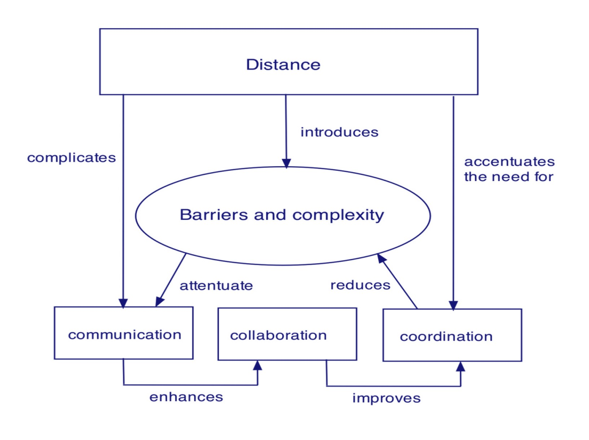

# Chapter 6 | Human Aspects of Software Engineering

## Characteristics Of A Software Engineer

### Traits of Successful Software Engineers（成功软件工程师的特质）

1. **Sense of individual responsibility（责任心）**

优秀的软件工程师对自己的工作成果负责，主动承担任务，遇到问题积极解决，不推卸责任。

2. **Acutely aware of the needs of team members and stakeholders（敏锐意识）**

能敏锐感知团队成员和利益相关者的需求，善于沟通和协作，促进团队目标的实现。

3. **Brutally honest about design flaws and offers constructive criticism（勇于承认错误，建设性意见）**

对设计缺陷敢于直言不讳，勇于承认错误，并能提出有建设性的改进建议，推动项目进步。

4. **Resilient under pressure（抗压）**

能在高压环境下保持冷静和高效，积极应对挑战和困难，不轻易放弃。

5. **Heightened sense of fairness（公正）**

具备强烈的公平意识，公正对待团队成员和工作分配，营造良好的团队氛围。

6. **Attention to detail（细度）**

注重细节，严谨对待每一项工作，减少疏漏和错误，提升软件质量。

7. **Pragmatic（实在）**

实事求是，注重实际效果，善于在理论与实践之间做出平衡，追求高效和可行的解决方案。

---

## Team Structures

### Organizational Paradigms（团队组织范式）

在软件工程团队管理中，组织范式（Organizational Paradigms）指的是团队结构和协作方式的典型模式。常见的四种组织范式如下：

1. **Closed paradigm（封闭式范式）**

团队采用传统的权威层级结构，成员分工明确，决策权集中在管理者手中，沟通路径清晰。适合任务明确、流程规范的大型项目，优点是管理有序、责任明确，但创新性和灵活性较弱。

2. **Random paradigm（随机式范式）**

团队结构松散，依赖成员的个人主动性和自我驱动。每个人可根据兴趣和专长选择任务，适合创新性强、探索性高的项目。优点是激发创造力和灵活性，但可能导致协调困难和目标分散。

3. **Open paradigm（开放式范式）**

试图在封闭式和随机式之间取得平衡，既保留一定的管理和流程控制，又鼓励成员创新和自主。适合既需规范又需创新的项目，既能保证项目有序推进，又能激发团队活力。

4. **Synchronous paradigm（同步式范式）**

依赖对问题的自然分解，将成员分组，各自负责问题的不同部分，组间沟通较少，强调独立完成任务。适合可模块化分工的项目，优点是效率高、易于并行推进，但沟通不足可能导致集成困难。

---

## Agile Teams

### Generic Agile Teams（通用敏捷团队）详解

1. **强调个人能力与团队协作**

敏捷团队既重视成员的个人专业能力，也强调团队的协作与配合，两者是项目成功的关键。

2. **以人为本，超越流程与政治**

敏捷理念认为“人比流程重要”，而在实际管理中，团队成员之间的关系和组织政治有时甚至比流程更具影响力。

3. **自组织与多样结构**

- 敏捷团队通常是自组织的，能够根据项目需求灵活调整结构，具备高度适应性。
- 可能融合Constantine提出的随机式、开放式、同步式等多种组织结构的优点。
- 团队拥有较高的自主权。

4. **最小化计划，聚焦业务与标准**

敏捷团队的计划工作保持在最低限度，仅受业务需求和组织标准约束，强调快速响应变化。

---

### XP Team Values（极限编程团队价值观）

1. **Communication（沟通）**

鼓励团队成员和利益相关者之间进行密切、非正式的口头沟通，及时反馈和共享信息，促进团队协作。

2. **Simplicity（简单）**

追求设计的简洁性，只为当前需求而设计，避免过度设计和复杂性，强调“活在当下”。

3. **Feedback（反馈）**

通过已实现的软件、客户和团队成员的反馈，持续改进产品和开发过程。

4. **Courage（勇气）**

有勇气抵制不合理的需求变更和不切实际的设计压力，敢于面对问题和挑战。

5. **Respect（尊重）**

团队成员和利益相关者之间相互尊重，营造积极、支持性的团队氛围。

---

## Impact of Social Media（社交媒体的影响）

社交媒体对软件工程团队的沟通、协作和知识共享产生了深远影响。主要体现在以下几个方面：

1. **Blogs（博客）**

博客可用于团队成员和客户之间的信息分享，记录开发经验、技术总结和项目进展，促进知识积累和传播。

2. **Microblogs（微博/微型博客）**

微博等平台支持实时消息发布，便于团队成员快速沟通、同步进展和即时反馈。例如：Twitter。

3. **Targeted on-line forums（专业在线论坛）**

专业论坛为开发者提供提问、答疑和观点交流的平台，有助于团队成员获取外部知识和解决实际问题。

4. **Social networking sites（社交网络）**

社交网站（如Facebook、LinkedIn）帮助开发者建立联系、分享信息、拓展人脉，促进跨团队、跨组织的协作。

5. **Social book marking（社会化书签）**

社会化书签工具（如Delicious、Stumble、CiteULike）便于开发者收藏、管理和分享网络资源，提升团队知识管理能力。

---

## Software Engineering using the Cloud（云计算下的软件工程）

### 优势（Benefits）

1. **为所有软件工程工作产品提供访问（access to all）**

云平台使团队成员能够随时随地访问项目中的所有软件工程成果（如文档、代码、测试用例等），极大提升了协作效率。

2. **消除设备依赖，实现随处可用（Removes device dependencies and available everywhere）**

团队成员不再受限于特定设备或操作系统，只要有网络即可访问云端资源，支持远程办公和多样化的工作场景。

3. **为软件分发和测试提供渠道（Provides avenues for distributing and testing software）**

云平台便于将软件分发给测试人员或用户，支持自动化测试和持续集成，提升开发与交付效率。

4. **促进信息共享（Allows software engineering information developed by one member to be available to all team members）**

团队成员开发的文档、设计、代码等可实时同步到云端，所有成员都能及时获取和共享最新信息，减少沟通障碍。

---

### 隐忧（Concerns）

1. **云服务分散带来的可靠性与安全风险（reliability and security risks）**

如果云服务超出软件团队的直接控制，可能会带来数据泄露、服务中断等安全与可靠性问题。

2. **互操作性问题（interoperability problems）**

当云端分布的服务数量增多，不同服务之间的兼容性和集成难度上升，容易出现互操作性障碍。

3. **可用性与性能压力（usability and performance）**

云服务需兼顾易用性和高性能，但这往往与安全、隐私、可靠性等需求产生冲突，需要在多目标之间权衡。

---

## Collaboration Tools（协作工具）

协作开发环境（Collaborative Development Environments, CDEs）为软件工程团队提供了一系列服务，帮助团队成员高效协作、管理项目和提升产出质量。主要服务包括：

1. **命名空间（Namespace）**

提供安全、私有的存储空间或工作产品区域，确保团队成员的数据隔离和信息安全。

2. **日历（Calendar）**

用于协调项目事件、会议和重要里程碑，帮助团队成员同步进度和安排。

3. **模板（Templates）**

允许团队成员基于统一模板创建工件（如文档、报告等），保证项目产出的一致性和专业外观。

4. **度量支持（Metrics support）**

提供量化评估工具，帮助团队衡量每位成员的贡献，便于绩效管理和持续改进。

5. **通信分析（Communication analysis）**

跟踪团队消息流，分析沟通模式，识别潜在问题和瓶颈，及时发现并解决协作障碍。

6. **工件聚类（Artifact clustering）**

展示工作产品之间的依赖关系，帮助团队理解项目结构，优化协作和集成流程。

---

## Global Teams（全球化团队）

### 团队决策的复杂性（Team Decisions Making Complications）

全球软件团队在协作、协调和沟通方面面临额外的挑战，主要体现在以下几个方面：

1. **问题复杂性（Problem complexity）**

全球团队通常需要解决跨地域、跨文化、跨时区的复杂问题，问题本身的复杂性增加，决策难度提升。

2. **决策相关的不确定性与风险（Uncertainty and risk associated with the decision）**

团队成员对决策结果的不确定性和潜在风险认识不同，增加了决策过程中的不确定性和风险管理难度。

3. **决策的连带影响（Work associated with decision has unintended effect on another project object）**

某项决策可能对项目中的其他部分产生意想不到的影响，这被称为“意外后果定律”（law of unintended consequences），需要团队在决策时充分评估潜在影响。

4. **对问题的不同看法导致不同结论（Different views of the problem lead to different conclusions about the way forward）**

团队成员由于背景、经验、文化等差异，对同一问题可能有不同理解和观点，导致对解决方案的分歧，影响团队一致性和决策效率。

**简要总结：**
全球化软件团队在决策过程中，需面对更高的复杂性、不确定性和沟通障碍。有效的协作机制、风险评估和多元包容的团队文化，是提升全球团队决策效率和项目成功率的关键。

**Factors Affecting Global Software Development Team**

---