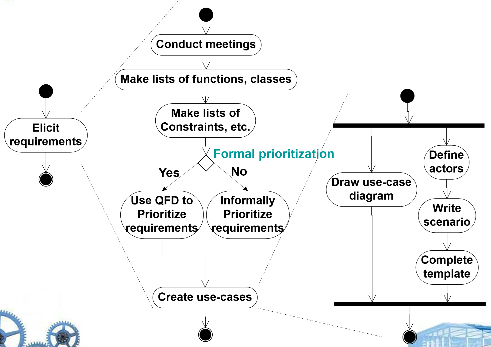
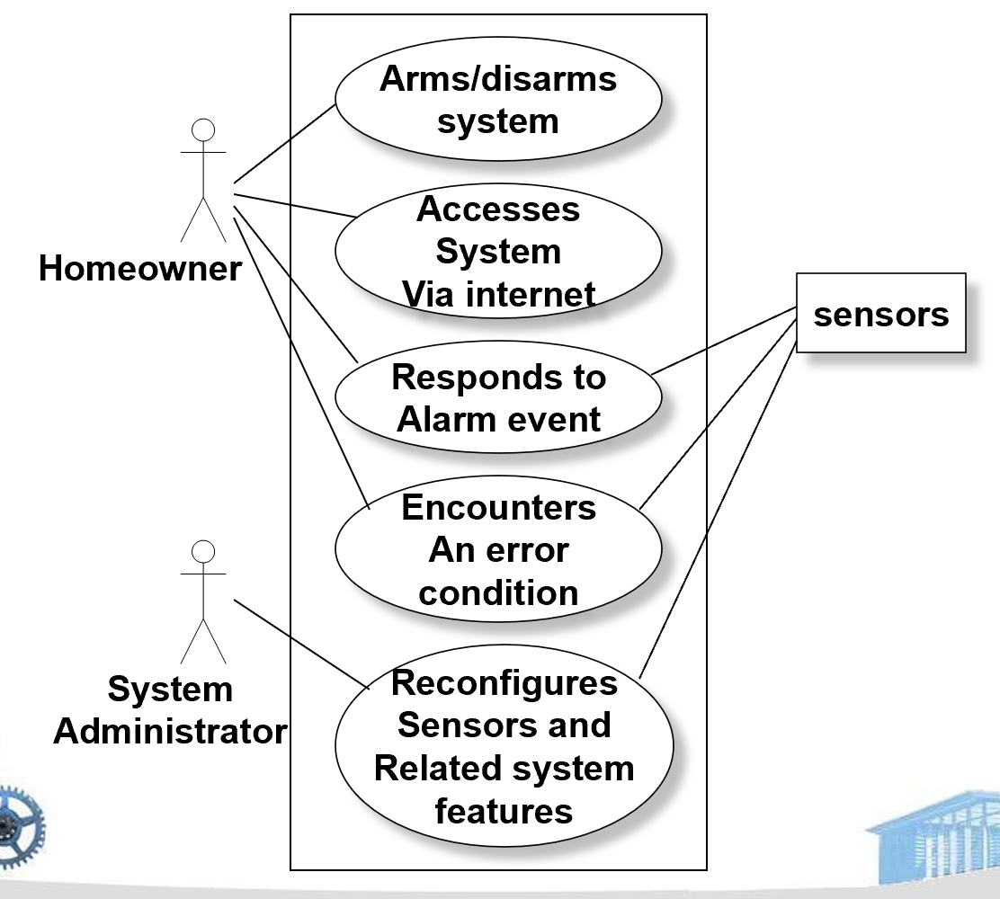
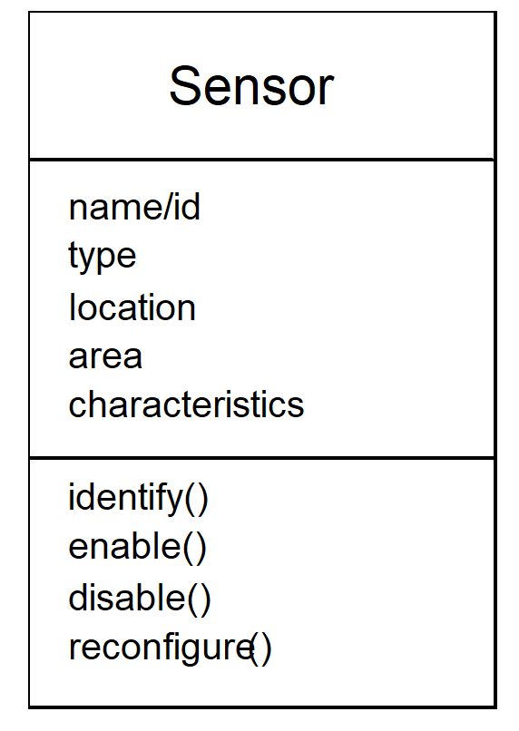
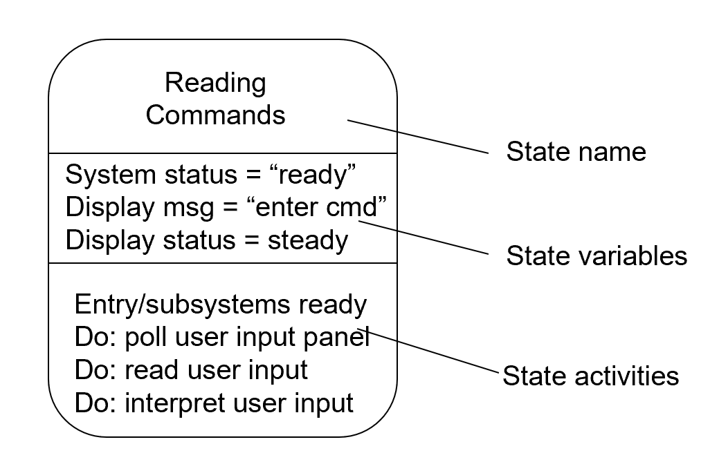
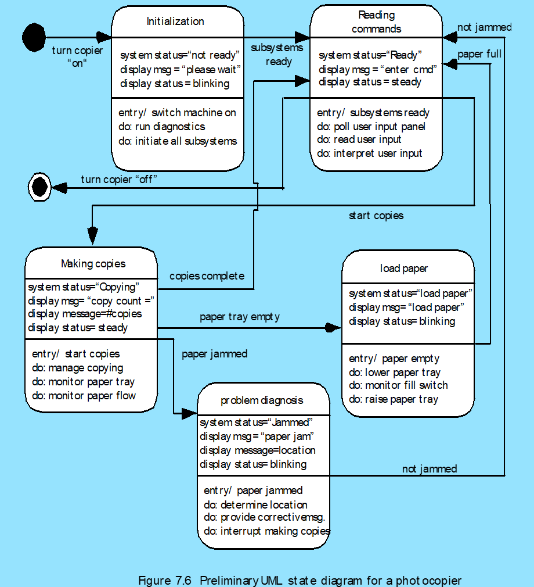

# Chapter 8 | Understanding Requirement

## Requirements Engineering

1. **引导/起始（Inception）**：

- 目的：通过一组关键问题建立对问题域的初步理解，明确需要解决的问题、目标用户以及期望的解决方案方向。
- 典型问题：谁是利益相关者？谁会使用系统？问题的本质是什么？期望的解决效果如何？是否存在替代方案？
- 活动与产出：召开启动会议、识别主要利益相关者、记录初始上下文说明、形成初步范围与假设清单。
- 重视沟通的有效性——早期确认联系人与决策人能避免后续反复变更。

2. **需求获取（Elicitation）**：

- 目的：从所有相关利益相关者处主动引出隐含与显性的需求，而不是被动地接受他们的愿望陈述。
- 方法：访谈、调查问卷、观察现行流程、召开焦点小组、使用场景/用例研讨、工作坊、头脑风暴、原型演示等。
- 风险：利益相关者可能有冲突目标、无法准确表达需求或受限于现有认知。
- 多种方法并用，记录意见分歧并追踪来源人员，及时建立共享的需求背书记录。

3. **细化/展开（Elaboration）**：

- 目的：将获取到的需求转化为更具体、可分析的模型，识别数据、功能与行为要求。
- 产出示例：用例/用户故事、流程图、类/数据模型、状态机、界面原型、优先级列表。
- 做法：以需求为输入建立分析模型，澄清不确定项并分解成可交付的小块（如最小可行产品或迭代计划）。

4. **协商（Negotiation）**：

- 目的：在开发者与用户（以及不同利益相关者）之间就可交付的系统达成现实、可实现的共识。
- 场景：当资源、时间、技术或业务目标冲突时，需要优先级排序、范围削减或替代方案。
- 采用透明的优先级评估标准（如业务价值、风险、成本），并把决策记录为变更/范围协议。

5. **规格说明（Specification）**：

- 说明：规格可以采用多种形式——书面文档、模型、形式化规范、用例/用户场景或原型。没有单一“正确”格式，取决于项目与读者。
- 要点：规格要能被实现团队与验证团队理解；关键需求应可追溯到原始来源（来源追踪）。

6. **验证（Validation）**：

- 目的：通过审阅、评审、演示或测试，发现内容或解释错误、需要澄清的地方、遗漏信息、不一致或不可实现的需求。
- 方法：同行评审、利益相关者评审、原型评估、验收测试用例评审等。
- 常见问题：大系统尤其容易存在不一致性；验证应尽早且反复进行以降低后期返工成本。

7. **需求管理（Requirements Management）**：

- 概念：在整个项目生命周期中跟踪、控制需求的变更、优先级和状态，维护需求与实现/测试之间的可追溯性。
- 活动：需求版本控制、变更请求处理、影响分析、基线管理、状态报告。
- 为需求建立唯一标识（ID）、变更流程和变更日志，确保变更前后都有清晰记录与批准者。

---

### Inception（起始）

1. 识别利益相关者（Identify stakeholders）：

- 关键问题示例："你认为我还应该和谁谈？" 通过让受访者推荐其他联系人，能发现隐性利益相关者与影响链。
- 实践：建立一张利益相关者清单，记录角色、职责、联系方式与决策权限。

2. 识别多元视角（Recognize multiple points of view）：

- 不同参与方（业务、运维、最终用户、合规等）往往有冲突需求，必须在早期收集并记录各方目标与顾虑。

3. 朝着协作（collaboration）推进：

- 通过工作坊或联合原型设计促进共同理解，减少“各自为政”的误解。

4. 上下文无关的首批问题（context-free questions）：

- Who is behind the request?（谁提出这项需求？谁为之买单？）
- Who will use the solution?（谁将使用该系统？）
- What will be the economic benefit of a successful solution?（该解决方案的经济/业务价值是什么？）
- Is there another source for the solution that you need?（是否已有可复用或外购的替代方案？）

5. 输出（建议）：

- 在起始阶段产出：利益相关者地图、问题陈述、初步成功衡量指标（KPI）、初步范围说明。

---

### Eliciting Requirements（需求获取）

1. 会议组织原则：

- 会议应由软件工程师与客户双方出席，确保技术与业务信息交叉验证。 
- 确立准备与参与规则（rules for preparation and participation），例如提前分发议题、预读材料与期望结果。
- 建议拟定一份明确的议程（agenda），列出目标、时间与输出物。

2. 指定主持人（facilitator）：

- 主持人可以是客户代表、开发者或独立顾问，其职责是控制讨论节奏、确保所有声音被听见并记录决议。 
- 主持人还负责冲突调节与将讨论导向可执行的输出（如用例或用户故事）。

3. 定义机制（definition mechanism）：

- 使用便于记录与可视化的工具：工作表、翻页图、墙贴、电子公告板、聊天空间或虚拟论坛。
- 这些机制帮助团队把讨论的碎片信息组织成结构化条目，便于后续汇总与优先级排序。

4. 核心挑战及其含义：

- "The hardest single part of building a software system is deciding what to build" — 决定构建什么系统是最难的。
- 问题一：范围（Problem of scope）——界定系统边界与包含的功能；防止范围蔓延（scope creep）。
- 问题二：理解（Problem of understanding）——不同人员对相同术语/场景的理解不一致，需要通过示例、原型与验收条件来统一认知。
- 问题三：易变性（Problem of volatility）——需求会随业务环境或用户认知演进而变化，需设计变更容忍机制与迭代计划。

5. 输出（建议）：

- 在获取阶段应至少产出一套初步的“解决方案需求”（preliminary solution requirements），包含参与者认定、关键用例/用户故事、初步非功能需求与优先级。
- 为每个主要需求记录验收标准（acceptance criteria），便于后续验证（validation）与开发估算。

---

### Elaboration（细化）

#### Quality Function Deployment（QFD，质量功能展开）

- Function deployment：确定每个功能对于客户感知的“价值”。在需求优先级与设计权衡时，关注哪些功能对客户最有价值。
- Information deployment：识别系统需要的关键数据对象与事件（例如实体、消息流、事件触发）。
- Task deployment：检视系统的行为（任务/流程），即系统在不同场景下要执行的动作。
- Value analysis：通过分析各项功能/信息/任务的相对价值来决定优先级与资源分配。
- 要识别的三类需求：

1. Normal requirements（常规需求）：必须满足的基本功能或约束；
2. Expected requirements（期望需求）：用户通常期望存在的特性（若缺失会造成不满）；
3. Exciting requirements（令人兴奋的需求）：超出期望的创新或增值特性，会显著提升用户满意度。

---

#### Non-Functional Requirements（非功能性需求，NFR）

- 定义：NFR 是指质量属性、性能属性、安全属性或通用系统约束，例如性能、可靠性、安全性、可用性、可维护性等。
- 推荐的两阶段评估流程：

1. 第一阶段：构建矩阵，将每个 NFR 作为列标题，系统工程（SE）或设计指南作为行标签，用以描述 NFR 与指南的关系；
2. 第二阶段：团队使用决策规则对每一对 NFR×指南进行分类（例如：互补 complementary、重叠 overlapping、冲突 conflicting、独立 independent），并据此优先化要实现的 NFR。

---

#### Elicitation Work Products（需求获取的工作产物）

一份需求获取应产出的典型工件包括：

- Statement of need and feasibility（需求与可行性说明）：说明为什么需要该系统以及可行性结论；
- Bounded statement of scope（有界范围说明）：界定系统边界与包含/不包含的功能；
- Stakeholder list（参与者清单）：记录参与获取的客户、用户与其他利益相关者及其角色；
- Technical environment description（技术环境说明）：目标系统运行或集成的技术/平台/接口约束；
- Requirements list（需求清单）：按功能组织的需求以及适用的领域约束（domain constraints）；
- Usage scenarios（使用场景）：若干场景/情景示例，展示系统在不同运行条件下的使用方式与边界情形；
- Prototypes（原型）：为澄清复杂或模糊需求而开发的纸面或交互式原型。

每项产物都应能被追溯到来源（会议记录、利益相关者、用例），并包含验证/验收标准。

---

#### Use‑Cases（用例）

用例是一组以参与者（actor）视角描述的用户场景，用来说明系统如何被使用以完成特定目标。用例聚焦“行为/交互”，便于从需求过渡到设计与测试。

场景应回答的问题：

- 谁是主参与者？是否有次要参与者或外部系统？
- 参与者的目标是什么？成功完成后系统与参与者处于何种状态？
- 前置条件（preconditions）有哪些？系统需要处于什么初始状态？
- 触发事件（trigger）是什么？是谁或什么引发交互？
- 主成功场景的关键步骤（step-by-step）是什么？每一步对应的系统响应如何？
- 备选路径（extensions）有哪些（例如用户取消、认证失败、资源不可用）？
- 可能的变体（variations）或错误情形如何处理？
- 参与者将从系统获取、产生或修改哪些信息？系统需要向参与者或外部实体汇报哪些变化？
- 参与者希望接收哪些意外或异常通知？这些通知应具有什么级别与内容？

---

#### Use‑Case Diagram（用例图）

- 元素：参与者（Actor）、用例（Use‑case，椭圆）、关联（连线）、系统边界框（矩形）、关系（include、extend、generalization）。

含义与用法：

- 参与者表示外部实体（人或外部系统）；用例图展示参与者与用例之间谁调用/参与哪些功能；
- 系统边界箱清晰标识被描述的系统范围；
- 使用 include 表示共用子行为，使用 extend 表示可选或异常扩展场景。

---

##### 示例：SafeHome（家居安防）

场景摘要：目标构建基于微处理器的家居安防系统，使用传感器检测非法入侵、火灾、洪水等不良情形，并在检测到情况时联络监控机构；系统可由房主编程并远程访问。

- 典型参与者：房主（Homeowner）、系统管理员（System Administrator）、传感器（Sensors，作为外部设备/事件源）、监控机构（Monitoring Agency）。

主要用例示例（高层）：

- Arm/Disarm System（布防/撤防） — 房主布置或撤除警戒；
- Access System via Internet（通过互联网访问系统） — 房主/管理员远程访问或查看状态；
- Responds to Alarm Event（响应报警事件） — 系统接收传感器报警并采取响应（声光、电话/短信通知监控机构）；
- Encounter Error Condition（遇到错误） — 系统检测到传感器失效或通信故障并记录报警；
- Reconfigure Sensors and Related Features（重新配置传感器与系统设置） — 管理员或房主调整灵敏度、区域分组等。

主成功场景示例：Responds to Alarm Event（简化）

1. 触发：传感器检测到异常（例如门窗入侵），向系统发送报警事件（trigger）；
2. 系统验证：系统对传感器读数做初步滤波/确认（避免误报）；
3. 执行动作：系统激活本地警报（声光），并向房主与监控机构发送通知（含事件类型、时间戳、位置）；
4. 记录：系统记录事件日志并切换到报警运行模式；
5. 结束条件：监控机构或房主采取确认/解除操作，系统归位或进入待处理状态（postcondition）。

- 与 NFR 的联系：此用例需要满足关键 NFR（例如响应时间、通知可靠性、误报率控制、系统可用性与安全认证）。

---

#### Building the Analysis Model（构建分析模型）

分析模型元素（常见类别）：

- 场景/用例驱动元素（scenario‑based）：用例文本、活动图、交互序列图；
- 类/数据模型（class‑based）：领域类、属性、关联；
- 行为元素（behavioral）：状态机、流程图；
- 数据流/信息视角（flow‑oriented）：数据字典、消息格式、事件序列。

---

#### Class Diagram（类图）

- 目的：类图用于表示系统的静态结构——主要领域类、它们的属性、方法以及类之间的关系（关联、依赖、继承、聚合/组合）。类图是把用例中抽取的名词（候选实体）以结构化形式表达出来的常用工件。

- 常见元素：类名、属性（属性名：类型）、操作/方法（方法名(参数)：返回类型）、可见性（+/-/#）、关系（关联、导航性、基数）、继承/实现、聚合/组合。

SafeHome 示例（Sensor 类）说明：

- 属性示例：name/id、type、location、area、characteristics（传感器标识、类型、安装位置、覆盖区域、特性）；
- 操作示例：identify()、enable()、disable()、reconfigure()（传感器的识别、启用、禁用与重新配置接口）；
- 建议：为重要属性添加约束或单位（如灵敏度范围、采样频率），并对外部设备（传感器）定义接口契约（消息格式、超时、错误码）。

---

#### State Diagram（状态图）

- 目的：状态图（状态机）用于刻画对象或子系统随事件或条件变化的生命周期（状态、状态变量、进入/退出动作与状态内活动）。当行为强依赖状态（例如设备驱动、协议实现或交互式流程）时，状态图非常有用。

- 状态图元素：状态（带名称）、状态变量（描述状态相关的数据）、入口/退出动作（entry/exit）、内部活动（do）、转换（带触发事件/守护条件/动作）、初始与终止节点、复合状态与并发子状态。

---

#### Analysis Patterns（分析模式）

- 定义：分析模式是对常见领域问题的可重用解决方案摘要，通常包含模式名、意图、动机、力量与上下文、解决方案、后果、设计、已知用例与相关模式等要素。

模式文档常包含的部分：

- Pattern name：模式名称，简洁描述模式要点；
- Intent：目的或意图，说明模式试图解决什么问题；
- Motivation：通过示例场景说明该模式如何应用；
- Forces and context：影响模式使用的外部条件或权衡（例如性能、复杂度、可变性）；
- Solution：模式的结构或步骤，强调结构化与行为方面如何协同；
- Consequences：应用该模式会带来的效果与权衡（例如更好的重用 vs 额外的复杂度）；
- Design：如何通过已知的设计模式或架构手段实现分析模式；
- Known uses：真实系统中已知的使用示例；
- Related patterns：与之相关或相似的其他分析模式。

---

### Negotiating Requirements（协商需求）

识别关键利益相关者；明确每位利益相关者的“获胜条件（win conditions）”；通过协商达成一组对各方都能产生“共赢（win‑win）”效果的需求。

扩展说明：

1. 识别关键利益相关者：

- 首先列出所有可能受影响或能影响项目的人与组织（业务负责人、最终用户、运维、安全、法规、供应商、合作伙伴等）；
- 标记决策者（有最终批准权）、影响者（能左右决策）与受影响者（结果直接影响其工作的群体）；

2. 确定“获胜条件”（win conditions）：

- 获胜条件往往不是显而易见的，需要通过开放式访谈、同侪讨论、观察其度量指标（KPI）或使用利益相关者问卷来挖掘；
- 示例：业务方的获胜条件可能是“提升转化率 10%”，运维的获胜条件可能是“系统可维护且停机时间≤月均1小时”；两者的折中点即为协商目标；

3. Work toward a set of requirements that lead to “win-win”

---

### Validating Requirements（验证需求）

验证需求是确保规格反映真实意图、可实现且可验证的重要活动。以下是常用的验证问题、判别要点与实践建议：

核心验证问题（Checklist）

- 每项需求是否与系统/产品的总体目标一致（consistency）？
- 每项需求是否处于合适的抽象层次（level of abstraction）？是否有需求过于具体或包含实现细节而不适合当前阶段？
- 该需求是否真正必要（necessary），还是附加功能（add‑on）？
- 每项需求是否有明确的边界且无歧义（bounded and unambiguous）？
- 每项需求是否有来源归属（attribution）——谁提出并负责该需求？
- 是否存在需求间冲突（conflict with other requirements）？需要何种折衷？
- 需求在目标技术环境下是否可实现（achievable）？是否需要依赖外部未决条件？
- 实现后该需求是否可测试（testable）？是否有明确的验收标准或可量化指标？

模型与分层验证

- 要求模型是否正确反映信息、功能和行为？模型应能逐步暴露更详细信息（partitioned），便于迭代细化。
- 是否使用了需求模式（requirements patterns）简化模型？这些模式是否已被验证且与客户需求一致？

---

### Requirements Monitoring（需求监控）

需求监控是在增量开发和系统运行阶段持续跟踪需求满足情况与演进风险的活动。该活动不只是技术监控，也是验证需求假设与业务价值是否兑现的重要手段。下文把幻灯片中的要点展开为实践说明与示例：

1. 分布式调试（Distributed debugging）

- 作用：在分布式或组件化系统中，帮助发现错误并定位其根因（例如跨服务调用链中的延迟或异常）。
- 做法：结合分布式追踪（如 OpenTelemetry）、结构化日志与因果链追踪（trace id），重现故障场景并定位导致需求不满足的组件或集成点。
- 示例：当用户报告某业务流程完成率下降，使用链路追踪定位是某微服务超时导致回退逻辑频繁触发，从而导致用户体验下降。

2. 运行时验证（Run‑time verification）

- 作用：在真实运行环境中验证软件是否符合其规范（例如合约、接口或关键行为序列）。
- 做法：在关键路径加入断言或契约检测（contract tests）、合约监控、以及自动化合规检查；使用合约测试（consumer‑driven contracts）保证服务间语义兼容。
- 示例：API 合约变更时，运行时合约守护可检测到不兼容调用并警报，从而避免违反需求的行为进入生产。

3. 运行时验证用户目标（Run‑time validation）

- 作用：评估系统在演进过程中是否持续满足用户目标与业务指标（例如转化率、任务完成时间）。
- 做法：定义业务级指标（KPI），通过遥测/埋点收集用户行为与关键指标并与需求预期比对；使用 A/B 测试或试点验证新的需求或功能是否带来预期价值。
- 示例：上线新推荐算法后，通过对比用户留存与转化率，验证该功能是否实现了“提升转化”的需求目标。

4. 业务活动监控（Business activity monitoring）

- 作用：从业务流程视角评估系统是否能满足业务目标，而不仅限于技术指标。
- 做法：建立端到端业务流程仪表盘（例如订单处理率、失败率、平均处理时长），将这些指标与需求条目关联以便直接看出需求实现效果。
- 示例：电商系统监控“下单到支付完成”整个流程的成功率，若低于阈值触发运维与产品告警以启动调查。

5. 演进与协同设计（Evolution and codesign）

- 作用：在系统演进过程中把监控数据反馈给利益相关者，支持共同设计与优先级调整。
- 做法：定期把监控结果与需求状态合并呈现（需求仪表板），在迭代计划会议中用数据驱动决策，必要时调整需求或分阶段发布计划。
- 示例：某 NFR（响应时间）难以达成，通过监控发现瓶颈在外部依赖，团队决定把该 NFR 调整为渐进式目标并在后续迭代中逐步优化。

6. 实践建议与检查表

- 为关键需求定义可观测指标（SLO/SLI）并设定阈值（例如响应时间 P95 ≤ 300ms、成功率 ≥ 99%）；
- 在 CI/CD 中加入自动化回归与合约测试，减少回归导致的需求退化；
- 把监控数据与需求条目建立双向追溯（需求→实现→监控），方便变更影响分析；
- 定期召开需求状态回顾（每个发布或季度），基于监控与用户反馈调整优先级或需求描述；
- 选择合适的工具链（追踪：OpenTelemetry、日志：ELK/EFK、监控：Prometheus/Grafana、业务分析：BI 工具）并把指标导入需求管理流程。

---