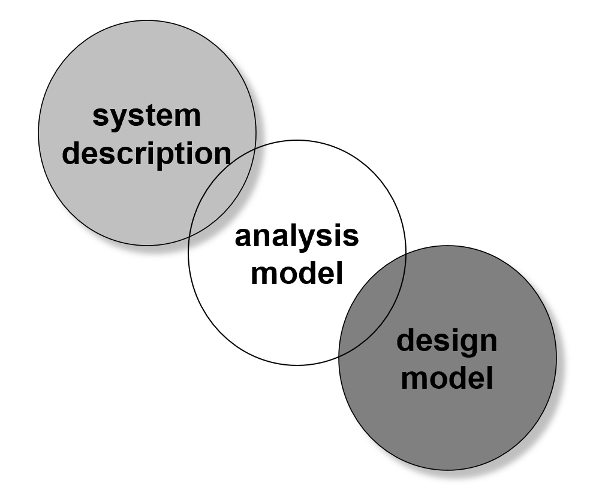
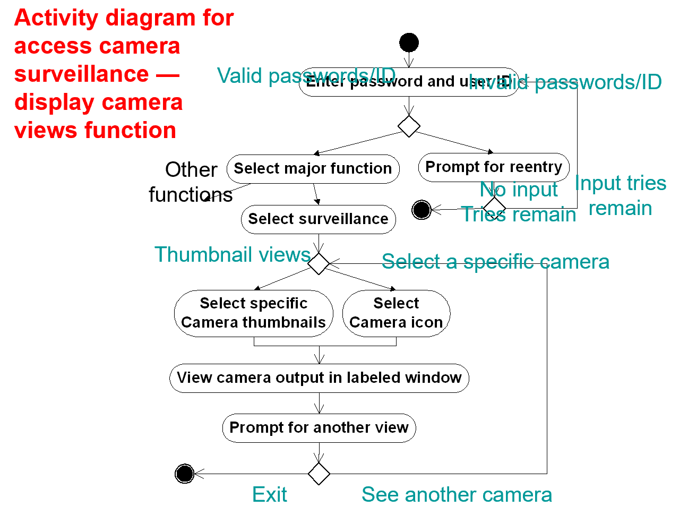
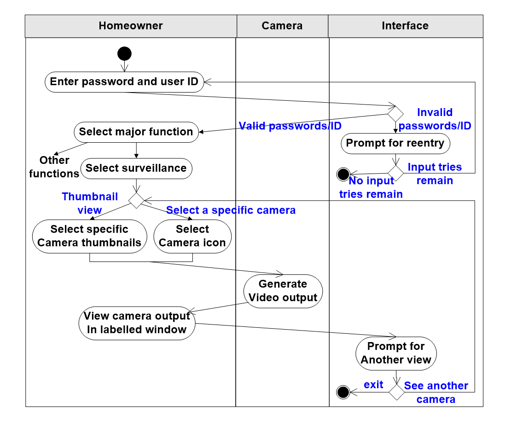

# Chapter 9 | Requirements Modeling：Scenario-Based Methods

## Requirements Analysis

1. 目标 (objectives)

- 描述客户需要什么：明确记录用户与客户的功能性与非功能性需求，避免产生二义性或假设。
- 为软件设计创建基础：需求输出应足够清晰和完整，以便架构师和设计者据此开始设计活动。
- 定义可验证的一组需求：需求应可测量或可验证（比如通过测试、演示或代码审查），从而支持后续的验证与确认活动。

2. 需求分析者的角色（analyst 或 modeler）

需求分析允许软件工程师（在此角色中称为分析师或建模者）做如下工作：

- 对早期需求工程阶段提出的基本需求进行详化（elaborate）：把粗粒度的需求分解、澄清并补充细节，识别边界条件与异常情况。

构建模型来描述：

- 用户场景（user scenarios）与用例的流程；
- 功能活动（functional activities）与问题类（problem classes）以及它们之间的关系；
- 系统与类的行为（system and class behavior）；
- 数据在系统中如何被转换和流动（the flow of data as it is transformed）；
- 软件必须满足的约束（constraints），例如性能、安全、兼容性与法规要求。

---

## A Bridge（桥）——系统描述、分析模型与设计模型之间的关系

- `system description`：以面向用户/业务的视角描述系统的上下文、目标、边界、外部实体及需求（通常为自然语言说明、用例纲要、初步场景等）。它回答“系统是什么、为什么存在、它与外部世界如何交互”。
- `analysis model`：为需求提供抽象化、结构化的表示（例如用例、领域模型、类的职责、主要行为与数据流）。分析模型侧重于“做什么”和“为什么这样做”，尽量保持与实现技术无关，以便各方就需求达成共识。
- `design model`：从分析模型出发，给出面向实现的决策（模块划分、接口、数据结构、并发/性能考虑、基础设施需求等）。设计模型关注“如何实现”。

关系与实践要点：

- 分离关注（separation of concerns）：保持分析模型与设计模型的界限，避免在分析阶段过早引入实现细节（例如特定数据库或框架），以免污染需求并引起不必要的设计偏见。
- 追踪性（traceability）：确保从 system description 的需求到 analysis model 的元素，再到 design model 的组件都有可追溯关系，便于变更影响分析与验证。
- 迭代递进：在敏捷或增量开发中，分析模型可以先覆盖最重要的需求并作为设计输入，随后逐步扩展到其他需求。

---

## Rules of Thumb（经验法则）

1. 模型应关注问题域内可见的需求（高抽象层次）

- 说明：分析模型应聚焦于业务或问题域能够观察到的需求，而不是实现细节。抽象层次应相对较高，以便概括本质职责与行为。

2. 分析模型的每个元素都应有助于对需求的整体理解并提供对信息域、系统功能和行为的洞见

- 说明：模型元素应能增进对系统的认知，而不是冗余或重复信息。

3. 将基础设施与其他非功能模型的考虑延后到设计阶段（Delay）

- 说明：许多非功能性（如部署、可用性、网络拓扑）在设计阶段更合适，早期介入会降低分析的抽象性。

4. 尽量最小化系统内部的耦合（Minimize coupling）

- 说明：分析模型应推动模块化与低耦合的职责分配，以便系统在设计与实现时更易演化与测试。

5. 确保分析模型对所有利益相关者都有价值

- 说明：模型不仅供架构师或开发者使用，也应能被客户、产品经理、测试人员理解并用于决策。

6. 保持模型尽可能简单（Keep the model as simple as it can be）

- 说明：复杂的模型增加理解成本和维护成本，只有在需要时才增加复杂度。

---

## Domain Analysis（领域分析）

- 目标（Goal）：领域分析是从特定应用领域识别、分析与规格化通用需求的过程，旨在为该领域内多个项目提供可复用的需求与模型。

1. 域知识来源：

- 技术文献（technical literature）：行业规范、标准与研究成果；
- 现有应用（existing applications）：成熟系统的实现与最佳实践；
- 客户调查（customer surveys）：用户实际使用场景与痛点；
- 专家建议（expert advice）：领域专家、业务顾问的隐性知识；
- 当前/未来需求（current/future requirements）：正在进行或预期的项目需求。

2. 领域分析的产出：

- 类目/分类法（class taxonomies）：对领域内概念进行分级分类；
- 复用标准（reuse standards）：接口约定、模块规范、数据格式等便于复用的规则；
- 功能模型（functional models）：抽象的功能集合与行为描述，作为参考实现的基础；
- 领域语言（domain languages）：术语表、DSL 片段或特定语义集合，帮助统一沟通。

---

## 模型体系（Software requirements 的四类模型）

- 需求建模分为四类互补视角：情景驱动（Scenario-based）、流向导向（Flow-oriented）、类/领域驱动（Class-based）与行为驱动（Behavioral）。中心是“Software requirements”，各视角提供不同的分析工具。

各类模型简介与常用表示：

- Scenario-based models（情景/场景模型）：用例文本、用例图、活动图、泳道图等。侧重描述用户与系统交互的端到端情景，适合与业务方沟通与发现需求序列。
- Flow-oriented models（流程/数据流模型）：数据流图、控制流图、处理叙述（processing narratives）。适合分析信息如何在系统或子系统间变换、传递与处理，便于发现数据依赖与瓶颈。
- Class-based models（类/领域模型）：类图、分析包、CRC 卡、协同图。用于刻画系统的静态结构、领域概念与实体关系，便于设计阶段的结构化迁移。
- Behavioral models（行为模型）：状态图、时序图（sequence diagrams）。侧重对象/组件的生命周期与交互顺序，适合捕获复杂状态变化与协议约定。

---

## Scenario-Based Modeling（基于场景的建模）

- 以“场景”（scenario 或 use-case）为单位描述系统在特定情境下的使用线程（thread of usage），把系统要对外提供的行为用故事化的步骤表示出来，便于与用户、客户和测试人员沟通需求。
- 四个设计问题：

1) 我们应该描述哪些内容？（What should we write about?）
2) 我们要写多少内容？（How much should we write about it?）
3) 描述需要多详细？（How detailed should we make our description?）
4) 如何组织这些描述？（How should we organize the description?）

---

## 用例（Use-Cases）及角色（Actors）

- 用例定义：描述系统一条“使用线程”的场景，指出外部参与者（actors）与系统之间的交互、参与者的目标和系统应执行的动作序列。
- Actor 说明：表示在该场景中扮演某个角色的人、系统或设备。一个用户可以在不同场景中扮演不同角色。

---

### 如何开发一个用例（Developing a Use-Case）

典型要问的问题：

- 参与者（actor）执行的主要任务或功能是什么？
- 参与者将获得、产生或改变哪些系统信息？
- 参与者是否需要向系统报告外部环境的变化？（例如传感器或外部事件）
- 参与者期望从系统得到何种信息或反馈？
- 参与者是否希望在出现意外（unexpected）变化时得到通知？

---

### 用例审查（Reviewing a Use-Case）

从叙述形式写出初稿，然后（如需正式化）映射到模板。每个主场景都应被审查并细化，以识别可能的替代交互：

- 参与者在某一步是否可以采取其他动作？
- 参与者是否可能在某点遭遇错误条件？若是，是什么？
- 是否可能出现其它行为路径？若是，是什么？

- 目的：确保主场景健壮，捕获异常与备选流程，避免遗漏关键的错误处理或备用路径。

---

### 用例的文档化（Documenting Use Cases）结构与要素

- `Goal in context`（上下文中的目标）：标识该用例的整体范围与业务目标。
- `Pre-conditions`（前置条件）：执行用例前必须成立的状态或约束。
- `Trigger`（触发器）：启动该用例的事件或条件。
- `Scenario`（主场景/步骤）：列出参与者与系统之间的具体交互步骤，以及系统应做出的响应。
- `Exceptions`（异常）：识别在初始用例细化过程中发现的异常情形与处理方式。

- 文档化建议：先用自然语言叙述主场景，再把关键信息映射入标准模板（表格形式），以便评审、优先级判定和测试用例编写。

---

### 用例图（Use-Case Diagram）用途与注意点

- 用处：用例图提供一个高层视图，展示系统边界、主要用例及其与外部 actor 的关系，帮助快速沟通“谁用系统做什么”。
- 注意：用例图只做概览，不替代用例详细描述。复杂行为仍需在用例文本、活动图或时序图里补充细节。

---

### 活动图与泳道图（Activity and Swim-Lane Diagrams）

- 活动图：用于刻画流程控制与并发路径，适合表示用例内部的工作流、分支与并行活动。
- 泳道图：在活动图的基础上按参与者或子系统划分“泳道”，清晰展示各角色的责任边界与交互点，有利于识别职责分界和跨边界通信。

---

#### 活动图示例（Activity Diagrams Example）

- 目的与场景：一个访问摄像头监控、显示摄像头视图功能的活动图，展示从用户登录到选择摄像头并查看视频输出的整个流程，包括成功路径与异常处理（例如密码错误、无输入、重试次数耗尽）。

- 初始节点（filled circle）：表示用例流程的开始。
- 动作节点（rounded rectangles / ovals）：表示具体步骤或操作，如“Enter password and user ID”、“Select surveillance”、“View camera output”等。
- 判定/分支节点（diamond）：用于根据条件选择不同的路径（例如密码是否有效、是否选择缩略图或直接选择摄像头图标）。
- 合并/连接节点：把多个分支汇合回主流程。
- 结束节点（filled circle with ring）：表示流程终止（Exit）。
- 控制流箭头：表示动作与动作之间的顺序关系；箭头上可标注守卫条件（guards），例如“valid passwords/ID”或“invalid passwords/ID”。
- 注释/文本：用于标注重试次数、异常处理或用户界面提示（如“Prompt for reentry”、“No input tries remain”）。

行为解读（逐步）：

1) 用户输入凭证，系统判断是否有效；若无效则提示重试并检查剩余尝试次数；若耗尽则退出或转入异常流程。
2) 认证通过后，用户选择主功能（例如选择“surveillance”）；系统呈现缩略图视图（thumbnail views）或入口以选择具体摄像头。
3) 用户可通过缩略图或摄像头图标选择具体摄像头，系统生成并在标识窗口中显示视频输出。
4) 显示完成后，系统提示是否查看其他摄像头或退出；如果选择查看则回到选择摄像头步骤，否则结束用例。

---

#### 泳道图示例（Swim Lane Diagrams Example）

- 目的与场景：泳道图把活动按参与者或系统边界划分为多条泳道（示例中为 Homeowner、Camera、Interface），直观展示各方在流程中的职责与交互点，便于识别跨边界消息与责任分配。

- 泳道（lanes）：每条泳道代表一个 actor、子系统或组件，泳道内部的动作由该参与方负责执行；
- 消息/控制流跨泳道箭头：表示某个动作触发另一泳道的行为（例如 Homeowner 的“Select Camera icon”触发 Camera 的“Generate Video output”）；
- 同样包含判定、开始/结束、并行/同步结构，用法与活动图一致，但更强调分工。

行为解读（示例流程）：

1) Homeowner 输入凭证并通过认证（在 Interface 泳道可能会处理认证逻辑）；
2) Homeowner 选择主功能并请求监控视图，Interface 将请求转发给 Camera（或由 Camera 子系统生成视频）；
3) Camera 泳道负责生成视频输出并将结果返回给 Interface，Interface 在 Homeowner 泳道展示视图；
4) 在查看结束或切换摄像头时，控制流跨泳道回到相应的选择步骤或结束节点。

---