# 敏捷开发

## 敏捷开发内涵

### 敏捷开发的背景

* **时代背景：** 在 1995 年前后，传统的软件开发模型（如瀑布模型、螺旋模型）和标准规范（如 CMMI、ISO）占据统治地位。
* **面临的困境：** 这些传统方法过于“重型化”（流程繁琐、文档堆叠），导致软件开发面临以下五大难题：

1. **需求多变：** 客户需求一直在变，导致传统计划式开发不断延期。
2. **质量下降：** 系统越复杂，Bug 越多，质量难以把控。
3. **文档包袱：** 过于强调规范文档，维护成本极高，投入产出比低。
4. **部门隔阂：** 团队成员间缺乏有效协作，部门之间像“深宅大院”一样孤立。
5. **速度需求：** 互联网的高速发展要求软件交付必须“快”。

---

### 敏捷开发的定义

* **核心理念：** 敏捷不仅是方法，更是一种以**用户需求进化**为核心的思想。
* **开发方式：** 采用**迭代（Iteration）**和**循序渐进**的方式。
* **关键特征：** * **响应变化：** 这是敏捷最大的特点，旨在降低需求变更带来的成本。
* **短周期交付：** 将大项目切分成小块，每个迭代周期通常为 1~4 周。
* **持续可用：** 每次迭代都会发布一个可运行的软件，且软件在整个过程中始终处于可用状态。

---

### 敏捷宣言与四大价值观

**敏捷四大价值观（左侧优于右侧）：**

1. **个人和交互 重于 流程和工具：** 人的协作比死板的流程更重要。
2. **工作的软件 重于 详尽的文档：** 交付能用的东西，而不是一堆描述如何工作的纸。
3. **客户协作 重于 合同谈判：** 与客户站在一起解决问题，而不是纠结于合同条款。
4. **响应变化 重于 遵循计划：** 能够灵活处理不可避免的变化，比死守最初的计划更有意义。

---

### 十二条敏捷原则（详细拆解）

1. **最高优先级：** 通过尽早、持续地交付**有价值的软件**来满足客户。
2. **欢迎变化：** 即使在开发后期也欢迎需求变更，利用变化为客户创造竞争优势。
3. **频繁交付：** 交付周期从几周到几个月不等，倾向于**更短**的时间范围，以便及时获得反馈。
4. **每日协作：** 业务人员和开发人员必须在整个项目期间每天在一起工作，打破沟通壁垒。
5. **激励个人：** 围绕充满动力的人构建项目，给予他们所需的环境、支持和信任。
6. **面对面沟通：** 这是团队内部传递信息最有效、最高效的方法（胜过文档和邮件）。
7. **衡量标准：** **可工作的软件**是衡量进度的首要标准，而不是完成百分比。
8. **可持续发展：** 敏捷过程倡导可持续开发，所有参与者应保持恒定的步调，避免因突击赶工损害长期效率。
9. **技术卓越：** 持续关注优秀的技能和良好的设计，这能增强敏捷性（减少技术债务）。
10. **简单化：** 尽最大可能减少不必要的工作，这门“艺术”至关重要（不要做客户不需要的功能）。
11. **自组织团队：** 最好的架构、需求和设计往往源于自组织的团队。
12. **定期总结：** 团队定期反思如何变得更有效，并相应地调整其行为。

---

## 敏捷开发流程

### 需求分析 (Requirements Analysis)

敏捷的需求分析不是一次性的，而是一个动态演进的过程。

* **确定利益相关者：** 明确谁会受到项目影响（客户、用户、管理层），了解他们的核心痛点。
* **用户故事 (User Stories)：** 这是敏捷的核心。它不再是枯燥的技术文档，而是一个固定的公式：
> “作为 [角色]，我想要 [目标]，以便于 [原因]。”
> *这种方式能让团队始终站在用户的视角思考。*
* **优先级与迭代：** 团队不会试图一次完成所有任务，而是将用户故事分配到 **1 到 4 周**的“迭代”中，优先处理价值最高的部分。
* **验收标准：** 在迭代开始前，团队必须和客户对齐：到底做到什么程度才算“搞定”（Done）。

---

### 产品设计 (Product Design)

敏捷设计强调“刚刚好”和“持续进化”，避免过度设计。

* **产品愿景与画像：** 愿景定义“我们要去哪”，用户画像（Persona）定义“我们为谁服务”。
* **路线图 (Roadmap)：** 这是一个高层级的演进计划，描述功能的优先级和发布节奏。
* **原型设计与测试：** 在正式大规模编码前，先通过原型（Prototype）与客户测试。这能极大地降低“做错东西”的风险。
* **持续迭代：** 设计不是在项目开始就定死的，而是根据每一轮反馈不断修正。

---

### 功能编码 (Coding)

* **编码标准与审查：** 确保代码不仅仅是能运行，还要易于维护。通过代码审查（Code Review）发现潜伏的问题。
* **小步快跑：** 每个迭代只完成一部分功能，但保证这部分是高质量的。
* **持续集成 (CI) 与单元测试：** 这是敏捷的“技术底座”。代码只要修改，就自动跑测试，确保新代码没有破坏原有功能。
* **交付可工作软件：** 编码的最终目标是输出一个可以运行、可以演示的东西，而不是半成品。

---

### 功能测试 (Testing)

* **自动化测试：** 这是提高效率的关键。重复性的测试交给脚本，降低测试成本。
* **测试用例与执行：** 编写易于理解的用例，覆盖各种业务场景（不仅仅是理想状态，还要考虑异常）。
* **缺陷优先级：** 发现 Bug 后，根据严重程度通知开发修复。
* **闭环解决：** 只有修复并经过重新验证，问题才算真正解决。

---

### 部署评估 (Deployment / Evaluation)

* **部署策略与环境：** 确定如何发布（如蓝绿发布、灰度发布），并明确生产环境所需的资源。
* **集成测试：** 在部署前，在类生产环境中进行最后一次全量检查。
* **自动化部署：** 通过脚本实现一键发布，减少人为误操作。
* **监控与管理：** 部署完成不代表结束。团队需要**实时监控**运行状态，一旦线上出现问题，能第一时间发现并修复（这也就是现在常说的 DevOps 理念）。

---

## 敏捷开发方法—Scrum

### Scrum 框架全景图

* **核心定义：** Scrum 是一种轻量级框架，基于**迭代**和**增量**开发。
* **流程概览：** 

1.  **产品负责人**梳理创意并形成**产品待办列表**。
2.  通过**计划会**确定本次迭代（2~6 周）的任务，形成**迭代任务**。
3.  团队在迭代期间每天进行**每日立会**。
4.  迭代结束时产出**可工作软件**。
5.  通过**评审会**和**反思会**总结并进入下一个循环。

---

### Scrum 中的三大角色

Scrum 团队通常由以下三类人员组成，他们各司其职，没有传统意义上的“领导”。

---

#### 产品负责人 (Product Owner, PO)

* **核心目标：** 追求**投资回报率 (ROI)** 最大化。
* **职责：** 决定“做什么”。他负责维护产品待办列表并排列优先级，确保团队总是在做最有价值的工作。
* **权力：** 他是唯一有权决定任务优先级和为团队布置任务的人。

---

#### 流程管理人 (Scrum Master, SM)

* **核心角色：** 团队的“教练”或“服务型领导”。
* **职责：** 确保 Scrum 规则被遵守，引导团队自组织，并帮助团队**清除工作障碍**（例如跨部门协调或资源短缺）。
* **交付物：** 他的交付物不是代码，而是一个高效协作的团队。

---

#### 团队成员 (Team Member)

* **特质：** 高度协同和**自组织**。
* **权力：** 团队有权全权决定“怎么做”，包括选择工具、技术方案以及如何瓜分任务。
* **目标：** 通过完成用户故事来持续增加产品价值。

---

### Scrum 中的四种会议

通过这些固定频率的会议，确保信息透明和及时反馈。

---

#### 计划会与每日站会

* **冲刺计划会议 (Sprint Planning)：** 迭代开始前召开，决定“我们要完成什么”以及“如何承诺完成”。
* **每日站会 (Daily Scrum)：** 每天 15 分钟。每个成员汇报：*昨天做了什么？今天计划做什么？遇到了什么困难？* **注意：** 这不是工作汇报，而是为了同步状态和暴露问题。

---

#### 评审会与反思会

* **冲刺评审会议 (Sprint Review)：** 迭代结束时，向利益相关者展示成果并收集反馈。
* **冲刺回顾会议 (Sprint Retrospective)：** 团队内部“闭门会议”，总结经验教训，讨论如何改进流程和提高效率。

---

### Scrum 中的三种工具（工件）

利用可视化工具来管理工作和追踪进度。

---

#### 产品待办列表 (Product Backlog)

* **定义：** 产品预期交付物的完整清单，包含功能、Bug 修复、文档等。
* **特点：** 按优先级严格排序，顶部的任务最具体且最先被执行。

---

#### 任务看板 (Task Board)

* **结构：** 经典的看板至少包含三列：**待开发 (To Do)**、**开发中 (Doing)**、**已完成 (Done)**。
* **价值：** 它是进度的可视化窗口。每一行通常对应一个用户故事（称为“泳道”），任务卡片在看板上移动。

---

#### 燃尽图 (Burndown Chart)

* **逻辑：** 描述**剩余工作量**与**时间**的关系。
* **关键指标：**
* **横轴：** 时间（迭代天数）。
* **纵轴：** 剩余范围/工作量。

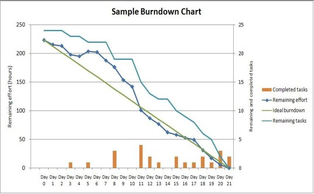

* **观察方法：** 曲线应从左上向右下延伸。若曲线垂直向上，说明增加了新需求；垂直向下则说明移除了部分工作。

---

# DevOps概述

## DevOps概念

### $DevOps$ 的概念与定义

1. **维基百科的定义：**

* **核心词：** 文化、运动或惯例。
* **重点：** 强调“软件开发人员 ($Dev$)”与“$IT$ 运维技术人员 ($Ops$)”之间的**沟通合作**。
* **手段：** 通过自动化软件交付和架构变更的流程。
* **目标：** 使构建、测试、发布软件能够更加快捷、频繁和可靠。

2. **云计算开源产业联盟的定义：**

* **核心词：** 过程、方法与系统的统称。
* **重点：** 涉及的部门更广，除了 $Dev$ 和 $Ops$，还明确加入了**质量保障 ($QA$)** 部门。
* **内涵：** 将需求、开发、测试、部署和运营统一起来。
* **目标：** 在保证**稳定性**的同时，实现快速交付高质量的软件和服务。

$DevOps$ 目前没有公认的单一定义。两者的争论点在于：$DevOps$ 到底更多是一种**文化**（强调人与人的协作），还是更多是一套**工具与系统**（强调自动化流水线）。目前主流观点倾向于两者兼有：文化是灵魂，自动化工具是支撑。

---

### 对 $DevOps$ 的常见误区

1. **误区一：$DevOps$ 是一套自动化工具**

* **纠正：** 自动化（如 $GitHub$、$Docker$ 等）确实是实现 $DevOps$ 的重要实践，但工具本身不等于 $DevOps$。如果团队成员不知道如何优化协作并将其融入工作流，再好的工具也是徒劳。

2. **误区二：$DevOps$ 取消了 $IT$ 运维**

* **纠正：** 这是一个很大的误解。虽然“无运维 ($NoOps$)”的概念很火，认为 $IT$ 行业会变得高度自动化，但运维的价值依然存在，只是职责发生了变化（从手动操作转向维护自动化平台和基础设施）。

3. **误区三：$DevOps$ 等同于持续交付 ($CD$)**

* **纠正：** 持续交付是 $DevOps$ 的核心技术组成部分，但 $DevOps$ 的范畴更广，它还包含了企业文化、组织架构的调整，甚至涉及销售和市场部门。

---

### $DevOps$ 的延伸：$BizDevOps$ 与 $DevSecOps$

随着 $DevOps$ 的发展，它的内涵不断扩大，引入了更多的角色来解决协作中的瓶颈。

1. **$BizDevOps$ 定义（业务 + 开发 + 运维）：**

* **背景：** 无论技术如何变革，最终目标都是为了实现业务价值。
* **核心：** 打破业务部门与技术部门之间的“隔阂”。让业务人员直接进入迭代周期，确保开发出来的东西正是市场和客户需要的。
* **目标：** 实现企业商业价值最大化。

2. **$DevSecOps$ 定义（开发 + 安全 + 运维）：**

* **背景：** 过去安全检查通常在发布前的最后阶段进行，容易成为瓶颈。
* **核心：** **“安全左移”**。在软件开发生命周期的最初阶段（设计、代码编写）就自动集成安全性，而不是事后修补。
* **座右铭：** “更安全、更迅速地交付软件”。它让安全成为了开发、安全和运维团队的**共同责任**。

---

## DevOps历史溯源

### 萌芽阶段 (2007~2008)：问题的发现

* **背景：** 2007年，比利时独立 $IT$ 咨询师 Patrick 在参与政府部门的大型数据中心迁移项目。
* **痛点：** 他的工作要求他穿梭于“敏捷”的开发团队 ($Dev$) 和“传统”的运维团队 ($Ops$) 之间。
* **开发团队：** 追求敏捷，频繁变更，快速响应需求。
* **运维团队：** 像消防员一样维护系统，追求绝对稳定，拒绝频繁变更。

**结论：** 这种截然不同的思维方式导致了巨大的冲突和协作壁垒。Patrick 开始思考：如何把敏捷思想引入到系统运维中？

---

### 萌芽阶段 (2007~2008)：思想的碰撞

* **关键事件：** 2008年在加拿大举办的 **$Agile\ 2008$ 大会**。
* **转折点：** Patrick 遇到了 **Andrew Shafer**。两人一拍即合，在 $Google\ Groups$ 上创建了一个名为 **"$Agile\ System\ Administration$"**（敏捷系统管理）的讨论组。
* **意义：** 这标志着开发者和运维者开始有意识地走到一起，探讨如何用敏捷的方法论来改进基础设施管理。

---

### 社区确立阶段 (2009~2010)：关键的演讲

* **关键事件：** 2009年6月，第二届 $Velocity$ 大会。
* **核心内容：** $Flickr$ 的两位大佬 John Allspaw 和 Paul Hammond 发表了名为 **"10+ Deploys per Day: Dev and Ops Cooperation at Flickr"**（Flickr 如何实现每天 10 次以上的部署：开发与运维的协作）的演讲。
* **震撼点：** 在那个部署一次软件需要数周甚至数月的时代，每天部署 10 次以上简直是天方夜谭。这有力地证明了 $Dev$ 和 $Ops$ 紧密协作能产生巨大的效能。

---

### 社区确立阶段 (2009~2010)：$DevOpsDays$ 的诞生

* **因果链：** Patrick 在网上看到了 $Flickr$ 的演讲视频，深受启发。
* **行动：** 既然美国有这样的讨论，为什么欧洲没有？于是他在比利时发起了名为 **$DevOpsDays$** 的会议。
* **灵魂发问：** “为什么没有一个让 $Dev$ 和 $Ops$ 聚在一起聊聊他们共同问题的会议呢？”

---

### 社区确立阶段 (2009~2010)：名词的定型

* **命名由来：** 第一届 $DevOpsDays$ 大会非常成功。由于 $Twitter$ 当时有字数限制，大家在讨论这个会议时，为了简便，将标签 **#DevOpsDays** 缩写为 **#DevOps**。
* **结果：** 这一无心之举，让 "$DevOps$" 这个词正式在社区中流传并确立下来。

---

### 社区确立阶段 (2009~2010)：声量扩大

* **多样化传播：** 相关话题频繁出现在各大技术活动、博客和播客中。
* **重要载体：** 出现了如 **"$DevOps\ Cafe$"** 这样的知名播客，以及 **"$the\ agile\ admin$"** 等技术博客，开始系统化地定义和介绍 $DevOps$ 的内涵。

---

### 产业关注阶段 (2011~2012)：主流化的开始

* **标志性事件：** 2011年起，$Gartner$ 和 $451\ Research$ 等顶级分析机构开始正式研究这个市场。
* **预测：** $Gartner$ 预言到 2015 年，$DevOps$ 将从云服务商的“小众策略”演变为全球 2000 强企业中 20% 的主流策略。
* **意义：** 意味着 $DevOps$ 从纯技术社区的自嗨，上升到了企业战略和产业趋势的高度。

---

### 蓬勃发展阶段 (2013~)：工具链的爆发

* **百花齐放：** $Puppet$、$Chef$（配置管理）、$Docker$（容器）、$Logstash$（日志）、$Jenkins/Hudson$（持续集成）等如雨后春笋般涌现。
* **巨头入场：** 微软将其研发协作平台 $VSTS$ 更名为 **$Azure\ DevOps$**，标志着 $DevOps$ 已成为各类工具平台建设的核心理念。

---

### 蓬勃发展阶段 (2013~)：云原生与深耕

1. **基础设施成熟：** 2013年 $Docker$ 出现，2014年 $Google$ 开源 $Kubernetes$ ($K8s$)，为 $DevOps$ 提供了完美的运行载体。
2. **云原生 ($Cloud\ Native$)：** 2015年 $CNCF$ 基金会成立，提出了“十二要素”应用准则。
3. **细分领域深耕：** 出现了 **$DevSecOps$**（安全即代码）、**$Compliance\ as\ Code$**（合规即代码）等新理念，强调安全与合规的自动化。

---

## DevOps标准能力

### 百花齐放的 $DevOps$ 工具

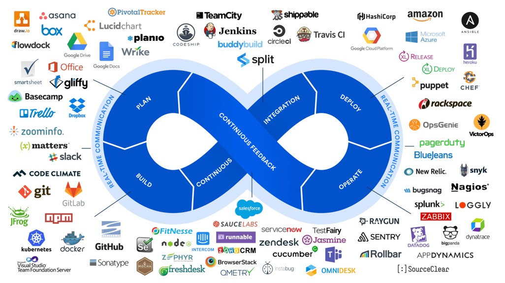

* **核心图示：** 中间是经典的 **$DevOps$ 无尽环（Infinity Loop）**，包含了 $Plan$（规划）、$Build$（构建）、$Continuous\ Integration$（持续集成）、$Deploy$（部署）、$Operate$（运营）、$Continuous\ Feedback$（持续反馈）等环节。
* **工具繁多：** 环的周围密密麻麻排列着各种工具（如 $Jira$、$GitLab$、$Jenkins$、$Docker$、$Kubernetes$、$Nagios$ 等）。
* **面临挑战：** * **学习成本高：** 想要精通每一个环节的工具需要花费巨大精力。
* **协作难题：** 不仅要保证单个工具运行，还要解决工具链之间的“烟囱效应”，确保数据和流程能无缝串联。

**趋势：** 为了减轻这种负担，行业开始向“一站式 $DevOps$ 平台”演进。

---

### 一站式 $DevOps$ 解决方案

由中国信通院（$CAICT$）牵头制定的行业标准。

* **背景：** 由信通院牵头，联合了阿里巴巴、腾讯、华为等巨头，历时半年讨论出了《研发运营一体化（$DevOps$）能力成熟度模型》标准。

**三个核心维度：**

1. **内容范围：** 涵盖项目管理、开发、测试、运维等全生命周期，并对安全能力提出要求。
2. **分级要求：** 将能力分为**基础级、增强级、先进级**，方便企业对标找差距。
3. **面向对象：** 既适用于公有云服务商，也适用于私有环境下的软件产品。

**意义：** 让 $DevOps$ 的落地不再是“盲人摸象”，而是有了统一的“度量衡”。

---

### $DevOps$ 标准能力框架总览

把复杂的 $DevOps$ 拆解成了 **“5 大域、34 个二级模块、550 个能力项”**。

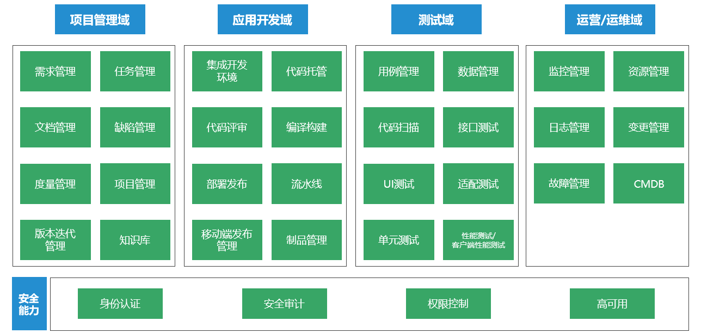

1. **项目管理域：** 关注“做什么”和“进度如何”。
2. **应用开发域：** 关注“怎么写”和“怎么产出”。
3. **测试域：** 关注“质量如何”。
4. **运营/运维域：** 关注“跑得稳不稳”。
5. **安全能力：** 底层的横向支撑，确保全流程安全。

---

#### 项目管理域

项目管理域是研发的入口，主要包含：

* **需求与任务管理：** 确保开发目标与用户需求一致。
* **文档与知识库：** 沉淀架构设计、手册和团队经验。
* **度量与缺陷管理：** 用数据说话，量化研发效率，跟踪软件“病灶”。
* **版本迭代管理：** 负责集成版本的规划和发布节奏。

---

#### 应用开发域

这是程序员最关心的领域：

* **代码托管与评审：** 如 $GitLab$ 等，确保代码有版本管理，且经过同伴审查。
* **编译构建与流水线：** 核心是**自动化**。将源代码转化为可执行程序，并通过流水线（$Pipeline$）串联起各个环节。
* **制品管理：** 存储编译后的产物（如 $Docker\ Image$ 或 $Jar$ 包），确保生产环境拉取的是经过测试的确定的版本。

---

#### 测试域

$DevOps$ 要求“测试左移”，即测试贯穿始终：

* **单元测试与代码扫描：** 在写代码阶段就发现逻辑错误和安全漏洞。
* **接口与 $UI$ 测试：** 验证系统功能和用户体验。
* **数据与适配管理：** 模拟真实数据，并测试在不同手机、浏览器上的兼容性。

---

#### 运营运维域

运维不再是简单的“搬机器”，而是精细化运营：

* **资源与变更管理：** 调度 $IT$ 资源，并确保每一次系统变更都标准化、可追溯。
* **监控、日志与 $CMDB$：** 实时收集数据，像监控心跳一样监控系统状态，并在出故障时快速定位。
* **故障管理：** 目标是尽快恢复服务，减少业务损失。

---

#### 安全能力

安全是 $DevOps$ 的底线（即 $DevSecOps$）：

* **身份认证与授权：** 解决“谁能操作什么”的问题。
* **安全审计：** 记录所有关键操作，以备事后溯源。
* **高可用：** 通过容灾、备份确保系统在大压或故障下不宕机。

---

# CI/CD

## 持续集成

### 什么是持续集成？

* **定义**：CI 是一种软件开发实践。它要求团队成员频繁地将代码集成到共享的主干中。
* **核心动作**：每次代码递交都会触发**自动化的构建和测试**。
* **主要目标**：
* **尽早发现错误**：不用等到项目结尾才发现代码冲突或 Bug。
* **提高软件质量**：通过频繁的验证确保代码始终处于可工作状态。
* **缩短反馈周期**：减少从写完代码到确认代码正确所需的时间。

---

### 持续集成的价值

* **早发现、快解决**：避免在项目后期合并代码时出现灾难性的冲突（即“集成地狱”）。
* **保持库的稳定性**：确保代码库里的代码随时是可以部署的。
* **自动化检测**：利用自动化测试发现肉眼难以察觉的漏洞。
* **加快交付**：缩短反馈循环，让功能上线更快。
* **增强协作**：团队成员通过频繁的小步提交，保持代码的一致性和可读性。

---

### 持续集成的三个阶段（概览）

这页提出了实现 CI 的三个演进阶段：

1. **第一阶段**：实现自动化，每次提交都要跑完完整的流水线。
2. **第二阶段**：引入自动化测试，确保集成不仅是“合成功了”，而且“质量合格”。
3. **第三阶段**：强调修复效率，一旦流水线报错，必须在第一时间响应并修复。

---

#### 第一阶段——快速集成

* **关键词**：快速集成。
* **前置条件**：
* **统一的分支策略**：大家得在一个规则下管理代码分支。
* **清晰的集成规则**：什么时候触发、谁来触发要明确。
* **标准化的资源池**：构建环境（如服务器、容器）要统一，不能在张三机器上行，在李四机器上不行。
* **足够的反馈周期**：CI 运行速度要快（建议 10-15 分钟内出结果），否则开发人员会失去耐心。

---

#### 第二阶段——质量内建

重点在于“自动化测试”。

* **关键词**：质量内建。
* **核心观点**：CI 的目的不是为了“跑过流程”，而是为了“发现问题”。
* **要点**：
* **匹配测试活动**：不同层级的集成（如代码级、系统级）需要匹配不同深度的测试。
* **公信力**：如果 CI 经常因为环境不稳定而报错（假报警），开发人员就不再信任它。
* **有效性**：测试套件要精干，优先验证基础功能和本次变更点，而不是漫无目的地全量测试。

---

#### 第三阶段——第一时间修复

* **核心逻辑**：CI 发现问题后，如果没人修，那 CI 就失去了意义。
* **机制建设**：
* **文化约束**：像硅谷公司一样，下班前确认 CI 正常，或“红灯”时不准提交新代码。
* **自动回滚**：如果 10 分钟内修不好，系统应具备自动撤销（回滚）该次提交的能力，保证主干始终是健康的。
* **共同负责**：CI 挂了，全组人应停止手中工作优先恢复 CI 环境。

---

### 持续集成的误区

* **误区**：单纯为了追求提交次数。
* **正确做法**：
* 不要在代码还没写完、甚至编译都不通的时候为了“每日提交”而提交。
* 每次提交应该是**具有逻辑完整性**的改动。
* **本质**：CI 追求的是“持续地集成”，而不是“机械地每天打卡”。

---

### 这不能称之为持续集成？

这一页对比了传统模式与 CI 模式的区别。

* **传统方式**：各个需求长期在独立分支开发，最后再进行一次性大合并，容易产生严重冲突。
* **CI 方案对比**：
* **方案一（经典 CI）**：每完成一个小任务就合并到主干。
* **方案二（特性集成）**：先在一个需求内部分集成，验证没问题后再合入总干。

**总结**：虽然方案二看起来更稳妥，但如果一个需求开发周期太长才提交，它就会失去“持续性”，从而导致合并冲突增加。

---

## 持续交付

### 什么是持续交付？

* **定义**：CD 是一种利用**自动化**手段加速新代码发布的方法。
* **流程**：代码更改后，自动推送到仓库或镜像库，经过构建、测试、部署，最终交付给质量团队或用户评审。
* **核心目标**：确保软件处于**随时可交付**的状态。也就是说，无论何时想发布，系统都应该已经准备好了，不需要再经历漫长的“发布前冲刺”。

---

### 持续交付的价值

* **及时发现和修复错误**：缩短了从代码编写到线上验证的链路。
* **防止分支偏离主干**：通过频繁交付，强迫团队保持代码同步。
* **降低成本与风险**：自动化减少了人工操作导致的“低级失误”，让发布不再是一个充满压力的过程。
* **提高满意度**：用户能更快看到新功能，反馈也更及时。

---

### 持续集成 (CI) 与持续交付 (CD) 的异同

这页非常关键，它理清了两个容易混淆的概念：

* **同**：目标一致，都是为了快速发现错误、提高质量、实现敏捷。
* **异**：
* **CI（持续集成）**：重点在**构建和测试**阶段。只要代码合进去了，测试过了，CI 的任务就完成了。
* **CD（持续交付）**：延伸到了**部署**阶段。它包含将代码推送到类生产环境（Staging）供评审的步骤。
* **关键区别**：持续交付通常需要**人工确认**后才最终部署到生产环境（注意：如果是全自动化无需人工干预直接上线，那叫“持续部署” Continuous Deployment）。

---

### 常见开发和发布模式

这一页提出了三种主流的分支模型，后续页码会逐一展开：

1. **主干开发，主干发布**：最激进、最高效。
2. **主干开发，分支发布**：目前大多数企业的选择。
3. **分支开发，主干发布**：适合大型、周期长的项目。

---

#### 模式一——主干开发，主干发布

这两页讨论了“Trunk-based Development”：

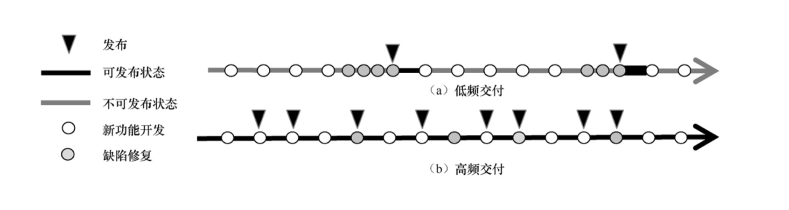

* **逻辑**：工程师直接把代码往主干（master/main）交，不拉长期的开发分支。
* **低频交付 vs 高频交付**：
* **低频**：旧模式，像备份仓库一样，最后才联调，风险极高。
* **高频**：现代互联网模式，每天甚至每小时都在发布。

* **优点**：分支方式极简，几乎没有复杂的“合并成本”（Merge Hell）。
* **缺点**：
* 低频模式下，后期缺陷修复压力大。
* 高频模式下，如果主干变动太快，而你的本地代码没跟上，合并时可能会发现代码已经面目全非。

---

#### 模式二——主干开发，分支发布

这是业界非常经典的模式（如 Facebook 的移动端开发）：

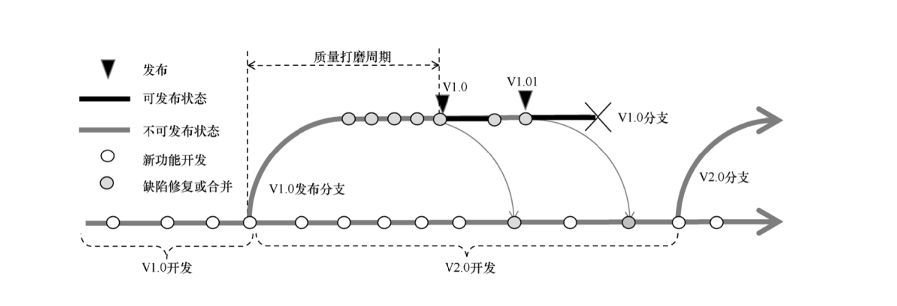

* **逻辑**：

1. 大家平时都在**主干**上提交代码。
2. 到了发布点（比如要发布 V1.0），拉出一个**发布分支**。
3. 在这个分支上只做 Bug 修复和质量打磨，不再加新功能。
4. 修复的代码再“拣选”（Cherry-pick）回主干。

* **优点**：主干开发不受发布周期的干扰，且发布版本非常稳定。
* **缺点**：如果发布分支太多、周期太长，会产生“分支地狱”，维护成本陡增。

---

##### 案例分析——HP 打印机团队的分支困局

一个著名的案例（HP LaserJet Firmware 团队）警示了复杂分支的危害：

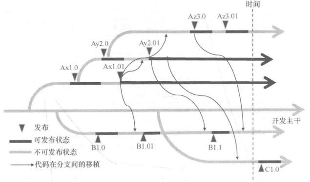

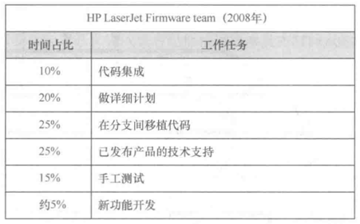

* **困境**：如图中密密麻麻的箭头，团队为不同型号（Ax, Ay, Az, B...）拉了太多长寿分支。
* **后果**：
* 在一个分支修了 Bug，得人肉移植到其他所有分支，极其低效。
* **资源浪费**：图中表格显示，该团队当时仅有 **5%** 的资源用于研发新功能，竟然有 **25%** 的时间花在在不同分支间移植代码！

**启示**：过于复杂的分支模型是效率的杀手，这也是为什么现代 DevOps 极力推崇减少长寿分支、向主干靠拢的原因。

---

### 模式三——分支开发，主干发布

这是目前业界**最广泛使用**的模式（通常对应 GitHub Flow 或类似的合并请求流程）。

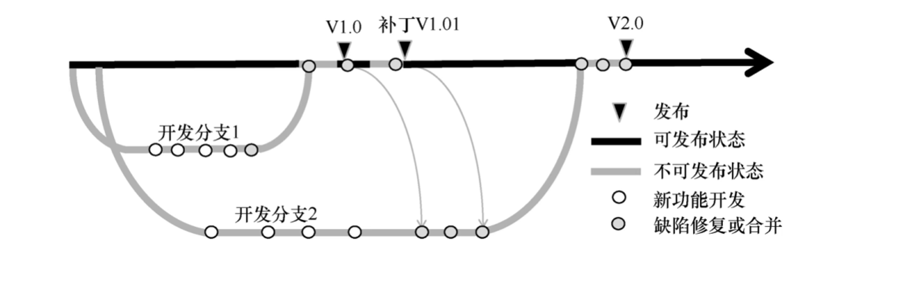

* **操作逻辑**：从主干拉出分支开发新功能或修 Bug，完成后发起合并请求（MR/PR），合入主干后再从主干打包发布。
* **优势**：开发活动互不干扰；可以自由选择哪些功能进入下一版本；主干 Bug 修复简单，直接拉个 Hotfix 分支即可。
* **关键点**：分支生命周期要短，主干要尽可能保持“随时可发布”的状态。

---

#### 特性分支模式 (Feature Branching)

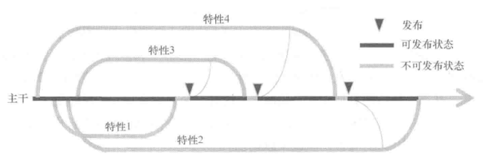

* **核心**：一个分支 = 一个功能特性。
* **优势**：非常灵活。如果某个功能没赶上发布点，直接不合并就行，不影响其他功能。
* **不足**：如果特性分支太多且长期不合并，合并时的冲突会非常痛苦（即“合并地狱”）。
* **建议**：特性要拆细，生命周期最好控制在 **3 天以内**；每天都要从主干拉取最新代码到分支进行同步。

---

#### 团队分支模式 (Team Branching)

适用于 **40 人以上** 的大型项目。

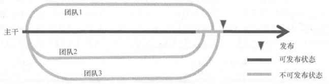

* **场景**：项目被拆分成多个组，每组负责不同的子系统。
* **痛点**：容易演变成“小瀑布”模式（组内开发很久才往主干合一次）。
* **成功关键**：即使不马上发布，各团队也要尽早向主干提交高质量代码，并频繁从主干拉取其他团队的变更。

---

### 三驾马车分支模式 (Chrome 模式)

这是 Google Chrome 浏览器曾使用的经典模型，强调**渐进式稳定**。

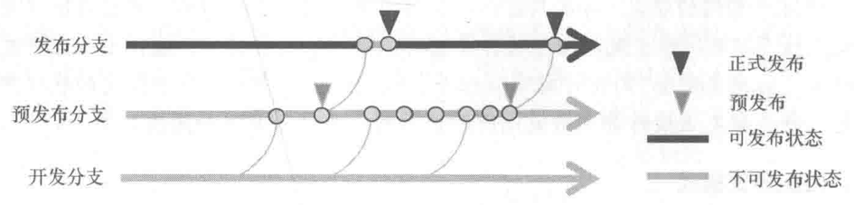

* **三个分支**：

1. **开发分支**：全员提交代码的地方。
2. **预发布分支**：从开发分支中“拣选”功能进入，发布 Alpha/Beta 版本给种子用户测试。
3. **发布分支**：当 Beta 版稳定后，形成 RC（发布候选）版，最终转为正式版。

**逻辑**：通过多级漏斗过滤掉 Bug。

---

### GitFlow 分支模式

这是曾经最流行的重型分支模型。

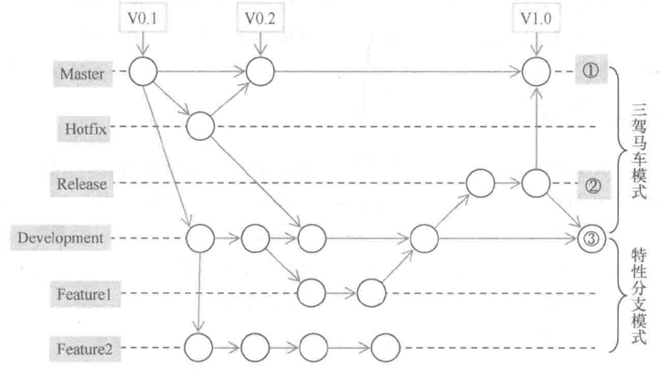

* **结构**：由 Master（生产）、Develop（开发）、Feature（特性）、Release（预发布）和 Hotfix（热修复）组成。
* **评价**：定义非常严谨清晰。
* **缺点**：太复杂了，分支切换频繁，合并成本高。现在很多追求敏捷的团队已经转向更简单的主干开发模式。

---

### 如何低风险发布？

话题从“代码怎么管理”转变为“**代码怎么上线**”。

四种核心策略：**蛮力发布、金丝雀发布、滚动部署、蓝绿部署**。

---

#### 蛮力发布 (Brute Force)

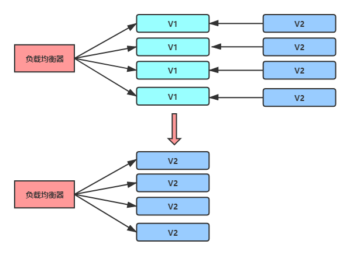

* **方式**：简单粗暴，直接用 V2 覆盖 V1。
* **缺点**：发布期间服务会中断（停机维护），用户会受影响。
* **适用场景**：开发/测试环境，或者对可用性要求不高的内部系统。

---

#### 金丝雀发布 (Canary Release)

名字源于旷工用金丝雀检测瓦斯。

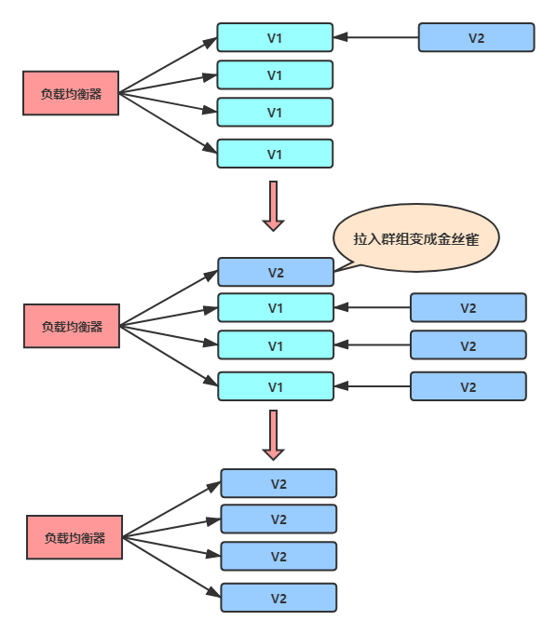

* **方式**：先升级一两台服务器（“金丝雀”），只让极少部分流量进来。如果没有报错，再逐步扩大到全量。
* **优点**：风险极小，如果有 Bug，只影响极少数人。
* **缺点**：如果新旧版本数据库结构不兼容，处理起来会很麻烦。

---

#### 滚动部署 (Rolling Update)

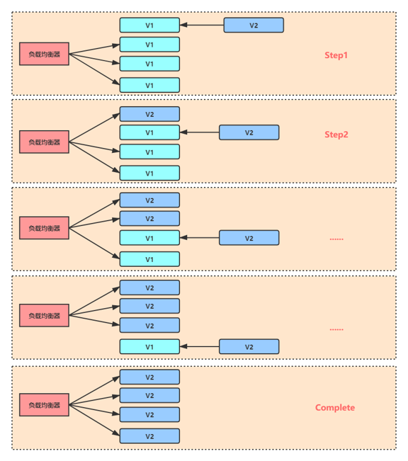

* **方式**：一批一批地更新服务器。比如总共 4 台，先更 1 台，成功后再更下一台，直到全部完成。
* **优点**：不需要额外的一倍服务器资源，用户感知较平滑。
* **缺点**：发布过程慢；过程中新旧版本共存，需要考虑版本兼容性。

---

#### 蓝绿部署 (Blue-Green Deployment)

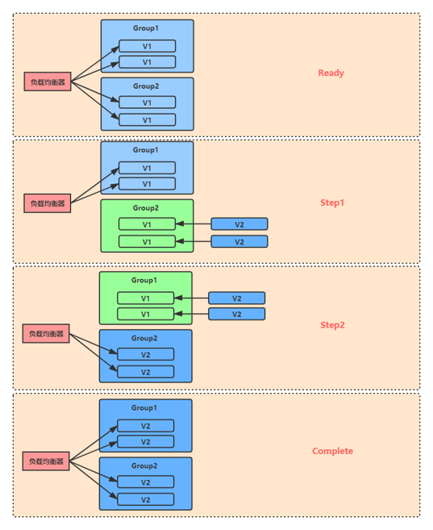

* **方式**：准备两套一模一样的集群（蓝色环境跑 V1，绿色环境装 V2）。通过负载均衡器（LB）瞬间把流量从蓝色切到绿色。
* **优点**：**瞬间切换，零停机**；如果 V2 有问题，瞬间切回蓝色（回滚极快）。
* **缺点**：太费钱（需要双倍的服务器资源）；不适合在业务高峰期操作，因为切换瞬间可能导致连接断开。

---

## CI/CD工具简介与实践

### CI/CD 工具一览

* **工具矩阵**：Jenkins, Travis CI, Circle CI, TeamCity, GitLab CI, GitHub Actions 等 8 种工具。

**重点介绍**：

* **Jenkins**：CI 界的老大哥，**开源且插件极多**。它的优点是“万能”，只要你想实现的功能，几乎都能找到对应的插件，适合追求高度定制化的大型团队。
* **Travis CI**：基于云端，和 GitHub 深度绑定。最大的特点是**配置简单**，对开源项目非常友好。
* **GitLab CI**：内置在 GitLab 平台中，使用 YAML 文件定义管道，支持云原生和容器化部署，主打“一站式”体验。
* **GitHub Actions (图中称 GitHub CI)**：直接在 GitHub 仓库里监听 push 或 PR 事件来触发脚本，是目前开发者使用最广泛的云端工具之一。

---

### Travis CI 的魅力

**核心特性**：

* **语言支持广**：支持超过 30 种编程语言（如 Java, Python, Go, Node.js 等）。
* **流程清晰**：它提供了“分支构建流”和“拉取请求（PR）构建流”，确保合并进主干的代码都是经过验证的。
* **全自动化**：支持实时查看构建视图、自动部署、为每次构建提供干净的虚拟机环境（隔离性好）。
* **多平台支持**：覆盖 Mac, Linux 和 iOS。

---

### Travis CI 的注册与授权

**如何把仓库连上工具**。

* **绑定账号**：直接使用 GitHub 账号登录 Travis CI。
* **开启监控**：登录后，在设置中勾选你希望启用持续集成的存储库。这就相当于告诉 Travis CI：“盯着这几个仓库，一旦有人提交代码，你就立刻开工。”

---

### 仓库的高级设置

* **控制开关**：可以设置“仅在分支 push 时构建”或“在 PR 提交时构建”。
* **自动取消机制**：如果前一次构建还没跑完，又有了新的提交，可以自动取消旧的，节省资源。
* **环境变量**：这是非常重要的一环。比如数据库密码、API Key 等敏感信息，不能写在代码里，而是配置在 Travis CI 的环境变量中，确保安全。

---

### 核心逻辑——`.travis.yml`

在 Travis CI 中，所有的构建逻辑都写在项目根目录下一个叫 `.travis.yml` 的文件中。

* **生命周期（Job Lifecycle）**：幻灯片详细列出了一个任务从头到尾的 12 个步骤，最关键的包括：
* `install`：安装依赖。
* `script`：运行核心脚本（通常是跑单元测试或构建代码）。
* `deploy`：如果前面的测试全过了，执行部署动作。

---

### 实时监控与状态反馈

这是流程的最后一环：**看结果**。

* **构建日志**：Travis CI 会提供一个实时的控制台页面。
* **红绿灯反馈**：
* **绿色**：构建通过！你可以放心地去喝杯咖啡了。
* **红色**：构建失败。你需要点击进入日志，查看是哪个测试没过，或者是代码在哪个环节报错，然后第一时间修复。

---

### Travis CI 生命周期全景图

Travis CI 处理任务的 **12 个阶段**。

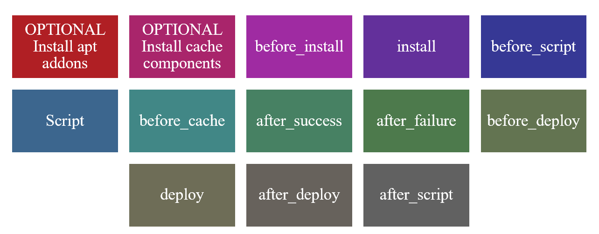

* **逻辑顺序**：从左到右、从上到下执行。
* **灵活性**：有些阶段是可选的（如 `addons`, `cache`），有些则是核心必选的（如 `script`）。
* **容错性**：提供了 `after_success` 和 `after_failure` 来处理不同构建结果后的收尾工作。

---

#### OPTIONAL Install apt addons（系统级依赖）

* **功能**：在虚拟机里安装 Linux 软件包。
* **应用场景**：如果你的代码依赖特定的系统工具（如 `git` 最新版、特定的 `python3` 版本等），在这里配置。

* **YAML 示例**：
```yaml
addons:
  apt:
    packages:
      - git
      - python3

```

---

#### OPTIONAL Install cache components（缓存加速）

* **功能**：这是“提速神器”。它会把下载过的依赖包保存起来，下次构建直接用，不用重新下载。
* **应用场景**：缓存 Maven 的本地仓库（`.m2`）或 Node.js 的 `node_modules`。
* **关键点**：可以设置缓存的过期时间（示例中设为一周）。

---

#### before_install（安装前预处理）

* **功能**：在正式安装项目依赖之前执行的命令。
* **应用场景**：
* 设置环境变量（如 `JAVA_HOME`）。
* 更新系统源（`apt-get update`）。
* 下载并解压一些非标准的工具包。

---

#### install（安装项目依赖）

* **功能**：这是准备环境的核心阶段。
* **应用场景**：运行包管理命令。
* **PPT 技巧**：示例中使用了 `mvn install -DskipTests=true`。为什么要跳过测试？因为这个阶段只负责“安装依赖”，真正的测试应该留在后面的 `script` 阶段，这样权责分明。

---

#### before_script（脚本前置动作）

* **功能**：为运行测试脚本做最后的准备。
* **应用场景**：
* 修改脚本文件的执行权限（`chmod +x`）。
* 启动一些测试所需的模拟服务（如虚拟显示器 `xvfb`，用于跑 UI 测试）。

---

#### script（核心构建与测试）

* **功能**：**这是整个 CI 任务的“心脏”**。
* **判定标准**：如果这个阶段的命令返回非零值（报错），整个构建就会被标记为“失败（Failed）”。
* **应用场景**：执行单元测试、代码质量检查、编译打包。

---

#### before_cache（缓存前清理）

* **功能**：在 Travis 把文件夹打包存入缓存库之前执行。
* **应用场景**：
* 清理缓存中多余的、不稳定的文件（比如你自己的项目构建产物，通常不建议缓存）。
* 压缩某些大文件夹以节省存储空间。

---

#### after_success（构建成功后的狂欢）

* **功能**：只有当 `script` 阶段完美运行（返回 0）时，才会执行。
* **应用场景**：
* **通知**：发个 Webhook 告诉团队“代码稳了”。
* **部署**：执行 `mvn deploy` 把包发到私服。
* **文档**：生成最新的 Javadoc 文档并发布。

---

#### after_failure（失败后的“急诊室”）

如果你的 `script` 阶段（测试或构建）挂了，这个阶段就会被触发。

* **核心功能**：专门用于收集错误信息、发送失败通知或尝试补救。
* **应用场景**：
* **查错**：`cat logs/error.log` 直接在控制台打印错误日志，方便你定位问题。
* **报警**：通过 `curl` 发送 Webhook，把失败的消息推送到钉钉、飞书或 Slack 频道，让全组人都知道“代码炸了”。
* **重试**：使用 `travis_retry` 尝试重新运行某些容易受网络波动影响的脚本。

---

#### before_deploy（部署前的“打包”）

当你的测试全部通过，准备把代码发往服务器时，通常需要做一些最后的准备工作。

* **核心功能**：准备或验证部署目标。
* **应用场景**：最常见的动作就是**打包产物**。比如将编译好的代码文件夹压缩成一个 `.zip` 或 `.tar.gz` 文件，方便传输。
* **示例**：`zip -r my-app.zip my-app/`。

---

#### deploy（重头戏：正式部署）

这是整个流水线的终点——将代码发布到生产环境或指定的服务器上。

* **核心功能**：执行部署动作。你可以使用 Travis CI 自带的插件（如部署到 AWS、Heroku），也可以写自定义脚本。
* **实战案例**：
* **Provider**：指定使用 `script`（自定义脚本）作为部署方式。
* **Script**：运行 `deploy.sh`，并传入环境参数（`production`）和版本标签（`$TRAVIS_TAG`）。
* **On 触发条件**：
* `tags: true`：只有当你给代码打了 Git Tag（比如 `v1.0`）时才触发部署，防止普通提交误操作。
* `all_branches: true`：或者设置为任何分支更新都触发（通常用于测试环境）。

---

#### after_deploy（部署后的“打扫”）

部署完成后的收尾工作。

* **核心功能**：清理临时文件或验证部署结果。
* **应用场景**：
* **清理**：把刚才在 `before_deploy` 阶段生成的压缩包 `rm` 掉，保持环境整洁。
* **健康检查**：向部署后的网址发送一个测试请求（`check?app=my-app`），确认服务真的跑起来了。

---

#### after_script（最终的总结报告）

无论构建成功还是失败，这个阶段都会在最后执行（类似代码中的 `finally` 块）。

* **核心功能**：收集额外的调试信息或统计数据。
* **应用场景**：查看代码覆盖率报告（`cat logs/coverage.log`）。即便测试挂了，看看覆盖率也能帮你分析是哪部分代码没被跑到的原因。

---

### GitHub CI

#### 第一步——准备仓库

在开始 CI 流程之前，你首先需要一个代码仓库。

* **操作内容**：你可以选择 **Fork**（派生）一个已有的开源项目（例如幻灯片中的 RuoYi 项目），或者直接在自己的账号下新建一个仓库。
* **意义**：Fork 相当于把别人的代码复制了一份到你的名下，这样你就有权限在上面配置自动化工作流，而不会影响原作者。

---

#### 第二步——选择工作流模板

GitHub 非常智能，它会根据你仓库里的代码语言自动推荐合适的配置。

* **操作内容**：

1. 点击仓库顶部的 **Actions** 选项卡。
2. 点击 **New workflow**（新建工作流）。

* **核心功能**：你会看到很多卡片（如 "Java with Maven", "Android CI" 等）。如果你是 Java 项目，GitHub 会建议你使用 Maven 模板，这能省去你从头写配置文件的麻烦。

---

#### 第三步——编辑 YAML 脚本

这页展示了 GitHub Actions 的“灵魂”——**Workflow 配置文件**。

* **配置方式**：
* GitHub 使用 YAML 格式，文件通常保存在 `.github/workflows/` 目录下。
* 你可以在浏览器里直接修改脚本。脚本里定义了什么时候触发（如 `push` 到主分支时）、在什么系统运行（如 `ubuntu-latest`）、以及具体的执行步骤（如安装 Java、运行打包命令）。

* **提交生效**：修改完成后，点击右上角的 **Commit changes**。一旦代码提交，CI 就会立刻被激活。

---

#### 第四步——查看运行结果

代码提交后，剩下的就是等待和观察。

* **查看路径**：再次点击 **Actions** 标签页。
* **监控状态**：
* 你会看到一个工作流列表。每一行代表一次自动运行。
* **绿色对勾**：表示你的代码通过了所有的自动化测试和构建。
* **红色叉号**：表示出错了（编译失败或测试没过）。你可以点进去看详细的报错日志，这和我们之前讲的 Travis CI 逻辑是一模一样的。

---