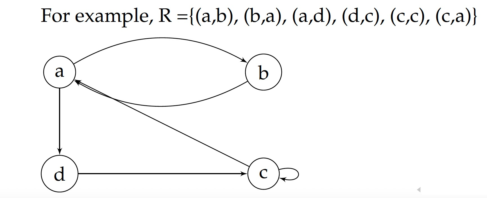
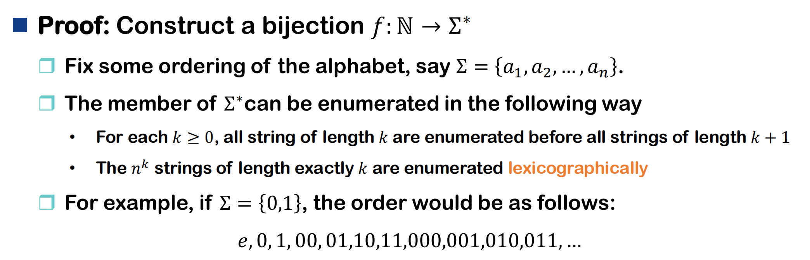
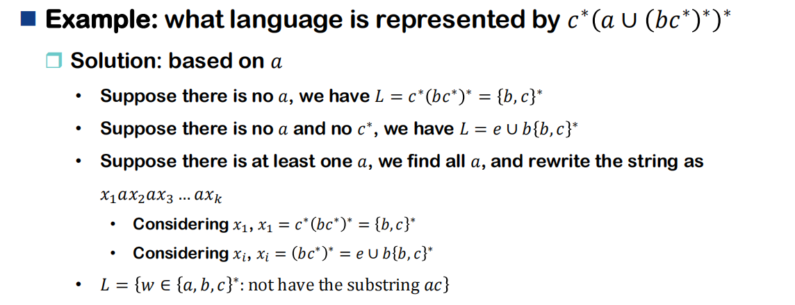

# Chapter 1

**Fundamental questions of Computer Science**

- What is an algorithm?
- What is computable?
- How can we characterize the difficulty of computation?

**The purpose of this course**

- Introduce a formal and rigorous definition of these concepts 给出形式化和严格的定义

The content of this course: Turing Machine

- Basic Concepts & Properties of the Turing Machine
- Foundations for Turing Machine invention

!!! info "Turing Machine (definition from Wiki)"
    A Turing machine is a mathematical model of computation describing an abstract machine that manipulates symbols on a strip of tape according to a table of rules. Despite the model's simplicity, it is capable of implementing any computer algorithm.

    [img](./assets/1-1.png)

    图灵机是一种计算的数学模型，它描述了一台抽象的机器，这台机器可以根据一套规则，在一条纸带上操作符号。尽管图灵机的模型非常简单，但它却能够实现任何计算机算法。

首先需要对实际问题进行描述（Problem Description），比如用数学语言表达问题。问题描述之后，需要对问题进行符号化（Problem Symbolization），也就是用数学符号、公式等形式将问题抽象出来，便于后续分析和处理。最后，通过形式化的模型（如图灵机）来分析问题，寻找反例（Find a counterexample），验证某个命题是否成立，或者证明某个问题是否可计算。

**algorithmic number theory**

problem $\rightarrow$ sets of symbols $ \rightarrow$ languages $ \leftrightarrow$ computational models

也就是说，实际问题可以转化为符号集合，再进一步转化为形式语言，而这些语言与计算模型（如图灵机）之间是等价的。

The equivalent relationship between computational model (solution) and language (problem)

计算模型（解）与语言（问题）之间存在等价关系，即每一个形式语言都对应一个计算模型，反之亦然。

## 离散知识的回顾

### Set

- A set is a collection of objects, an unordered collection of elements
- Objects in a set are called **elements** or **members** of the set.
- a $\in$ A if a is an element of A; a $\notin$ A, otherwise.

- A set is **empty** if it contains no element.
- A set is a **singleton(单元集)** if it contains only one element.
- A set is **finite** if it contains finite number of elements.
- A set is **infinite** if it contains infinite number of elements.

---

### Subsets

- A is a **subset** of B if each element of A is also an element of B.

$$A \subseteq B \leftrightarrow (x \in A \rightarrow x \in B)$$

We also say that B is a **superset** of A.

- A is a **proper subset** of B if $A \subseteq B$ and $A \neq B$.

$$ A \subset B$$

We also say that B is a **proper superset** of A.

- Two sets are Equal iff they contain the same elements

???+ example
    How to define equal if we do not have the concept of subsets?

??? note "answer"
    Two sets A and B are equal iff $A \subseteq B$ and $B \subseteq A$.

---

### Set Operations

- **Union**: $A \cup B = \{x : x \in A \lor x \in B\}$
- **Intersection**: $A \cap B = \{x : x \in A \land x \in B\}$
- **Complement**: $\overline{A} = \{x : x \notin A\}$
- **Difference**: $A - B = \{x : x \in A \land x \notin B\}$
- **Symmetric Difference**: $A \oplus B = (A - B) \cup (B - A)$
- **Power Set**: $2^A = \{S : S \subseteq A\}$

---

#### Set Identities

- Idempotent Laws

$$A \cup A = A, \quad A \cap A = A$$

- Commutative Laws

$$A \cup B = B \cup A, \quad A \cap B = B \cap A$$

- Associative Laws

$$(A \cup B) \cup C = A \cup (B \cup C), \quad (A \cap B) \cap C = A \cap (B \cap C)$$

- Distributive Laws

$$A \cup (B \cap C) = (A \cup B) \cap (A \cup C), \quad A \cap (B \cup C) = (A \cap B) \cup (A \cap C)$$

- Absorption Laws

$$A \cup (A \cap B) = A, \quad A \cap (A \cup B) = A$$

- De Morgan's Laws

$$\overline{A \cup B} = \overline{A} \cap \overline{B}, \quad \overline{A \cap B} = \overline{A} \cup \overline{B}$$

$$A - (B \cup C) = (A - B) \cap (A - C), \quad A - (B \cap C) = (A - B) \cup (A - C)$$

???+ example
    Why some problems can be solved by employing computational models?

??? note "answer"
    Problem $\leftrightarrow$ Sets or language

    Automated solution $\leftrightarrow$ problem has identities $\leftrightarrow$ can be computed

---

### Partition

A partition of a non-empty set A is a subset $\Pi$ of $2^A$ such that

- $\emptyset \neq \Pi$
- $\forall S,T \in \Pi, S \cap T = \emptyset$ （任意两部分不相交）
- $\bigcup \Pi = A$ （所有部分的并集为 A）

---

### Sequences

- A sequence is a list of objects in some order.

$$(1,2) \neq (2,1)$$

- A finite sequence is also called a **tuple**. A sequence of k elements is called a **k-tuple**.
- A 2-tuple is also called an **ordered pair**.

$$(a,b) = (c,d) \leftrightarrow (a = c) \land (b = d)$$

---

### Cartesian Product

- The **Cartesian product** of two sets A and B is

$$A \times B = \{(a,b) : a \in A \land b \in B\}$$

- The **Cartesian production** of k sets $A_1, A_2, \ldots, A_k$ is

$$A_1 \times A_2 \times \ldots \times A_k = \{(a_1, a_2, \ldots, a_k) : a_i \in A_i\}$$

---

### Relations

- A binary relation R from A to B is a subset of $A \times B$.

$$R \subseteq A \times B$$

---

#### Operations of Relations

- Inverse

$$R \subseteq A \times B \Rightarrow R^{-1} \subseteq B \times A$$

- Composition

Let A, B, and C be sets

Let R be a relation from A to B and let S be a relation from B to C

$$(R \subseteq A \times B) \land (S \subseteq B \times C)$$

Then R and S give rise to a relation from A to C(composition) indicated by RoS

$$RoS = \{(a,c) : \exists b \in B, (a,b) \in R \land (b,c) \in S\}$$

???+ example
    

??? note "answer"
    

---

#### Domain and Range

关系的域是所有输入值的集合，值域是所有输出值的集合。

- Domain of any relation is the set of input values of the relation
- Range of any relation is the set of output values of the relation

???+ example
    If we take two sets A and B, and define a relation $R = \{(a,b) | a \in A, b \in B\}$

??? note "answer"
    The set of values of A is called the domain of the function. 
    
    The set of values of B is called the range of the function.

---

### Functions

- A function $f : A \rightarrow B$ assigns each $a \in A$ a **unique** $f(a) \in B$.

$$f \subseteq A \times B$$

$$\forall a \in A, \exists \text{ exactly one } b \in B, (a,b) \in f$$

> f(a) is the **image** of a.
> A is called the **domain** of f.
> **Range** of f is the set of all images, denoted as f(A).

- Let $f : A \rightarrow B$ be a function.

- f is **one-to-one(injective)** if 

$$\forall a, b \in A, a \neq b \rightarrow f(a) \neq f(b)$$

单射（Injective）：不同的输入有不同的输出。

- f is **onto(surjective)** 

$$\forall b \in B, \exists a \in A, f(a) = b$$

满射（Surjective）：B 中每个元素都至少有一个 $a \in A$ 使 $f(a)=b$ 。

- f is **bijective(one-to-one correspondence)** if it is both one-to-one and onto.

既是单射又是满射。


???+ example
    Another type of "Not a Function"?

??? note "answer"
    A relation that assigns multiple outputs to a single input is not a function.

???+ example
    Can a function be neither Injective nor Surjective?

??? note "answer"
    Yes, a function can be neither injective nor surjective.

    设 A = {1,2,3}，B = {a,b,c,d}，定义 f : A → B 如下：

    - f(1) = a
    - f(2) = a
    - f(3) = b

    此时：

    - f(1) = f(2) = a，说明 f 不是单射（injective）。
    - c 和 d 都没有被任何 $a \in A$ 映射到，说明 f 不是满射（surjective）。

---

### Special Types of Binary Relations

#### Directed Graph

For any set A, a relation $R \subseteq A \times A$ can be represented by a directed graph.

> A node: represented by a small circle, represent each element of A
> An arrow: is the edge of the graph, drawn from a to b iff (a,b) $\in R$
> From a node to another, there is either no edge or one edge



---

#### Matrix

- If R is a binary relation between sets X and Y, so $R \subseteq X \times Y$
- R can be represented by the logical matrix M whose row and column indices index the elements of X and Y, respectively.
- The entries of M are defined by

$$M_{ij} = \begin{cases} 1 & \text{if } (x_i, y_j) \in R \\ 0 & \text{if } (x_i, y_j) \notin R \end{cases}$$

---

#### Properties of Relations ($R \subseteq X \times Y$)

(a) **reflexive(自反性)**: 

$$\forall a \in A, (a,a) \in R$$

- consider all $a \in A$

(b) **symmetric(对称性)**: 

$$(a,b) \in R \land a \neq b \rightarrow (b,a) \in R$$

- Reflexive is alternative
- Not necessarily consider all pairs 
- Represented by undirected graph

(c) **antisymmetric(反对称性)**:

$$(a,b) \in R \land a \neq b \rightarrow (b,a) \notin R$$

- Reflexive is alternative

(d) **transitive(传递性)**: 

$$(a,b) \in R \land (b,c) \in R \rightarrow (a,c) \in R$$

- Reflexive is alternative
- Not necessarily consider all pairs

???+ example
    Is there a relation belong neither or both of symmetric and antisymmetric?

??? note "answer"
    **情况一：既不是对称关系，又不是反对称关系**

    设集合 $A = \{1, 2, 3\}$，我们定义关系 $R = \{(1, 2), (2, 1), (2, 3)\}$

    1.  **不是对称关系？**，因为我们看到 $(2, 3) \in R$，但是它的反向序对 $(3, 2) \notin R$。这违反了对称关系的定义。

    2.  **不是反对称关系？**，因为我们看到 $(1, 2) \in R$ 并且 $(2, 1) \in R$，但是 $1 \neq 2$。这违反了反对称关系的定义。

    由于关系 $R$ 既不满足对称关系的要求，也不满足反对称关系的要求，因此它就是一个“既不属于对称也不属于反对称”的关系。

    **情况二：既是对称关系，又是反对称关系**

    一个关系要满足这个条件，它必须同时满足对称性和反对称性的定义。

    让我们来推导一下这意味着什么：

    1.  假设关系 $R$ 中有一个有序对 $(a, b)$，即 $(a, b) \in R$。
    2.  根据**对称性**的定义，如果 $(a, b) \in R$，那么 $(b, a)$ 也必须在 $R$ 中。
    3.  现在我们同时有了 $(a, b) \in R$ 和 $(b, a) \in R$。
    4.  根据**反对称性**的定义，如果 $(a, b) \in R$ 且 $(b, a) \in R$，那么必须有 $a = b$。

    **结论**：通过上述推导，我们发现，一个同时满足对称和反对称的关系，它包含的任何有序对 $(a, b)$ 都必须满足 $a = b$ 的条件。换句话说，这种关系只能包含形如 $(x, x)$ 的元素。

    在任意非空集合 $A$ 上，空关系 $R = \emptyset$（不包含任何有序对）也是一个特殊的例子。

    * **验证对称性**：定义是对所有 $(a, b) \in R$ 进行要求。因为 $R$ 中没有任何元素，所以这个条件的前提（`if` 部分）永远为假，因此整个逻辑蕴含式是“真值已满”(vacuously true)。所以它是对称的。
    * **验证反对称性**：同理，因为找不到任何 $(a, b) \in R$ 和 $(b, a) \in R$，所以反对称的定义也是“真值已满”。所以它也是反对称的。

    因此，**空关系**也是既对称又反对称的。

---

#### Equivalence Relation

- A binary relation R on $A \times A$ is an **equivalence relation** if it is reflexive, symmetric, and transitive.

若 R 同时具备自反性、对称性和传递性，则 R 是等价关系（equivalence relation）。

- A representation of an equivalent relation $R \subseteq A \times A$ as an undirected graph consists of several clusters, within clusters each pair is connected by a line

等价关系可以用无向图来表示：每个"团簇"（cluster）代表一个等价类，团簇内的任意两个元素之间都有连线。

---

#### Equivalence Classes

$$[a] = \{b | (a,b) \in R \}$$

- The set of nodes in a cluster is an equivalence class

在无向图表示中，每个团簇（cluster）中的所有节点就组成了一个等价类。


---

#### Partition

**Theorem:** Let R be an equivalence relation on a nonempty set A. Then the equivalence classes of R constitute a partition of A.

等价关系会把集合 A 划分为若干个互不重叠的子集（等价类），每个元素只属于一个等价类，所有等价类的并集就是 A 本身。这种划分方式就叫做集合的“分割”。


---

#### Partial Order

**Definition:** Given a set A, a partial ordering of A is a binary relation $\le$ satisfying the following axioms:

- Reflexive: for each $a \in A$ , we have $a \le a$
- Transitive: if $a \le b$ and $b \le c$ , then $a \le c$
- Antisymmetric: if $a \le b$ and $b \le a$ , then a = b

!!! tip "example"
    Let A be the set of real numbers. Define $a \le b$ if $b - a$ is a nonnegative. Then $\le$ is a partial ordering of A.

    实数集R上的≤关系（即 a≤b 当且仅当 b−a 为非负数）是一个偏序关系。

    Let S be a set, and let P(S) denote the collection of all subsets of S. For T, T' $\in$ P(S), write $T \le T'$ if $T \subseteq T'$. This relation makes P(S) into a partially ordered set.

    集合 S 的所有子集组成的集合 P(S)，用包含关系 ⊆ 作为偏序关系。

    Let Z be the set of positive integers. Then Z is partially ordered by divisibility: we can define $a \le b$ iff a|b

    正整数集 $Z^+$ ，用整除关系 a∣b 作为偏序关系。

##### 偏序集中的极小/极大元素

**Definition:** Given a partially ordered set A, we say that an element $a \in A$ is a least element of A if $a \le b$ for all $b \in A$. We say that a is a minimal element of A if $b \le a$ implies $a = b$.

**Definition:** Given a partially ordered set A, we say that an element $a \in A$ is a greatest element of A if $b \le a$ for all $b \in A$. We say that a is a maximal element of A if $a \le b$ implies $a = b$.


* **最小元素 (Least Element)** 如果存在一个元素 $a \\in A$，对于**所有**的 $b \\in A$，都有 $a \\le b$，则称 $a$ 是集合 $A$ 的最小元素。

* **极小元素 (Minimal Element)** 如果存在一个元素 $a \\in A$，**不存在**任何**不同于** $a$ 的元素 $b \\in A$ 使得 $b \\le a$，则称 $a$ 是集合 $A$ 的极小元素。

* **最大元素 (Greatest Element)** 如果存在一个元素 $a \\in A$，对于**所有**的 $b \\in A$，都有 $b \\le a$，则称 $a$ 是集合 $A$ 的最大元素。

* **极大元素 (Maximal Element)** 如果存在一个元素 $a \\in A$，**不存在**任何**不同于** $a$ 的元素 $b \\in A$ 使得 $a \\le b$，则称 $a$ 是集合 $A$ 的极大元素。

###### 核心区别解析

这四个概念的关键区别在于 **“全局性”** vs **“局部性”**，这通常取决于集合的序关系是 **全序 (Total Order)** 还是 **偏序 (Partial Order)**。

1.  **最大/最小元素 (全局最优)**

* **要求**：必须能与集合中 **所有** 其他元素进行比较，并且是 "最强" 的。
* **唯一性**：如果存在，最大元素和最小元素一定是 **唯一** 的。

2.  **极大/极小元素 (局部最优)**

* **要求**：只需要满足 **没有** 其他元素比它 "更强" 即可。它 **不一定** 需要和所有元素都能比较。
* **唯一性**：极大元素和极小元素可能 **不唯一**，可以存在多个。

??? example "举例说明"
    让我们用一个具体的例子来展示这些区别。

    **集合**： 设集合 $A = {2, 3, 4, 6, 8, 12}$。
    **序关系 `≤`**： 定义为 **"整除"** 关系，即 $a \\le b$ 当且仅当 $a$ 能整除 $b$ (记作 $a | b$)。

    这是一个偏序集，因为有些元素之间无法比较，例如 `3` 不能整除 `4`，`4` 也不能整除 `3`。

    我们可以画出这个集合的哈斯图（Hasse Diagram）来帮助理解：

    ```
        8      12
        |     / |
        4    /  6
        |   /  /
        2  /  /
        \/  /
        (3)  <-- 3 和 2 无法比较
    ```

    **分析这个集合 A：**

    1.  **极小元素 (Minimal Elements)**

    * 我们需要找到那些**不能被集合中任何其他元素整除**的数。
    * `2`：不能被 `3, 4, 6, 8, 12` 整除。所以 `2` 是一个极小元素。
    * `3`：不能被 `2, 4, 6, 8, 12` 整除。所以 `3` 也是一个极小元素。
    * **结论**：集合 $A$ 有两个极小元素：${2, 3}$。

    2.  **最小元素 (Least Element)**

    * 我们需要找到一个能**整除集合中所有元素**的数。
    * `2` 能整除 `4, 6, 8, 12`，但不能整除 `3`。
    * `3` 能整除 `6, 12`，但不能整除 `2, 4, 8`。
    * **结论**：集合 $A$ **没有**最小元素。

    3.  **极大元素 (Maximal Elements)**

    * 我们需要找到那些**不能整除集合中任何其他元素**的数。
    * `8`：不能整除 `12`。集合中没有别的数是 `8` 的倍数。所以 `8` 是一个极大元素。
    * `12`：不能整除 `8`。集合中没有别的数是 `12` 的倍数。所以 `12` 也是一个极大元素。
    * `4` 可以整除 `8` 和 `12`，所以它不是极大元素。
    * `6` 可以整除 `12`，所以它不是极大元素。
    * **结论**：集合 $A$ 有两个极大元素：${8, 12}$。

    4.  **最大元素 (Greatest Element)**

    * 我们需要找到一个能**被集合中所有元素整除**的数（即所有元素的公倍数）。
    * `8` 不能被 `3, 6, 12` 整除。
    * `12` 不能被 `8` 整除。
    * **结论**：集合 $A$ **没有**最大元素。

!!! tip "example"
    Given the collection S = { {d, o}, {d, o, g}, {g, o, a, d}, {o, a, f} } ordered by containment.

    Element {d,o} is minimal as it contains no sets
    
    Element {g,o,a,d} is minimal as there is no set containing it
    
    Element {d, o,g} is neither, while {o, a, f} is both

---

#### Total Order

**Definition:** Let (A, <) be a partially ordered set. We say that $\le$ is a linear ordering or totally ordering on 𝐴 if for every pair of elements $a, b \in A$ , we have either $a \le b$ , or $b \le a$

1. Partially ordered

- $a \le a$ (reflexive)
- if $a \le b$ and $b \le c$ , then $a \le c$ (transitive)
- if $a \le b$ and $b \le a$ , then a = b (antisymmetric)

2. Every pair

- $\forall a, b \in A$ , then $a \le b$ or $b \le a$ (**strongly connected**, called **total**)

全序 = 偏序 + 任意两元素可比

**常见全序例子**：自然数的大小关系、字典序、实数大小等。

**常见偏序但非全序例子**：集合的包含关系、整除关系等。

---

### Finite and Infinite Sets

#### Equinumerous 等势/等基数

**Definition:** Sets 𝐴 and 𝐵 equinumerous A~B $\leftrightarrow$ $\exists$ a bijection $f: A \to B$.

如果存在一个双射，那么等势。双射就是一一对应关系。

- There is no “equinumerous” function or “bijective” sets. 
- There are equinumerous sets and bijective functions.
- Equinumerous sets are sets for which at least a bijective function exists.

**Properties:** equivalence relation 等势关系/等价关系

- **Reflexivity**: identity function on any 𝐴 is a bijection from 𝐴 to itself. A~A
- **Symmetry**: for every bijection between two sets 𝐴 and 𝐵, there exists an inverse function which is bijection between 𝐵 and 𝐴. A~B implies B~A
- **Transitivity**: Given three sets 𝐴, 𝐵, and 𝐶 with two bijections 𝑓:𝐴→𝐵 and 𝑔:𝐵→𝐶, the composition of 𝑓 and 𝑔 are bijection from 𝐴 to 𝐶. 𝐴~𝐵 and 𝐵~𝐶 implies 𝐴~C

---

#### Cardinality 基数

**Definition:** the cardinality of a set is a measure of the **number** of elements of the set.

集合的基数是用来衡量集合中元素“数量”的概念。

- The Cardinality of a set A is usually denoted |𝐴|, card(𝐴), #A
- Equinumerous sets have a one-to-one correspondence between them, and are said to have the **same cardinality**.

**Generalized Cardinality**

- Allows one to distinguish between different types of infinity

基数的概念可以推广到无限集合，这样可以区分不同“类型”的无穷大（比如自然数集和实数集的基数不同）。

---

#### Finite Set

**Definition:** Finite sets are sets having a finite number of members. Finite sets are also known as **countable** sets.

---

#### Infinite Set

**Definition:** If a set is not finite, it is called an infinite set because the number of element in that set is **uncountable**.

---

#### Countable and Uncountable Infinite

- A set is said to be countably infinite $\leftrightarrow$ it is **equinumerous** with ℕ
- S is uncountably infinite $\leftrightarrow$ |𝑆|>|ℕ|

---

Hilbert’s paradox of the Grand Hotel (countably infinite)

Suppose that there is a hotel that has an infinite number of rooms. As a convenience, the rooms have numbers, the first room has the number 1, the second has number 2, and so on.

- Case 1: finite guests can be taken in 有有限个新客人到来，总能安排入住（只需把现有客人全部往后挪 x 间）。
- Case 2: infinitely new guests can be taken in 有无限个新客人到来，也能安排（比如原住客n号搬到2n号，新客人住奇数号）。
- Case 3: infinitely new buses, each contains infinitely new guests, can be taken in 有无限辆大巴，每辆大巴上有无限个新客人，依然可以安排 (m,n) $\rightarrow$ prime $(m)^n$ ，其中 m 是大巴号，n 是大巴上的客人数量。

---

**Countable Infinite:** $\aleph_0$

- A set is said to be countably infinite $\leftrightarrow$ it is **equinumerous** with ℕ
- The **union** of a countable infinite collection of countable infinite sets is countably infinite


???+ example
    show that $N \times N$ is countably infinite

??? note "answer"
    Solution 1:

    

    Solution 2: find a bijection

    $$f((m,n)) = \frac{1}{2}[(m+n)^2 + 3m + n]$$

    Solution 3：

    Construction two injections: $f: N \times N \to N$ and $g: N \to N \times N$

    Show |N| $\leq$ |N x N| and |N x N| $\leq$ |N|

    - f(n) = (n,0) , g(m,n) = $2^m 3^n$

    利用素数唯一分解定理。并且得到的数是自然数。

??? note "对 Solution 2 的解释"
    好的，这是为您整理好的版本，修正了数学公式的格式，使其更清晰、规范，并可以直接复制使用。

    **一、构造思路（康托尔配对函数）**

    **对角线编号法**

    首先，将所有非负整数对 $(m, n)$ 排列在一个二维表格中：

    -   **第一行**: $(0,0), (0,1), (0,2), \dots$
    -   **第二行**: $(1,0), (1,1), (1,2), \dots$
    -   **...**

    然后，我们不按行或列顺序，而是按照 $m+n$ 的和，沿着对角线方向进行依次编号：

    -   $m+n=0$: $(0,0)$
    -   $m+n=1$: $(0,1), (1,0)$
    -   $m+n=2$: $(0,2), (1,1), (2,0)$
    -   $m+n=3$: $(0,3), (1,2), (2,1), (3,0)$
    -   **...**

    这种编号方式确保了每一个整数对 $(m,n)$ 都会被访问到，且只被访问一次，实现了从二维到一维的完美映射。

    **二、公式推导**

    **1. 每条对角线的起始编号**

    我们来计算第 $k$ 条对角线（即满足 $m+n=k$ 的所有数对）的起始编号是多少。

    -   第 $k$ 条对角线本身有 $k+1$ 个元素。
    -   在给第 $k$ 条对角线编号之前，我们已经完成了前面所有对角线（从 $m+n=0$ 到 $m+n=k-1$）的编号。
    -   这些已经编号的元素总数是 $1 + 2 + 3 + \dots + k$。
    -   根据等差数列求和公式，这个总数是 $\frac{k(k+1)}{2}$。

    由于编号从 $0$ 开始，第 $k$ 条对角线的起始编号就是前面所有元素的总数。

    将 $k = m+n$ 代入，可得起始编号为：

    $$\text{起始编号} = \frac{(m+n)(m+n+1)}{2}$$

    **2. 在对角线内的偏移**

    在 $m+n=k$ 这条对角线上，我们按照 $(0,k), (1,k-1), (2,k-2), \dots$ 的顺序排列。

    可以看出，数对 $(m,n)$ 在这条对角线上的位置（偏移量，从0开始计数）正好是其第一个分量 $m$。

    $$\text{偏移量} = m$$

    **3. 总编号公式**

    将“起始编号”和“偏移量”相加，就得到了 $(m,n)$ 最终的唯一编号。

    $$\text{编号} = (\text{起始编号}) + (\text{偏移量})$$

    这就是康托尔配对函数的标准形式：

    $$\pi(m, n) = \frac{(m+n)(m+n+1)}{2} + m$$

    **二、证明它是双射**

    要证明康托尔配对函数 $\pi(m, n)$ 是一个双射（Bijective mapping），我们需要分别证明它既是**单射**（Injective）又是**满射**（Surjective）。

    **1. 单射 (Injective / 一对一)**

    单射意味着，对于任意两个不同的输入数对 $(m_1, n_1)$ 和 $(m_2, n_2)$，它们的输出结果 $\pi(m_1, n_1)$ 和 $\pi(m_2, n_2)$ 也必然不同。

    我们可以分两种情况讨论：

    * **情况一：两个数对在不同的对角线上。**

        即 $m_1 + n_1 \neq m_2 + n_2$。函数值主要由对角线的起始编号 $\frac{(m+n)(m+n+1)}{2}$ 决定，这是一个关于 $m+n$ 的严格递增函数。因此，如果 $m+n$ 的值不同，其对应的函数值也一定不同。

    * **情况二：两个数对在同一条对角线上。**

        即 $m_1 + n_1 = m_2 + n_2$。因为数对是不同的，所以必然有 $m_1 \neq m_2$。在这种情况下，函数值 $\pi(m, n) = \frac{(m+n)(m+n+1)}{2} + m$ 的第一部分（起始编号）是相同的，但第二部分（偏移量 $m$）是不同的。因此，最终的函数值也必然不同。

    **结论**：综合以上两种情况，不同的数对 $(m,n)$ 必然映射到不同的自然数。所以，该函数是单射。

    **2. 满射 (Surjective / 映成)**

    满射意味着，对于定义域内的任意一个自然数 $z$，我们都能在定义域中找到至少一个数对 $(m,n)$，使得 $\pi(m,n) = z$。我们可以通过构造一个逆向求解 $(m,n)$ 的过程来证明这一点。

    给定任意自然数 $z$，求解对应 $(m,n)$ 的步骤如下：

    * **第一步：确定对角线索引 $k$。**

        首先，我们需要找到该数所在的对角线，即计算出 $k = m+n$ 的值。$k$ 是满足以下不等式的最大非负整数：

        $$\frac{k(k+1)}{2} \le z$$

    * **第二步：计算偏移量 $m$。**

        一旦确定了对角线索引 $k$，我们就知道了这条对角线的起始编号是 $\frac{k(k+1)}{2}$。用 $z$ 减去这个起始编号，就得到了在该对角线上的偏移量，这个偏移量就是 $m$：

        $$m = z - \frac{k(k+1)}{2}$$

    * **第三步：计算 $n$。**

        因为 $k = m+n$，所以 $n$ 可以很简单地计算出来：

        $$n = k - m$$

    **结论**：由于对于任何自然数 $z$，我们都能通过上述步骤唯一地反向构造出对应的非负整数对 $(m,n)$，因此该函数是满射。

**Theorem:** |R| > |N|

???+ example
    Is |ℝ|>(0,1)?

??? note "answer"
    Proof: Construct a bijection

    $$f(x) = \frac{1}{\pi} \arctan(x) + \frac{1}{2}$$

    

**Continuum hypothesis (by Cantor)**

- About the possible sizes of infinite sets.
- "There is no set whose cardinality is strictly between that of the integers and the real numbers."

> Let ℕ = $\aleph_0$ and |ℝ| = $\aleph_1$ , there is **no** 𝑤 such that $\aleph_0 < w < \aleph_1$ (hypothesis), and $\aleph_0 \le \aleph_1$ (theorem).

---

### Three Fundamental Proof 三大基本证明方法

#### The Principle of Mathematical Induction

Let A be a set of natural numbers such that

- 0 $\in$ A and for each natural number 𝑛, if {0,1,2,...,n} ∈ A then 𝑛 + 1 ∈ A.

---

#### The Pigeonhole Principle

If 𝑚 objects are placed into 𝑛 bins, where 𝑚 > 𝑛, then some bin contains at least two objects.

???+ example
    Show that for any five points on a sphere, there is a closed hemisphere that contains at least fours of them

??? note "answer"
    - A great circle of a sphere is a circle that divides it into 2 hemispheres.

    - Any 2 points on a sphere determine a great circle of it.

    球面上任意两点可以确定一个大圆，这个大圆把球面分成两个半球。

    - Use 2 of the 5 points to find a great circle. There are 3 other points.

    选定任意两点，剩下3个点要么都在同一个半球，要么分布在两个半球。

    - By Pigeonhole Principle, at least 2 of them are contained in one of the two great circles.

    用鸽巢原理：3个点放进2个半球，至少有一个半球里有2个点。

    - Thus, at least 4 points are contained in a closed hemisphere.

    加上确定大圆的那2个点，这个半球至少有4个点。

**Proof of Pigeonhole Principle**

1. Basis Step.

|B| = 0 $\rightarrow$ no function from 𝐴 to B $\rightarrow$ no (injective) function

2. Induction Hypothesis.

Suppose $f \rightarrow A \to B$ , |A| > |B| and |B| $\le$ n, where $n \ge 0$ $\rightarrow$ f is not injective.

3. Induction Step.

Suppose $f \rightarrow A \to B$ , and |A| > |B| = n + 1. Chose some $t \in A$.

- Case 1: If $\exists a \in A$ such that $f(a) = f(t)$ $\rightarrow$ f is not injective.
- Case 2: 𝑡 is the only element mapped by 𝑓 to 𝑓(𝑡) $\rightarrow$ |A - {t}| = |A| - 1 > |B| - 1 = |B - {f(t)}| = n $\rightarrow$ g: A - {t} -> B - {f(t)} is not injective $\rightarrow$ $\exists a,b \in A - {t}, a \neq b$ , such that g(a) = g(b) $\rightarrow$ 𝑓 is not injective.

??? note "中文版"
    **鸽巢原理的数学归纳法证明**

    **原理陈述**：如果将 $m$ 个物体放入 $n$ 个盒子中，且 $m > n$，那么至少有一个盒子中包含至少两个物体。

    用集合论的语言描述：如果 $A$ 和 $B$ 是两个有限集，且 $|A| > |B|$，那么不存在一个从 $A$ 到 $B$ 的单射函数（injective function）。

    我们将对盒子（集合 $B$）的数量 $|B|=n$ 进行数学归纳。

    **1. 基础步骤 (Basis Step)**

    当 $n=0$ 时，即盒子数量 $|B|=0$。这意味着 $B$ 是一个空集，$B = \emptyset$。
    根据原理的条件，$|A| > |B|$，所以 $|A| > 0$，即 $A$ 是一个非空集。
    根据函数的定义，从一个非空集 $A$ 到一个空集 $B$ 的函数是不存在的，因为无法为 $A$ 中的任何一个元素在 $B$ 中找到对应的像。
    因此，不存在从 $A$ 到 $B$ 的函数，更不用说单射函数了。所以当 $n=0$ 时，命题成立。

    **2. 归纳假设 (Induction Hypothesis)**

    假设当盒子数量为 $n$ 时命题成立。也就是说，对于任何有限集 $A'$ 和 $B'$，如果 $|B'|=n$ 且 $|A'| > n$，那么任何从 $A'$ 到 $B'$ 的函数 $f': A' \to B'$ 都不是单射。

    **3. 归纳步骤 (Induction Step)**

    现在，我们需要证明当盒子数量为 $n+1$ 时命题也成立。
    设有两个集合 $A$ 和 $B$，满足 $|B|=n+1$ 以及 $|A| > n+1$。设 $f: A \to B$ 是一个任意函数。我们需要证明 $f$ 不是单射。

    从集合 $A$ 中任取一个元素，记为 $t$。现在我们考虑以下两种互斥的情况：

    * **情况一：存在另一个元素 $a \in A$ 且 $a \neq t$，使得 $f(a) = f(t)$。**

    在这种情况下，我们找到了两个不同的元素（$a$ 和 $t$）被映射到了同一个目标。根据单射的定义，函数 $f$ 已经不是单射。命题得证。

    * **情况二：对于所有 $a \in A$ 且 $a \neq t$，都有 $f(a) \neq f(t)$。**

    这意味着元素 $t$ 是唯一一个被映射到 $f(t)$ 的元素。
        
    在这种情况下，我们可以构造两个新的集合：

    -   $A' = A \setminus \{t\}$ （从 $A$ 中移除 $t$）
    -   $B' = B \setminus \{f(t)\}$ （从 $B$ 中移除 $t$ 的像）

    这两个新集合的大小为：

    -   $|A'| = |A| - 1$
    -   $|B'| = |B| - 1 = (n+1) - 1 = n$

    因为原始条件是 $|A| > n+1$，所以 $|A'| = |A|-1 > n$。因此，我们有 $|A'| > |B'|$。

    现在，我们可以定义一个新函数 $g: A' \to B'$，它是原函数 $f$ 的限制，即对于所有 $a \in A'$，$g(a) = f(a)$。

    根据我们的**归纳假设**，任何从大小为 $|A'|$ 的集合到大小为 $n$ 的集合的函数都不是单射（因为 $|A'| > n$）。因此，$g$ 不是单射。

    这意味着在 $A'$ 中存在两个不同的元素 $a_1, a_2$，使得 $g(a_1) = g(a_2)$。由于 $g$ 是 $f$ 的一部分，这也意味着 $f(a_1) = f(a_2)$。

    我们在原集合 $A$ 中找到了两个不同的元素 $a_1$ 和 $a_2$，它们被映射到了同一个目标。因此，函数 $f$ 不是单射。

    **结论**：在所有可能的情况下，函数 $f$ 都不是单射。因此，通过数学归纳法，鸽巢原理得证。

---

#### The Diagonalization Principle

Let 𝑅 be a binary relation on a set 𝐴, and let 𝐷, the diagonal set for 𝑅, 𝐷 = {𝑎|𝑎 ∈ 𝐴 ∧ (𝑎, 𝑎) ∉ 𝑅}. For each $a \in A$ , let $R_a = \{b | b \in A \land (a,b) \in R\}$

Then 𝐷 is distinct from each $R_a$

设R是集合A上的二元关系, 𝐷 = {𝑎|𝑎 ∈ 𝐴 ∧ (𝑎, 𝑎) ∉ 𝑅} 称作R的对角线集合。对于每一个 a $\in$ A,令 $R_a = \{b | b \in A \land (a,b) \in R\}$ ,则D与每一个 $R_a$ 都不相同


---

### Cantor’s Theorem

Let 𝑓 be a map from set 𝐴 to its power set 𝑃(𝐴) or $2^A$ . Then card(𝐴) < card(𝑃(𝐴)) holds for any set A 

对于任意一个集合 $A$，其**幂集**（Power Set）$\mathcal{P}(A)$ 的基数（cardinality）严格大于集合 $A$ 本身的基数。

用数学符号表示为：

$$|A| < |\mathcal{P}(A)|$$

> **背景知识**：
>
> -   **幂集 $\mathcal{P}(A)$**: 指由集合 $A$ 的所有子集（包括空集和 $A$ 本身）构成的集合。例如，如果 $A = \{1, 2\}$，那么 $\mathcal{P}(A) = \{\emptyset, \{1\}, \{2\}, \{1, 2\}\}$。

**证明思路**

我们将使用**反证法**（Proof by Contradiction）来证明此定理。

证明分为两部分：

1.  首先证明 $|A| \le |\mathcal{P}(A)|$，这比较简单，只需构造一个从 $A$ 到 $\mathcal{P}(A)$ 的单射函数即可。
2.  然后证明 $|A| \neq |\mathcal{P}(A)|$。我们将假设存在一个从 $A$ 到 $\mathcal{P}(A)$ 的**双射函数**（bijection），并利用对角线论证法构造出一个无法被映射到的元素，从而导出矛盾。如果不存在双射，则二者基数必不相等。

**详细证明步骤**

**证明 $|A| \le |\mathcal{P}(A)|$**

我们可以很容易地构造一个从 $A$ 到 $\mathcal{P}(A)$ 的单射函数 $g$。例如，定义函数 $g: A \to \mathcal{P}(A)$ 如下：

$$g(x) = \{x\}$$

该函数将 $A$ 中的每个元素 $x$ 映射到只包含它自身的单元子集 $\{x\}$。因为不同的元素 $x_1$ 和 $x_2$ 会被映射到不同的子集 $\{x_1\}$ 和 $\{x_2\}$，所以该函数是单射。

存在单射函数证明了 $|A| \le |\mathcal{P}(A)|$。

**使用对角线法证明 $|A| \neq |\mathcal{P}(A)|$**

1.  **提出假设**

我们假设存在一个从 $A$ 到 $\mathcal{P}(A)$ 的**满射函数**（surjective function），记为 $f$。（如果连满射都不存在，那么双射就更不可能存在了）。

这个假设意味着：对于 $\mathcal{P}(A)$ 中的**任何**一个子集 $S$，都存在 $A$ 中的某个元素 $a$，使得 $f(a) = S$。

2.  **构造特殊的“对角”集合**

现在，我们利用这个假设的函数 $f$ 来构造一个特殊的集合 $D$，该集合是 $A$ 的一个子集：

$$D = \{ x \in A \mid x \notin f(x) \}$$

这个集合 $D$ 的定义是：它包含所有**不属于**其自身映射结果（$f(x)$）的元素 $x$。

为了更直观地理解，可以想象一张表格：

-   表格的行由 $A$ 中的所有元素 $x$ 标记。
-   表格的列也由 $A$ 中的所有元素 $x$ 标记。
-   单元格 $(x, y)$ 的内容表示 “元素 $y$ 是否在集合 $f(x)$ 中”。
-   集合 $D$ 的构造就是沿着表格的**对角线**（即 $y=x$ 的位置），检查元素 $x$ 是否在 $f(x)$ 中，然后取与事实**相反**的情况来决定是否将 $x$ 放入 $D$。

3.  **导出矛盾**

根据定义，$D$ 是由 $A$ 的元素构成的集合，所以 $D$ 是 $A$ 的一个子集。因此，$D$ 必然是幂集 $\mathcal{P}(A)$ 中的一个元素。

既然 $D \in \mathcal{P}(A)$，并且我们已经假设函数 $f$ 是满射的，那么**必定存在**一个元素 $d \in A$，它被 $f$ 映射到集合 $D$。即：

$$f(d) = D$$

现在，我们来问一个致命的问题：**元素 $d$ 是否属于集合 $D$？**

* **情况一：假设 $d \in D$**

根据集合 $D$ 的定义（$D = \{ x \in A \mid x \notin f(x) \}$），任何属于 $D$ 的元素都必须满足条件“该元素不属于它自身的映射结果”。

所以，如果 $d \in D$，那么必然有 $d \notin f(d)$。

但我们已知 $f(d) = D$，所以这等价于说 $d \notin D$。

于是，我们从 “$d \in D$” 推导出了 “$d \notin D$”，这是一个**矛盾**。

* **情况二：假设 $d \notin D$**

根据集合 $D$ 的定义，如果一个元素不属于 $D$，那它一定**不满足**进入 $D$ 的条件。

进入 $D$ 的条件是 $x \notin f(x)$，那么不满足这个条件就意味着 $x \in f(x)$。

所以，如果 $d \notin D$，那么必然有 $d \in f(d)$。

但我们已知 $f(d) = D$，所以这等价于说 $d \in D$。

于是，我们从 “$d \notin D$” 推导出了 “$d \in D$”，这同样是一个**矛盾**。

4.  **最终结论**
    
无论哪种情况，我们都得出了逻辑矛盾。这说明我们最初的假设——“存在一个从 $A$到 $\mathcal{P}(A)$ 的满射函数 $f$”——是错误的。

既然不存在满射函数，就更不可能存在双射函数。因此，集合 $A$ 和其幂集 $\mathcal{P}(A)$ 的基数不相等，即 $|A| \neq |\mathcal{P}(A)|$。

定理得证。

<div id = "infinite_sequences"></div>

???+ example
    Considering the set 𝑇 of all infinite sequences of binary digits (i.e. each digit is zero or one). Is 𝑇 countable?
    
    考虑一个集合 T，它包含了所有可能的“无限长度的二进制数字序列”（即序列中的每一位不是0就是1）。请问这个集合 T 是可数的（countable）吗？

??? note "answer"
    首先，**无限二进制序列**与**自然数集合的子集**之间存在一一对应的关系。

    1.  先考虑集合 `{1, 4}` 可以对应一个无限序列。这个序列的规则是：如果自然数 `n` 在这个集合里，那么序列的第 `n` 位就是1；如果不在，就是0。（这里我们假设位置从0开始计数）。

    -   **集合 `{1, 4}`**
    -   对应的序列：第1位和第4位是1，其他所有位都是0。
    -   序列形式：`0 1 0 0 1 0 0 0 ...`

    反过来也一样，任何一个无限二进制序列也对应一个独一无二的自然数子集。例如：

    -   序列 `1 0 1 0 0 ...` 对应集合 `{0, 2}`。
    -   序列 `1 1 1 1 ...` 对应所有自然数的集合 `N`。
    -   序列 `0 0 0 0 ...` 对应空集 `∅`。

    2.  **问题的转化**：由于存在这种完美的一一对应关系，原问题“无限二进制序列的集合是否可数？”就等价于新问题：“**自然数集 N 的所有子集（即幂集 P(N)）是否可数？**”

    接着采用**反证法**（Proof by Contradiction）。

    1.  **提出假设**：

    我们首先**假设集合 T 是可数的**。如果这个假设成立，那么我们就可以把所有无限二进制序列排成一个完整的、无穷的列表，像这样：

    -   序列0: $S_0$
    -   序列1: $S_1$
    -   序列2: $S_2$
    -   ...
    -   序列n: $S_n$
    -   ...

    

    每一行代表一个无限二进制序列。

    -   第0行是列表中的第一个序列 (`0 1 0 0 1 0 0 ...`)
    -   第1行是第二个序列 (`1 1 0 1 1 0 0 ...`)
    -   第2行是第三个序列 (`0 0 0 0 0 0 0 ...`)
    -   以此类推。

    2.  **构造一个“幽灵序列”**：

    接下来，我们利用这个表格构造一个新的、特殊的序列，我们称之为 $S_{new}$。构造规则如下：

    -   观察表格中**对角线上的数字**（用红色标出的部分）：`0, 1, 0, 0, 1, 0, 1, 0...`
    -   将这些对角线数字**依次取反**（0变1，1变0），形成我们的新序列 $S_{new}$。
    -   $S_{new}$ 的第0位 = (第0行第0位的数字) 取反 = (0) 取反 = **1**
    -   $S_{new}$ 的第1位 = (第1行第1位的数字) 取反 = (1) 取反 = **0**
    -   $S_{new}$ 的第2位 = (第2行第2位的数字) 取反 = (0) 取反 = **1**
    -   $S_{new}$ 的第3位 = (第3行第3位的数字) 取反 = (0) 取反 = **1**
    -   ...

    所以，我们构造出的新序列 $S_{new}$ 是 `1 0 1 1 ...`。

    3.  **导出矛盾**：

    -   这个新序列 $S_{new}$ 本身也是一个无限二进制序列，所以它**必须**属于集合 T。
    -   既然它属于 T，而我们又假设表格里的列表是**完整**的，那么 $S_{new}$ **必定**是列表中的某一行。
    -   **但这是不可能的！** 为什么？

        -   $S_{new}$ 不可能是列表中的**第0行**，因为它的第0位（是1）与第0行的第0位（是0）不同。
        -   $S_{new}$ 不可能是列表中的**第1行**，因为它的第1位（是0）与第1行的第1位（是1）不同。
        -   $S_{new}$ 不可能是列表中的**第 n 行**，因为根据我们的构造方法，它的第 n 位永远与第 n 行的第 n 位（对角线上的数字）相反。

    我们构造出的这个序列 $S_{new}$ 与列表中的**每一行**都至少有一个位置不同。这意味着，$S_{new}$ **根本不在这个列表里**！
    这就产生了一个尖锐的矛盾：我们假设列表是完整的，但我们却找到了一个不在列表中的元素。

    4.  **得出结论**：

    这个矛盾说明我们最初的假设——“集合T是可数的”——是**错误**的。
    因此，**集合T（所有无限二进制序列的集合）是不可数的（uncountable）**。

    > **What if the sequences is finite? （如果序列是有限的呢？）**

    如果序列的长度是**有限**的，那么这个集合就是**可数的**。

    我们可以按照序列的长度来依次列出所有可能的有限序列，从而证明它是可数的：

    -   长度为0的序列： (空序列)
    -   长度为1的序列： 0, 1
    -   长度为2的序列： 00, 01, 10, 11
    -   长度为3的序列： 000, 001, 010, ...
    -   ...

    通过这种方式，我们可以不重不漏地将所有有限二进制序列排列起来，因此它是可数集。对角线论证法在这里会失效，因为我们无法构造出一个“无限长”的幽灵序列来证明列表不完整。

---

### Closure

#### Intuitive Idea

Natural numbers ℕ are closed under +, i.e., for given two natural numbers 𝑛, 𝑚, we always have 𝑛 + 𝑚 ∈ ℕ

Natural numbers ℕ are not closed under subtraction −, i.e., there are two natural numbers 𝑛, 𝑚, such that 𝑛 − 𝑚 ∉ ℕ, for example, 1,2 ∈ ℕ but 1 − 2 = −1 ∉ ℕ

Integers 𝕫 are closed under −.

𝕫 is the smallest set containing ℕ and closed under subtraction −

---

#### Closures of Relations

Given any binary relation 𝑅, one can form closures with respect to any combinations of the properties: **Reflexive**, **Symmetric**, **Transitive**

- Reflexive, transitive closure of 𝑅 is usually denoted as $𝑅^∗$

**Definition**

Let 𝑅 ⊆ 𝐴 × 𝐴 be a directed graph. The reflexive transitive closure of 𝑅 is the relation

$$R^* = \{(a,b) | 𝑎, 𝑏 \in 𝐴 and there is path from 𝑎 to 𝑏 in R\}$$

> 自反性 (Reflexive)
>
> 如果一个关系是自反的，那么集合中的每一个元素都与自身有关系。在图中，表现为每一个节点都有一个指向自己的环（self-loop）。
>
> 传递性 (Transitive)
> 定义：如果关系是传递的，意味着只要存在“中转”，就一定存在“直达”。即，如果 (a,b)∈R 并且 (b,c)∈R，那么一定有 (a,c)∈R。

**The Transitive Closure（传递闭包）**，通常用 $R^+$ 来表示。

> The **smallest** relation that includes R and is **transitive**.
> (包含 R 且满足传递性的**最小**关系。)

这个定义与上一张的“自反传递闭包”非常相似，但有一个关键区别：它**不要求**关系是自反的。

-   **包含 R**：最终得到的传递闭包 $R^+$ 必须包含原始关系 $R$ 中的所有序对（箭头）。
-   **满足传递性**：$R^+$ 必须是传递的。这意味着，如果在 $R^+$ 中可以从 A 到达 B，再从 B 到达 C，那么一定有一条从 A 直接到达 C 的路径。它的本质是“补全所有路径的直达链接”。
-   **最小**：我们只添加为满足传递性所“必需”的箭头，不添加任何多余的箭头。

因此：一个关系 $R^+$ 是 $R$ 的传递闭包，当且仅当它满足以下所有条件：

1.  **$R \subseteq R^+$**
2.  **$R^+$ is transitive**
3.  **$\forall R', R \subseteq R' \text{ and } R' \text{ is transitive} \Rightarrow R^+ \subseteq R'$**

---

### Alphabet and Language

Data are encoded in the computers’ memory as strings of bits or other **symbols** appropriate for manipulation

The mathematical study of the **Theory of Computation** begins with understanding of mathematics of manipulation of **strings of symbols**

---

### Alphabet

**Definition:** Any **finite** set is called an alphabet. Elements of the alphabet are called **symbols** of the alphabet.

**Notation:** We use a symbol $\Sigma$ to denote the alphabet

> 字母表（通常用符号 $\Sigma$ 表示）是一个“**非空**”且“有限”的符号集合。

---

### Strings

We call **finite** sequences of the alphabet $\Sigma$ **words** or **strings** over $\Sigma$

字符串是由字母表 $\Sigma$ 中的符号组成的有限序列，也叫“单词”（word）。

We denote by 𝑒 the empty string **over** $\Sigma$

长度为0的字符串称为“空串”，记作 $e$。

We denote by $\Sigma^*$ the set of all strings **over** $\Sigma$

$\Sigma^*$ 表示由字母表 $\Sigma$ 中的符号组成的所有有限字符串的集合（包括空串）。

Elements of $\Sigma^*$ are called strings **over** $\Sigma$

We write $w \in \Sigma^*$ to express that $w$ is a string **in** $\Sigma^*$

???+ example
    Is $\emptyset = \Sigma^*$ for some $\Sigma$ ?

??? note "answer"
    No. $\Sigma^*$ always contains at least the empty string 𝑒, so $\emptyset \neq \Sigma^*$ for any alphabet $\Sigma$.

---

### Operation of Strings

- Concatenation(连接): x · y or xy
- Substring, suffix, prefix
- Example: $\forall w , we = ew = w$

**String exponentiation(字符串幂)**

- $w^0 = e$ , the empty string
- $w^{i+1} = w^i \cdot w$ , for $i \ge 0$

**Reversal(反转)**

- If 𝑤 is a string of length 0, then $w^R = w = e$
- If 𝑤 is a string of length 𝑛 + 1 > 0, then 𝑤 = 𝑢𝑎 for some $a \in \Sigma$ , and $w^R = au^R$

把最后一个字符移到最前面，然后递归地反转剩下的部分。

---

### Language：Set of Strings

- Alphabet: $\Sigma$
- The set of all strings: $\Sigma^* (e \in \Sigma)$
- Language: $L \subseteq \Sigma^*$
- $\emptyset \subset \Sigma^*$ are languages
- Finite Language: by listing all the strings
- Infinite Language: specify by the following scheme

$$L = \{w \in \Sigma^* | \text{𝑤 has property P} \}$$

- 语言是 $\Sigma^*$ 的子集，即由 $\Sigma$ 上的字符串组成的集合。可以是有限的，也可以是无限的。
- $\emptyset$ 也是 $\Sigma^*$ 的子集，因此也是一种语言。

---

**Theorem** : If $\Sigma$ is a finite alphabet, then $\Sigma^*$ is countably infinite set.

**定理：如果 $\Sigma$ 是一个有限字母表，那么 $\Sigma^*$ 是一个可数无穷集。**

我们可以按照字符串的长度和字典序来排列 $\Sigma^*$ 中的所有元素，从而证明它是可数的：

1.  先列出长度为 0 的字符串。
2.  再列出长度为 1 的所有字符串。
3.  接着列出长度为 2 的所有字符串。
4.  ...以此类推。

对于 $\Sigma$ = {0, 1}，这个列表就是：`""`, `"0"`, `"1"`, `"00"`, `"01"`, `"10"`, `"11"`, `"000"`, ...

因为我们可以用这种方式把所有字符串不重不漏地排列成一个序列，所以 $\Sigma^*$ 是可数无穷的。

??? note "proof in English"
    

> 与之前的[命题](https://melody12020831.github.io/Notebook/Computer_Science/TOC/Chapter1/#infinite_sequences)（无限长度的二进制数字序列）不同。

---

> How many strings over a non-empty alphabet?

- Countably infinite

正如之前所解释的，我们可以通过按长度排序，再按字典序排序的方式，将所有可能的字符串（"", "0", "1", "00", "01", ...）不重不漏地排成一个无限长的列表。

因为可以被列举并编号，所以这个集合是可数无穷的。它的 Cardinality 与自然数集 ℕ 相同，记为 $|\Sigma^*| = |\mathbb{N}| = \aleph_0$。

> Is a language countable over a non-empty alphabet?

- Any language over any alphabet is countable.

一个语言就是从所有可能的字符串（Σ*）中挑选出来的一个集合（可以是空集，有限集，或无限集）。

因为一个语言 L 是 Σ* 的一个子集，而 Σ* 本身是可数无穷的。一个可数无穷集合的任何子集，其元素数量要么是有限的，要么是可数无穷的。这两种情况都属于“可数”的范畴。一个子集的规模不可能超过母集。

> How many languages over a non-empty alphabet?

- $|\mathbb{R}|$

1. 我们已经定义了“语言”是 Σ* 的任意子集。那么，“所有语言的总数”就等于“Σ* 的所有子集的总数”。
2. 一个集合 S 的所有子集的集合被称为该集合的幂集 (Power Set)，记作 P(S)。所以，这个问题就是在问幂集 P(Σ*) 的基数。
3. 由于 Σ* 是可数无穷的（与自然数集 ℕ 同构）。根据集合论中的一个基本定理（康托定理），一个无穷集合的幂集的基数严格大于原集合的基数。而对于可数无穷集（如 Σ* 或自然数集 ℕ），其幂集的基数等于实数集 ℝ 的基数。这是一种更“高级”的无穷，是不可数的。

---

#### Operations of Languages

- Union, Intersection, Difference, Complement(补集) ($\overline{L} = \Sigma^* - L$)
- Exponentiation

    - $L^0 = \{e\}$
    - $L^{i+1} = L^i \cdot L$ , for $i \ge 0$

- Concatenation(连接) $L_1 \cdot L_2 = \{xy | x \in L_1 \land y \in L_2\}$
- Kleene Star

$$L^* = \{w \in \Sigma^*| w = w_1 \dots w_k \land k \ge 0, w_1, \dots, w_k \in L\} = \bigcup_{i \ge 0} L^i$$

- We write $L^+$ for the language $LL^*$ . Equivalently, $L^+$ is the language

$$L^+ = \{w \in \Sigma^*| w = w_1 \dots w_k \land k \ge 1, w_1, \dots, w_k \in L\} = \bigcup_{i \ge 1} L^i$$

Note that $L^+$ can be considered as **the closure of 𝐿 under the function of concatenation**. That is, $L^+$ is the smallest language that include 𝐿 and all strings that are concatenations of strings in L.

> Can $e \in L^+$ for some $\Sigma$ ?

- Yes. If $e \in L$ , then $e \in L^+$ . For example, if $\Sigma = \{0,1\}$ and $L = \{e, 0, 1\}$ , then $e \in L^+$ .

> When we have $L^* = L^+$ ?

- $L^* = L^+ \cup \{e\}$ . So, if $e \in L^+$ , then $L^* = L^+$ .

> Can $L^*$ or $\emptyset^*$ be empty?

- For $L^*$ , no. Since $e \in L^*$ for any language L, $L^*$ is never empty. For $\emptyset^*$ , no. Since $\emptyset^0 = \{e\}$ , $\emptyset^*$ is never empty.

---

**Remark** : The use of $\Sigma^*$ to denote the set of all strings over $\Sigma$ is consistent with the notation for the Kleene star of $\Sigma$

- $\emptyset^* = \{e\}$
- $L^+ = L \cdot L^*$
- For any language 𝐿, $(L^*)^* = L^* ; L \emptyset = \emptyset L = \emptyset$.

??? example "question"
    Proof $L = \{w \in \{0,1\}^* | w \text{ w has an unequal number of 0's and 1's } \}$ Then $L^* = \{0,1\}^*$

    Hint: $L_1 \subseteq L_2 \rightarrow L_1^* \subseteq L_2^*$ and $\{0,1\} \subseteq L$

??? note "answer"
    如何证明两个集合相等？ $A = B$ 当且仅当 $A \subseteq B$ 且 $B \subseteq A$。

    1. L 本身就是 $\{0,1\}^*$ 的一个子集，因为 L 里的字符串都是由 '0' 和 '1' 构成的。$L^*$ 是通过拼接 L 中的字符串得到的。既然原材料都是 '0' 和 '1'，拼接后的产品自然也只能由 '0' 和 '1' 构成。

    $$\therefore L^* \subseteq \{0,1\}^*$$

    2. 我们令 $L_1 = \{0,1\}$，令 $L_2 = L$。因此可以得到 $L_1 \subseteq L_2$。再根据提示可以得到 $L_1^* \subseteq L_2^*$，即 $\{0,1\}^* \subseteq L^*$。

---

### Finite Representations of Languages

We can represent a **finite** language by **finite means**

Languages are often **infinite**

- and so a natural question arises: if a finite representation is possible and when it is possible when a **language is infinite**

The representation of languages by **finite** specifications is a central issue of the **theory of computation**

Of course we have to define first formally what do we mean by representation by **finite specifications**, or more precisely by a **finite representation**

以上内容总结来说就是对于无限语言，我们能否用有限的方式来描述它？换句话说，是否存在一种“规则”或“公式”，用有限的信息就能描述出这个无限集合？

---

Let $L = \{w \in \{0,1\}^* : w \text{ has two or three occurrences of 1,the first and second of which are not consecutive } \}$

> w 中有2个或3个'1'，且第1个和第2个'1'不相邻

The language can be described using only singleton sets and the symbols as

$$\{0\}^* \{1\} \{0\}^* \{0 1\} \{0\}^* ((\{1\} \{0\}^*) \cup \emptyset^*)$$

The language can be written simply as

$$0^* 1 0^* 010^*(1 0^* \cup \emptyset^*)$$

---

**Definition:** The regular expressions are all strings over the alphabet $\Sigma \cup \{(,),*,\cup, *\}$ that can be obtained as follows.

1. $\emptyset$ and $\{x\}$ ($\forall a \in \Sigma$) is a regular expression.

2. If $\alpha$ and $\beta$ are regular expressions, then so are $(\alpha \beta)$ , $(\alpha \cup \beta)$ and $(\alpha^*)$.

> {a} 只包含字符串 "a"
> 
> {b} 只包含字符串 "b"
>
> ({a} $\cup$ {b}) 包含字符串 "a" 或 "b"
> 
> (({a} $\cup$ {b})$^*$) 包含所有由 "a" 和 "b" 组成的任意长度字符串（包括空串）
> 
> ({a}{b}) 只包含字符串 "ab"
> 
> ({a}$^*$) 包含由 0个或多个 "a" 组成的字符串

---

**Definition:** We define a $R$ of **regular expressions** over an alphabet $\Sigma$ as follows : $R \subseteq (\Sigma \cup \{(,) , \emptyset, *\})^*$ and $R$ is the smallest set such that

- $\emptyset \in R$ and $\Sigma \subseteq R$
- If $\alpha, \beta \in R$ , then $(\alpha \beta) \in R, (\alpha \cup \beta) \in R$ and $(\alpha^*) \in R$

???+ example "question"
    $$L = \{ab,aabb,aaabbb,...\} = \{a^n b^n | n \ge 1\}$$

    这是正则语言吗？

??? note "answer"
    这是一个非常重要的反例！这个语言 L 不是一个正则语言。

    正则表达式描述的语言可以用“有限状态自动机”来识别，这种机器没有记忆能力。而要识别 aⁿbⁿ，机器必须“记住”a 出现了多少次，以便检查b的数量是否完全相等。这种需要无限“计数”的能力，超出了正则表达式和有限状态自动机的范畴。

Languages represented by **regular expressions** are called **regular languages**.

???+ example "question"
    Can we finitely represent all languages over an alphabet?

??? note "answer"
    No. 

    对于任何一个有限的符号表，由它构成的所有有限长度字符串的集合 (Σ*) 是可数无穷的。

    我们能写出来的所有可能的正则表达式（或者任何其他基于字符串的描述方法）的总数是可数无穷的。

    “所有可能的语言”的总数，就等于 Σ* 的所有子集的总数。我们已经知道 Σ* 是一个可数无穷集。根据康托定理，一个可数无穷集的幂集是一个不可数无穷集。它的“大小”或“基数”与实数集 ℝ 相同，远比可数无穷大得多。

---

**Definition**: The representation relation between regular expressions 
and languages they represent is established by a function $\mathcal{L}$ such that :

- If $\alpha \in R$ is any regular expression, then $\mathcal{L}(\alpha)$ is the language represented by $\alpha$

**Formal definition**

The function $\mathcal{L} : R \rightarrow 2^{\Sigma^*}$ is defined recursively as follows:

- $\mathcal{L}(\emptyset) = \emptyset$ , $\mathcal{L}(a) = \{a\}$ for all $a \in \Sigma$
- If $\alpha, \beta \in R$ , then

    - $\mathcal{L}((\alpha \beta)) = \mathcal{L}(\alpha) \cdot \mathcal{L}(\beta)$
    - $\mathcal{L}(\alpha \cup \beta) = \mathcal{L}(\alpha) \cup \mathcal{L}(\beta)$
    - $\mathcal{L}(\alpha^*) = (\mathcal{L}(\alpha))^*$

---

Regular Expression Identities


??? example "question"
    

---

Every language that can be represented by a regular expression can be represented by infinitely many of them.

任何一个可以用正则表达式来表示的语言（即正则语言），也都可以被**无穷多个**不同的正则表达式所表示。

The regular expressions are an inadequate specification method in general.

作为一个通用的语言描述方法，正则表达式是不完备的（能力不足）。

---

Two important and useful means of representing languages:

**language recognition device**: to answer questions of the form “Is string 𝑤 a member of 𝐿?

**language generators**: regular expression

---

## PPT 最后的一些题目


### **1.7.4. 证明下列等式**

证明两个集合（语言）`A` 和 `B` 相等，通常需要证明 `A ⊆ B` 且 `B ⊆ A`。

**(a) `{ε}* = {ε}`**

* **证明:**

    * 根据克莱尼星号 `*` 的定义，`L*` 是由 `L` 中的字符串进行0次或多次拼接而成的集合。
    * 设 `L = {ε}`。
    * **0次拼接：** 按照定义，结果是空字符串 `ε`。
    * **1次或多次拼接：** 从 `L` 中取出字符串进行拼接，例如 `ε`, `εε`, `εεε`, ...。因为空字符串是拼接运算的单位元，任何字符串与 `ε` 拼接都等于其本身，所以 `εε...ε = ε`。
    * 因此，无论进行多少次拼接，唯一能生成的字符串就是 `ε`。
    * 所以，`{ε}* = {ε}`。

**(b) `(L*)* = L*`** (题中 `any L ⊆ L*` 应为 `(L*)* = L*` 的笔误)

* **证明:**

    1.  **证明 `L* ⊆ (L*)*`:**

        * 设 `w` 是 `L*` 中的任意一个字符串。
        * `(L*)*` 的定义是 `L*` 中的字符串进行0次或多次拼接。如果我们只进行**1次**拼接，那么 `L*` 中的每一个字符串本身就都属于 `(L*)*`。
        * 因此，`L*` 是 `(L*)*` 的子集。

    2.  **证明 `(L*)* ⊆ L*`:**

        * 设 `w` 是 `(L*)*` 中的任意一个字符串。这意味着 `w = w₁w₂...wₖ`，其中每一个 `wᵢ` 都来自于 `L*`。
        * 而每一个 `wᵢ` 又是由 `L` 中的字符串拼接而成的。
        * 所以 `w` 本质上是一个更长的、由 `L` 中的字符串拼接而成的序列。
        * 根据 `L*` 的定义（由`L`中字符串进行任意次拼接），`w` 必然属于 `L*`。
        * 因此，`(L*)*` 是 `L*` 的子集。

    * **结论：** 既然它们互为子集，所以 `(L*)* = L*`。

**(c) `{a, b}* = (a*b)*{a}*`**

* **证明:**

    1.  **证明 `(a*b)*{a}* ⊆ {a, b}*`:**

        * 右侧表达式 `(a*b)*{a}*` 中的所有字符串都是由符号 `a` 和 `b` 构成的。
        * 因此，它生成的任何字符串都必然属于由 `a` 和 `b` 构成的所有字符串的集合 `{a, b}*`。该方向成立。

    2.  **证明 `{a, b}* ⊆ (a*b)*{a}*`:**

        * 设 `w` 是 `{a, b}*` 中的任意一个字符串。
        * **情况1：`w` 中不包含 `b`。** 那么 `w` 是一个纯由 `a` 组成的字符串（如 `aaa` 或 `ε`）。这种字符串可以由 `(a*b)*{a}*` 生成，只需让 `(a*b)*` 部分生成 `ε`（拼接0次），让 `{a}*` 部分生成 `w` 即可。
        * **情况2：`w` 中包含 `b`。** 我们可以找到 `w` 中**最后一个 `b`** 的位置。那么 `w` 可以写成 `xby` 的形式，其中 `y` 是一个纯由 `a` 组成的字符串（可能为空）。`y` 可以由 `{a}*` 部分匹配。现在我们只需证明 `xb` 可以被 `(a*b)*` 匹配。字符串 `xb` 是一个以 `b` 结尾的字符串，我们可以将其分解为多个 `(任意个a后跟一个b)` 的块。例如，`aababb` 可以分解为 `(aab)(ab)(b)`。每一个这样的块都符合 `a*b` 的形式。因此 `xb` 可以被 `(a*b)*` 匹配。

    * **结论：** 两个方向都成立，所以等式成立。

**(d) 如果 `ε ∈ L₁` 且 `ε ∈ L₂`，那么 `(L₁Σ*L₂)* = Σ*`**

* **证明:**

    1.  **证明 `(L₁Σ*L₂)* ⊆ Σ*`:**
        * 因为 `L₁ ⊆ Σ*` 且 `L₂ ⊆ Σ*`，所以 `L₁Σ*L₂` 拼接出的字符串必然属于 `Σ*`。
        * 对其进行星号运算，结果 `(L₁Σ*L₂)*` 依然是 `Σ*` 的子集。该方向成立。

    2.  **证明 `Σ* ⊆ (L₁Σ*L₂)*`:**

        * 我们要证明 `Σ`（字母表本身）是 `L₁Σ*L₂` 的子集。
        * 对于字母表 `Σ` 中的任意一个符号 `σ`，我们可以构造字符串 `εσε`。
        * 因为 `ε ∈ L₁` 且 `ε ∈ L₂`，所以 `εσε` 是 `L₁Σ*L₂` 中的一个合法字符串。
        * 而 `εσε = σ`。所以，对于任意 `σ ∈ Σ`，都有 `σ ∈ L₁Σ*L₂`。这意味着 `Σ ⊆ L₁Σ*L₂`。
        * 根据 `A ⊆ B ⇒ A* ⊆ B*` 的性质，我们得出 `Σ* ⊆ (L₁Σ*L₂)*`。

    * **结论：** 两个方向都成立，所以等式成立。

**(e) `∅L = L∅ = ∅`**

* **证明:**

    * 语言的拼接 `AB` 定义为 `{ab | a ∈ A, b ∈ B}`。
    * 对于 `∅L`，我们需要从 `∅`（空语言）中取一个字符串，再从 `L` 中取一个字符串进行拼接。但 `∅` 中没有任何字符串可以取出。因此，无法生成任何字符串。
    * 所以 `∅L = ∅`。同理 `L∅ = ∅`。

---

### **1.7.6. 在什么情况下 `L⁺ = L* - {ε}`?**

* **分析:**

    * `L*` 的定义是 `L⁺ ∪ {ε}` (1个或多个拼接，再加上0个拼接的情况)。
    * `L* - {ε}` 的意思是将空字符串 `ε` 从 `L*` 集合中移除。
    * 要使 `L⁺ = L* - {ε}` 成立，就意味着 `L⁺` 本身不能含有 `ε`。
    * `L⁺` 是由 `L` 中的字符串进行**1次或多次**拼接构成的。怎样才能从中得到 `ε` 呢？唯一的可能是 `L` 语言本身就包含 `ε`。如果 `ε ∈ L`，那么进行1次拼接就可以得到 `ε`，从而 `ε ∈ L⁺`。

* **结论：**

    * 当 `ε ∉ L` (空字符串**不属于**语言L) 时，`L⁺` 中不可能包含 `ε`，此时 `L*` 恰好比 `L⁺` 多一个 `ε`，等式成立。
    * 当 `ε ∈ L` 时，`L⁺` 中也包含 `ε`，此时 `L* = L⁺`，而 `L* - {ε}` 从 `L*` 中移除了 `ε`，导致两边不相等。
    * 所以，答案是：**当且仅当 `ε ∉ L` 时。**

---

### **1.8.5. 下列哪个是真？请解释**

**(a) `baa ∈ a*b*a*b*` -- 真 (True)**

* **解释：** 我们需要看字符串 `baa` 能否被正则表达式 `a*b*a*b*` 匹配。
* `a*` 匹配 `ε` (0个a)
* `b*` 匹配 `b` (1个b)
* `a*` 匹配 `aa` (2个a)
* `b*` 匹配 `ε` (0个b)
* 拼接起来就是 `εb aa ε = baa`。匹配成功。

**(b) `b*a* ∩ a*b* = a* ∪ b*` -- 真 (True)**

* **解释：**

    * `b*a*`: 由任意个`b`后跟任意个`a`组成的字符串。
    * `a*b*`: 由任意个`a`后跟任意个`b`组成的字符串。
    * `∩` (交集): 我们要寻找同时符合两种模式的字符串。
    * 一个字符串如果同时包含`a`和`b`，它不可能是`b`在`a`前，又是`a`在`b`前。
    * 唯一能同时满足两种模式的，是那些只包含一种字母的字符串：
        * 纯`a`串 (`a*`)：在`b*a*`中匹配（`b*`为空），在`a*b*`中也匹配（`b*`为空）。
        * 纯`b`串 (`b*`)：在`b*a*`中匹配（`a*`为空），在`a*b*`中也匹配（`a*`为空）。
    * 因此，交集就是纯`a`串或纯`b`串的集合，即 `a* ∪ b*`。

**(c) `a*b* ∩ b*c* = ∅` -- 假 (False)**

* **解释：**

    * 我们要寻找 `a*b*` 和 `b*c*` 的交集。
    * 考虑一个纯由`b`组成的字符串，例如 `bb`。
    * `bb` 属于 `a*b*` (因为`a*`可以匹配 `ε`)。
    * `bb` 属于 `b*c*` (因为`c*`可以匹配 `ε`)。
    * 所以，两个语言的交集不是空集 `∅`，而是 `b*`。

**(d) `abcd ∈ (a(cd)*b)*` -- 假 (False)**

* **解释：**

    * 我们先分析括号内的部分 `a(cd)*b`。它匹配的字符串以`a`开头，以`b`结尾，中间是0个或多个`cd`。例如 `ab`, `acdb`, `acdcdb`。
    * 整个表达式 `(a(cd)*b)*` 是将上述这些字符串进行0次或多次拼接。
    * 字符串 `abcd` 无法匹配。
        * 它不能是0次拼接，因为不是空串。
        * 它不能是1次拼接，因为它不是以 `b` 结尾的。
        * 它不能是多次拼接，因为它里面连一个完整的 `a...b` 结构都没有。
    * 因此，`abcd` 不属于这个语言。

---