# Chapter 2 | Simple Models

## Deterministic Finite Automata

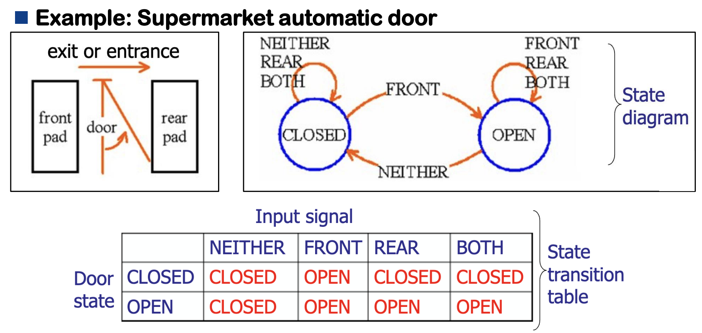

有限状态机是用来描述一个系统行为的数学模型。这个系统只能处于有限个“状态”之一，并且会根据接收到的“输入信号”从一个状态转换到另一个状态。

1.  **状态 (States):** 系统可能存在的几种核心情况。对于门来说，情况很简单，只有两种：

* **`CLOSED` (关闭)**
* **`OPEN` (打开)**

2.  **输入信号 (Input Signals):** 什么事件会影响系统的状态？事件来源于门前后的两个压力感应垫（front pad 和 rear pad）。根据哪个感应垫被踩下，我们可以定义出四种不同的输入信号：

* **`NEITHER`:** 两个感应垫都**没有**人踩。
* **`FRONT`:** 只有**前面**的感应垫有人踩。
* **`REAR`:** 只有**后面**的感应垫有人踩。
* **`BOTH`:** **两个**感应垫都有人踩。

---

**Definition**: A deterministic finite automata (DFA) is a quintuple (𝐾, $\Sigma$, $\delta$, 𝑠, 𝐹), where

- 𝐾 is a finite set of states
- $\Sigma$ is an alphabet
- $s \in K$ is the initial state
- $F \subseteq K$ is the set of final states
- $\delta: K \times \Sigma \rightarrow K$ is the transition function

确定性有限状态自动机（DFA）有五个要素：

1. **状态集合 (Set of States, Q):** 系统可能存在的所有状态的集合。
2. **输入符号集合 (Set of Input Symbols, Σ):** 系统可以接收的所有输入信号的集合。
3. **转换函数 (Transition Function, δ):** 定义了在当前状态下接收到某个输入信号后，系统将转换到哪个新状态的规则。
4. **初始状态 (Start State, q0):** 系统开始时的状态。
5. **接受状态集合 (Set of Accept States, F):** 系统可以接受的最终状态的集合。

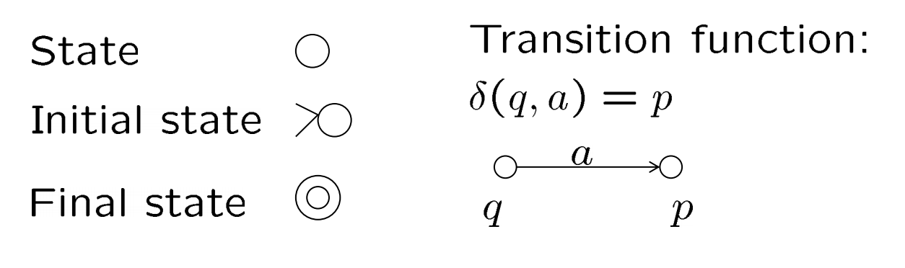

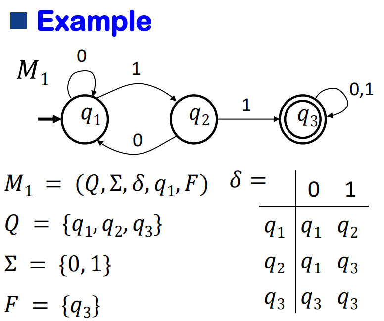

**Remark**: Transition function will determine **unique** next state based on current input and state.

???+ example "question"
    $L_2 = \{ w \in \{a,b\}^* : \text{𝑤 contains three consecutive b's} \}$

    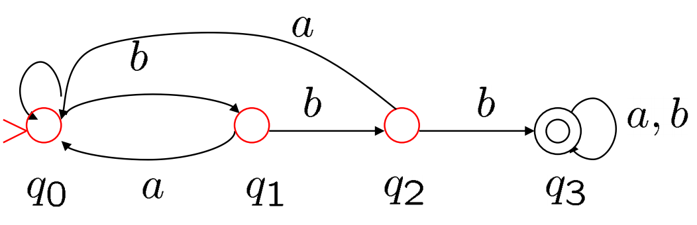

    The DFA that accepts language $L_2$ ?

??? example "answer"
    Note: $L_2 = \Sigma^* - L_1$

    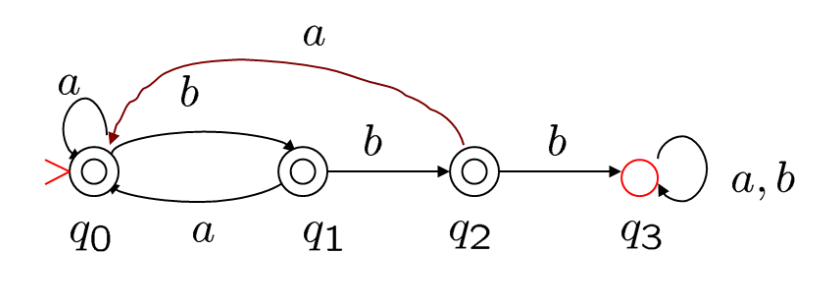

---

**Remark**

A configuration of a DFA (K, $\Sigma$, $\delta$, s, F) is in $K \times \Sigma^*$

- A configuration of a finite automaton 𝑴 tells the **current state** and the **inputs to be read** in the future.

Binary relation $\vdash_M$ between two config. of M $(q,w) \vdash_M (q',w') \leftrightarrow \exists a \in \Sigma, w = aw' \text{ and } \delta(q,a) = q'$

- $(q,w) \vdash_M (q',w')$ if the automaton 𝑀 can pass from the configuration $(q,w)$ to $(q',w')$ in one step.
- We say $(q,w)$ **yields** $(q',w')$ in **one** step.

$\vdash_M^*$ is the **reflexive** and **transitive** closure of $\vdash_M$

- $(q,w) \vdash_M^* (q',w') \leftrightarrow (q,w) \text{ yields } (q',w')$ after some number, possibly zero, of steps

A string $w \in \Sigma^*$ is said to be **accepted** by M iff there is a state $q \in F$ such that $(s,w) \vdash_M^* (q,\epsilon)$

- 从初始状态开始，把整个字符串读完，如果最后停在了某个接受状态里，那么这个字符串就被接受。

$L(M)$ is the language accepted by M and is the set of all strings accepted by M.

- $\epsilon$ is accepted if the start state is an accepting state.

---

## Nondeterministic Finite Automata

Consider the language L = $(ab \cup aba)^*$ which is accepted by the DFA:

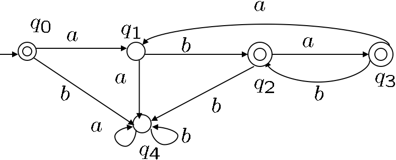

- No DFA with fewer than 5 states can accept this language
- Not easy to **ascertain** the DFA
- 𝐿 can be accepted by a simple **Nondeterministic Finite Automata** (NFA)

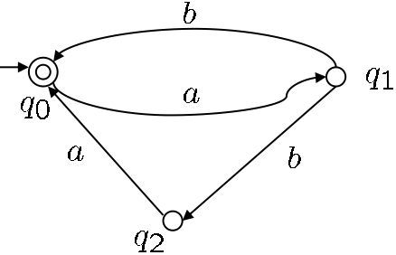

!!! info
    与DFA的严格规则不同，NFA放宽了限制，具有以下一个或多个特征：

    1. 允许多重转换 (Multiple Transitions):从一个状态出发，对于同一个输入符号，可以有多个可能的下一状态。

    2. 允许缺失转换 (Missing Transitions): 一个状态可以没有针对某个输入符号的转换路径。

---

**Definition**: A nondeterministic finite
automata (**NFA**) is a quintuple (𝐾, $\Sigma$, $\delta$, 𝑠, 𝐹), where

- 𝐾 is a finite set of state
- $\Sigma$ is an alphabet
- $s \in K$ is the initial state
- $F \subseteq K$ is the set of final states
- $\delta$ transition relation, is the subset of $K \times (\Sigma \cup \{\epsilon\}) \times K$

在每个状态 $q$，对于每个输入符号 $a$（甚至可以是 $\epsilon$，即不消耗输入），可以有多个可能的下一状态，也可以没有。

!!! info "**Remark**"
    For DFA, the transition function $\delta$ is a **function**, but for NFA, $\delta$ is a **relation**.

??? example
    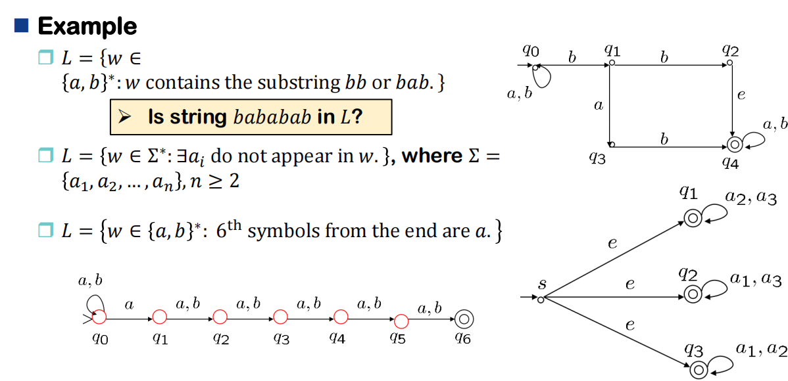

---

1. Every DFA is an NFA
2. NFA allows more transitions

However, is the language more expressive?

**Theorem**: For a language L = L(M) for some NFA, there exists a DFA M' such that L = L(M').

对于任何一个能被 NFA `M` 所接受的语言 L，我们总是可以构造出一个等价的 DFA `M'`，它接受的语言与 `M` 完全相同。

**如何理解这个“惊人”的结论？- 子集构造法**

如果 NFA 规则更灵活，为什么它的能力没有变得更强呢？

答案在于一个被称为**“子集构造法” (Subset Construction)** 的算法。这个算法证明了，任何 NFA 的“非确定性”行为，都可以被一个（通常更复杂的）DFA 来**模拟**。

**核心思想：**

* NFA 在运行中可以“分身”到多个状态。
* 我们可以构造一个 DFA，这个 DFA 的**每一个状态**对应 NFA 的**一个可能的状态集合**。

**举例：**

* 假设一个 NFA 在读取某个字符串后，它的“分身”们可能处于 `{q₁, q₃, q₅}` 这三个状态。
* 那么在等价的 DFA 中，就会有一个**单一的状态**，我们就叫它 `S₁`，这个 `S₁` 就代表着 NFA 的 `{q₁, q₃, q₅}` 状态集。
* DFA 的状态转换，就是模拟 NFA 状态**集合**的整体变迁。
* **代价：** 虽然总能将 NFA 转换成等价的 DFA，但代价可能是状态数量的“爆炸性”增长。如果一个 NFA 有 `n` 个状态，那么理论上构造出的等价 DFA 最多可能有 `2ⁿ` 个状态（因为一个n元集合有`2ⁿ`个不同的子集）。

---

### **证明策略**

要证明 NFA 和 DFA 的能力等价，我们需要证明两个方向：

1.  对任意一个 DFA，都能找到一个接受相同语言的 NFA。（这个方向很简单，因为DFA本身就是一种行为受限的NFA）。
2.  对任意一个 NFA，都能找到一个接受相同语言的 DFA。（这是证明的难点和核心）。

**区别1：转换规则的性质 (Transition Relation)**

* **DFA:** 转换函数 `δ` 是一个**函数**。对于一个 `(状态, 输入)` 对，其下一状态是**唯一确定**的。
* **NFA:** 转换规则 `Δ` 是一个**关系**。对于一个 `(状态, 输入)` 对，其下一状态可以是**零个、一个或多个**。

**区别2：定义域 (Domain)**

* **DFA:** 输入符号只能是字母表 `Σ` 中的字符。
* **NFA:** 输入符号可以是 `Σ` 中的字符，也可以是**空串 `ε`**。这允许 NFA 在不消耗任何输入的情况下改变状态（即 `ε-转换`）。

---

#### **解决方案之 Idea 1：用“状态集合”消除“非确定性”**

**核心思想:** NFA 在某一时刻可能同时处于多个状态。那么，我们就让新构造的 DFA 的**一个状态**来代表 NFA 的**一个状态集合**。
**具体实施：**

1.  **DFA 的状态:** DFA 的每一个状态都是一个由 NFA 的状态组成的**集合**。例如，如果 NFA 可能同时处于 `q₀` 和 `q₂`，那么在 DFA 中就会有一个单一的状态，我们称之为 `{q₀, q₂}`。
2.  **DFA 的初始状态:** 如果 NFA 的初始状态是 `q₀`，那么 DFA 的初始状态就是集合 `{q₀}`。
3.  **DFA 的接受状态:** 任何包含了**至少一个** NFA 接受状态的 DFA 状态，都是 DFA 的接受状态。例如，如果 NFA 的接受状态是 `q₂`，那么 DFA 的 `{q₀, q₂}` 和 `{q₂}` 状态就都是接受状态。

---

#### **解决方案之 Idea 2：用“ε-闭包”消除“ε-转换”**

**问题:** 在 NFA 中，从一个状态 `q` 出发，在读取一个字符 `a` 之后，它还可能“免费”地进行一系列 `ε-转换`。我们需要一种方法来计算出所有这些可能到达的状态。
* **核心工具：`ε-闭包` (ε-closure)，记作 `E(q)`。**

* **定义:** 对于 NFA 的任意一个状态 `q`，`E(q)` 是从 `q` 出发，**只通过 `ε-转换`** （可以走0步或多步）所能到达的所有状态的集合。`q` 本身也包含在 `E(q)` 中。
* **作用：** `ε-闭包` 让我们能够计算出，在 NFA 的某个状态 `q` 时，它**实际上可能处于的所有状态**（包括通过 `ε` 转换能“瞬间移动”到的地方）。

---

综合以上思想，我们可以得到一个完整的算法来构造与 NFA `M` 等价的 DFA `M'`：

1.  **DFA 的初始状态：** 计算 NFA 初始状态 `q₀` 的 `ε-闭包`，即 `E(q₀)`。这个状态集合就是 DFA 的初始状态。

2.  **构造 DFA 的转换函数 `δ'`:**

* 从 DFA 的初始状态（一个状态集合）开始，对字母表中的每一个符号 `a`，计算它的下一状态。
* 假设 DFA 的一个当前状态是 `S`（`S` 是 NFA 的一个状态集），要计算输入 `a` 后的下一状态 `S'`：

    a.  **移动 (Move):** 找出 NFA 从 `S` 中的所有状态出发，在读取输入 `a` 后能够到达的所有状态的集合。
    b.  **闭包 (Closure):** 计算上一步得到的集合中，**每一个状态**的 `ε-闭包`，然后将所有这些 `ε-闭包` **合并（取并集）**，得到的结果就是 DFA 的新状态 `S'`。

* 重复这个过程，直到所有新产生的 DFA 状态的转换都被计算出来。

3.  **确定 DFA 的接受状态:**

* 在所有构造出的 DFA 状态（状态集合）中，任何一个集合，只要它里面包含了**至少一个** NFA 的原始接受状态，那么这个集合状态就是 DFA 的一个接受状态。

---

### How to make a DFA for a given NFA?

Given an NFA : M = (K, $\Sigma$, $\delta$, s, F)

Construct an equivalent DFA : M' = (K', $\Sigma$, $\delta'$, s', F') where

- K' = $P(K)$ (the power set of K)
- s' = E(s) (the ε-closure of s)
- F' = { $Q| Q \subseteq K \text{ and } Q \cap F \neq \emptyset$ }
- For each $Q \subseteq K$ and each $a \in \Sigma$, let $\delta'(Q,a) = \bigcup_{E(p) | q \in Q, p \in K, \text{ and } (q,a,p) \in \delta}$

---

**Definition** of 𝐸(𝑞): For any state $q \in K$ , let $E(q)$ be the set of all states in M they are reachable from state q without reading any input

$$E(q) = \{p \in K : (q, \epsilon) \vdash_M^* (p, \epsilon)\}$$

**Claim** :

$$(q,w) \vdash_{M}^* (p,e) \leftrightarrow (E(q),w) \vdash_{M'}^* (P,\epsilon) \text{ for some set 𝑃 containing 𝑝}$$

??? example "Proof"
    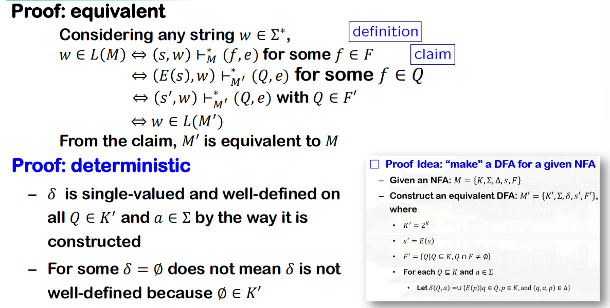

    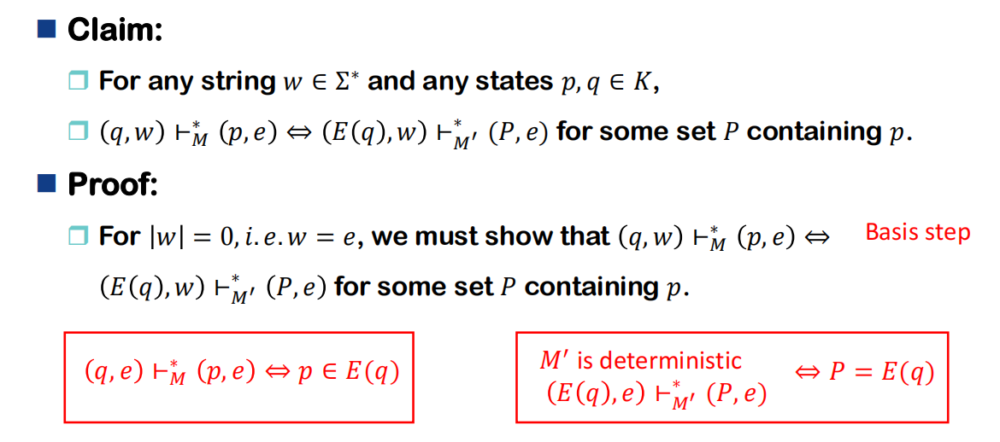

    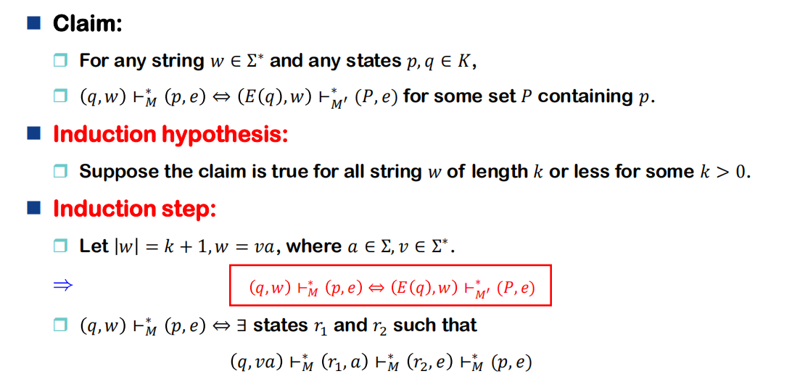

    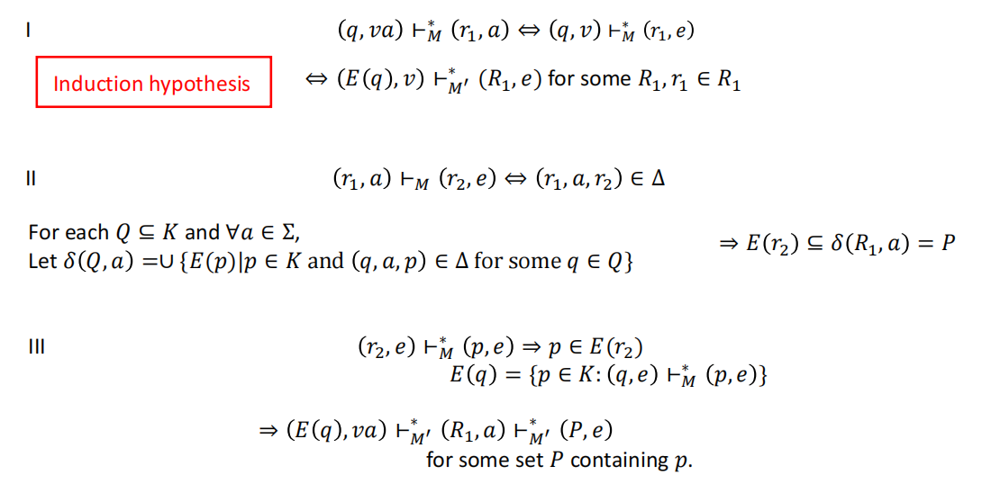

    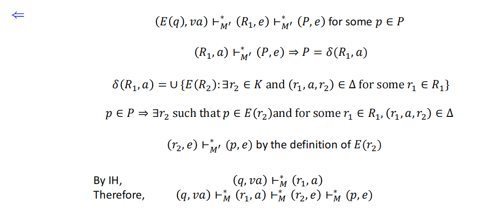

??? example "Proof in Chinese"
    这个证明的目标是说明：对于任何一个**非确定性有限自动机 (NFA)**，我们总能构造出一个与之等价的**确定性有限自动机 (DFA)**。所谓“等价”，就是指它们接受的语言完全相同。

    整个证明分为两个部分：

    1.  **构造方法**：如何从一个 NFA `M` 构造出对应的 DFA `M'`。
    2.  **等价性证明**：证明构造出来的 `M'` 和原来的 `M` 是等价的。

    ---

    第一步：理解目标和构造方法

    **我们的最终目标是什么？**证明 `w ∈ L(M) ⇔ w ∈ L(M')`。

    * `w ∈ L(M)` 意味着 NFA `M` 接受字符串 `w`。根据 NFA 的定义，这等价于 `(s, w) ⊢*_M (f, e)`，其中 `s` 是 `M` 的起始状态，`f` 是 `M` 的某个接受状态。
    * `w ∈ L(M')` 意味着 DFA `M'` 接受字符串 `w`。

    ??? note "what is ⊢*_M"
        $\vdash_M^*$ 表示自动机 M 的“多步推导关系”，也叫“可达关系”或“归纳闭包”。表示零步或多步推导（即“反射-传递闭包”）：自动机 M 从某个配置经过若干步（可以是0步，也可以是多步）转移到另一个配置。s

    **DFA `M'` 是如何构造的？**这个构造方法被称为**子集构造法 (Subset Construction)**。

    * **状态 (`K'`)**：`M'` 的每一个状态都是 `M` 的一个**状态集合**。例如，如果 `M` 有状态 `{q₀, q₁, q₂}`，那么 `M'` 的一个状态可能是 `{q₀}`，另一个可能是 `{q₁, q₂}`。
    * **起始状态 (`s'`)**：`M'` 的起始状态是 `E(s)`，即从 `M` 的起始状态 `s` 出发，只通过 `ε` (空转移) 能到达的所有状态的集合。`E(q)` 就代表从状态 `q` 开始的 `ε-闭包`。
    * **接受状态 (`F'`)**：`M'` 的任何一个状态（它本身是一个集合），只要它**包含了至少一个** `M` 的接受状态，那么它就是 `M'` 的一个接受状态。
    * **转移函数 (`δ'`)**：这是最关键的一步。`δ'(Q, a)` 的意思是，当前 `M'` 处于状态 `Q` (`Q` 是 `M` 的一个状态集)，在读入字符 `a` 后，`M'` 应该转移到哪个新状态？这个新状态的计算方法是：

        1.  找出 `M` 中从 `Q` 里的**任何一个**状态出发，读入字符 `a` 后能到达的所有状态。
        2.  对第1步得到的所有状态，计算它们的 `ε-闭包`，把这些闭包合并成一个大集合。这个大集合就是 `M'` 的下一个状态。
        即：`δ'(Q, a) = ⋃_{q∈Q} E(δ(q, a))`

    ---

    第二步：核心论断 (The Claim) 

    直接证明 `L(M) = L(M')` 有些复杂，所以我们先证明一个更通用、更强大的“引理”或“论断 (Claim)”。如果这个论断成立，那么语言等价就自然成立了。

    **论断内容：** 对于**任意**字符串 `w` 和 `M` 的**任意**状态 `p, q`： NFA `M` 从状态 `q` 开始读完 `w` 后能够到达状态 `p`

    `(q, w) ⊢*_M (p, e)` **当且仅当 (⇔)** `(E(q), w) ⊢*_{M'} (P, e)` 且 `p ∈ P`

    DFA `M'` 从状态 `E(q)` 开始读完 `w` 后，会到达某个状态 `P`，并且这个状态 `P` (它是一个集合) 里面包含了状态 `p`。

    **为什么这个论断如此重要？**

    如果我们证明了这个论断，只需要把 `q` 设为 `M` 的起始状态 `s`，把 `p` 设为 `M` 的某个接受状态 `f`，那么：

    `w` 被 `M` 接受 ⇔ `(s, w) ⊢*_M (f, e)` (对于某个 `f ∈ F`) ⇔ `(E(s), w) ⊢*_{M'} (Q, e)` 且 `f ∈ Q` (根据我们的论断) ⇔ `(s', w) ⊢*_{M'} (Q, e)` 且 `Q` 是 `M'` 的一个接受状态 (根据 `s'` 和 `F'` 的定义) ⇔ `w` 被 `M'` 接受。

    这就完美地证明了 `L(M) = L(M')`。

    ---

    第三步：使用数学归纳法证明核心论断

    我们对字符串 `w` 的长度 `|w|` 进行归纳。

    ---

    **1. 基础步骤 (Basis Step)**

    证明当 `|w| = 0`，即 `w = e` (空字符串) 时，论断成立。我们需要证明：`(q, e) ⊢*_M (p, e) ⇔ (E(q), e) ⊢*_{M'} (P, e)` 且 `p ∈ P`。

    **`⇒` 方向**：

    * 假设 `(q, e) ⊢*_M (p, e)` 成立。
    * 在 NFA 中，这表示从 `q` 只通过 `ε` 转移就能到达 `p`。这正是 `ε-闭包` 的定义，也就是说 `p ∈ E(q)`。
    * 再看 DFA `M'`，从状态 `E(q)` 开始读入空字符串 `e`，它哪儿也不会去，状态仍然是 `E(q)`。所以 `P = E(q)`。
    * 那么 `p ∈ P` 这个条件成立吗？成立，因为我们已经推导出 `p ∈ E(q)`，而 `P` 就是 `E(q)`。

    **`⇐` 方向**：

    * 假设 `(E(q), e) ⊢*_{M'} (P, e)` 且 `p ∈ P` 成立。
    * DFA 读入 `e` 不会改变状态，所以 `P = E(q)`。
    * 条件就变成了 `p ∈ E(q)`。
    * 根据 `ε-闭包` 的定义，`p ∈ E(q)` 等价于 `(q, e) ⊢*_M (p, e)`。

    **结论**：基础步骤成立。

    ---

    **2. 归纳假设 (Induction Hypothesis)**

    假设对于所有长度小于等于 `k` (`k ≥ 0`) 的字符串 `v`，我们的论断都成立。

    ---

    **3. 归纳步骤 (Induction Step)**

    现在我们要证明对于长度为 `k+1` 的字符串 `w`，论断也成立。

    设 `w = va`，其中 `|v| = k`，`a` 是一个字符。

    我们需要证明：`(q, va) ⊢*_M (p, e) ⇔ (E(q), va) ⊢*_{M'} (P, e)` 且 `p ∈ P`。

    **`⇒` 方向**

    * **假设** `(q, va) ⊢*_M (p, e)` 成立。
    * **分解 NFA 的计算过程**：NFA 从 `q` 读入 `va` 到达 `p`，这个过程必然可以分解为三步：

        1.  `(q, v) ⊢*_M (r₁, e)`：首先从 `q` 读完字符串 `v`，到达某个中间状态 `r₁`。
        2.  `(r₁, a) ⊢_M (r₂, e)`：然后从 `r₁` 读入字符 `a`，转移到另一个中间状态 `r₂`。这意味着 `M` 的转移规则 `Δ` 中存在一条 `(r₁, a, r₂)`。
        3.  `(r₂, e) ⊢*_M (p, e)`：最后从 `r₂` 通过若干 `ε` 转移到达最终状态 `p`。这等价于 `p ∈ E(r₂)`。

    * **应用归纳假设**：

        * 对于第1步 `(q, v) ⊢*_M (r₁, e)`，因为 `|v| = k`，我们可以应用归纳假设。
        * 这告诉我们：`(E(q), v) ⊢*_{M'} (R₁, e)` 并且 `r₁ ∈ R₁`。

    * **连接到 DFA 的下一步**：

        * 现在 DFA `M'` 处于状态 `R₁`，接下来它要读入字符 `a`。根据 `M'` 的转移函数 `δ'`，它会转移到新状态 `P = δ'(R₁, a)`。
        * 我们现在需要证明的是，我们最开始的目标状态 `p` 就在这个集合 `P` 里面。

    * **证明 `p ∈ P`**：

        * 回顾 `δ'` 的定义：`P = δ'(R₁, a)` 是所有能从 `R₁` 中的某个状态（比如 `r`）出发，经过 `a` 转移，再经过 `ε` 转移到达的状态的集合。
        * 我们已知：`r₁ ∈ R₁` (来自归纳假设)，`M` 中存在转移 `(r₁, a, r₂)` (来自第2步)，以及 `p ∈ E(r₂)` (来自第3步)。
        * 这三点完美地符合了 `p` 成为 `δ'(R₁, a)` 集合中一员的条件。因此 `p ∈ P`。

    * **小结**：我们成功证明了，如果 NFA 的计算路径存在，那么 DFA 也会进行相应的计算 `(E(q), va) ⊢*_{M'} (P, e)`，并且最终状态集 `P` 包含 `p`。

    **`⇐` 方向**

    * **假设** `(E(q), va) ⊢*_{M'} (P, e)` 且 `p ∈ P` 成立。
    * **分解 DFA 的计算过程**：DFA 从 `E(q)` 读入 `va`，可以分解为两步：

        1.  `(E(q), v) ⊢*_{M'} (R₁, e)`：先读入 `v` 到达某个状态 `R₁`。
        2.  `(R₁, a) ⊢_{M'} (P, e)`：再读入 `a` 到达状态 `P`。这说明 `P = δ'(R₁, a)`。

    * **分析假设**：

        * 我们有 `p ∈ P`，并且 `P = δ'(R₁, a)`。
        * 根据 `δ'` 的定义，这必然意味着：**存在**某个状态 `r₁ ∈ R₁` 和某个状态 `r₂`，使得：

            * `M` 中有一条转移规则 `(r₁, a, r₂)`。
            * `p` 可以从 `r₂` 通过 `ε` 转移到达，即 `p ∈ E(r₂)`，也就是 `(r₂, e) ⊢*_M (p, e)`。

    * **应用归纳假设**：

        * 对于第1步 `(E(q), v) ⊢*_{M'} (R₁, e)`，并且我们找到了一个 `r₁ ∈ R₁`，我们可以应用归纳假设（反向）。
        * 这告诉我们：`(q, v) ⊢*_M (r₁, e)` 必定成立。

    * **连接 NFA 的所有步骤**：

        1.  我们有 `(q, v) ⊢*_M (r₁, e)`。
        2.  我们有 `(r₁, a) ⊢_M (r₂, e)` (因为存在 `(r₁, a, r₂)` 这条规则)。
        3.  我们有 `(r₂, e) ⊢*_M (p, e)`。

    * **小结**：把这三步连起来，我们就构造出了 NFA `M` 的一条完整计算路径：`(q, va) ⊢*_M (p, e)`。

---

**Remark**

- Size of new DFA can be exponential in size of old NFA $\rightarrow 2^n$ 状态
- The proof of theorem provides an **actual algorithm** for constructing an equivalent DFA from any NFA

---

## FA & Regular Expression

**克莱尼定理 (Kleene's Theorem)**。

A Language 𝐿 is regular iff it is accepted by a finite automata M, i.e., L = L(M)

**定理内容**: "A Language L is **regular** iff it is accepted by a **finite automata** M" (一个语言 L 是**正则**的，当且仅当它能被一个**有限自动机** M 所接受)。

By definition, L is regular iff there is a regular expression r that represents L

根据定义，一个语言 L 是正则的，当且仅当存在一个正则表达式 r 来表示它

**核心思想**: 这条定理在**正则表达式**和**有限自动机**之间画上了等号。它告诉我们，这两种工具在表达能力上是完全等价的。

* **正则表达式**：是一种描述性的、基于文本的模式，方便人类书写和理解。
* **有限自动机**：是一种计算性的、基于状态的模型，方便机器执行和分析。

**证明思路 (Proof Idea)**: 这个定理是双向的（“当且仅当”），所以证明也必须包含两个方向：

1.  **充分性**: 给定任意一个正则表达式，我们总能构造出一个与之等价的有限自动机 (FA)。
2.  **必要性**: 给定任意一个有限自动机，我们总能构造出一个与之等价的正则表达式。

### 从正则表达式到自动机

**递归构造 (Construct a FA recursively)**: 证明的关键是利用正则表达式的**递归定义**。

**正则表达式的定义 (Definition)**:

1.  **基础情况**: `∅` (空集)、`ε` (空串) 以及字母表 `Σ` 中的任何单个字符 `a` 都是正则表达式。
2.  **递归步骤**: 如果 `α` 和 `β` 都是正则表达式，那么 `(αβ)` (连接)、`(α ∪ β)` (并集) 和 `(α*)` (克莱尼星号) 也都是正则表达式。

* **证明思路 (Proof Idea)**:

1.  首先，为基础情况（`∅`, `ε`, `a`）构造出极其简单的有限自动机。
2.  然后，证明如果我们已经有了 `α` 和 `β` 对应的自动机，我们总有办法将它们组合起来，构造出 `αβ`、`α ∪ β` 和 `α*` 对应的更复杂的自动机。
3.  这就引出了一个关键概念：**闭包性质 (Closure Properties)**。如果一个语言类别在某种运算下是“封闭”的，意味着对该类别中的语言进行这种运算后，得到的结果仍然属于这个类别。
4.  因此，证明思路转化为了：**证明有限自动机接受的语言（即正则语言）这个大家庭，在并集、连接、克莱尼星号、补集、交集这些运算下是封闭的。**

---

#### 正则语言的闭包性质 (Closure Properties)

##### 并集 (Union)

**目标**: 给定两个 NFA `M₁` 和 `M₂`，构造一个新的 NFA `M`，使得 `L(M) = L(M₁) ∪ L(M₂)`。

**构造方法**:

1.  创建一个**新的起始状态 `s`**。
2.  从新状态 `s` 引出两条 `ε` 转移，分别指向原来 `M₁` 的起始状态 `s₁` 和 `M₂` 的起始状态 `s₂`。
3.  新机器 `M` 的状态集是 `M₁` 和 `M₂` 状态集的并集，再加上新的起始状态 `s`。
4.  新机器的接受状态集是 `M₁` 和 `M₂` 接受状态集的并集。

**工作原理**: 当一个字符串输入到新机器 `M` 时，它首先从 `s` 出发，可以**自由选择**（非确定性地）进入 `M₁` 的路径或者 `M₂` 的路径。只要这个字符串能被 `M₁` **或** `M₂` 中的任何一个接受，它就能在新机器 `M` 中找到一条通往接受状态的路径。

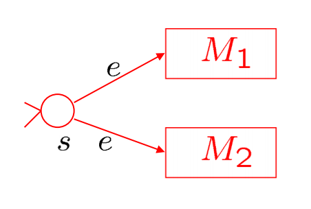

???+ example "question"
    Is infinite unions regular?

??? note "answer"
    No

    考虑无限个正则语言：`L₀={ε}`, `L₁={a¹b¹}`, `L₂={a²b²}`, ... `Lᵢ={aⁱbⁱ}`。每一个 `Lᵢ` 本身只包含一个字符串，是有限集，因此是正则的。但是它们的并集 `∪ Lᵢ = {aⁿbⁿ | n≥0}`，我们已经知道这个语言不是正则的，因为它需要无限的记忆来计数。

---

##### 连接 (Concatenation)

**目标**: 给定两个 NFA `M₁` 和 `M₂`，构造一个新的 NFA `M`，使得 `L(M) = L(M₁) ∘ L(M₂)`。

**构造方法**:

1.  将 `M₁` 和 `M₂` “串联”起来。
2.  `M` 的起始状态就是 `M₁` 的起始状态。
3.  `M` 的接受状态就是 `M₂` 的接受状态。
4.  从 `M₁` 的**所有**接受状态引出 `ε` 转移，指向 `M₂` 的起始状态。

**工作原理**: 要想被新机器 `M` 接受，一个字符串 `w` 必须能被分解为两部分 `w = xy`。机器首先作为 `M₁` 运行，处理完前半部分 `x` 后，恰好停在 `M₁` 的一个接受状态上。然后，通过 `ε` 转移“跳”到 `M₂` 的起点，继续作为 `M₂` 运行，处理完后半部分 `y` 后，停在 `M₂` 的一个接受状态上。

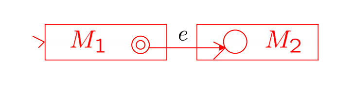

---

##### 克莱尼星号 (Kleene Star)

**目标**: 给定一个 NFA `M₁`，构造一个新的 NFA `M`，使得 `L(M) = L(M₁)*`。

**构造方法**:

1.  创建一个**新的起始状态 `s'`**。
2.  从 `s'` 引出一条 `ε` 转移到 `M₁` 的原起始状态 `s₁`。
3.  从 `M₁` 的所有接受状态 `F₁` 引出 `ε` 转移**返回到** `M₁` 的原起始状态 `s₁`。（这形成了循环，允许 `M₁` 被重复执行多次）。
4.  **关键一步**: 将新的起始状态 `s'` **也设为接受状态**。

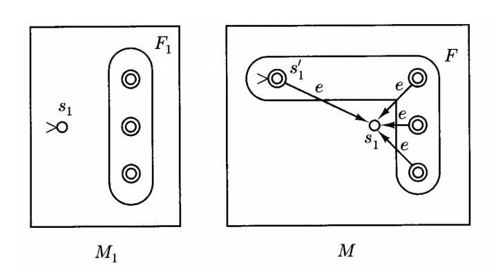

???+ example "question"
    Why do we need to make the new initial state also a final state?

??? note "answer"
    因为根据定义，任何语言 `L` 的克莱尼闭包 `L*` **永远包含空字符串 `ε`**。为了让机器能接受 `ε`，最直接的方法就是让起始状态本身就是一个接受状态。

???+ example "question"
    Why can't skip the introduction of the new initial state?

??? note "answer"
    例如这个例子，如果只在 M₁ 上修改，将起始状态变成接受状态，并从最终状态加一条边指回起始状态。M₁ 的路径是 `s₀ --a--> s₁ --b--> s₂(final)`。

    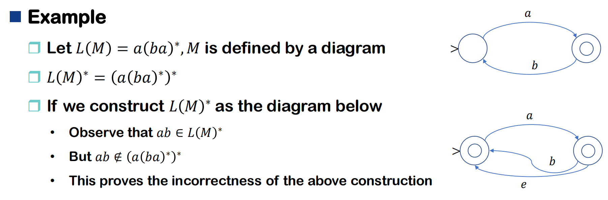

---

#### 其他闭包性质（基于DFA）

正则语言在补集和交集运算下也是封闭的。

##### 补集 (Complementation)

**目标**: 给定一个 **DFA** `M₁`，构造一个 DFA `M`，使得 `L(M)` 是 `L(M₁)` 的补集，即 `Σ* - L(M₁)`。

**构造方法**: 

1.  `M` 的状态、起始状态、转移函数都和 `M₁` 完全一样。
2.  `M` 的接受状态集 `F`，恰好是 `M₁` 的**非接受状态集**。即 `F = K₁ - F₁`。

**工作原理**:

* 这个构造的巧妙之处在于它**必须基于 DFA**。因为对于一个 DFA，任何输入字符串 `w` 都有**唯一一条**计算路径，并且最终必然停在**唯一一个**状态上。
* 如果 `w` 在 `M₁` 中被接受，它会停在一个 `F₁` 中的状态。在 `M` 中，这个状态就变成了非接受状态，所以 `w` 不被 `M` 接受。
* 如果 `w` 在 `M₁` 中不被接受，它会停在一个非 `F₁` 的状态。在 `M` 中，这个状态就变成了接受状态，所以 `w` 被 `M` 接受。
* 这对于 NFA 是不成立的，因为 NFA 对于一个字符串可能有多条路径，也可能没有路径。

**构造方法**:

假设 $M_1 = (K_1, \Sigma, \delta_1, s_1, F_1)$ 是一个DFA。

我们构造 $M=(K, \Sigma, \delta, s, F)$ 如下：

- 状态集 (K): $K = K_1$
- 起始状态 (s): $s = s_1$
- 接受状态集 (F): $F = K - F_1$
- 转移函数 (δ): $\delta = \delta_1$

---

##### 交集 (Intersection)

**目标**: 给定两个 **DFA** `M₁` 和 `M₂`，构造一个 DFA `M`，使得 `L(M) = L(M₁) ∩ L(M₂)`。

**构造方法 (乘积构造法 Product Construction)**:

1.  `M` 的状态是 `M₁` 和 `M₂` 状态的**笛卡尔积** `K₁ × K₂`。`M` 的每个状态都是一个状态对 `(q₁, q₂)`，其中 `q₁ ∈ K₁`, `q₂ ∈ K₂`。
2.  `M` 的起始状态是 `(s₁, s₂)`。
3.  **核心**: `M` 的转移函数 `δ` 模拟了 `M₁` 和 `M₂` 的**并行运行**。当 `M` 处于状态 `(q₁, q₂)` 并读入字符 `a` 时，它会同时计算 `M₁` 从 `q₁` 读 `a` 会到哪里 (`δ₁(q₁, a)`)，以及 `M₂` 从 `q₂` 读 `a` 会到哪里 (`δ₂(q₂, a)`)，然后进入由这两个新状态组成的对。
4.  `M` 的接受状态是那些**两个分量都是各自机器的接受状态**的状态对，即 `F = F₁ × F₂`。

**工作原理**: 一个字符串 `w` 能驱动 `M` 从起始状态 `(s₁, s₂)` 到达一个接受状态 `(f₁, f₂)` (其中 `f₁∈F₁`, `f₂∈F₂`)，当且仅当 `w` 能同时驱动 `M₁` 从 `s₁` 到 `f₁` **并且**驱动 `M₂` 从 `s₂` 到 `f₂`。这完美地实现了交集的定义。

$$L(M_1) \cap L(M_2) = \sigma^* - \left( (\Sigma^* - L(M_1)) \cup (\Sigma^* - L(M_2)) \right)$$

* 这是集合论中的**德摩根定律**。
* 它提供了证明交集封闭性的另一种思路：既然我们已经证明了正则语言对**补集**和**并集**是封闭的，那么根据这个公式，它们对交集也必然是封闭的。

思路2: 乘积构造法 ("parallel" simulation!)

目标: 给定两个 DFA $M_1$ 和 $M_2$，构造一个DFA $M$ 来模拟它们的并行运行。

构造方法:

假设 $M_1 = (K_1, \Sigma, \delta_1, s_1, F_1)$ 和 $M_2 = (K_2, \Sigma, \delta_2, s_2, F_2)$。
我们构造 $M=(K, \Sigma, \delta, s, F)$ 如下：

- 状态集 (K): $K = K_1 \times K_2$ (状态是原状态的笛卡尔积)
- 起始状态 (s): $s = (s_1, s_2)$
- 接受状态集 (F): $F = F_1 \times F_2$ (只有当两个子状态都达到接受状态时，新状态才是接受状态)
- 转移函数 (δ): 对于任意 $(q_1, q_2) \in K$ 和 $a \in \Sigma$，定义：

$$\delta((q_1, q_2), a) = (\delta_1(q_1, a), \delta_2(q_2, a))$$

---

#### 汤普森构造法

**核心思想**：汤普森构造法是一种**系统性的、算法化的**方法，用于将任意一个正则表达式（Regular Expression）转换为一个与之等价的**非确定性有限自动机（NFA）**。

汤普森构造法生成的每个NFA（或NFA组件）都有一个非常重要的**标准结构**：

* 只有一个起始状态。
* 只有一个接受状态（或称为终止状态）。
* 起始状态没有指向它的转移（没有入边）。
* 接受状态没有从它出发的转移（没有出边）。

**(a) 构造识别空字符串 `ε` 的NFA**

这是最简单的自动机。它什么也不读，直接从开始到结束。

```
         ε
  (s) -----> (f)
```

* `s` 是起始状态，`f` 是接受状态（用双圈表示）。
* 一条 `ε` 转移直接连接两者。

**(b) 构造识别单个字符 `a` 的NFA**

这个自动机只接受单个字符 `a`。

```
         a
  (s) -----> (f)
```

* 一条标签为 `a` 的转移连接起始和接受状态。

**递归/组合规则** (Recursive Cases) - 三种拼接方法

假设我们已经为正则表达式 `A` 和 `B` 构造好了它们各自的NFA，我们分别称之为 `M(A)` 和 `M(B)`。

**(a) 并集/或 (Union / `A | B` 或 `A ∪ B`)**

1.  创建一个**新的起始状态** `s_new` 和一个**新的接受状态** `f_new`。
2.  从 `s_new` 画两条 `ε` 转移，分别指向 `M(A)` 和 `M(B)` 的起始状态。
3.  从 `M(A)` 和 `M(B)` 的接受状态画两条 `ε` 转移，分别指向新的接受状态 `f_new`。

**(b) 连接 (Concatenation / `AB`)**

1.  `M(A)` 的起始状态成为新机器的起始状态。
2.  `M(B)` 的接受状态成为新机器的接受状态。
3.  将 `M(A)` 的**接受状态**通过一条 `ε` 转移连接到 `M(B)` 的**起始状态**。

**(c) 克莱尼星号 (Kleene Star / `A*`)**

这个操作表示“重复0次或多次”。它需要提供一条“跳过”路径（重复0次）和一条“循环”路径（重复多次）。

1.  创建一个**新的起始状态** `s_new` 和一个**新的接受状态** `f_new`。
2.  **跳过路径 (重复0次)**: 从 `s_new` 画一条 `ε` 转移直接到 `f_new`。
3.  **循环路径 (重复1次或多次)**:

    * 从 `s_new` 画 `ε` 转移到 `M(A)` 的起始状态。
    * 从 `M(A)` 的接受状态画 `ε` 转移到 `f_new`。
    * **关键的循环**：从 `M(A)` 的接受状态画一条 `ε` 转移**返回到** `M(A)` 的起始状态。

---

### 从自动机到正则表达式

这是一个非常巧妙的构造性证明，其核心思想是**逐步消减状态 (State Elimination)**。

#### 广义有限自动机 (GFA)

**目标**: Given a FA, we construct a regular expression by induction, i.e., executing on a limited number of states

**新定义：广义有限自动机 (Generalized Finite Automaton, GFA 或 $M_G$)**

1.  **转移的标签可以是正则表达式**: 在普通NFA中，一条边的标签只能是一个字符或`ε`。但在GFA中，一条边的标签可以是**任意复杂的正则表达式**。例如，可以有一条从`q₁`到`q₂`的边，标签是 `(a∪b)*ab`。
2.  **单一的接受状态**: GFA被设计为只有一个接受状态。
3.  **特殊的起始和接受状态**:

    * 没有任何转移可以**进入**起始状态。
    * 没有任何转移可以**离开**接受状态。

---

#### 将任意FA转换为GFA

**步骤 (Extend M to $M_G$)**:

1.  **重命名状态**: 将原自动机 `M` 的所有状态命名为 `q₁, q₂, ..., qₙ₋₂`。
2.  **添加两个新状态**: 添加一个全新的起始状态 `qₙ₋₁` (也记作 $s_G$) 和一个全新的接受状态 `qₙ` (也记作 $f_G$)。
3.  **连接新状态**:

* 从新的起始状态 $s_G$ 画一条标签为 `ε` 的边，指向**原来**的起始状态 `s`。
* 从**原来所有**的接受状态 `q ∈ F` 画标签为 `ε` 的边，指向新的唯一接受状态 $f_G$。

4.  **保留原结构**: `M` 内部原来的所有状态和转移都保持不变。

**结果**: 经过这个改造，我们得到了一个GFA $M_G$ 。它接受的语言和原来的 `M` 完全一样 (`L(M) = L(M_G)`)，并且完美地满足GFA的所有定义（单一接受状态、起始状态无入边、接受状态无出边）。

现在，无论我们拿到什么样的FA，都可以通过这个标准流程，得到一个可以进行下一步操作的GFA。

---

#### 如何“消掉”一个状态

* 假设原来有一条路径：从 `qᵢ` 经过标签为 `α` 的边到达 `q`，再从 `q` 经过标签为 `β` 的边到达 `qⱼ`。这条路径对应的字符串模式就是 `α` 后面跟着 `β`，即 `αβ`。
* 当我们移除 `q` 后，为了保留这条路径，我们直接在 `qᵢ` 和 `qⱼ` 之间添加一条新的边，其标签就是 `αβ`。
* 如果 `qᵢ` 和 `qⱼ` 之间本来就有一条标签为 `δ` 的边，那么现在从 `qᵢ` 到 `qⱼ` 就有了两条路：原来的 `δ` 和新的 `αβ`。我们将它们合并，新边的标签就是 `δ ∪ αβ`。

* 更一般的情况。状态 `q` 可能有一个指向自己的环，标签为 `γ`。
* 现在，一条经过 `q` 的路径可以是：从 `qᵢ` 经 `α` 到 `q`，然后在 `q` 的自环 `γ` 上绕任意圈（0次、1次、2次...），最后从 `q` 经 `β` 到 `qⱼ`。
* 在自环上绕任意圈，这个模式用正则表达式描述就是 `γ*`。
* 因此，这条完整的“绕行”路径对应的模式是 `α` 后面跟着 `γ*`，再跟着 `β`，即 `αγ*β`。
* 同样，我们将这个新路径与原来可能存在的直达路径 `δ` 合并，得到最终的新标签：`δ ∪ αγ*β`。

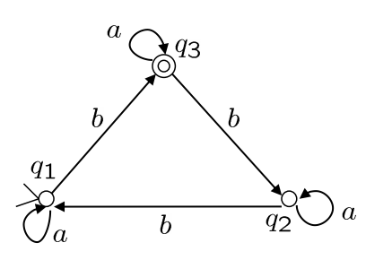

---

#### 严谨证明：数学归纳法

##### 核心定义

**定义 `R(i, j, k)`**:

* 首先，我们将自动机的所有状态编号为 `q₁, q₂, ..., qₙ`。
* `R(i, j, k)` 代表一个**语言**（字符串的集合）。
* 这个集合包含所有能让自动机从状态 `qᵢ` 转移到 `qⱼ` 的字符串 `w`，其限制条件是：在整个转移路径中，所有**中间经过**的状态，其编号都**不能大于 `k`**。（起点`i`和终点`j`不受此限制）。

**Remark**:

* **"intermediate state" (中间状态)**: 这个解释非常关键。`k` 就像一个“通行许可等级”。`k=0` 意味着不允许经过任何编号大于0的中间状态（即不允许有中间状态，只能直接转移）。`k=n` 意味着可以使用所有 `n` 个状态作为中间状态。
* `R(i, j, n)` 的特殊含义：当 `k=n` 时，通行许可等级最高，意味着路径可以经过**任何**中间状态。这其实就是从 `qᵢ` 到 `qⱼ` 的所有可能路径所形成的语言。

##### 归纳证明过程

**证明目标**: 证明对于任意的 `i, j, k`，`R(i, j, k)` 所代表的语言都是**正则的**（即可以用正则表达式表示）。如果这个成立，那么整个自动机的语言 `L(M)`（它无非是所有从起始状态到接受状态的路径语言的并集，即 `∪ R(start, final, n)`）也必然是正则的。

**归纳证明**:

**Base case k = 0 (基础情况)**:

* `R(i, j, 0)` 表示从 `qᵢ` 到 `qⱼ` 且不允许经过任何编号大于0的中间状态的路径。这只可能是**一步直接转移**。
* 这种语言只包含单个字符（所有`qᵢ`到`qⱼ`的直达边上的标签）或者`ε`（如果`i=j`，表示原地不动）。这是一个有限集合，因此是正则的。基础情况成立。

**Induction step (归纳步骤)**:

* **归纳假设**: 假设对于任意 `i, j`，`R(i, j, k-1)` 都已经是正则的。
* **推导 `R(i, j, k)`**: 我们要证明 `R(i, j, k)` 也是正则的。
* 考虑一条从 `qᵢ`到 `qⱼ`、中间状态编号不超过 `k` 的路径。这条路径可以分为两种情况：

1.  **路径根本不经过 `qₖ`**: 那么它的所有中间状态编号都不超过 `k-1`。这种路径的语言就是 `R(i, j, k-1)`。
2.  **路径至少经过一次 `qₖ`**: 那么这条路径可以被分解为：

    * 从 `qᵢ` **首次**到达 `qₖ` (中间状态编号不超过 `k-1`) $\rightarrow$ 对应语言 `R(i, k, k-1)`
    * 在 `qₖ` 上**循环任意次** (每次循环的中间状态编号不超过 `k-1`) $\rightarrow$ 对应语言 `R(k, k, k-1)*`
    * 从 `qₖ` **最终**离开到达 `qⱼ` (中间状态编号不超过 `k-1`) $\rightarrow$ 对应语言 `R(k, j, k-1)`

**核心递推公式**: 将这两种情况用**并集**（`∪`）组合起来，就得到了这个至关重要的公式：

$$R(i, j, k) = R(i, j, k-1) \cup R(i, k, k-1) (R(k, k, k-1)) * R(k, j, k-1)$$

**结论**: 根据归纳假设，公式右边的所有 `R(..., ..., k-1)` 都是正则的。而正则语言对于**并集(∪)、连接(concatenation)和克莱尼星号(\*)** 运算是封闭的。因此，整个 `R(i, j, k)` 也必然是正则的。

---

## Languages that are and are not regular

### 如何证明一个语言是正则的

有三种主要方法：

1. 被 `FA` 接受: 为该语言构造一个DFA或NFA。
2. 由正则表达式描述: 为该语言写出一个正则表达式。
3. 闭包性质: 证明该语言可以通过对已知的正则语言进行并、交、补、连接、克莱尼星号等运算得到。

Let $\Sigma=\{0,1,...,9\}$ . $L=\{w | w \in \Sigma^* \text{ be the decimal representation for nonnegative integers (without redundant leading zeros) divisible by 2 and 3}\}$。Show 𝐿 is regular.

我们可以将 L 分解：

1.  $L_1$: 所有合法的非负整数十进制表示的集合。

$L_1 = 0 \cup \{1,2,...,9\}\Sigma^*$ (是正则的)

2.  $L_2$: 所有能被2整除的数的集合。

$L_2 = L_1 \cap \Sigma^*\{0,2,4,6,8\}$ (是正则的)

3.  $L_3$: 所有能被3整除的数的集合。一个数能被3整除，当且仅当它的各位数字之和能被3整除。我们可以构造一个3状态的DFA来识别它,如图所示。所以 $L_3$ 是正则的。

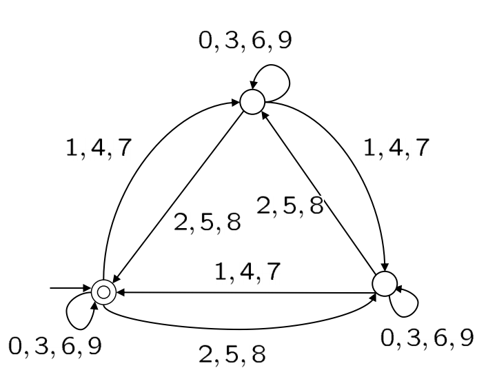

最终，$L = L_2 \cap L_3$。因为正则语言对交集封闭，所以 L 是正则的。

---

1. $L = \{xy \in \Sigma^* : x \in L' \text{ and } y \notin L'\}$ is regular.

Proof:

该语言可以表示为 $L = L' \circ \overline{L'}$，其中 $\overline{L'}$ 是 $L'$ 的补集。因为正则语言对补集和连接运算是封闭的，所以 L 是正则的。

2. $L = \{w \in \{a,b\}^* : w \text{ has an equal number of 𝑎′s and 𝑏′s}\}$ is not regular.

Proof:

* 反证法: 假设 L 是正则的。
* 我们知道 $a^*b^*$ 是一个正则语言。
* 因为正则语言对交集封闭，所以 $L \cap a^*b^*$ 也必须是正则的。
* 然而，$L \cap a^*b^* = \{a^nb^n : n \ge 0\}$。这是一个经典的非正则语言。
* 产生矛盾，因此原假设错误，L不是正则的。

3. $L = a^*$

* **解释**: 这个语言被判定为正则语言，理由是“它由一个正则表达式所定义”。这是最直接的判定方式。所以它所代表的语言 $L = \{\epsilon, a, aa, aaa, ...\}$ 就是一个正则语言。

4. $L = \{a^n: n \ge 0\}$

* **解释**: 这个语言被判定为正则语言，理由是它与前一个语言相等。因为展开来看，这个集合就是 $\{\epsilon, a, aa, aaa, ...\}$，这与上一条中由正则表达式 `a*` 所描述的语言是完全一样的。

5. $L = \{a^n: n \in \text{Even}\}$

* **解释**: 这个语言被判定为正则语言，理由是它可以被正则表达式 `(aa)*` 描述。

---

#### 为什么大多数语言不是正则的？

**直觉**: FA只有有限的记忆（状态）。对于需要无限计数或记忆的问题，FA无能为力。

对于任何非空字母表，字符串的集合是可数无限的。语言是字符串的集合，所以语言的总数是不可数无限的 ($|\mathbb{R}|$)。然而，正则表达式（或FA）的数量是可数无限的 ($\aleph_0$)。

**结论**：绝大多数语言都不是正则的。

非正则语言的例子:

$$L = \{a^nb^n : n \ge 0\}$$

$$L = \{a^n : n \text{ is prime}\}$$

$$L = \{ww^R : w \in \{a,b\}^*\}$$

$$L = \{ww : w \in \{a,b\}^*\}$$

??? example "其中第三条偶数长度的回文和第四条重复串在引入下面的泵引理之后给出证明"
    1. $L = \{ww^R : w \in \{a,b\}^*\}$ (偶数长度的回文)

    **直觉解释**：

    要判断一个字符串是否属于 $L$，机器必须：读取并**记住**整个前半部分 `w`。读取后半部分时，逐一将其与记忆中的 `w` 的**反序**进行比较。如果 `w` 可以是任意长度，那么机器就需要无限的内存来存储它。有限自动机做不到这一点。

    Proof by Contradiction:

    1. **假设**: 我们假设 $L$ 是一个正则语言。
    2. 根据泵引理，存在一个泵长度 $n \ge 1$。
    3. 我们需要挑选一个字符串 $s \in L$ 且 $|s| \ge n$。一个好的选择是 $s = a^n b b a^n$。在这个例子中，$w = a^n b$，所以 $w^R = b a^n$。因此 $s = ww^R$，确实属于 $L$。它的长度是 $2n+2$，满足 $|s| \ge n$。
    4. 由于 $|xy| \le n$，`x` 和 `y` 必须完全位于字符串开头的 $a^n$ 部分。因此 `y` 必然是由一个或多个 `a` 组成的，即 $y = a^k$ (其中 $k \ge 1$)。
    5. 我们选择 $i=2$。新字符串是 $xy^2z$。原来的 $s = a^n b b a^n$。新字符串变成了 $a^{n+k} b b a^n$。矛盾。因此 $L$ 不是正则语言。

    ---

    2. $L = \{ww : w \in \{a,b\}^*\}$ (重复串)

    **直觉解释**：

    与回文类似，要识别这个语言，机器必须：读取并**记住**整个前半部分 `w`。读取后半部分时，逐一将其与记忆中的 `w` 进行**完全相同**的比较。这同样需要无限的记忆能力，超出了有限自动机的范畴。

    Proof by Contradiction:

    1. 我们假设 $L$ 是一个正则语言。
    2. 泵引理给出泵长度 $n \ge 1$。
    3. 我们挑选字符串 $s = a^n b a^n b$。这里 $w=a^n b$，所以 $s=ww$，属于 $L$。它的长度是 $2n+2$，满足 $|s| \ge n$。
    4. 将 $s$ 分解为 $s=xyz$，且 $|xy| \le n$，$y \ne \epsilon$。同样，因为 $|xy| \le n$，$x$ 和 $y$ 必须位于字符串开头的 $a^n$ 部分。所以 $y = a^k$ (其中 $k \ge 1$)。
    5. 选择 $i=0$ (向下泵)。新字符串是 $xz$。通过移除 $y=a^k$，我们将开头的 $a^n$ 变为了 $a^{n-k}$。所以新字符串是 $a^{n-k} b a^n b$。产生矛盾。因此， $L$ 不是正则语言。

---

### 泵引理 (Pumping Theorem)

**核心思想**:

如果一个 `FA` 接受一个足够长的字符串，那么它的计算路径必然会经过同一个状态两次，形成一个环。这个环对应的子串可以被“泵”(pumping)，即重复任意次（包括0次），而得到的的新字符串仍然必须被该 `FA` 接受。

**Theorem**: (Pumping Theorem)

设 L 是一个正则语言。那么存在一个整数 $n \ge 1$ (泵长度)，使得任何字符串 $w \in L$ 且 $|w| \ge n$ 都可以被分解为三部分 $w=xyz$，满足以下条件：

$y \ne \epsilon$ (中间部分非空)

$|xy| \le n$ (前两部分的长度不超过泵长度)

对于所有的 $i \ge 0$，$xy^iz \in L$ (泵出的所有字符串都必须在语言L中)

**证明思路**:

设接受 L 的 DFA 有 n 个状态。对于任何长度至少为 n 的输入串 w，在读取其前 n+1 个字符的过程中，根据鸽巢原理，必然有至少一个状态被访问了两次。这就找到了一个环。

**如何使用** : Proof by contradiction

!!! info
    需要知道的是，泵定理是**正则语言的必要条件**，但不是充分条件。也就是说，如果一个语言是正则的，那么它一定满足泵引理；但反过来，如果一个语言满足泵引理，我们不能断定它是正则的。

页 65-69: 泵引理应用实例

??? example "Show $L = \{a^ib^i | i \ge 0\}$ is not regular"
    1.  假设 L 是正则的，泵引理给出一个 n。
    2.  选择 $w = a^nb^n$。$|w| = 2n \ge n$。
    3.  根据泵引理，$w=xyz$。由于 $|xy| \le n$，x 和 y 必定完全由 a 构成。所以 $y = a^k$ for some $k \ge 1$。
    4.  选择 $i=0$。泵出的字符串是 $xz = a^{n-k}b^n$。
    5.  因为 $k \ge 1$，所以 $n-k \ne n$。$a$ 和 $b$ 的数量不相等，所以 $xz \notin L$。
    6.  矛盾。L不是正则的。

???+ example "Show $L = \{a^k | k \text{ is prime}\}$ is not regular"
    1.  假设 L 是正则的，泵引理给出一个 n。
    2.  选择一个素数 $m \ge n$，令 $w = a^m$。
    3.  根据泵引理，$w=xyz$，$x=a^p$, $y=a^q$, $z=a^r$，其中 $q \ge 1$，$p+q+r = m$。
    4.  对于任意 $i \ge 0$，$xy^iz = a^{p+iq+r}$ 必须属于 L，即 $p+iq+r$ 必须是素数。
    5.  我们来构造一个 i 使得结果是合数。令 $i = p+r$。那么新长度为 $p+(p+r)q+r = (p+r) + (p+r)q = (p+r)(1+q)$。
    6.  因为 $q \ge 1$，所以 $1+q \ge 2$。只要我们能保证 $p+r \ge 2$，这个数就是合数。这总是可以做到的 (除非p和r都是0，但那样w=y，仍然可以构造出合数)。
    7.  矛盾。L不是正则的。

#### 一个复杂的泵引理证明

**目标**: 证明语言 $L = \{uu^Rv | u, v \in \{a, b\}^+\}$ 不是正则的。

* $u, v \in \{a, b\}^+$ 表示 u 和 v 都是由 a, b 组成的非空字符串。
* 这个语言的结构是：一个非空的回文串 $uu^R$ 后面跟着另一个非空字符串 $v$。例如，`abba`a ($u=ab, v=a$)。

**证明步骤详解**:

1. **利用交集简化问题**:

直接在 $L$ 上使用泵引理会很复杂，因为 $u$ 和 $v$ 的可能性太多。

所以，我们先用一个简单的正则语言 `(ab)^+(ba)^+` 与 $L$ 求交集，得到一个结构更清晰的子语言 $L'$。

$$L' = L \cap (ab)^+(ba)^+ = \{(ab)^n(ba)^m | m > n \ge 1\}$$

- 字符串要满足 $(ab)^n(ba)^m$ 的形式。同时它又要满足 $uu^Rv$ 的形式。令 $u=(ab)^n$，那么 $u^R = (b^Ta^T)^n = (ba)^n$。所以字符串的前半部分 $uu^R = (ab)^n(ba)^n$。剩下的部分就是 $v$。根据语言定义，$v$ 必须非空，所以 $m-n > 0$，即 $m>n$。

2. 假设 $L'$ 是正则的，泵引理给出一个泵长度 $p$。

3. 我们选择一个字符串 $w = (ab)^p(ba)^{p+1}$。 $|w| = 2p + 2(p+1) = 4p+2$，足够长。

4. 所以 `y` 必须在字符串开头的 $(ab)^p$ 部分。
    * 这里列举了 `y` 的四种可能形式，这四种形式覆盖了所有可能的情况：`y` 要么是完整的 `ab` 块，要么以 `b` 开头，要么以 `a` 结尾，等等。

- 如果 $y$ 是 `(ab)^k` 或 `b(ab)^(k-1)a` 这种“平衡”的形式（`a`和`b`数量相等），我们向上泵 ($i=3$)。新字符串 $xy^3z$ 中，前缀 $(ab)$ 的重复次数会增加，而后缀 $(ba)$ 的重复次数不变，破坏了 $m>n$ 的关系（可能会变成 $m \le n'$），导致新字符串不属于 $L'$。
- 如果 $y$ 是 `b(ab)^(k-1)` 或 `(ab)^(k-1)a` 这种“不平衡”的形式，我们向下泵 ($i=0$)。移除 `y` 会破坏 `(ab)` 或 `(ba)` 的交替结构，使得字符串不再能被 `(ab)^*(ba)^*` 的形式所描述，因此也不属于 $L'$

因此矛盾，所以 $L'$ 不是正则的。因为 $L' = L \cap \text{(一个正则语言)}$ 不是正则的，所以 $L$ 本身也不是正则的。

---

#### 利用闭包性质证明非正则性

**例子**: 证明语言 $L = \{w \in \{a,b\}^* : w \text{ 中 a 和 b 的数量相等}\}$ 不是正则的。

**证明步骤详解**:

1. **做出假设**我们先假设 $L$ **是**一个正则语言。

2. 我们知道正则语言对于**交集 ($\cap$) 运算**是封闭的。这意味着，**两个正则语言的交集必然还是一个正则语言**。我们另外构造一个非常简单的语言：$L' = a^*b^*$。根据闭包性质，如果我们的假设（$L$ 是正则的）成立，那么 $L \cap L'$ 的结果也**必须**是正则的。

3. $L \cap a^*b^* = \{a^nb^n : n \ge 0\}$。

4. $\{a^nb^n : n \ge 0\}$。这个语言是我们之前已经分析过的**经典非正则语言**。它需要无限的记忆来确保 `a` 和 `b` 的数量相等。

5.  得出矛盾说明，我们最初的假设是错误的。因此，语言 $L$ **不是**正则语言。

---

#### 正则语言性质总结

这张图片是对正则语言和非正则语言的一些普遍性质和常见例子的总结。

1. **`Is L = a^n c* b^n regular?` -> 否 (No)**

**原因**: 尽管中间有可以任意重复的 `c*`，但这个语言仍然要求开头的 `a` 和结尾的 `b` 数量**严格相等**。这依然需要无限的记忆来计数和比较，因此它不是正则的。

2. **`Is L = a* c* b* regular?` -> 是 (Yes)**

**原因**: 这个语言可以直接由正则表达式 `a*c*b*` 描述，因此根据定义，它是正则的。这里 `a`, `c`, `b` 的数量是相互独立的，不需要比较。

3. **`A finite language` -> 是 (Yes)**

**原因**: 任何只包含有限个字符串的语言都是正则的。我们可以为每个字符串构造一个简单的FA，然后用并集运算将它们组合起来。

4. **`A union of finite number of regular languages` -> 是 (Yes)**

**原因**: 这是正则语言的**并集闭包性**。有限个正则语言的并集仍然是正则的。

5. **`A union of a countable number of regular languages` -> 不一定 (Not necessarily)**

**原因**: 无限并集不一定封闭。一个经典反例是：语言 $\{a^nb^n\}$ 本身不是正则的，但它可以被看作是无限个正则语言的并集：$\{a^0b^0\} \cup \{a^1b^1\} \cup \{a^2b^2\} \cup \dots$。这里的每一个 $\{a^ib^i\}$ 都是一个只含单个字符串的有限语言，因此是正则的。

6. **`An intersection of a countable number of regular languages` -> 不一定 (Not necessarily)**

**原因**: 与无限并集类似。德摩根定律公式 $\bigcup_{i=0}^{\infty}L_i = \overline{\bigcap_{i=0}^{\infty}\overline{L_i}}$ 说明了无限并集和无限交集在性质上是等价的。

7. **`{x: x ∈ L1 and x ∉ L2}, L1 and L2 are both regular` -> 是 (Yes)**

**原因**: 这个语言可以写作 $L_1 \cap \overline{L_2}$。因为正则语言对补集 ($\overline{L_2}$) 和交集 ($\cap$) 运算都是封闭的，所以结果必然是正则的。

8. **`A subset of a regular language` -> 不一定 (Not necessarily)**

**原因**: 一个正则语言的子集可能是正则的，也可能不是。最强的反例是：宇宙语言 $\Sigma^*$ (例如 `(a|b)*`) 是正则的，但它的子集 $\{a^nb^n\}$ 就不是正则的。

---

???+ example "question"
    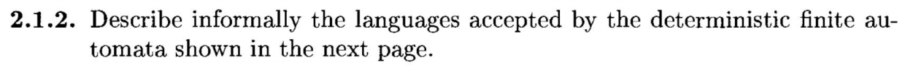

    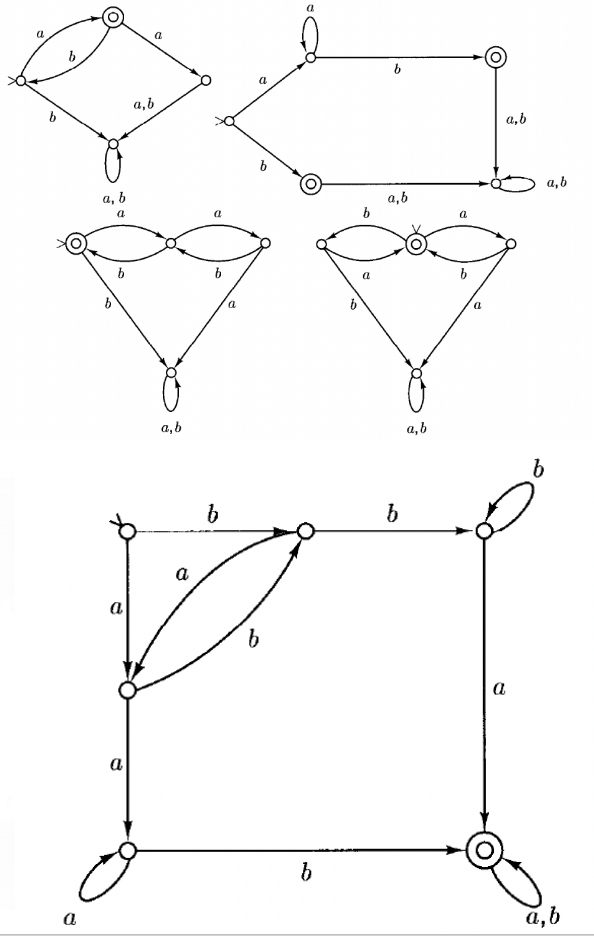

??? note "answer"
    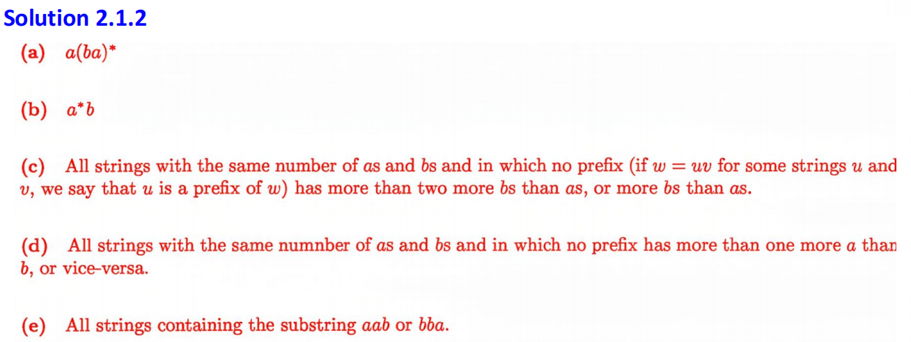

    c. 所有 a 和 b 数量相同，且任何前缀中 b 的数量不能比 a 的数量多超过2个，a 的数量也不能比 b 的数量多超过2个的字符串。

    **解释**: 这个DFA的状态可以看作是在记录 count(a) - count(b) 的差值。例如，起始状态代表差值为0，向右的状态代表 a 比 b 多，向左的状态代表 b 比 a 多。接受状态就是差值为0的状态。图中的结构限制了这个差值的绝对值不能超过2。

    其实这个 (c) 是可以写作： (a(ab)*b)* 的。

???+ example "question"
    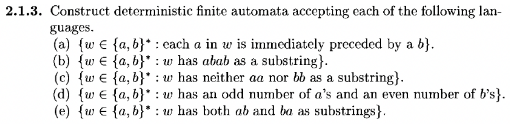

??? note "answer"
    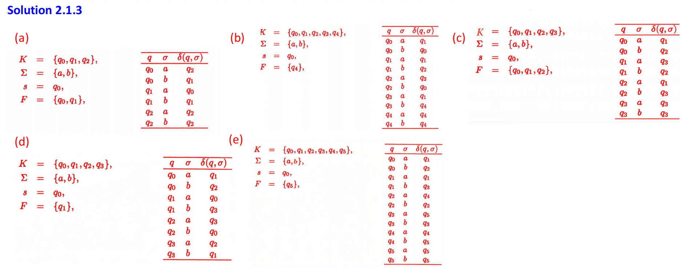

???+ example "question"
    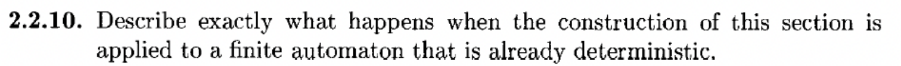

??? note "answer"
    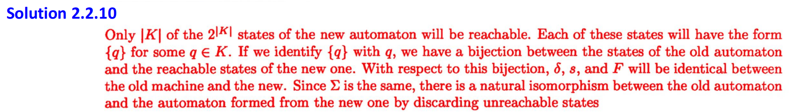

    也就是说，当将子集构造法应用于一个已有的 DFA 时，我们会得到一个新的 DFA。如果我们忽略掉所有不可达的状态，那么剩下的这个新 DFA 与原 DFA 是同构 (isomorphic) 的。

    “同构” 在这里意味着它们在结构上是完全一样的，只是状态的“名字”不同了：

    - 原 DFA 的状态叫 q。
    - 新 DFA 的状态叫 {q}。

    我们可以建立一个完美的一对一映射（双射, bijection）：将原 DFA 中的每个状态 q 映射到新 DFA 中对应的状态 {q}。

??? note
    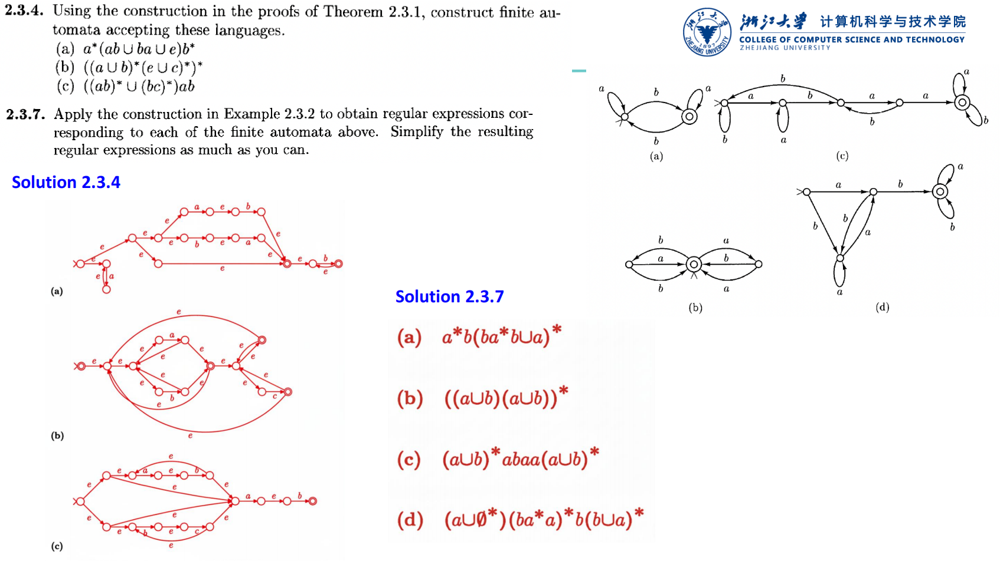

    **基本规则（处理最简单的正则表达式）：**

    1.  **处理空集 $\emptyset$**：构造一个开始状态和一个接受状态，它们之间没有任何转换。
    2.  **处理空字符串 $\epsilon$ (图中有时用 `e` 表示)**：构造一个开始状态和一个接受状态，用一条标记为 $\epsilon$ 的箭头连接它们。
    3.  **处理单个符号 $a$** (例如 `a`, `b`, `c`):构造一个开始状态和一个接受状态，用一条标记为 $a$ 的箭头连接它们。

    **递归步骤（处理更复杂的正则表达式）：**

    假设我们已经为子表达式 $S$ 和 $T$ 构造好了自动机 $N(S)$ 和 $N(T)$。

    1.  **并集 (Union) $S \cup T$**：

    * 创建一个新的开始状态和一个新的接受状态。
    * 从新的开始状态画两条 $\epsilon$ 转换，分别指向 $N(S)$ 和 $N(T)$ 的开始状态。
    * 从 $N(S)$ 和 $N(T)$ 的接受状态画两条 $\epsilon$ 转换，都指向新的接受状态。
    * $N(S)$ 和 $N(T)$ 原来的接受状态不再是接受状态。

    2.  **连接 (Concatenation) $ST$**：

    * $N(S)$ 的开始状态成为新自动机的开始状态。
    * $N(T)$ 的接受状态成为新自动机的接受状态。
    * 将 $N(S)$ 的接受状态的所有出边转移到 $N(T)$ 的开始状态上，然后将 $N(S)$ 的接受状态和 $N(T)$ 的开始状态用一条 $\epsilon$ 转换连接起来。（或者更简单地，将$N(S)$的接受状态与$N(T)$的开始状态合并）。

    3.  **克林闭包 (Kleene Star) $S^*$**：

    * 创建一个新的开始状态和一个新的接受状态。
    * 从新的开始状态画一条 $\epsilon$ 转换到 $N(S)$ 的开始状态。
    * 从 $N(S)$ 的接受状态画一条 $\epsilon$ 转换到 $N(S)$ 的开始状态（用于循环）。
    * 从 $N(S)$ 的接受状态画一条 $\epsilon$ 转换到新的接受状态（结束循环）。
    * 从新的开始状态直接画一条 $\epsilon$ 转换到新的接受状态（处理 $S$ 出现0次，即空字符串的情况）。

    ---

    **状态消除法 (State Elimination Method)**

    1.  **预处理**：

    * 如果存在多个接受状态，则创建一个新的、唯一的接受状态，并从所有旧的接受状态向这个新状态添加 $\epsilon$ 转换。
    * 如果开始状态有任何进入的转换，则创建一个新的开始状态，并用 $\epsilon$ 转换连接到旧的开始状态。
    * 将所有转换的标签都视为正则表达式。例如，从状态 $q_i$ 到 $q_j$ 的转换标签可以是单个符号 `a`，也可以是 `a ∪ b` 等。如果没有转换，可以认为标签是 $\emptyset$。

    2.  **迭代消除状态**：

    * 选择一个**非开始状态**也**非接受状态**的中间状态 $q_{rip}$ 进行消除。
    * 对于每一对状态 $(q_i, q_j)$，其中存在从 $q_i$ 到 $q_{rip}$ 的转换，以及从 $q_{rip}$ 到 $q_j$ 的转换，我们需要更新从 $q_i$ 到 $q_j$ 的直接转换。
    * 假设：

        * $R_1$: 从 $q_i$ 到 $q_{rip}$ 的正则表达式。
        * $R_2$: 从 $q_{rip}$ 到 $q_{rip}$ 的自环的正则表达式。
        * $R_3$: 从 $q_{rip}$ 到 $q_j$ 的正则表达式。
        * $R_4$: 从 $q_i$ 到 $q_j$ 原有的直接转换的正则表达式。

    * 在消除了 $q_{rip}$ 后，从 $q_i$ 到 $q_j$ 的新路径的正则表达式为：$R_4 \cup (R_1(R_2)^*R_3)$。

    3.  **重复**：

    * 持续重复第2步，直到自动机中只剩下开始状态和接受状态。
    * 此时，从开始状态到接受状态的唯一转换上的标签，就是最终的正则表达式。

???+ example "question"
    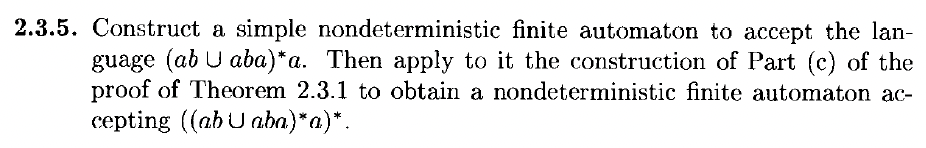

??? note "answer"
    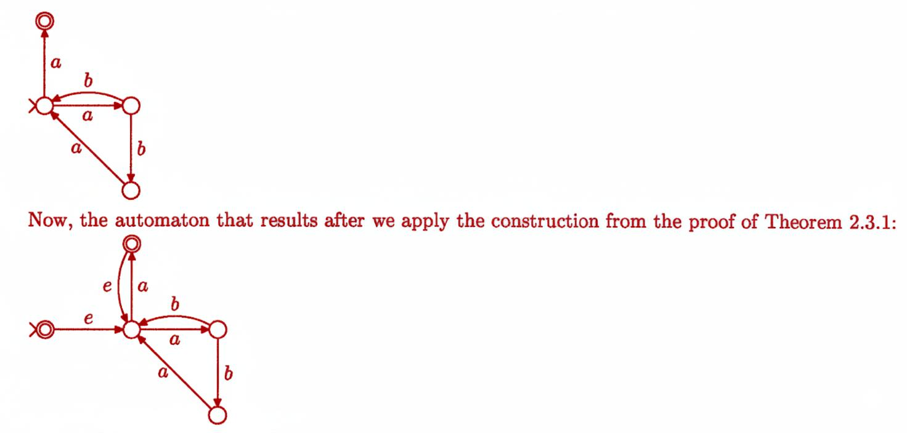

???+ example "question"
    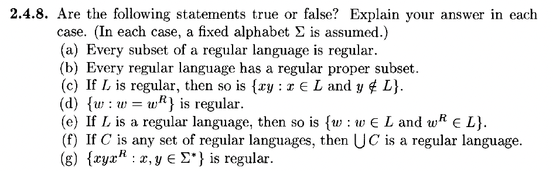

??? note "answer"
    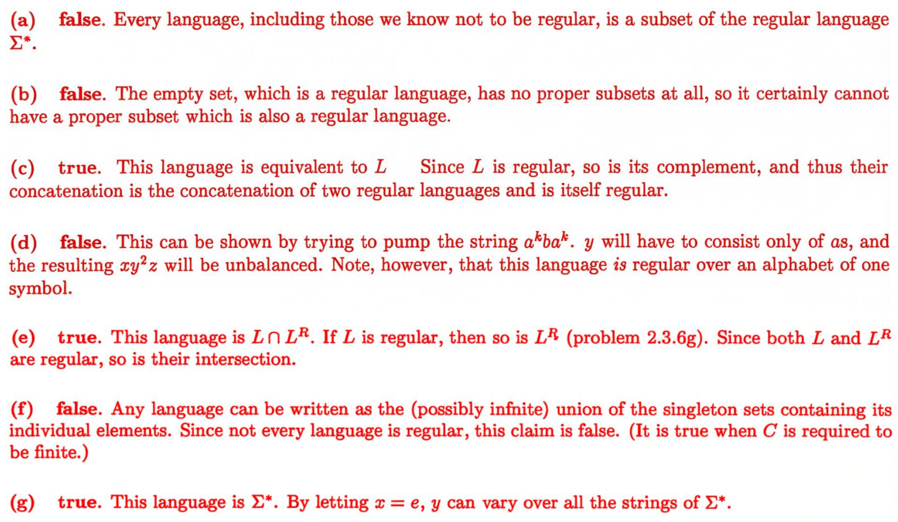

    (a) 正则语言的每个子集都是正则的。

    假 (False)。反例: Σ* (例如 (a∪b)*) 是正则的。但它的子集 {aⁿbⁿ | n ≥ 0} 不是正则的。

    (b) 每个正则语言都有一个正则的真子集。

    假 (False)。反例: 空集 ∅ 是一个正则语言，但它没有任何真子集。

    (c) 如果 L 是正则的, 那么 {xy | x ∈ L, y ∉ L} 也是正则的。

    真 (True)。这个语言可以表示为 L ∘ (Σ* - L)。因为正则语言对补集 (Σ* - L) 和连接 (∘) 运算是封闭的，所以结果仍然是正则的。

    (d) 语言 {wwᴿ | w ∈ {a,b}*} 是正则的。

    假 (False)。这就是泵引理部分的第一个例子（偶数长度的回文），我们已经证明了它不是正则的。

    (e) 如果 L 是正则的, 那么 {w | w ∈ L, wᴿ ∈ L} 也是正则的。

    真 (True)。这个语言可以表示为 L ∩ Lᴿ。因为正则语言对逆序 (reversal) (Lᴿ) 和交集 (intersection) (∩) 运算是封闭的，所以结果仍然是正则的。

    (f) 如果 C 是正则语言的任意集合, 那么 ∪C 也是正则的。

    假 (False)。这指的是无限并集。反例: 考虑无限集合 C = { {aⁿbⁿ} | n ≥ 0}。C中的每个元素（如 {ab}, {aabb}）都是一个只包含单个字符串的语言，因此是正则的。但它们的并集 ∪C = {aⁿbⁿ | n ≥ 0} 不是正则的。

    (g) {xyxᴿ | x, y ∈ Σ*} 是正则的。

    真 (True)。这个语言其实就是 Σ*。对于 Σ* 中的任何字符串 w，我们可以让 x = ε (空字符串)，y = w。那么 xyxᴿ = εwε = w。所以这个表达式可以生成所有字符串。Σ* 是正则的。

???+ example "question"
    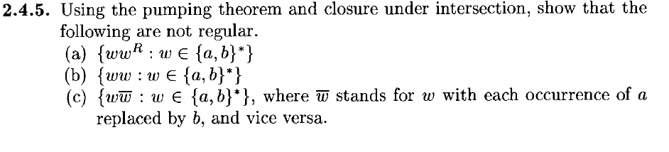

??? note "answer"
    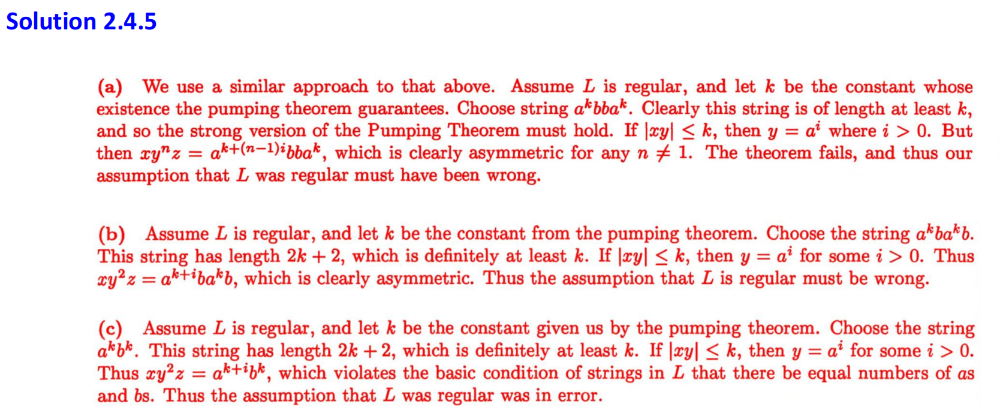

---