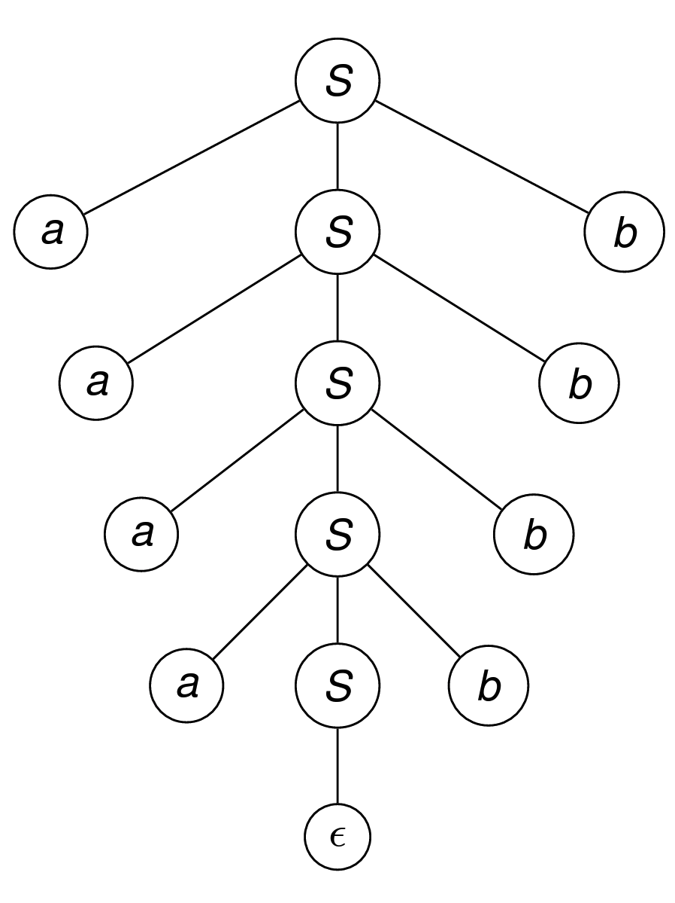

# Chapter 3 | Context-free Language and Pushdown Automata

## Context-Free Grammars

**Definition**: Context-Free Grammar, CFG

A CFG is a 4-tuple $G=(V,\Sigma,R,S)$, where:

- $V$ is an alphabet.
- $\Sigma\subseteq V$ is a set of terminal symbols.
- $S\in V-\Sigma$ is the start symbol.
- $R$ is a finite set of rules, which is a subset of $(V-\Sigma)\times V^{*}$.

**Remarks**:

$(V - \Sigma) \times V^*$ is a relation and can be written as $(V - \Sigma, V^*)$ or $V - \Sigma \rightarrow V^*$

- $V - \Sigma$: 从总字母表中排除终结符，剩下的就是 非终结符 (non-terminal symbols) 的集合。
- $V^*$: 由 $V$ 中所有符号组成的所有可能字符串的集合（包括空字符串 $\epsilon$）。

例如，规则 $S \rightarrow aSb$ 在数学上就是一个有序对 $(S, aSb)$，这个有序对是集合 $(V - \Sigma) \times V^*$ 的一个成员。

**Generalized Grammar**: 

$R$ is the set of rules, a finite subset of $V^+ \times V^*$

在广义文法 (Generalized Grammar) 中，规则集 R 是 $V^+ \times V^*$ 的一个有限子集。

**与正规表达式的关系**

两者都是正则语言的生成设备 (generation device)。如果一个语言L是正则语言，当且仅当存在一个正则表达式 $\alpha$ 使得 $L=L(\alpha)$。如果一个语言L是上下文无关语言 (Context-Free Language, CFL)，当且仅当存在一个CFG G 使得 $L=L(G)$。

---

### 非终结符 (Nonterminals)

The member of $V - \Sigma$ are called nonterminals, and for any $A \in V - \Sigma$ and $u \in V^*$, we have $A \rightarrow_G u \Leftrightarrow (A, u) \in R$.

非终结符是文法中的“变量”或“占位符”，它们是推导过程中的中间符号，最终必须被替换掉。它们是集合 $V$ (总字母表) 中排除了 $\Sigma$ (终结符) 的那部分。

For any strings $u, v \in V^*$, we have

$u \Rightarrow_G v \Leftrightarrow \exists x,y \in V^*$ and $A \in V - \Sigma$, such that $u = xAy$, $v = xv'y$, and $A \rightarrow_G v'$

**解释**:

单步推导 ($\Rightarrow_G$): 这个符号表示“一步推导出”。它精确地定义了如何从一个字符串 u 得到另一个字符串 v。这需要满足三个条件：

1. 字符串 u 可以被看作三部分的拼接：x + A + y，其中 A 是一个非终结符。
2. 存在一条规则 $A \rightarrow v'$。
3. 将 u 中的 A 替换为 $v'$，就得到了 v，即 $v = xv'y$。

例子: 假设有规则 $S \rightarrow aSb$，对于字符串 $u = aSba$，我们可以令 $x=a$, $A=S$, $y=ba$。应用规则 $S \rightarrow aSb$，我们得到 $v' = aSb$。那么 $v = x v' y = a (aSb) ba = a^{2}Sb^{2}a$。因此，我们可以写出 $aSba \Rightarrow_G a^{2}Sb^{2}a$。

$\Rightarrow_G^*$ is the reflexive, transitive closure of $\Rightarrow_G$

**解释**:

- 多步推导 ($\Rightarrow_G^*$): 这个符号表示“零步或多步推导出”。它是单步推导关系的自反传递闭包 (reflexive, transitive closure)。
- 自反 (Reflexive): 任何字符串都可以零步推导出它自己，即 $u \Rightarrow_G^* u$。
- 传递 (Transitive): 如果 $u \Rightarrow_G^* v$ 且 $v \Rightarrow_G^* w$，那么 $u \Rightarrow_G^* w$。

简单来说，$u \Rightarrow_G^* w$ 意味着从 $u$ 开始，经过一系列（可能为零次）的单步推导，最终可以得到 $w$。

A derivation in G of $w_n$ from $w_0$: $w_0 \Rightarrow_G w_1 \Rightarrow_G ... \Rightarrow_G w_n$.

- $n$ is the length of the derivation.

一个完整的推导过程 (derivation) 就是一个单步推导的序列。它展示了如何从一个初始字符串 $w_0$ 一步步地变成最终字符串 $w_n$。这个过程的长度 (length) 指的是所使用的单步推导的次数，即箭头的数量 $n$。

The language generated by $G$: $L(G) = \{w \in \Sigma^* : S \Rightarrow_G^* w \}$.

这是上下文无关文法最终的目标：定义一个语言。一个文法 $G$ 所生成的语言 $L(G)$ 是一个字符串的集合。这个集合里的每个字符串 $w$ 必须满足两个条件：

1. $w \in \Sigma^*$ : $w$ 必须完全由终结符构成。它不能包含任何非终结符。
2. $S \Rightarrow_G^* w$ : $w$ 必须能从文法的起始符号 (Start Symbol) $S$ 经过零步或多步推导得到。

换句话说，语言 $L(G)$ 就是我们从起始符号 $S$ 开始，通过反复应用规则，所有可能生成的终结符字符串的总和。

!!! info
    The set of non-terminals is always nonempty.

    The set of terminals is always nonempty. $\rightarrow$ False

    For $L(G) = \{w \in V^* : S \Rightarrow_G^* w\}$, G is CFG $\Rightarrow$ False 因为文法生成的语言成员必须是完全由终结符组成的字符串，即 $w$ 必须属于 $\Sigma^*$。而 $V^*$ 中包含了非终结符，这些带有非终结符的字符串只是推导过程中的中间形式，而不是语言的最终成员。

    Language L is CFL iff $L=L(G)$ $\rightarrow$ False 因为缺少对 G 类型的限定。必须明确指出 G 是上下文无关文法 (CFG)，才能确保 L 是上下文无关语言 (CFL)。

    Language L if CFL iff it is accepted by a CFG. $\rightarrow$ False 这个陈述混淆了两个核心概念：生成 (generate) 和 接受 (accept)。因此，正确的说法是：一个语言是CFL，当且仅当它能被一个CFG 生成

---

#### show the CFG 𝐺 and Language 𝐿 is **equal**

Consider $L = \{w \in \{a, b\}^* : w \text{ equal number of 𝑎′s and 𝑏′s}\}$ the CFG 𝐺 is

- 𝑆 = 𝑆, Σ = {𝑎, 𝑏}, 𝑉 = {𝑎, 𝑏, 𝑆}
- 𝑅 = 𝑆 → {𝑆𝑆|𝑎𝑆𝑏|𝑏𝑆𝑎|e}

##### 证明 $w \in L(G) \Rightarrow w \in L$

Proof by induction on **length of derivation**

1. **基础情况 (Base Case):** 推导长度为1。

* 唯一的可能是推导 $S \Rightarrow_G e$。
* 生成的字符串是 $w=e$（空字符串），其中有0个`a`和0个`b`，数量相等。结论成立。

2. **归纳假设 (Inductive Hypothesis):** 假设所有长度小于等于 $n$ 的推导所生成的字符串，其`a`和`b`的数量都相等。

3. **归纳步骤 (Inductive Step):** 考虑一个长度为 $n+1$ 的推导。我们分析它的第一步：

* **情况 1: $S \Rightarrow_G SS \Rightarrow_G^* xy = w$**。

$S \Rightarrow_G^* x$ 和 $S \Rightarrow_G^* y$ 这两个子推导的长度都小于 $n+1$。根据归纳假设，$x$ 和 $y$ 中`a`,`b`数量各自相等。因此，它们的拼接 $w=xy$ 中`a`,`b`的总数也必然相等。

* **情况 2: $S \Rightarrow_G aSb \Rightarrow_G^* axb = w$**

$S \Rightarrow_G^* x$ 这个子推导的长度小于 $n+1$。根据归纳假设，$x$ 中`a`,`b`数量相等。字符串 $w$ 是在 $x$ 的基础上，在外面包裹了一对`a`和`b`。因此，$w$ 中`a`,`b`的数量依然相等。

* **情况 3: $S \Rightarrow_G bSa \Rightarrow_G^* bxa = w$**

与情况2同理，结论成立。

**结论：** 证明完成。任何由G生成的字符串都属于L。

---

##### 证明 $w \in L \Rightarrow w \in L(G)$

Proof by induction on **length of string**

1. **基础情况 (Base Case):** 长度为0，$w=e$。

因为文法中有规则 $S \rightarrow_G e$，所以 $S \Rightarrow_G^* e$。结论成立。

2.  **归纳假设 (Inductive Hypothesis):** 假设对于L中所有长度小于等于 $k$ 的字符串 $w$，都有 $S \Rightarrow_G^* w$。

3.  **归纳步骤 (Inductive Step):** 考虑L中一个长度为 $k+2$ 的字符串 $x$。（注意：长度必须是偶数）。我们根据 $x$ 的首尾字符分为四种情况：

* **情况 1: $x = awb$**

由于 $x$ 中`a`,`b`总数相等，去掉首尾的`a`和`b`后，中间的字符串 $w$ 的`a`,`b`数量也必定相等。$|w| = k$，满足归纳假设的条件。因此存在推导 $S \Rightarrow_G^* w$。那么，我们就可以构造出 $x$ 的推导：$S \Rightarrow_G aSb \Rightarrow_G^* awb = x$。

* **情况 2: $x = bwa$**

与情况1类似，推导为 $S \Rightarrow_G bSa \Rightarrow_G^* bwa = x$。

* **情况 3: $x = awa$** (以及情况4: $x=bwb$)

这种情况比较复杂，它揭示了为什么规则 $S \rightarrow_G SS$ 是**必需的**。如果 $x=awa$，那么 $w$ 中的`b`会比`a`多两个。

**关键思想**是：可以证明 $w$ 一定能被拆分成两个子串 $u$ 和 $v$（即 $w=uv$），使得 $au$ 和 $va$ 这两个更短的字符串都属于语言L（即它们内部`a`,`b`数量相等）。

因为 $|au| < |x|$ 且 $|va| < |x|$，它们都满足归纳假设。所以存在推导 $S \Rightarrow_G^* au$ 和 $S \Rightarrow_G^* va$。

因此，我们可以构造出 $x$ 的推导：$S \Rightarrow_G SS \Rightarrow_G^* auva = x$ 。

**例子:** 字符串 `abba`。它不符合情况1或2。它首尾都是`a`。我们可以将其拆分为 `au = ab` 和 `va = ba`。显然 `ab` 和 `ba` 都属于L，且可以由G生成 ($S \Rightarrow_G aSb \Rightarrow_G ab$ 和 $S \Rightarrow_G bSa \Rightarrow_G ba$)。因此，`abba` 的推导就是 $S \Rightarrow_G SS \Rightarrow_G^* (ab)(ba)$。如果没有 $S \rightarrow_G SS$ 规则，就无法生成这类字符串。

**结论：** 证明完成。L中的任何字符串都可以由G生成。

---

#### 其他上下文无关语言示例

1.  **$L_1 = \{ww^R \mid w \in \{a,b\}^*\}$ (偶数长度的回文串)**

* $w^R$ 表示字符串 $w$ 的反转。
* **文法:** $S \rightarrow aSa \mid bSb \mid e$
* **工作原理:** 这个文法从“中心”向“两侧”构建字符串。规则 $aSa$ 和 $bSb$ 保证了每次都在两端加上一对匹配的字符。最后使用 $S \rightarrow e$ 结束，确保了总长度为偶数。

2.  **$L_2 = \{w \in \{a,b\}^* \mid w = w^R\}$ (所有回文串，包括奇数和偶数长度)**

* 例如 `aba`, `a`, `abba`。
* **文法:** $S \rightarrow aSa \mid bSb \mid a \mid b \mid e$
* **工作原理:** 它在 $L_1$ 的文法基础上增加了两个规则：$S \rightarrow a$ 和 $S \rightarrow b$。这两个规则是奇数长度回文串的终止条件。当推导到最中心的单个字符时，就用这两个规则来替换 $S$。
* **两种语言的关系:** $L_2 = L_1 \cup xax^R \cup xbx^R$。

---

## Parse Tree

**Definition** : A derivation of a CFG $G=(S, V, \Sigma, R)$, can be represented with a parse tree.

一个上下文无关文法 G 的推导过程，可以用一棵分析树来表示。分析树是推导过程的图形化表示。它展示了如何从起始符开始，通过应用一系列规则，最终生成一个由终结符组成的字符串。它关注的是最终的结构，而不是推导的顺序。

**分析树的构成**

- Leaves: terminal symbols (叶子节点是终结符)树最底层的节点必须是终结符 ($\in \Sigma$) 或空串 ($\epsilon$)。
- Root: Start Symbol (根节点是起始符)树的最高点必须是文法的起始符 $S$。
- Node: element in V (内部节点是非终结符)所有既不是根节点也不是叶子节点的内部节点，都必须是非终结符 ($\in V-\Sigma$)。

**Remark**

- The leaves constitute the yield of the tree.

将树的所有叶子节点从左到右依次连接起来，得到的字符串就是这棵分析树所生成的字符串，这个字符串被称为树的产出 (yield)。

- Terminal symbols can occur only at the leaves (终结符只能出现在叶子节点).

这是分析树的严格规则。终结符代表推导的终点，不能再继续展开，所以它们必然在树的末端。

- Variables can occur only at the internal nodes (变量/非终结符只能出现在内部节点).

“Variables” 在这里就是指非终结符 (non-terminals)。因为内部节点代表了推导过程中的一个中间步骤，它还需要被规则替换，所以它必须是非终结符。

- The terminals concatenated from left to right give the string (从左到右连接终结符得到字符串).

这再次强调了如何从分析树得到它所代表的字符串。

??? note "示例：生成 $a^4b^4$ 的分析树"
    

    图中为语言 $L = \{a^n b^n \mid n \ge 0\}$ (文法规则为 $S \rightarrow aSb \mid \epsilon$) 生成字符串 $a^4b^4$ 的分析树。

    根节点是 S。

    推导过程的可视化:

    第一次应用 $S \rightarrow aSb$，根节点 S 生出三个分支：a，S，b。

    对中间的 S 再次应用 $S \rightarrow aSb$，又生出 a, S, b。

    重复这个过程4次。

    最后，对最中间的 S 应用 $S \rightarrow \epsilon$，推导结束。

    产出 (Yield): 将所有叶子节点从左到右连接起来，得到 a a a a $\epsilon$ b b b b，即 a⁴b⁴。

---