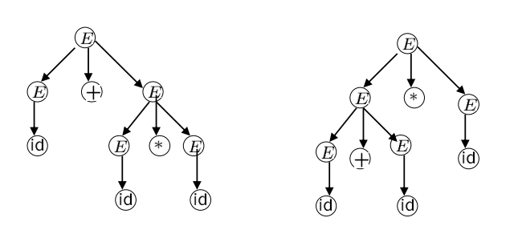
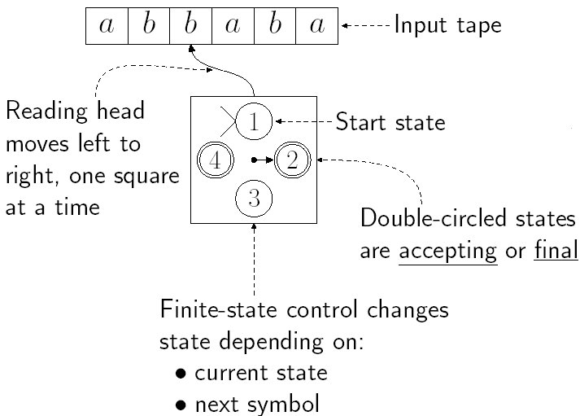
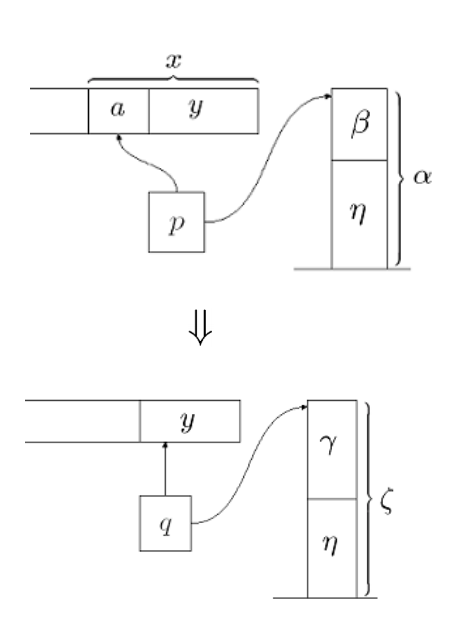
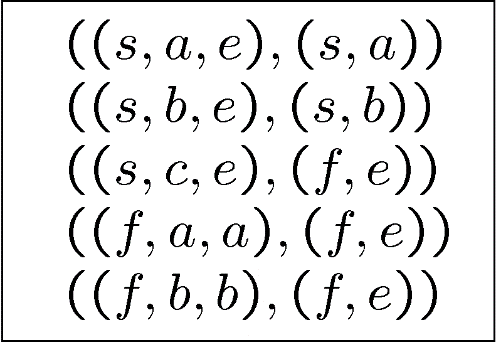

# Chapter 3 | Context-free Language and Pushdown Automata

## Context-Free Grammars

**Definition**: Context-Free Grammar, CFG

A CFG is a 4-tuple $G=(V,\Sigma,R,S)$, where:

- $V$ is an alphabet.
- $\Sigma\subseteq V$ is a set of terminal symbols.
- $S\in V-\Sigma$ is the start symbol.
- $R$ is a finite set of rules, which is a subset of $(V-\Sigma)\times V^{*}$.

**Remarks**:

$(V - \Sigma) \times V^*$ is a relation and can be written as $(V - \Sigma, V^*)$ or $V - \Sigma \rightarrow V^*$

- $V - \Sigma$: 从总字母表中排除终结符，剩下的就是 非终结符 (non-terminal symbols) 的集合。
- $V^*$: 由 $V$ 中所有符号组成的所有可能字符串的集合（包括空字符串 $\epsilon$）。

例如，规则 $S \rightarrow aSb$ 在数学上就是一个有序对 $(S, aSb)$，这个有序对是集合 $(V - \Sigma) \times V^*$ 的一个成员。

**Generalized Grammar**: 

$R$ is the set of rules, a finite subset of $V^+ \times V^*$

在广义文法 (Generalized Grammar) 中，规则集 R 是 $V^+ \times V^*$ 的一个有限子集。

**与正规表达式的关系**

两者都是正则语言的生成设备 (generation device)。如果一个语言L是正则语言，当且仅当存在一个正则表达式 $\alpha$ 使得 $L=L(\alpha)$。如果一个语言L是上下文无关语言 (Context-Free Language, CFL)，当且仅当存在一个CFG G 使得 $L=L(G)$。

---

### 非终结符 (Nonterminals)

The member of $V - \Sigma$ are called nonterminals, and for any $A \in V - \Sigma$ and $u \in V^*$, we have $A \rightarrow_G u \Leftrightarrow (A, u) \in R$.

非终结符是文法中的“变量”或“占位符”，它们是推导过程中的中间符号，最终必须被替换掉。它们是集合 $V$ (总字母表) 中排除了 $\Sigma$ (终结符) 的那部分。

For any strings $u, v \in V^*$, we have

$u \Rightarrow_G v \Leftrightarrow \exists x,y \in V^*$ and $A \in V - \Sigma$, such that $u = xAy$, $v = xv'y$, and $A \rightarrow_G v'$

**解释**:

单步推导 ($\Rightarrow_G$): 这个符号表示“一步推导出”。它精确地定义了如何从一个字符串 u 得到另一个字符串 v。这需要满足三个条件：

1. 字符串 u 可以被看作三部分的拼接：x + A + y，其中 A 是一个非终结符。
2. 存在一条规则 $A \rightarrow v'$。
3. 将 u 中的 A 替换为 $v'$，就得到了 v，即 $v = xv'y$。

例子: 假设有规则 $S \rightarrow aSb$，对于字符串 $u = aSba$，我们可以令 $x=a$, $A=S$, $y=ba$。应用规则 $S \rightarrow aSb$，我们得到 $v' = aSb$。那么 $v = x v' y = a (aSb) ba = a^{2}Sb^{2}a$。因此，我们可以写出 $aSba \Rightarrow_G a^{2}Sb^{2}a$。

$\Rightarrow_G^*$ is the reflexive, transitive closure of $\Rightarrow_G$

**解释**:

- 多步推导 ($\Rightarrow_G^*$): 这个符号表示“零步或多步推导出”。它是单步推导关系的自反传递闭包 (reflexive, transitive closure)。
- 自反 (Reflexive): 任何字符串都可以零步推导出它自己，即 $u \Rightarrow_G^* u$。
- 传递 (Transitive): 如果 $u \Rightarrow_G^* v$ 且 $v \Rightarrow_G^* w$，那么 $u \Rightarrow_G^* w$。

简单来说，$u \Rightarrow_G^* w$ 意味着从 $u$ 开始，经过一系列（可能为零次）的单步推导，最终可以得到 $w$。

A derivation in G of $w_n$ from $w_0$: $w_0 \Rightarrow_G w_1 \Rightarrow_G ... \Rightarrow_G w_n$.

- $n$ is the length of the derivation.

一个完整的推导过程 (derivation) 就是一个单步推导的序列。它展示了如何从一个初始字符串 $w_0$ 一步步地变成最终字符串 $w_n$。这个过程的长度 (length) 指的是所使用的单步推导的次数，即箭头的数量 $n$。

The language generated by $G$: $L(G) = \{w \in \Sigma^* : S \Rightarrow_G^* w \}$.

这是上下文无关文法最终的目标：定义一个语言。一个文法 $G$ 所生成的语言 $L(G)$ 是一个字符串的集合。这个集合里的每个字符串 $w$ 必须满足两个条件：

1. $w \in \Sigma^*$ : $w$ 必须完全由终结符构成。它不能包含任何非终结符。
2. $S \Rightarrow_G^* w$ : $w$ 必须能从文法的起始符号 (Start Symbol) $S$ 经过零步或多步推导得到。

换句话说，语言 $L(G)$ 就是我们从起始符号 $S$ 开始，通过反复应用规则，所有可能生成的终结符字符串的总和。

!!! info
    The set of non-terminals is always nonempty.

    The set of terminals is always nonempty. $\rightarrow$ False

    For $L(G) = \{w \in V^* : S \Rightarrow_G^* w\}$, G is CFG $\Rightarrow$ False 因为文法生成的语言成员必须是完全由终结符组成的字符串，即 $w$ 必须属于 $\Sigma^*$。而 $V^*$ 中包含了非终结符，这些带有非终结符的字符串只是推导过程中的中间形式，而不是语言的最终成员。

    Language L is CFL iff $L=L(G)$ $\rightarrow$ False 因为缺少对 G 类型的限定。必须明确指出 G 是上下文无关文法 (CFG)，才能确保 L 是上下文无关语言 (CFL)。

    Language L if CFL iff it is accepted by a CFG. $\rightarrow$ False 这个陈述混淆了两个核心概念：生成 (generate) 和 接受 (accept)。因此，正确的说法是：一个语言是CFL，当且仅当它能被一个CFG 生成

---

#### show the CFG 𝐺 and Language 𝐿 is **equal**

Consider $L = \{w \in \{a, b\}^* : w \text{ equal number of 𝑎′s and 𝑏′s}\}$ the CFG 𝐺 is

- 𝑆 = 𝑆, Σ = {𝑎, 𝑏}, 𝑉 = {𝑎, 𝑏, 𝑆}
- 𝑅 = 𝑆 → {𝑆𝑆|𝑎𝑆𝑏|𝑏𝑆𝑎|e}

---

##### 证明 $w \in L(G) \Rightarrow w \in L$

Proof by induction on **length of derivation**

1. **基础情况 (Base Case):** 推导长度为1。

* 唯一的可能是推导 $S \Rightarrow_G e$。
* 生成的字符串是 $w=e$（空字符串），其中有0个`a`和0个`b`，数量相等。结论成立。

2. **归纳假设 (Inductive Hypothesis):** 假设所有长度小于等于 $n$ 的推导所生成的字符串，其`a`和`b`的数量都相等。

3. **归纳步骤 (Inductive Step):** 考虑一个长度为 $n+1$ 的推导。我们分析它的第一步：

* **情况 1: $S \Rightarrow_G SS \Rightarrow_G^* xy = w$**。

$S \Rightarrow_G^* x$ 和 $S \Rightarrow_G^* y$ 这两个子推导的长度都小于 $n+1$。根据归纳假设，$x$ 和 $y$ 中`a`,`b`数量各自相等。因此，它们的拼接 $w=xy$ 中`a`,`b`的总数也必然相等。

* **情况 2: $S \Rightarrow_G aSb \Rightarrow_G^* axb = w$**

$S \Rightarrow_G^* x$ 这个子推导的长度小于 $n+1$。根据归纳假设，$x$ 中`a`,`b`数量相等。字符串 $w$ 是在 $x$ 的基础上，在外面包裹了一对`a`和`b`。因此，$w$ 中`a`,`b`的数量依然相等。

* **情况 3: $S \Rightarrow_G bSa \Rightarrow_G^* bxa = w$**

与情况2同理，结论成立。

**结论：** 证明完成。任何由G生成的字符串都属于L。

---

##### 证明 $w \in L \Rightarrow w \in L(G)$

Proof by induction on **length of string**

1. **基础情况 (Base Case):** 长度为0，$w=e$。

因为文法中有规则 $S \rightarrow_G e$，所以 $S \Rightarrow_G^* e$。结论成立。

2.  **归纳假设 (Inductive Hypothesis):** 假设对于L中所有长度小于等于 $k$ 的字符串 $w$，都有 $S \Rightarrow_G^* w$。

3.  **归纳步骤 (Inductive Step):** 考虑L中一个长度为 $k+2$ 的字符串 $x$。（注意：长度必须是偶数）。我们根据 $x$ 的首尾字符分为四种情况：

* **情况 1: $x = awb$**

由于 $x$ 中`a`,`b`总数相等，去掉首尾的`a`和`b`后，中间的字符串 $w$ 的`a`,`b`数量也必定相等。$|w| = k$，满足归纳假设的条件。因此存在推导 $S \Rightarrow_G^* w$。那么，我们就可以构造出 $x$ 的推导：$S \Rightarrow_G aSb \Rightarrow_G^* awb = x$。

* **情况 2: $x = bwa$**

与情况1类似，推导为 $S \Rightarrow_G bSa \Rightarrow_G^* bwa = x$。

* **情况 3: $x = awa$** (以及情况4: $x=bwb$)

这种情况比较复杂，它揭示了为什么规则 $S \rightarrow_G SS$ 是**必需的**。如果 $x=awa$，那么 $w$ 中的`b`会比`a`多两个。

**关键思想**是：可以证明 $w$ 一定能被拆分成两个子串 $u$ 和 $v$（即 $w=uv$），使得 $au$ 和 $va$ 这两个更短的字符串都属于语言L（即它们内部`a`,`b`数量相等）。

因为 $|au| < |x|$ 且 $|va| < |x|$，它们都满足归纳假设。所以存在推导 $S \Rightarrow_G^* au$ 和 $S \Rightarrow_G^* va$。

因此，我们可以构造出 $x$ 的推导：$S \Rightarrow_G SS \Rightarrow_G^* auva = x$ 。

**例子:** 字符串 `abba`。它不符合情况1或2。它首尾都是`a`。我们可以将其拆分为 `au = ab` 和 `va = ba`。显然 `ab` 和 `ba` 都属于L，且可以由G生成 ($S \Rightarrow_G aSb \Rightarrow_G ab$ 和 $S \Rightarrow_G bSa \Rightarrow_G ba$)。因此，`abba` 的推导就是 $S \Rightarrow_G SS \Rightarrow_G^* (ab)(ba)$。如果没有 $S \rightarrow_G SS$ 规则，就无法生成这类字符串。

**结论：** 证明完成。L中的任何字符串都可以由G生成。

---

#### 其他上下文无关语言示例

1.  **$L_1 = \{ww^R \mid w \in \{a,b\}^*\}$ (偶数长度的回文串)**

* $w^R$ 表示字符串 $w$ 的反转。
* **文法:** $S \rightarrow aSa \mid bSb \mid e$
* **工作原理:** 这个文法从“中心”向“两侧”构建字符串。规则 $aSa$ 和 $bSb$ 保证了每次都在两端加上一对匹配的字符。最后使用 $S \rightarrow e$ 结束，确保了总长度为偶数。

2.  **$L_2 = \{w \in \{a,b\}^* \mid w = w^R\}$ (所有回文串，包括奇数和偶数长度)**

* 例如 `aba`, `a`, `abba`。
* **文法:** $S \rightarrow aSa \mid bSb \mid a \mid b \mid e$
* **工作原理:** 它在 $L_1$ 的文法基础上增加了两个规则：$S \rightarrow a$ 和 $S \rightarrow b$。这两个规则是奇数长度回文串的终止条件。当推导到最中心的单个字符时，就用这两个规则来替换 $S$。
* **两种语言的关系:** $L_2 = L_1 \cup xax^R \cup xbx^R$。

---

## Parse Tree

**Definition** : A derivation of a CFG $G=(S, V, \Sigma, R)$, can be represented with a parse tree.

一个上下文无关文法 G 的推导过程，可以用一棵分析树来表示。分析树是推导过程的图形化表示。它展示了如何从起始符开始，通过应用一系列规则，最终生成一个由终结符组成的字符串。它关注的是最终的结构，而不是推导的顺序。

**分析树的构成**

- Leaves: terminal symbols (叶子节点是终结符)树最底层的节点必须是终结符 ($\in \Sigma$) 或空串 ($\epsilon$)。
- Root: Start Symbol (根节点是起始符)树的最高点必须是文法的起始符 $S$。
- Node: element in V (内部节点是非终结符)所有既不是根节点也不是叶子节点的内部节点，都必须是非终结符 ($\in V-\Sigma$)。

**Remark**

- The leaves constitute the yield of the tree.

将树的所有叶子节点从左到右依次连接起来，得到的字符串就是这棵分析树所生成的字符串，这个字符串被称为树的产出 (yield)。

- Terminal symbols can occur only at the leaves (终结符只能出现在叶子节点).

这是分析树的严格规则。终结符代表推导的终点，不能再继续展开，所以它们必然在树的末端。

- Variables can occur only at the internal nodes (变量/非终结符只能出现在内部节点).

“Variables” 在这里就是指非终结符 (non-terminals)。因为内部节点代表了推导过程中的一个中间步骤，它还需要被规则替换，所以它必须是非终结符。

- The terminals concatenated from left to right give the string (从左到右连接终结符得到字符串).

这再次强调了如何从分析树得到它所代表的字符串。

??? note "示例：生成 $a^4b^4$ 的分析树"
    

    图中为语言 $L = \{a^n b^n \mid n \ge 0\}$ (文法规则为 $S \rightarrow aSb \mid \epsilon$) 生成字符串 $a^4b^4$ 的分析树。

    根节点是 S。

    推导过程的可视化:

    第一次应用 $S \rightarrow aSb$，根节点 S 生出三个分支：a，S，b。

    对中间的 S 再次应用 $S \rightarrow aSb$，又生出 a, S, b。

    重复这个过程4次。

    最后，对最中间的 S 应用 $S \rightarrow \epsilon$，推导结束。

    产出 (Yield): 将所有叶子节点从左到右连接起来，得到 a a a a $\epsilon$ b b b b，即 a⁴b⁴。

---

首先定义了一个上下文无关文法 $G$ (CFG)，这个文法 $G$ 用于生成所有“平衡括号”的字符串（例如 `()`、`(())`、`()()` 等）。

三条规则：

1.  **$S \to e$**
2.  **$S \to SS$**
3.  **$S \to (S)$**

一个字符串可以有多种不同的“推导过程”，但这些不同的过程可能对应的是 同一个“语法分析树”。

---

### Similarity of derivations

**Definition**: 考虑两个长度相同（都是 $n$ 步）的推导 $D$ 和 $D'$。

* $D = x_1 \Rightarrow x_2 \Rightarrow \dots \Rightarrow x_n$
* $D' = x'_1 \Rightarrow x'_2 \Rightarrow \dots \Rightarrow x'_n$

* **"领先" (precedes, $D < D'$):** 我们说 $D$ *领先于* $D'$ (记作 $D < D'$)，如果 $D$ 和 $D'$ 在绝大多数步骤上是完全一样的，只在某一步 $(k)$ 和 $(k+1)$ 交换了两个**互不相干**的规则应用顺序。

**形式化条件：**

1.  在 $k-1$ 步之前，以及在 $k+1$ 步之后，两个推导完全相同。($x_i = x'_i$ for $i \neq k$)
2.  在 $k-1$ 步时，字符串都是 $x_{k-1} = x'_{k-1} = uAvBw$。这里 $A$ 和 $B$ 是两个不同的非终结符。
3.  **推导 D (先 A 后 B):**
    * $x_k = uyvBw$ (应用规则 $A \rightarrow y$)
    * $x_{k+1} = uyvzw$ (应用规则 $B \rightarrow z$)
4.  **推导 D' (先 B 后 A):**
    * $x'_k = uAzw$ (应用规则 $B \rightarrow z$)
    * $x'_{k+1} = uyvzw$ (应用规则 $A \rightarrow y$)

这个 $D < D'$ 定义的是一个“**切换 (switching)**”。因为 $A$ 和 $B$ 是字符串中两个不相邻、互不影响的部分，所以“先替换 A 再替换 B” (推导 D) 和“先替换 B 再替换 A” (推导 D')，最终得到的结果 $x_{k+1}$ 是完全一样的。$D < D'$ 只是一个记号，用来表示 D 是“A-在-B-之前”的那个版本。

**"相似" (Similar):**

* **定义：** 两个推导 $D$ 和 $D'$ 是**相似的 (similar)**，当且仅当 $(D, D')$ 属于由“领先”关系 $<$ 所生成的**自反、对称、传递闭包**。
* 也就是说“相似”是一个**等价关系 (equivalence relation)**。**一系列的‘切换’(a sequence of 'switchings')** 相互转换，那么它们就是相似的。

---

#### Remarks

1. Similarity is an **equivalence** relation
2. Derivations in the same equivalence class under similarity have the **same parse tree**
3. Each parse tree contains a derivation that is **maximal or minimal** under <

1. 相似性是一个**等价关系 (equivalence relation)**。
2. 在相似性这个等价关系下，**同一个等价类中的所有推导，都拥有相同的语法分析树 (same parse tree)**。
3. 每一棵语法分析树都包含一个“领先”关系下的**最大 (maximal) 或最小 (minimal)** 推导。

**定义 (最左推导 Leftmost derivation)：** 在推导的每一步，总是应用在**最左边的非终结符**上的推导。

* 在一个等价类（即一棵树）中，最左推导是一个“极端”版本，你不能再通过“切换”把它变得更“左”（即，不存在 $D'$ 使得 $D' < D_{leftmost}$）。同理，最右推导是另一个“极端”版本。
* 对于**一棵**语法分析树，存在**唯一一个**最左推导和**唯一一个**最右推导。

---

**Theorem**: 对于一个上下文无关语法 (Context-Free Grammar, CFG)，让 $G = (V, \Sigma, R, S)$（其中 $V$ 是变量集，$\Sigma$ 是终结符集，$R$ 是规则集，$S$ 是开始符号），并设 $A$ 是一个非终结符 (即 $A \in V - \Sigma$)，$w$ 是一个由终结符组成的字符串 (即 $w \in \Sigma^*$)。

那么，以下**四个陈述是等价的**：

1. **$A \Rightarrow^* w$**

- 从非终结符 $A$ 开始，经过 0 步或多步（$\Rightarrow^*$ 中的 $*$ 代表“0次或多次”）应用语法规则，我们**可以推导出**字符串 $w$。

2. **$\exists$ (存在) 一棵以 $A$ 为根、产出 (yield) 为 $w$ 的语法分析树。**
3. **$\exists$ (存在) 一个最左推导 $A \Rightarrow_L^* w$。**
4. **$\exists$ (存在) 一个最右推导 $A \Rightarrow_R^* w$。**

---

### Ambiguous Grammars

既然“推导”和“树”是等价的，那么一个很自然的问题就出现了：对于*同一个*字符串，会不会存在*多棵*不同的语法分析树呢？

**Definition:** 一个语法 (grammar) 如果包含某些“词” (words，即字符串)，而这些词**至少有两棵不同**的语法分析树，那么这个语法就被称为是**二义性的 (ambiguous)**。

- **Ambiguous grammars** allow strings with multiple leftmost and multiple rightmost derivations.

* **推论：** 如果一个字符串有两棵不同的语法分析树，它也就必然拥有**多个最左推导**和**多个最右推导**。

**Example:**

**规则 (R):**

* $E \rightarrow E + E$
* $E \rightarrow E * E$
* $E \rightarrow (E)$
* $E \rightarrow id$

**问题字符串：** `id + id * id`

---

### Syntactic Ambiguity

首先定义了一个（简化的）英语语法。再展示了对于这同*一个*句子，存在两棵*不同*的语法分析树。

“句法二义性 (Syntactic Ambiguity)”可以导致“语义二义性 (Semantic Ambiguity)”。同一个句子，因为语法结构（树）不同，可以有两种截然不同的合理解释。这就是自然语言处理 (NLP) 中著名的 **"PP-attachment" (介词短语附着) 难题**。计算机程序很难（但必须）通过上下文来判断哪种解释更合理。

---

## Pushdown Automata

那么，一个很自然的问题就是：我们有了“生成”语言的工具 (CFG)，那么有没有一种“**识别**”或“**接受**”这种语言的**计算机器**呢？

**Finite Automata** has

- **一个输入带 (An input tape):** 存放我们要检查的字符串，比如 "abbaba..."。
- **一个有限控制器 (A finite control):** 这是 FA 的“大脑”，它包含有限个状态 (states)。
- **动作 (Action):**

1.  **读 (Read):** FA 的“读头” (Reading head) 从左到右依次读取输入带上的符号，一次读一个，每读一个就向右移动一格。
2.  **思考 (Think):** “有限控制器”根据它**当前所处的状态 (current state)** 和**刚刚读取到的符号 (next symbol)**，来决定下一步要**改变 (change)** 到哪个新状态。

- 当**输入带被读完 (tape is empty)**，并且此时 FA **恰好停在一个终止状态 (state is final)**，我们就说这个 FA **接受 (Accept)** 了这个输入字符串。

我们已经知道，对于任何一个**正则语法 (regular grammar)** $G$，我们都能构造一个 FA $M$，使得它们所描述的语言是完全一致的，即 $L(G) = L(M)$。

**FA 的局限 (The Limitation)：**"Cannot deal with $S \rightarrow aSa$"。

* $S \rightarrow aSa$ 这条规则是**上下文无关 (Context-Free)** 的，但**不是正则 (Regular)** 的。（正则语法的规则形如 $A \rightarrow wB$ 或 $A \rightarrow w$，右侧最多只有一个非终结符，且必须在最末尾）。
* 这条规则的含义是“在中间的 $S$ 的**两边**各放一个 $a$”。它可以生成像 $a a S a a \rightarrow a a a S a a a \rightarrow \dots$ 这样的结构，最终生成 $a^n b a^n$（假设有 $S \rightarrow b$ 规则）。
* 这是一个“配对”问题。FA 在读取了开头的 $n$ 个 $a$ 之后，需要**记住** $n$ 是多少，以便在读取完中间部分后，去检查末尾**是否也恰好有 $n$ 个 $a$**。
* 正如我们刚才所说，FA 的内存是**有限的**，它无法记住一个**任意大**的 $n$。它无法“计数”。
* 因此，FA 无法处理 $S \rightarrow aSa$ 这样的规则，也无法识别 $L = \{ a^n b a^n \ | \ n \ge 0 \}$ 这样的语言。

---

**下推自动机** (PDA)

既然 FA 的问题在于**没有（无限的）内存**，那我们给它加上内存不就行了吗？“下推自动机”(PDA)，它就是“FA + 一个栈内存”。

**下推自动机的组成 (Pushdown Automata has):**

-  **一个输入带 (An input tape):** (同 FA)
-  **一个有限控制器 (A finite control):** (同 FA)
-  **一个栈 (A Stack):**
- **PDA 的动作 (Action):**

1.  **读 (Read):** (同 FA) 检查输入符号，读头右移。
2.  **思考 (Think):** 这一步变得更复杂了。PDA 的决策**不仅**基于“当前状态”和“输入符号”，它还**可以查看“栈顶符号”**。
3.  它的动作也更强大：改变有限控制器的状态 (change state)。**并且**，它可以**操纵栈 (manipulate stack)**：它可以 Push 一个新符号，也可以 Pop 掉栈顶符号。

??? note "PDA 如何解决 $A \rightarrow aBb$ 的问题？"
    当 PDA 要执行 $A \rightarrow aBb$ 这条规则时，它可以做如下操作：

    1.  （假设 $A$ 是当前栈顶符号，表示“我们的目标是匹配 $A$”）

    2.  **Pop** 掉 $A$。

    3.  **Push** 符号 $b$。（把 $b$ 存入栈中，**记住**我们稍后需要匹配它）

    4.  **Push** 符号 $B$。（$B$ 是我们的下一个目标）

    5.  **Push** 符号 $a$。（$a$ 是我们的下一个目标）

    * 更直观地，对于 $L = \{ a^n b a^n \}$：

    1.  FA 读到一个 $a$（在 $b$ 之前）：**Push 'a'** 到栈上。

    2.  FA 读到 $b$：什么也不做，进入“准备弹出”的状态。

    3.  FA 读到一个 $a$（在 $b$ 之后）：**Pop** 栈顶。

    4.  如果 Pop 出来的符号是 'a'，则匹配成功，继续。如果不是 'a'，或者栈是空的，则匹配失败。

    * 通过这种方式，栈 (Stack) 充当了一个**无限的计数器**。

- **接受条件 (Accept condition):**

1.  **读完输入 (tape is empty)**
2.  **停在终止状态 (state is final)**
3.  **并且栈必须是空的 (stack is empty)**

---

Let CFG G = (V, $\Sigma$, R, S) with V = {S, a, b, c}, $\Sigma$ = {a, b, c}, and R = {S -> aSa | bSb | c}, then L(G) = {wcw^R : w \in \{a, b\}$^*$}.

Consider the string `abbcbba`

Derivation: $S \Rightarrow aSa \Rightarrow abSba \Rightarrow abbSbba \Rightarrow abbcbba$

PDA 在**读取** $w = abb$（前半部分）时，**执行**了“压栈”操作，这个操作**等价于**在“构建” $w^R = bba$（后半部分）。

* $w$ 的第一个符号 $a$，对应 $w^R$ 的最后一个符号 $a$ $\rightarrow$ $a$ 第一个被压入，最后一个被弹出。
* $w$ 的最后一个符号 $b$，对应 $w^R$ 的第一个符号 $b$ $\rightarrow$ $b$ 最后一个被压入，第一个被弹出。

因此，**栈 (Stack) 充当了一个“反转器”和“记事本”**，它把 CFG 推导规则中 $a...a$ 这种“未来的承诺”（即“你现在用了个 $a$，你最后必须还一个 $a$”），转化为了一个即时的、可存储的“债务”（即“把 $a$ 压入栈中，备查”）。

---

**Definition**: A pushdown automata (PDA) is a sextuple M = (K, \Sigma, \Gamma, \Delta, s, F), where

* K is a finite set of states
* $\Sigma$ is an alphabet (the input symbols)
* $\Gamma$ is an alphabet (the stack symbols)
* $s \in K$ is the initial state
* $F \subseteq K$ is the set of final states
* $\Delta$, transition relation, is a subset of $(K \times (\Sigma \cup \{e\})) \times \Gamma^* \times (K \times \Gamma^*)$

Example: Every FA can be trivially viewed as a PDA that never operates on its stack.

任何一个有限自动机 (FA) 都可以被“平凡地”视作一个**从不使用其栈**的下推自动机 (PDA)。

**Remark**: ((p, u, \beta), (q, \gamma)) replace \beta by \gamma on the top of the stack; goes to state q

这条规则的含义是：“在状态 $p$ 下，如果输入是 $u$ 且栈顶是 $\beta$，那么就把栈顶的 $\beta$ 换成 $\gamma$，并进入状态 $q$”。

**`reading a symbol` (读取一个符号)**

* Consider $((p, a, \beta), (q, \gamma)) \in \Delta$ , then the PDA can: (这里 $a \in \Sigma$，不是 $e$)
* Enter some state q (进入状态 $q$)
* Replace $\beta$ by $\gamma$ on the top of the stack (将栈顶的 $\beta$ 替换为 $\gamma$)
* Advance the tape head (将输入带的读头向右移动一格)
* **特殊情况 (Special Cases):**

    * $((p, u, e), (q, \gamma)): push\ \gamma$

        * **含义：** $\beta = e$ (空串)。我们“弹出”一个空串，然后“压入”$\gamma$。这就是纯粹的 **压栈 (Push)** 操作。

    * $((p, u, \beta), (q, e)): pop \ \beta$

        * **含义：** $\gamma = e$ (空串)。我们“弹出”$\beta$，然后“压入”一个空串。这就是纯粹的 **弹栈 (Pop)** 操作。

**`e-transition` ($\epsilon$-转移)**

* $consider ((p, e, \beta), (q, \gamma)) \in \Delta, then the PDA can:$ (这里 $u = e$)
* **中文解释：** 这是一个“$\epsilon$-转移”，也叫“空转移”。
* Enter some state q (进入状态 $q$)
* Replace $\beta$ by $\gamma$ on the top of the stack (将栈顶的 $\beta$ 替换为 $\gamma$)
* Does not advance the tape head (**不移动**输入带读头)

为什么需要 $\epsilon$-转移？它赋予了 PDA **在不消耗任何输入的情况下，自由操作栈和改变状态的能力**。这非常强大，比如：

1.  在开始时，用 $\epsilon$-转移向空栈中压入一个初始符号 $Z_0$。
2.  在 $S \rightarrow \epsilon$ 这样的语法规则中，PDA 可以不读输入，直接（比如）弹出一个 $S$。
3.  实现**非确定性**。

---

Remark: Since several transition may be simultaneously applicable at any point, the machines are **nondeterministic**.

在任何一个时刻，如果 PDA 有**多条**转移规则都可以被激活，机器就呈现**非确定性 (Nondeterministic)**。

Example: ... find its language L(M)

* $L(M) = {ww^R : w \in \{a, b\}^*}$
* $ww^R$ 语言**必须**用非确定性 PDA 才能识别。为什么？因为机器在读字符串时，**没有“中心标记 `c`”** 告诉它 $w$ 在哪里结束、$w^R$ 在哪里开始。
* PDA 必须在读取每一步时都**“猜测”**：“我是不是已经读到 $w$ 的末尾了？”

---

### Configuration

Configuration of a PDA: a member of $K \times \Sigma^* \times \Gamma^*$

PDA 的**格局 (Configuration)**（也叫“瞬时描述” / Instantaneous Description, ID）是 PDA 在某一时刻的**完整快照**。

这个快照是一个三元组：**$(p, x, \alpha)$**

* $p \in K$：**当前状态**。
* $x \in \Sigma^*$：**剩余的未读输入**。
* $\alpha \in \Gamma^*$：**当前的完整栈内容**（通常约定 $\alpha$ 的最左边是栈顶）。

$(p, x, \alpha) \vdash_M (q, y, \zeta)$ (yield in one step) iff

我们说格局 $C_1 = (p, x, \alpha)$ 可以**在一步内“产生” (yield)** 格局 $C_2 = (q, y, \zeta)$，当且仅当存在一条转移规则 $\Delta$ 允许这种变化。

there is some transitions $((p, a, \beta), (q, \gamma)) \in \Delta$ such that

* $x = ay, a \in \Sigma \cup \{e\}$

剩余输入 $x$ 被分为两部分：当前要读的符号 $a$（可以是 $e$）和读完后剩下的 $y$。

* $\alpha = \beta\eta$

当前栈 $\alpha$ 被分为两部分：栈顶要被弹出的 $\beta$ 和它下面不变的部分 $\eta$。

* $\zeta = \gamma\eta$

新的栈 $\zeta$ 是由这两部分组成的：新压入的 $\gamma$ 和原来就在下面的 $\eta$。

$\vdash_M^*$ be the reflexive, transitive closure of $\vdash_M$

$\vdash_M^*$ (读作 "yields star") 的意思是“**经过 0 步或多步计算**”。

* $C_i \vdash_M^* C_j$ 的意思是“从格局 $C_i$ 开始，机器可以最终到达格局 $C_j$”。
* **最终定义“接受”：** 一个 PDA $M$ 接受字符串 $w$，当且仅当：

$$(s, w, e) \vdash_M^* (f, e, \alpha)$$

其中 $s$ 是初始状态，$f$ 是一个终止状态 ($f \in F$)，$\alpha$ 是任意栈内容。

---

### PDA 的接受 (Acceptance)

A PDA M accepts a string $w \in \Sigma^*$ iff

- $(s, w, e) \vdash_M^* (p, e, e)$ for some $p \in F.$
- There is a sequence of configuration $C_0, \dots, C_n (n > 0), (s, w, e) \vdash_M C_1 \vdash_M \dots \vdash_M C_n = (p, e, e)$ for some $p \in F$

这只是把 $\vdash_M^*$ 展开了。它说明“0 步或多步”意味着存在一个**有限的格局序列**，从 $C_0 = (s, w, e)$ 开始，通过 $n$ 次单步 $\vdash_M$ 运算，最终到达 $C_n = (p, e, e)$。

- The language accepted by M: $L(M) = \{w | (s, w, e) \vdash_M^* (p, e, e) \text{ for some state } p \in F\}.$

一个 PDA $M$ 所**接受的语言 $L(M)$**，就是**所有**满足上述条件的字符串 $w$ 的**集合**。

??? example
    Design a PDA 𝑀 to accept the language $L = \{wcw^R : w \in \{a, b\}^*\}$

??? solution
    Let $M = (K, \Sigma, \Gamma, \Delta, s, F)$

    * $K = \{s, f\}$：状态集。`s` 是“压栈”状态，`f` 是“匹配/弹出”状态。
    * $\Sigma = \{a, b, c\}$：输入字母表。
    * $\Gamma = \{a, b\}$：栈字母表。（注意：中心标记 `c` 不需要入栈）。
    * $F = \{f\}$：终止状态集。
    * $\Delta$：转移规则，共 5 条。

    

??? Example
    Design a PDA M to accept the language $L = \{w \in \{a, b\}^* : w \text{ has the same number of } a\text{'s and } b\text{'s}\}.$

??? solution
    Let $M = (K, \Sigma, \Gamma, \Delta, s, F)

    * **$K = \{s, q, f\}$**：`s` 是初始状态，`q` 是主循环状态，`f` 是终止状态。

    * **$\Sigma = \{a, b\}$**：输入。

    * **$\Gamma = \{a, b, c\}$**：栈字母表。`a` 和 `b` 用来存“富余”，`c` 是一个特殊符号。

    * **$F = \{f\}$**：终止状态。

    **`State: s, Unread Input: abbbabaa, Stack: e`** (假设输入是 `abbbabaa`)
    
    * **初始格局**。

    **`q, abbbabaa, c` (Transition 1: `((s, e, e), (q, c))` )**

    * 这是一个 $\epsilon$-转移。在**开始时**，不读任何输入，从 `s` 变到 `q`，并向**空栈**中压入一个**栈底标记 (bottom marker) `c`**。

    **`q, bbbabaa, ac` (Transition 2: `((q, a, c), (q, ac))` )**

    * **含义：** 读入 `a`，发现栈顶是 `c`（代表栈是“平衡”的）。将 `a` 压栈，表示现在 $a$ 富余 1。

    **`q, bbabaa, c` (Transition 7: `((q, b, a), (q, e))` )**

    * **含义：** 读入 `b`，发现栈顶是 `a`（$a$ 富余）。`a` 和 `b` **相互抵消**，将 `a` 弹出。栈又回到“平衡”状态（栈顶是 `c`）。
    
    **`q, babaa, bc` (Transition 5: `((q, b, c), (q, bc))` )**

    * **含义：** 读入 `b`，发现栈顶是 `c`（“平衡”）。将 `b` 压栈，表示现在 $b$ 富余 1。
    
    **`q, abaa, bbc` (Transition 6: `((q, b, b), (q, bb))` )**
    
    * **含义：** 读入 `b`，发现栈顶是 `b`（$b$ 已有富余）。再压入一个 `b`，表示 $b$ 现在富余 2。
    
    **`q, baa, bbbc` (Transition 6: 同上)**
    
    * ... $b$ 富余 3。

    **`q, aa, bbc` (Transition 4: `((q, a, b), (q, e))` )**
        
    * **含义：** 读入 `a`，发现栈顶是 `b`（$b$ 富余）。`a` 和 `b` **相互抵消**，弹出 `b`。 $b$ 的富余降为 2。
    
    **`q, a, bc` (Transition 4: 同上)**
    
    * ... $b$ 的富余降为 1。
    
    **`q, e, c` (Transition 4: 同上)**
    
    * ... $b$ 的富余降为 0。栈再次“平衡”。
    
    **`f, e, e` (Transition 8: `((q, e, c), (f, e))` )**
    
    * **含义：** 这是一个 $\epsilon$-转移。当**输入已读完 (Unread Input: e)** 且此时**栈是“平衡”的 (Stack top: c)** 时，机器才可以执行此操作：进入终止状态 `f`，并弹出 `c` 使栈变为**真正的空栈 `e`**。
    
    **最终状态：** `(f, e, e)`。$p=f \in F$，输入为空，栈为空。**满足接受条件！**

    * **`Is c necessary?` (c 是必需的吗？)**

    * Yes

    **区分“平衡”与“空”：** 机器如何知道栈是“平衡”的？如果没有 `c`，平衡状态就是“空栈 `e`”。
    
    **`c` 的作用：** 通过在**启动时 (Transition 1)** 压入 `c`，我们确保了在 `q` 状态工作时，栈**永远不会**是真正的空栈 `e`。
    
    `((q, a, c), ...)` 和 `((q, e, c), ...)` 之间没有冲突，因为一个需要读 `a`，另一个需要 $\epsilon$ 输入。`c` 巧妙地**消除了非确定性冲突**，让“平衡”状态 (栈顶为 `c`) 和“接受”时机 (输入为 `e` 且栈顶为 `c`) 变得清晰明确。

---

### PDA and CFL Equivalence

**Theorem**: The class of languages accepted by PDA is exactly the class of CFL.

我们需要分两步证明：

* **`Lemma 1: Each context-free language is accepted by some PDA.`**
* **`Lemma 2: If a language is accepted by a PDA, it is a context-free language.`**

---

#### 引理 1 的证明思路

Proof Idea: Construct a PDA 𝑀 for the CFG 𝐺 to mimic the left-most derivation of the input string

我们的证明思路是“构造法”。给定一个 CFG $G = (V, \Sigma, R, S)$，我们来构造一个 PDA $M = (K, \Sigma, \Gamma, \Delta, s, F)$，使得 $L(M) = L(G)$。

**PDA $M$ 的“构造配方”：**

* PDA M has just 2 states: p ~ start state, q ~ final state

**$K = \{p, q\}$**。$p$ 是启动状态，$q$ 是主循环状态，同时 $q$ 也是**唯一的终止状态** ($F=\{q\}$)。

* Stack alphabet \Gamma = V

**$\Gamma = V = (V - \Sigma) \cup \Sigma$**。（$V$ 是语法的**所有符号**，包括非终结符和终结符）。

我们 PDA 的“栈”要用来**模拟 CFG 的“推导”**。CFG 推导过程中会产生一串“待办事项”（比如 $aSa$），这个字符串里既有终结符 ($a$)，也有非终结符 ($S$)。所以，我们的栈字母表 $\Gamma$ 必须能把所有这些符号都存进去。

* $\Delta$ contains the following transitions:

**$\Delta$ (转移规则)** 是 $M$ 的“程序”。这个“程序”只有 **三种** 指令：

1.  **规则 I (初始化): `((p, e, e), (q, S))`**

* **含义：** (在 $p$ 状态，不读输入 $e$，栈是空 $e$) $\rightarrow$ (进入 $q$ 状态，把**开始符号 $S$** 压入栈中)。
* **目的：** 这是 PDA 的**第 0 步**。CFG 的一切推导都是从 $S$ 开始的，所以我们的 PDA 要做的第一件事，就是把“目标 $S$”放入栈中。

2.  **规则 II (推导): `((q, e, A), (q, x)) for each rule A -> x \in R`**

* **含义：** **对于语法中的每一条规则 $A \rightarrow x$**，我们都给 PDA 添加一条 $\epsilon$-转移：
* (在 $q$ 状态，不读输入 $e$，栈顶是**非终结符 $A$**) $\rightarrow$ (留在 $q$ 状态，弹出 $A$，然后把**规则右侧的 $x$** 压入栈中)。
* **注意压栈顺序：** 如果 $x = x_1 x_2 \dots x_k$，那么 $x_1$ 在栈顶，$x_k$ 在栈底。
* **目的：** 这就是对“**推导**”的**完美模拟**！当栈顶是“目标 $A$”时，PDA **猜测**一个 $A$ 的规则（比如 $A \rightarrow x$），然后把“目标 $A$”替换为“新的子目标 $x$”。

3.  **规则 III (匹配): `((q, a, a), (q, e)), \forall a \in \Sigma`**

* **含义：** **对于字母表中的每一个终结符 $a$**，我们都添加一条转移：
* (在 $q$ 状态，读入输入 $a$，栈顶是**终结符 $a$**) $\rightarrow$ (留在 $q$ 状态，弹出 $a$)。
* **目的：** 这就是“**消耗输入**”的唯一途径。当栈顶的“目标”是一个终结符 $a$ 时，它**必须**与当前输入符号**精确匹配**。如果匹配，两者都“抵消”；如果不匹配，PDA 就会卡住（因为没有对应的规则），计算失败。

* **`M mimics the left-most derivation of the input string`**

!!! note
    这个 PDA $M$ **完美地模拟了“最左推导 (left-most derivation)”**。

    为什么是最左推导？因为栈是**后进先出 (LIFO)** 的。

    * 当 PDA 应用规则 $A \rightarrow x_1 x_2 \dots x_k$ (规则 II) 时，$x_1$ 被压入栈顶。
    * PDA 的**下一步**操作，必然是处理栈顶的 $x_1$。
    * 这正是“最左推导”的定义：在推导的每一步，总是展开**最左边**的那个非终结符。

---

我们有了“构造算法”，但我们怎么**证明**这个算法造出来的 $M$ 一定和 $G$ 等价呢？我们需要一个强大的数学工具。

- Verify L(M) = L(G)
- Claim: Let $w \in \Sigma^*$ and $\alpha \in (V - \Sigma)V^* \cup \{e\}$. Then

$$S \Rightarrow_L^* w\alpha \iff (q, w, S) \vdash_M^* (q, e, \alpha)$$

* **LHS (语法世界): `S \Rightarrow_L^* w\alpha`**

**含义：** “从**开始符号 $S$** 出发，经过若干步**最左推导**，我们得到了一个字符串，这个字符串由两部分组成：一个**终结符前缀 $w$**，和一个**待办事项后缀 $\alpha$**（$\alpha$ 可以是终结符、非终结符的任意组合）。”

* **RHS (机器世界): `(q, w, S) \vdash_M^* (q, e, \alpha)`**

**含义：** “如果我们从**格局 $(q, w, S)$** 开始（即：在 $q$ 状态，未读输入是 $w$，栈中是 $S$）那么机器 $M$ 将会**恰好读完 $w$**（未读输入变为 $e$），并且最终**停在 $q$ 状态**，栈中内容**恰好变为 $\alpha$**。”

The claim will suffice to Lemma. Taking \alpha = e that ...

1.  假设我们已经证明了上述“断言”。
2.  现在，我们在这个“断言”中，令**后缀 $\alpha = e$**（$e$ 代表空串）。
3.  "断言" 就变成了：**`S \Rightarrow_L^* w \iff (q, w, S) \vdash_M^* (q, e, e)`**

**串联完整的 PDA 计算：**

* $w \in L(M)$ 的**完整定义**是：$ (p, w, e) \vdash_M^* (q, e, e) $ (因为 $p$ 是初始状态，$q$ 是终止状态)。
* 我们的 PDA 是如何从 $(p, w, e)$ 开始的？
* $(p, w, e) \vdash_M (q, w, S)$ （**第 1 步：** 使用 **规则 I** 初始化）
* $\dots \vdash_M^* (q, e, e)$ （**第 2 步：** 使用我们**断言的 RHS**）
* 把这两步合起来，我们得到：$(p, w, e) \vdash_M^* (q, e, e)$
* 这**精确地**证明了：$S \Rightarrow_L^* w \iff (p, w, e) \vdash_M^* (q, e, e)$
* 也就是：$w \in L(G) \iff w \in L(M)$

我们现在开始用数学归纳法证明这个“断言”的 $$\Rightarrow$$ (正) 方向：

$$\text{Suppose} S \Rightarrow_L^* w\alpha, \text{ THEN } (q, w, S) \vdash_M^* (q, e, \alpha)$$

1. Basis step: If the derivation is of length 0, then it must be that $w = e$ and $\alpha = S$. Show that $(q, e, S) \vdash_M^* (q, e, S)$.
2. Induction hypothesis: Assume that for any left-most derivation of length less than or equal to n, $S \Rightarrow_L^* w\alpha$, the machine equivalence $(q, w, S) \vdash_M^* (q, e, \alpha)$ holds.

我们**假设**：对于**任意**长度**小于或等于 $n$ 步**的最左推导 $S \Rightarrow_L^* w\alpha$，机器的等价性 `(q, w, S) \vdash_M^* (q, e, \alpha)` **都成立**。

考虑一个** $n+1$ 步**的最左推导：

$$S = u_0 \Rightarrow_L u_1 \Rightarrow_L \dots \Rightarrow_L u_n \Rightarrow_L u_{n+1} = w\alpha$$

* $u_n$ 是第 $n$ 步的结果。
* $u_{n+1}$ 是第 $n+1$ 步的结果。
* $u_n \Rightarrow_L u_{n+1}$ 是**最后一步推导**。
* 设 $u_n = xA\beta$，其中 $A$ 是 $u_n$ 中**最左**的非终结符，$x$ 是 $A$ 左边的终结符（因为 $A$ 是最左非终结符，$x$ 必须只能是终结符）。
* 这最后一步 $u_n \Rightarrow_L u_{n+1}$，一定是应用了某条规则 $A \rightarrow \gamma$。
* 所以 $u_{n+1} = x\gamma\beta$。

我们的 $n+1$ 步推导，可以分解为：

1.  $S \Rightarrow_L^* u_n = xA\beta$ (这是一个** $n$ 步**推导)
2.  $u_n \Rightarrow_L u_{n+1} = x\gamma\beta$ (这是**第 $n+1$ 步**)
3.  我们最终的目标是 $w\alpha$，所以 $w\alpha = x\gamma\beta$。

现在我们来模拟这个过程，目标是证明 $(q, w, S) \vdash_M^* (q, e, \alpha)$。

1. By the induction hypothesis, $(q, x, S) \vdash_M^* (q, e, A\beta)$

我们看 $n$ 步推导 $S \Rightarrow_L^* xA\beta$。

根据我们的**归纳假设**（$n$ 步成立），我们可以把 $w$ 对应 $x$，把 $\alpha$ 对应 $A\beta$。

所以机器**可以**做到：

$$(q, x, S) \vdash_M^* (q, e, A\beta)$$

机器从 $S$ 开始，**消耗了输入 $x$**，栈中现在是 $A\beta$。

2. Since $A \rightarrow \gamma$ is a rule in R, $(q, e, A\beta) \vdash_M (q, e, \gamma\beta)$

机器现在处于格局 `(q, e, A\beta)`。

栈顶是 $A$。根据我们 PDA 构造的 **规则 II** `((q, e, A), (q, \gamma))`，PDA 会执行一次 $\epsilon$-转移：它**弹出 $A$**，**压入 $\gamma$**。栈中原有的 $\beta$ 不受影响。这一步使格局变为 `(q, e, \gamma\beta)`。

3. 我们从 `(q, w, S)` 开始。$w$ 是总输入。根据 (1)，机器消耗了 $x$，还**剩下**一些输入（我们称之为 $y$）。

所以 $w = xy$。

$$(q, xy, S) \vdash_M^* (q, y, A\beta)$$

机器执行 $\epsilon$-转移，输入 $y$ 不变：

$$\vdash_M (q, y, \gamma\beta)$$

于是我们从 `(q, w, S)` 出发，到达了 `(q, y, \gamma\beta)`。

Note that $w\alpha = x\gamma\beta$ and $w = xy$

* $w\alpha = (xy)\alpha = x(y\alpha)$
* $x\gamma\beta = x(\gamma\beta)$
* 所以：$y\alpha = \gamma\beta$。

* **我们的目标：** 我们在 $(q, y, \gamma\beta)$，我们要到达 $(q, e, \alpha)$。
* **这如何实现？**

* $y\alpha = \gamma\beta$ 意味着 $\gamma\beta$ 这个“待办事项”在推导后，会产生终结符 $y$ 和后缀 $\alpha$。
* $y$ **一定是** $\gamma\beta$ 的**终结符前缀**。
* 我们的 PDA **规则 III** (`((q, a, a), (q, e))`)就是干这个的！
* PDA 会在 `(q, y, \gamma\beta)` 格局下，不断地“匹配” $y$ 和 $\gamma\beta$ 的终结符前缀。
* **例如：** 如果 $\gamma\beta = aB\dots$ 且 $y = a\dots$，PDA 就会用规则 III 匹配 $a$，格局变为 `(q, \dots, B\dots)`。
* 这个过程会一直持续，直到 $y$ 被**消耗殆尽**（变为 $e$），而 $\gamma\beta$ 中所有 $y$ 的部分也都被弹出，**只剩下 $\alpha$**。
* 因此：**`(q, y, \gamma\beta) \vdash_M^* (q, e, \alpha)`** （这一步 $\vdash_M^*$ 只使用了 **规则 III** 和 **规则 II**）。

4. Combining (3) and (4) completes the induction step.

---

#### 引理 2 的证明思路

Lemma 2: If a language is accepted by a PDA, it is a context-free language.

Proof Idea: Building a CFG from a PDA

为了解决这个“复杂性”问题，我们引入一个中间步骤。

1. Define the simple PDA

我们先定义一种“受限的、简单的” PDA，它的转移规则非常干净、规范。

2. Convert a PDA to an equivalent simple PDA

我们将证明，任何“复杂”的 PDA，都可以被转换成一个和它功能完全等价的“简单” PDA。

3. Building a CFG from the simple PDA

最后，我们将展示如何把这种“简单 PDA”的简单规则，**直接地、机械地**翻译成 CFG 规则。

---

##### 步骤 1：定义“简单 PDA”

Definition of Simple PDA

一个“简单 PDA”**总是**（除了特殊的启动状态外）：

* Consults its topmost stack symbol, and

只查看（和弹出）栈顶的 1 个符号。

* Replace it either with e, or with single stack symbol, or with two stack symbols

替换（压入）的符号数量不能超过 2 个。

---

##### 步骤 2：转换任意 PDA $\rightarrow$ 简单 PDA

Let M = $(K, \Sigma, \Gamma, \Delta, s, F)$ be any PDA, construct a simple PDA M' = $(K', \Sigma, \Gamma \cup \{Z\}, \Delta', s', F')$ such that $L(M') = L(M)$

我们的目标是，给定任意 PDA $M$，我们来构造一个**新的、等价的**简单 PDA $M'$。

$s', f' \notin K$ be two new states, $Z \notin \Gamma$ be the stack bottom symbol.

我们为 $M'$ 引入三个新部件：

1.  一个**新·初始状态 (new start state)** $s'$。
2.  一个**新·终止状态 (new final state)** $f'$。
3.  一个**新·栈底标记 (new stack bottom symbol)** $Z$。

$\Delta'$ (新·转移规则集) 包含：

1. The transition ((s', e, e), (s, Z)) (start transition)

- **启动转移：** $M'$ 从 $s'$ 开始，不读输入，不看栈，**压入 $Z$**，然后**立即转换到** $M$ 的**原·初始状态 $s$**。
- **目的：** 确保在 $M$ 的“主程序”开始运行时，栈里**永远不空**，它至少有一个 $Z$ 垫底。这使得“只看栈顶 1 个符号”的操作（Pop 1）永远是安全的。

2. For each $f \in F$, ((f, e, Z), (f', e)) (final transition)

- **终止转移：** 对于 $M$ 的**每一个**原·终止状态 $f$，我们添加一条 $\epsilon$-转移：
- 如果 $M$ 停在了 $f$，不读输入，并且此时**栈里只剩 $Z$**（意味着 $M$ 的计算已经完成了，栈已经清空了），那么就**弹出 $Z$**，进入 $M'$ **唯一的终止状态 $f'$**。
- **目的：** 将 $M$ 可能的多个终止状态，统一汇聚到 $M'$ 的单一终止状态 $f'$。$M'$ 的接受条件是 $\text{停在 } f' + \text{栈空}$，这与 $M$ 的 $\text{停在 } F \text{ 之一} + \text{栈空}$ 是等价的。

3. All transition of \Delta --- replace with equivalent transitions that satisfy the simplicity condition.

- **替换旧规则：** $M$ 原有的所有 $\Delta$ 规则，都要被替换成满足“简单”条件（Pop 1, Push $\le$ 2）的新规则。

---

###### 替换“不简单”规则的 3 种情况

情况 1：Get rid of transitions with $\beta \ge 2$ (Pop 太多)

-***“坏”规则：** $((q, a, \beta), (p, \gamma))$，其中 $\beta = B_1 B_2 \dots B_n$ ($n \ge 2$)。
* **问题：** 这条规则一次性弹出了 $n$ 个符号。
* **“修”法：** 我们用 $n$ 个“简单”转移（每次 Pop 1）来**模拟**这个过程。
* **替换为：**

1.  $((q, e, B_1), (r_1, e))$
2.  $((r_1, e, B_2), (r_2, e))$
3.  ...
4.  $((r_{n-1}, a, B_n), (p, \gamma))$

---

情况 2：Get rid of transitions with $\gamma > 2$ (Push 太多)

* **“坏”规则：** $((q, u, \beta), (p, \gamma))$，其中 $\gamma = C_1 C_2 \dots C_m$ ($m > 2$)。
* **问题：** 这条规则一次性压入了 $m$ 个符号。
* **“修”法：** 我们用 $m$ 个“简单”转移（每次 Push $\le$ 1）来**模拟**这个过程。
* **替换为：**

1.  $((q, u, \beta), (r_1, C_m))$
2.  $((r_1, e, e), (r_2, C_{m-1}))$
3.  ...
4.  $((r_{m-1}, e, e), (p, C_1))$

* **注意顺序！** 栈是 LIFO (后进先出)。我们要压入 $C_1 \dots C_m$ 且 $C_1$ 在**栈顶**，就必须**最先压入 $C_m$**。

---

情况 3：Get rid of transitions with $\beta = e$ (Pop 为空)

* **“坏”规则：** $((q, a, e), (p, \gamma))$。
* **问题：** 它没有“Consults its topmost stack symbol”。它违反了“Pop 1”的规定。
* **“修”法：** 利用 $Z$ 和栈“永不为空”的特性。
* **替换为：** $((q, a, A), (p, \gamma A)) \text{ for all } A \in \Gamma \cup \{Z\}$

原规则的**意图**是：“我不管栈顶是啥，读 $a$ 就行了，然后压入 $\gamma$”。

新规则**模拟**了这个意图：“OK，你不管栈顶是啥，那我们就**遍历所有可能**的栈顶 $A$（$A$ 可以是 $\Gamma$ 里的任何符号，也可以是栈底 $Z$）。”

* “如果栈顶是 $A$，你就先把它**弹出来 (Pop A)**
* 然后把你**想压的 $\gamma$ 压进去**
* 最后再把刚刚那个 $A$ **给压回来 (Push A)**。”
* **净效应 (Net effect)：** 栈中还是多了一个 $\gamma$。但这个操作在**形式上**满足了“Pop 1, Push 多”的规定 (Pop $A$, Push $\gamma A$)。

---

It is easy to see that L(M) = L(M')

* 经过这 3 种替换，我们把所有“复杂”规则都转换成了等价的“简单”规则组合。因此，新 PDA $M'$ 的语言 $L(M')$ 与旧 $M$ 的 $L(M)$ 是完全一样的。**步骤 2 得证！**

---

##### 步骤 3：从“简单 PDA”构造 CFG

现在我们到了最后一步，也是最巧妙的一步：如何把 $M'$（简单 PDA）翻译成 $G$ (CFG)。

Construct a CFG G = $(V, \Sigma, R, S)$ such that $L(G) = L(M')$

我们要发明一种**新**的“非终结符（变量）”，它代表 PDA 的一段“计算任务”。

**新变量的形式：** $A_{p, q}$

**$A_{p, q}$ 的含义：**

* $A_{p, q}$ 是一个 CFG 变量，它代表一个**计算任务**：
* "这个任务从 PDA 的**状态 $p$** 开始，最终在**状态 $q$** 结束。"
* "在 $p \rightarrow q$ 的这段计算过程中，它**恰好**在**栈的净效应 (net effect)** 上，是**消耗 (Pop) 掉了 1 个**符号。"

??? note "对 $A_{p, q}$ 含义的详细解释"
    portion of input read from when M is in state q with A on stack to when M enters state p and pops A

    这段计算代表了：当 $M$ 处于**状态 $q$** 且**栈顶是 $A$** 时开始。机器开始读取一段输入 $x_1 x_2 \dots x_k$。在这期间，栈可以变高或变低，如波浪线所示，但**绝不能**低于 $A$ 所在的高度，直到机器**最终**进入**状态 $p$**，并且**恰好**把那个 $A$ **弹出**（或替换为 $e$）。

**CFG 的构造方法 (总览)：**

* **$G$ 的变量 (V)：** 包含所有可能的 $A_{p, q}$ 组合，其中 $p, q$ 是 $M'$ 的状态。
* **$G$ 的开始符号 (S)：** $A_{s', f'}$（代表从“新·初始状态 $s'$”开始，到“新·终止状态 $f'$”结束，并消耗掉“新·栈底 $Z$”的**完整计算**）。
* **$G$ 的规则 (R)：** 通过翻译 $M'$ 的**每一条“简单”转移**来生成：

    * **如果 $M'$ 有规则 `((p, a, A), (q, e))`** (Pop 1, Push 0)

        * 这是一个从 $p$ 到 $q$，消耗 $A$，只读 $a$ 的“计算”。
        * **我们生成 CFG 规则：** $$A_{p, q} \rightarrow a$$

    * **如果 $M'$ 有规则 `((p, a, A), (q, B))`** (Pop 1, Push 1)

        * 这代表从 $p$ 到 $q$ 的计算 $A_{p,q}$。
        * 它由两部分组成：1. 读 $a$。 2. 留下一个“新任务”：从状态 $q$ 开始，最终消耗掉 $B$，并停在某个状态 $r$。这个新任务就是 $A_{q, r}$。
        * **我们生成 CFG 规则：** $$A_{p, r} \rightarrow a A_{q, r}$$ (对所有可能的 $r$ 状态)

    * **如果 $M'$ 有规则 `((p, a, A), (q, BC))`** (Pop 1, Push 2)

        * 这是最关键的。它代表从 $p$ 到某个最终状态 $r$ 的计算 $A_{p,r}$。
        * 它由三部分组成：1. 读 $a$。 2. 留下一个“新任务”：从 $q$ 开始，消耗 $B$，停在某个**中间状态 $k$** (即 $A_{q, k}$) 。 3. 再留下一个“后续任务”：从 $k$ 开始，消耗 $C$，停在**最终状态 $r$** (即 $A_{k, r}$)。
        * **我们生成 CFG 规则：** $$A_{p, r} \rightarrow a A_{q, k} A_{k, r}$$ (对所有可能的 $k, r$ 状态)

* **结论：** 通过这种方式，PDA 的每一条（简单）转移规则，都被精确地翻译成了一条或多条 CFG 规则。这就证明了 $L(M') = L(G)$。**步骤 3 得证！**

---

### Building a CFG from the simple PDA

任何一个可以被PDA识别的语言，都一定存在一个CFG可以生成它。

PDA (下推自动机) 是一个动态的计算模型。它有“状态”（$K$），有“输入”（$\Sigma$），还有一个至关重要的“栈”（$\Gamma$）。它的计算过程是“$\vdash$”（一步迁移），比如：((q, a, A), (p, BC))

意思是：我在 $q$ 状态，读了 $a$，栈顶是 $A$，那么我就（1）弹出 $A$，（2）转移到 $p$ 状态，（3）推入 $B$ 和 $C$（$B$ 在 $C$ 上面）。

核心问题： PDA的“LIFO”（后进先出）的栈操作，怎么用CFG的“替换”规则来模拟呢？

我们定义一种全新的非终结符（变量），它的形式是：$\langle q, A, p \rangle$

- $q$ 是一个状态（$q \in K$）
- $A$ 是一个栈符号（$A \in \Gamma$）
- $p$ 也是一个状态（$p \in K$）

$\langle q, A, p \rangle$ 的语义是：“我承诺，我将生成一个输入字符串 $w$，这个 $w$ 恰好能让PDA $M$ 从状态 $q$ 开始，栈顶为 $A$，经过一系列计算后，最终到达状态 $p$，并且在这个过程中，恰好把那个 $A$ (以及它上面后来压入的所有东西) 都消耗完毕。”

换句话说，这个非终结符 $\langle q, A, p \rangle$ 代表了PDA从 $(q, \dots, A \dots)$ 到 $(p, \dots, \dots)$ 并且**“净效果” (net effect) 是弹出了 $A$** 的所有可能的输入字符串 $w$。

$\langle q, A, p \rangle \Rightarrow_G^ w$* （在CFG $G$ 中，$w$ 可以从 $\langle q, A, p \rangle$ 推导出来）当且仅当 $(q, w, A) \vdash_M^ (p, \epsilon, \epsilon)$* （在PDA $M$ 中，从 $q$ 状态和 $A$ 栈顶开始，读取 $w$ 后，会到达 $p$ 状态，并且栈变空）。（注意：这里的“栈变空”是指相对于 $A$ 变空了，即 $A$ 被弹出了）。

这也就是 `Claim`: 

$$\langle q, A, p \rangle \Rightarrow_G^* x \iff (q, x, A) \vdash_M^* (p, \epsilon, \epsilon)$$

现在我们有了这个 $\langle q, A, p \rangle$，我们就可以开始搭建我们的CFG $G$ 了。

---

#### 1. V (非终结符集)

$$V = \{S\} \cup \{ \langle q, A, p \rangle \mid q, p \in K, A \in \Gamma \}$$

- $S$ 是我们新的、唯一的起始符号。
- 以及我们刚才定义的所有 $\langle \text{状态}, \text{栈符号}, \text{状态} \rangle$ 形式的三元组。
- $K = \{p, q\}$ (两个状态)
- $\Gamma = \{X, Z_0\}$ (两个栈符号)

所以我们的 $\langle q, A, p \rangle$ 就有 $2 \times 2 \times 2 = 8$ 种可能：

$$\langle p, X, p \rangle, \langle p, X, q \rangle, \langle q, X, p \rangle, \langle q, X, q \rangle$$

$$\langle p, Z_0, p \rangle, \langle p, Z_0, q \rangle, \langle q, Z_0, p \rangle, \langle q, Z_0, q \rangle$$

V = {S} 再加上这8个，总共9个非终结符。

---

#### 2. S (起始符号) 与 R (规则集) - 类型(1)

一个字符串 $w$ 什么时候算被PDA $M$ 接受？

- 它必须从起始状态 $s$ (例子中是 $q$) 开始。
- 它必须从栈底符号 $Z_0$ 在栈上开始。
- 当它读完 $w$ 后，它必须到达一个终态 $f \in F$ (例子中是 $p$)。
- 并且（根据这个构造的假设）它必须清空栈（即 $Z_0$ 也被弹出了）。

这也就是：从状态 $q$ 开始，最终弹出 $Z_0$，并到达状态 $p$ 吗？这正是 $\langle q, Z_0, p \rangle$ 的语义！

所以，我们的“总规则”就是：

$S \rightarrow \langle s, Z_0, f \rangle$  (对于每一个 $f \in F$)

- $s = q$
- $Z_0 = Z_0$
- $F = \{p\}$ (只有一个终态 $p$)

所以我们的起始规则就是：$S \rightarrow \langle q, Z_0, p \rangle$ 这和 $S \rightarrow \langle q, Z_0, p \rangle$ 完全一致！

---

#### 3. 构造 R (规则集) - 模拟PDA的“一步”

##### 3.1 模拟“Pop” (弹出)

PDA 迁移： ((q, a, A), (p, e)) (这里 $e$ 代表 $\epsilon$，即空串。)

含义： 在 $q$ 状态，读 $a$ ( $a$ 也可以是 $\epsilon$ )，栈顶是 $A$。我下一步就转移到 $p$ 状态，并弹出 $A$，不推入任何东西。

对应的 CFG 规则：

$$\langle q, A, p \rangle \rightarrow a$$

PDA规则: ((q, e, X), (q, e))

- $q=q, a=e, A=X, p=q$

CFG 规则: $\langle q, X, q \rangle \rightarrow e$ ((p, 1, X), (p, e))

$$q=p, a=1, A=X, p=p$$

CFG 规则: $\langle p, X, p \rangle \rightarrow 1$ 

---

##### 3.2 模拟“Replace” (替换/压入1个)

PDA 迁移： ((q, a, A), (r, C))

含义： 在 $q$ 状态，读 $a$，栈顶是 $A$。我下一步就转移到 $r$ 状态，弹出 $A$，并推入 $C$。

PDA第一步：读 $a$，变成 $r$ 状态，栈顶变成 $C$。

我们的总任务（弹出 $A$）还没有完成！它被转换成了一个新的子任务：

这个子任务是：从 $r$ 状态开始，读取“剩下的”输入字符串，最终弹出 $C$，并且到达我们的总目标状态 $p_{\text{end}}$。

这个子任务，就是 $\langle r, C, p_{\text{end}} \rangle$

对应的 CFG 规则：

$$\langle q, A, p_{\text{end}} \rangle \rightarrow a \langle r, C, p_{\text{end}} \rangle$$

(这条规则必须对所有可能的 $p_{\text{end}} \in K$ 都生成)

- ((q, 0, X), (p, X))

$$q=q, a=0, A=X, r=p, C=X$$

CFG 规则: $\langle q, X, p_{\text{end}} \rangle \rightarrow 0 \langle p, X, p_{\text{end}} \rangle$

这条规则要对所有 $p_{\text{end}} \in \{p, q\}$ 生成：

$p_{\text{end}} = q$: $\langle q, X, q \rangle \rightarrow 0 \langle p, X, q \rangle$

$p_{\text{end}} = p$: $\langle q, X, p \rangle \rightarrow 0 \langle p, X, p \rangle$

- ((p, 0, Z_0), (q, Z_0))

$$q=p, a=0, A=Z_0, r=q, C=Z_0$$

CFG 规则: $\langle p, Z_0, p_{\text{end}} \rangle \rightarrow 0 \langle q, Z_0, p_{\text{end}} \rangle$

这条规则要对所有 $p_{\text{end}} \in \{p, q\}$ 生成：

$p_{\text{end}} = q$: $\langle p, Z_0, q \rangle \rightarrow 0 \langle q, Z_0, q \rangle$

$p_{\text{end}} = p$: $\langle p, Z_0, p \rangle \rightarrow 0 \langle q, Z_0, p \rangle$

---

##### 3.3 模拟“Push” (压入2个)

PDA 迁移： ((q, a, A), (r, C_1 C_2))

含义： 在 $q$ 状态，读 $a$，栈顶是 $A$。我下一步就转移到 $r$ 状态，弹出 $A$，并推入 $C_1$ 和 $C_2$（$C_1$ 在栈顶）。

PDA第一步：读 $a$，变成 $r$ 状态，栈顶变成 $C_1$， $C_1$ 下面是 $C_2$。

我们的总任务（弹出 $A$）被转换成了两个串联的子任务：

子任务1： 我们必须先把 $C_1$ 弹出去。这个任务从 $r$ 状态开始，栈顶是 $C_1$。它会读取一段输入 $w_1$，然后 $C_1$ 被弹出，我们会到达某个中间状态 $p_{\text{mid}}$。

这个子任务就是：$\langle r, C_1, p_{\text{mid}} \rangle$

子任务2： 当 $C_1$ 弹出后， $C_2$ 就暴露在了栈顶。我们现在在 $p_{\text{mid}}$ 状态。我们接着要把 $C_2$ 弹出去。这个任务从 $p_{\text{mid}}$ 状态开始，栈顶是 $C_2$。它会读取下一段输入 $w_2$，然后 $C_2$ 被弹出，我们最终必须到达我们的总目标状态 $p_{\text{end}}$。

这个子任务就是：$\langle p_{\text{mid}}, C_2, p_{\text{end}} \rangle$

总的来看，$\langle q, A, p_{\text{end}} \rangle$ 生成的字符串 $w$ = $a$ (来自迁移) + $w_1$ (来自子任务1) + $w_2$ (来自子任务2)。

这在CFG里怎么写？就是递归！

对应的 CFG 规则：

$$\langle q, A, p_{\text{end}} \rangle \rightarrow a \langle r, C_1, p_{\text{mid}} \rangle \langle p_{\text{mid}}, C_2, p_{\text{end}} \rangle$$

(这条规则必须对所有可能的 $p_{\text{mid}} \in K$ 和 所有可能的 $p_{\text{end}} \in K$ 都生成)

- ((q, 1, Z_0), (q, XZ_0))

$$q=q, a=1, A=Z_0, r=q, C_1=X, C_2=Z_0$$

CFG 规则: $\langle q, Z_0, p_{\text{end}} \rangle \rightarrow 1 \langle q, X, p_{\text{mid}} \rangle \langle p_{\text{mid}}, Z_0, p_{\text{end}} \rangle$

这条规则要对所有 $p_{\text{end}} \in \{p, q\}$ 和 $p_{\text{mid}} \in \{p, q\}$ (共 $2 \times 2 = 4$ 种组合) 生成：

$p_{\text{end}}=q, p_{\text{mid}}=q$: $\langle qZ_0q \rangle \rightarrow 1 \langle qXq \rangle \langle qZ_0q \rangle$

$p_{\text{end}}=q, p_{\text{mid}}=p$: $\langle qZ_0q \rangle \rightarrow 1 \langle qXp \rangle \langle pZ_0q \rangle$

$p_{\text{end}}=p, p_{\text{mid}}=q$: $\langle qZ_0p \rangle \rightarrow 1 \langle qXq \rangle \langle qZ_0p \rangle$

$p_{\text{end}}=p, p_{\text{mid}}=p$: $\langle qZ_0p \rangle \rightarrow 1 \langle qXp \rangle \langle pZ_0p \rangle$

- ((q, 1, X), (q, XX))

$$q=q, a=1, A=X, r=q, C_1=X, C_2=X$$

CFG 规则: $\langle q, X, p_{\text{end}} \rangle \rightarrow 1 \langle q, X, p_{\text{mid}} \rangle \langle p_{\text{mid}}, X, p_{\text{end}} \rangle$

同样，要对 $p_{\text{end}}, p_{\text{mid}} \in \{p, q\}$ 生成4条规则：

$p_{\text{end}}=q, p_{\text{mid}}=q$: $\langle qXq \rangle \rightarrow 1 \langle qXq \rangle \langle qXq \rangle$

$p_{\text{end}}=q, p_{\text{mid}}=p$: $\langle qXq \rangle \rightarrow 1 \langle qXp \rangle \langle pXq \rangle$

$p_{\text{end}}=p, p_{\text{mid}}=q$: $\langle qXp \rangle \rightarrow 1 \langle qXq \rangle \langle qXp \rangle$

$p_{\text{end}}=p, p_{\text{mid}}=p$: $\langle qXp \rangle \rightarrow 1 \langle qXp \rangle \langle pXp \rangle$

---

### Languages that are and are not CF

1. 闭包性质 (Closure Properties): 对CFL进行“并、交、补、连接、星号”等运算后，得到的语言还是CFL吗？
2. 非CFL的证明 (Proving not CFL): 既然有边界，就一定有语言在CFL家族之外（比如 $L = \{a^nb^nc^n\}$）。我们如何严格地证明一个语言不是CFL？

---

#### CFL的“好”特性 (闭包性质)

我们首先看好消息。CFL在某些运算下是“封闭”的，这意味着CFL和CFL运算后，结果保证还是一个CFL。

定理：CFL在“并” (union)、“连接” (concatenation) 和“克林星号” (Kleene star) 下是封闭的。

这个证明非常直观，因为我们有CFG（文法）这个工具。假设我们有两个CFL， $L_1$ 和 $L_2$，它们分别由文法 $G_1 = (V_1, \Sigma_1, R_1, S_1)$ 和 $G_2 = (V_2, \Sigma_2, R_2, S_2)$ 生成。

（为了安全，我们先假设 $V_1$ 和 $V_2$ 中的非终结符没有交集，如果有，我们就重命名一下）。

我们只需要“构造”一个新的文法 $G$，就能轻松实现这三种运算：

1. 并 (Union) $L(G_1) \cup L(G_2)$:

思路： 我们要一个新的起始符号 $S$，它既可以推导出 $L_1$ 的所有串，也可以推导出 $L_2$ 的所有串。

构造：

- $V = V_1 \cup V_2 \cup \{S\}$ ( $S$ 是全新的起始符号)
- $R = R_1 \cup R_2 \cup \{ S \rightarrow S_1 \mid S_2 \}$

解释： 从 $S$ 开始，你第一步要么选择 $S_1$（进入 $G_1$ 的世界），要么选择 $S_2$（进入 $G_2$ 的世界）。这完美地实现了“或”（并集）的概念。

2. 连接 (Concatenation) $L(G_1)L(G_2)$:

思路： 我们要生成一个 $L_1$ 的串，紧跟着一个 $L_2$ 的串。

构造：

$$V = V_1 \cup V_2 \cup \{S\}$$

$$R = R_1 \cup R_2 \cup \{ S \rightarrow S_1 S_2 \}$$

解释： 从 $S$ 开始，你必须先生成 $S_1$（它会推导出 $L_1$ 的某个串 $w_1$），然后接着生成 $S_2$（它会推导出 $L_2$ 的某个串 $w_2$）。最终得到的串就是 $w_1w_2$。

3. 克林星号 (Kleene Star) $L(G_1)^*$:

思路： 我们要生成 0 个、1 个或任意多个 $L_1$ 的串连接在一起。

构造：

$$V = V_1 \cup \{S\}$$

$$R = R_1 \cup \{ S \rightarrow S_1 S \mid \epsilon \}$$

解释： 这个规则 $S \rightarrow S_1 S \mid \epsilon$ 是一个强大的递归：

- 想生成0个 $L_1$ 的串？用 $S \rightarrow \epsilon$。
- 想生成1个 $L_1$ 的串？用 $S \rightarrow S_1 S$，再用 $S \rightarrow \epsilon$。得到 $S_1$。
- 想生成3个 $L_1$ 的串？ $S \Rightarrow S_1 S \Rightarrow S_1 S_1 S \Rightarrow S_1 S_1 S_1 S \Rightarrow S_1 S_1 S_1 \epsilon$。

---

#### CFL的“坏”特性 (非闭包性质)

定理：CFL在“交” (intersection) 和“补” (complementation) 运算下是**不**封闭的。

CFL的困境：

非确定性是CFL的“灵魂”： 很多CFL（比如回文串）只能被非确定的PDA（NPDA）识别，而无法被确定的PDA（DPDA）识别。这就导致我们无法像DFA那样简单地“翻转”接受状态来构造“补”。

两个栈的麻烦： “并行”运行两个PDA会怎样？你需要在“乘积状态” $(q_1, q_2)$ 中同时管理两个栈！一个拥有两个栈的机器，其能力已经超越了PDA，它等价于“图灵机”（Turing Machine），比CFL强大得多。我们不能用它来证明CFL的闭包性。

【证明（通过反例）】我们不需要复杂的理论，只需要举出一个反例，就能推翻“闭包”的论断。

1. 交 (Intersection):

$$L_1 = \{a^nb^nc^m \mid n, m \ge 0\}$$

这个是CFL吗？是。PDA可以：(1) 压入 $a$；(2) 读 $b$ 时弹出 $a$（确保 $a, b$ 一样多）；(3) 自由地读取任意多的 $c$。

$$L_2 = \{a^mb^nc^n \mid m, n \ge 0\}$$

这个是CFL吗？是。PDA可以：(1) 自由地读取 $a$；(2) 压入 $b$；(3) 读 $c$ 时弹出 $b$（确保 $b, c$ 一样多）。

$$L_1 \cap L_2 = \text{?}$$

一个字符串 $w$ 同时在 $L_1$ 和 $L_2$ 中，意味着：

- 它的 $a$ 和 $b$ 的数量必须相等（来自 $L_1$）。
- 它的 $b$ 和 $c$ 的数量必须相等（来自 $L_2$）。
- 因此， $a, b, c$ 的数量必须全都相等！

$$L_1 \cap L_2 = \{a^nb^nc^n \mid n \ge 0\}$$

而 $L = \{a^nb^nc^n\}$ 是最著名的非CFL语言！

结论： 我们用两个CFL $L_1$ 和 $L_2$ 做“交”运算，得到了一个非CFL $L$。因此，CFL对“交”运算不封闭。

2. 补 (Complementation):

我们可以用一个逻辑技巧（德摩根定律）：

$$L_1 \cap L_2 = \overline{ \overline{L_1} \cup \overline{L_2} }$$

翻译： 两个语言的“交集”等于它们各自“补集”的“并集”的“补集”。

反证法：

- 假设CFL对“补”运算是封闭的。
- 我们已知CFL对“并”运算是封闭的。

如果CFL对“补”和“并”都封闭，那么 $\overline{L_1}$ (CFL) 和 $\overline{L_2}$ (CFL) 的“并集” $\overline{L_1} \cup \overline{L_2}$ (CFL) 的“补集” $\overline{ \overline{L_1} \cup \overline{L_2} }$ 也必须是CFL。

但这与我们刚刚证明的 $L_1 \cap L_2$ (非CFL) 相矛盾！

结论： 唯一的可能就是我们的假设（第1步）是错的。因此，CFL对“补”运算不封闭。

---

#### 一个强大的“特例”

虽然 CFL $\cap$ CFL 不行，但我们有一个非常有用、非常强大的特例。

定理：一个CFL和一个“正则语言”(Regular Language) 的交集，必定 是一个CFL。

这次，我们可以“并行”运行两个机器了！

CFL $L_1$ 由一个 PDA $M_1$ 识别。

正则语言 $L_2$ 由一个 DFA $M_2$ 识别。（注意，任何正则语言都可以被DFA识别）

我们来构造一个新的 PDA $M$，它同时模拟 $M_1$ 和 $M_2$ 的运行。

旧机器：

- $M_1 = (K_1, \Sigma, \Gamma_1, \Delta_1, s_1, F_1)$ (PDA)
- $M_2 = (K_2, \Sigma, \delta, s_2, F_2)$ (DFA)

新机器 $M = (K, \Sigma, \Gamma, \Delta, s, F)$：

- 状态 $K$： $K_1 \times K_2$ (乘积状态，和DFA交集构造一样)
- 栈字母表 $\Gamma$： $\Gamma_1$ (关键！ 只需要PDA的栈，DFA不需要栈！)
- 起始状态 $s$： $(s_1, s_2)$
- 接受状态 $F$： $F_1 \times F_2$ (当且仅当PDA和DFA都接受)
- 转移函数 $\Delta$： 这就是魔法发生的地方！

如果 PDA $M_1$ 有一个转移： $((q_1, a, \beta), (p_1, \gamma))$（意思是：在 $q_1$ 状态，读 $a$，栈顶是 $\beta$，就转移到 $p_1$，并把 $\gamma$ 压栈）

并且 DFA $M_2$ 有一个转移： $\delta(q_2, a) = p_2$（意思是：在 $q_2$ 状态，读 $a$，就转移到 $p_2$）

那么 我们的新机器 $M$ 就有一个转移：

$$(((q_1, q_2), a, \beta), ((p_1, p_2), \gamma))$$

（意思是：在 $(q_1, q_2)$ 组合状态，读 $a$，栈顶是 $\beta$，就转移到 $(p_1, p_2)$ 组合状态，并把 $\gamma$ 压栈）

解释： 这个新机器 $M$ 是一个合法的PDA（因为它只有一个栈！）。它的“状态”部分同时跟踪了PDA的状态和DFA的状态。它对栈的操作完全复制了原PDA $M_1$ 的行为，同时它利用DFA $M_2$ 的状态转移来“过滤”计算路径。只有当 $M_1$ 和 $M_2$ 都接受输入串时， $M$ 才会接受。

---

#### 应用这个“特例”

这个“CFL $\cap$ 正则 = CFL”的定理非常非常有用。

$$L = \{w \mid w \text{ 中 } a \text{ 和 } b \text{ 的数量相等}\}$$

$$R = a^*b^*$$ 

(这是一个正则语言)

$$L \cap R = \{a^nb^n \mid n \ge 0\}$$

我们知道 $\{a^nb^n\}$ 不是正则语言。

逻辑： 如果 $L$ 是 正则语言，那么 $L \cap R$ （两个正则语言的交集）必须是正则语言。但事实是 $L \cap R$ 不是正则语言，所以 $L$ 必定不是正则语言。（补充： $L = \{a^nb^n\}$ 正是我们CFL的经典例子！）

---

目标： 证明 $L = \{w \mid w \text{ 中 } a, b \text{ 数量相等，且不包含子串 } abaa \text{ 或 } babb\}$ 是一个CFL。

直接为 $L$ 构造一个PDA或CFG太复杂了！

我们可以把 $L$ 拆解为 $L = L_1 \cap L_2$

$$L_1 = \{w \mid w \text{ 中 } a \text{ 和 } b \text{ 的数量相等}\}$$

这个是CFL吗？是。我们知道它可以被一个PDA识别（比如，读 $a$ 压栈，读 $b$ 弹栈，或反之）。

$$L_2 = \{w \mid w \text{ 不包含子串 } abaa \text{ 或 } babb\}$$

这个是CFL吗？它甚至“更好”：它是正则语言。

为什么？

$$L_{\text{bad}} = \{w \mid w \text{ *包含* } abaa \text{ 或 } babb\}$$

$$L_{\text{bad}}$$ 的正则是： $$L( (a \mid b)^* (abaa \mid babb) (a \mid b)^* )$$

这显然是一个正则语言（由正则、并、连接、星号构造）。

$L_2$ 是 $L_{\text{bad}}$ 的“补集”（$L_2 = \overline{L_{\text{bad}}}$）。

我们知道“正则语言”对“补”运算是封闭的。

所以 $L_2$ 也是一个正则语言。

结论：

$$L = L_1 \text{ (CFL)} \cap L_2 \text{ (Regular Language)}$$

根据上面的定理，CFL和正则语言的交集必定是CFL。

因此，$L$ 是一个CFL。证毕。

---

### Pumping Lemma for CFLs

为什么CFL可以被“泵”？这个问题的根源在于上下文无关文法（CFG）的特性。

CFG的“记忆”是有限的： CFG的“记忆力”体现在它的**非终结符（变量）**集合 $V$ 上。这个集合的大小 $|V|$ 是有限的。

长字符串 $\rightarrow$ 高推导树： 当你用一个CFG $G$ 来生成一个非常非常长的字符串 $w$ 时，它的“推导树（Parse Tree）”也必定非常非常高。

鸽巢原理 (Pigeonhole Principle)：想象一下推导树中一条从根（$S$）到叶子的最长路径。

这条路径上有多少个节点？（路径长度至少是 $|V - \Sigma| + 1$，即非终结符的数量 + 1）。

如果路径上的非终结符数量超过了 $G$ 中所有非终结符的总数（即 $|V - \Sigma|$），那么根据“鸽巢原理”，这条路径上必定至少有一个非终结符（比如 $A$）重复出现了！

这就是整个泵引理的核心！我们找到了一个“递归结构”。

我们有一个非终结符 $A$

它在推导过程中，又一次推导出了它自己（下面的那个 $A$）

我们可以把这个推导过程写成三部分：

- $S \Rightarrow^ u A z$*（$S$ 经过若干步，推导出了 $u$、 $A$ 和 $z$。 $A$ 是上面那个重复的 $A$）
- $A \Rightarrow^ v A y$*（上面那个 $A$ 经过若干步，推导出了 $v$、 下面那个 $A$ 和 $y$）
- $A \Rightarrow^ x$*（下面那个 $A$ 最终推导出了终结符串 $x$）

现在，我们把这三步组合起来，看看发生了什么：

$$S \Rightarrow^* uAz \Rightarrow^* u(vAy)z \Rightarrow^* u(v(x)y)z = uvxyz$$

这就是我们原始的字符串 $w$。

“泵”（Pumping）就在这里：

1. 泵 0 次 ($n=0$)：我们在第1步 $S \Rightarrow^* uAz$ 之后，跳过第2步的递归，直接用第3步的规则 $A \Rightarrow^* x$ 来替换 $A$。

$$S \Rightarrow^* uAz \Rightarrow^* u(x)z = uxz$$

泵引理断言：这个新字符串 $uxz$（即 $uv^0xy^0z$）也必须在 $L$ 中。

2. 泵 2 次 ($n=2$)：我们在第2步 $A \Rightarrow^* vAy$ 之后，再重复一次第2步：

$$S \Rightarrow^* uAz \Rightarrow^* u(vAy)z \Rightarrow^* u(v(vAy)y)z \Rightarrow^* u(v(v(x)y)y)z = uvvxyyz = uv^2xy^2z$$

泵引理断言：这个新字符串 $uv^2xy^2z$ 也必须在 $L$ 中。

结论： 所有的 $uv^nxy^nz$（对 $n \ge 0$）都必须在 $L$ 中。

- $|vy| \ge 1$ ：$v$ 和 $y$ 不能同时为空。

为什么？ 如果我们选的是一个叶子最少的推导树，而 $v$ 和 $y$ 都是空串 $\epsilon$，那 $A \Rightarrow^* A$ 就没有意义，我们就可以把这个多余的推导步骤（$A \Rightarrow^* \epsilon A \epsilon$）去掉，从而得到一个更小的推导树，这与我们“叶子最少”的假设相矛盾。所以 $v$ 和 $y$ 至少有一个不为空。

$|vxy| \le p$ 。这个约束的意思是，我们找到的重复的 $A$ 是路径上往下数第一对重复的非终结符，所以它们之间的“距离”不会太长，它们所能生成的 $vxy$ 子串的长度也会有一个上限 $p$。

---

#### “泵长度” $p$ 是什么？

我们怎么保证一个字符串 $w$ 长到一定程度，它的推导树就一定高到能产生重复的非终结符呢？

定义 $\phi(G)$ : $\phi(G)$ (Fanout, 扇出) 是 $G$ 中所有规则的右侧的最大长度。

例如，如果 $G$ 有 $S \rightarrow ABC$ 和 $A \rightarrow aB$，那么 $\phi(G) = 3$。

这代表推导树中一个节点最多能有 $\phi(G)$ 个孩子。

引理 (Lemma) : 一个高度为 $h$ 的推导树，它能生成的字符串（yield）的长度最多是 $\phi(G)^h$。

证明 (Proof) :

- 基础 (Basis $h=1$)： 高度为1的树就是 $S \rightarrow \dots$，长度最多是 $\phi(G)$。 $\phi(G)^1$ 成立。
- 归纳 (Induction $h$)： 假设对 $h-1$ 成立。根 $S$ 最多有 $\phi(G)$ 个孩子。每个孩子都是一个高度 $\le h-1$ 的子树。根据归纳假设，每个子树的yield长度 $\le \phi(G)^{h-1}$。

总长度 $\le \phi(G)$ (孩子数) $\times \phi(G)^{h-1}$ (每个孩子的yield) $= \phi(G)^h$。

引理成立。

连接引理和泵引理：

- 令 $N = |V - \Sigma|$（非终结符的数量）。
- 我们希望推导树的最长路径 $> N$，这样就一定有非终结符重复。
- 所以我们希望树高 $h > N$。

根据引理的逆否命题：如果一个字符串 $w$ 的长度 $|w| > \phi(G)^N$，那么它所有的推导树的高度 $h$ 必定 $> N$。

找到了！ 这就是我们的“泵长度” $p$。

$$p = \phi(G)^{|V - \Sigma|}$$

小结： 任何CFL $L$ 都有一个“泵长度” $p$。任何 $L$ 中长度大于 $p$ 的字符串 $w$，其推导树都必定足够高，高到必定存在一条路径上有非终结符重复，因此 $w$ 必定可以被分解为 $uvxyz$ 并进行“泵”操作。

---

#### 如何使用泵引理

$L = \{a^nb^nc^n\}$

我们来玩这个游戏，证明 $L = \{a^nb^nc^n \mid n \ge 0\}$ 不是 CFL。

AI (对手)： “$L$ 是 CFL！存在一个泵长度 $p$。”

你 (反对者)： “我选择 $w = a^p b^p c^p$。” 这个 $w$ 在 $L$ 中，且 $|w| = 3p > p$。

AI (对手)： “我必定能把 $w = a^p b^p c^p$ 分解为 $uvxyz$，满足 $|vy| \ge 1$, $|vxy| \le p$，且 $uv^nxy^nz \in L$。”

你 (反对者)： “我们来检查所有满足 $|vxy| \le p$ 的分解方式。”

关键分析： $w = \underbrace{a\dots a}_{p} \underbrace{b\dots b}_{p} \underbrace{c\dots c}_{p}$。

因为 $|vxy| \le p$，这个“泵窗口” $vxy$ 不可能同时跨越 $a$ 段和 $c$ 段（因为它必须包含所有的 $b$ 段，而 $b$ 段的长度就是 $p$）。

所以， $vxy$ 只有四种可能的位置：

- Case 1： $vxy$ 完全在 $a$ 段内。
- Case 2： $vxy$ 完全在 $b$ 段内。
- Case 3： $vxy$ 完全在 $c$ 段内。
- Case 4： $vxy$ 跨越 $a$ 段和 $b$ 段。
- Case 5： $vxy$ 跨越 $b$ 段和 $c$ 段。

我们来逐一击破：

- Case 1, 2, 3 ( $vxy$ 只包含一种符号)：

假设 $vxy$ 在 $a$ 段内。那么 $v$ 和 $y$ 只能包含 $a$。

因为 $|vy| \ge 1$，所以 $v$ 和 $y$ 加起来至少有一个 $a$。

我们选 $n=2$（泵 2 次）：$w' = uv^2xy^2z$。

$w'$ 会有更多的 $a$（至少 $p+1$ 个），但 $b$ 和 $c$ 的数量仍然是 $p$。

$w'$ 不在 $L$ 中。AI 承诺被打破！

- Case 4, 5 ( $vxy$ 包含两种符号)：

假设 $vxy$ 跨 $a$ 和 $b$。那么 $v$ 只能包含 $a$，$y$ 只能包含 $b$（或 $v,y$ 都在 $a,b$ 中）。$v$ 和 $y$ 不能包含 $c$。

因为 $|vy| \ge 1$，所以我们至少泵了一个 $a$ 或一个 $b$。

我们选 $n=2$（泵 2 次）：$w' = uv^2xy^2z$。

$w'$ 会有更多的 $a$ 和/或 $b$，但 $c$ 的数量不变（还是 $p$ 个）。

$w'$ 中 $a, b, c$ 的数量不相等。

$w'$ 不在 $L$ 中。AI 承诺被打破！

最终裁决：

我们（反对者）已经证明了：对于 AI 任何可能的 $uvxyz$ 分解，我们总能找到一个 $n$ 使得 $uv^nxy^nz \notin L$。

因此，AI的初始声称（"$L$ 是 CFL"）必定为假。

$L = \{a^nb^nc^n\}$ 不是一个上下文无关语言。

---

现在我们来看两个更“刁钻”的例子。

1. 证明 $L = \{a^n \mid n \text{ is prime (素数)}\}$ 不是CFL

直觉： 泵引理的核心是“泵”操作会产生一个等差数列（$k, k+m, k+2m, \dots$）。而素数的分布是不规则的，它们不可能被一个等差数列“生成”。

AI (对手)： “$L$ 是 CFL！存在一个泵长度 $p$。”

你 (反对者)： “好。我选择一个素数 $k$，并保证 $k \ge p$ 且 $k \ge 2$。我选择的字符串是 $w = a^k$。”（$w$ 在 $L$ 中，且 $|w| \ge p$）。

AI (对手)： “我必定能把 $w = a^k$ 分解为 $w=uvxyz$，满足 $|vy| \ge 1$ 且 $|vxy| \le p$。”

你 (反对者)： “我们来分析。因为字母表只有 $\{a\}$，所以 $v$ 和 $y$ 必须都是由 $a$ 组成的。

令 $|v| + |y| = m$。

根据 $|vy| \ge 1$，我们知道 $m \ge 1$。

你（AI）承诺：$w_i = uv^ixy^iz$ 都在 $L$ 中。

$w_i$ 的长度 $|w_i| = |u| + i|v| + |x| + i|y| + |z|$

$= (|u|+|x|+|z|) + i(|v|+|y|)$

$= (|u|+|x|+|z|) + i \cdot m$

当 $i=1$ 时（原始字符串），$|w_1| = (|u|+|x|+|z|) + m = k$。

所以，我们可以令 $j = |u|+|x|+|z|$，则 $k = j + m$。

pumped 字符串的长度是 $k_i = j + i \cdot m$。

你承诺：$k_i = j + i \cdot m$ (对于所有 $i \ge 0$) 都必须是素数。

我的“将军” (Checkmate)： 我选 $i = k+1$。（其中 $k$ 是我们选的那个素数）

（选择 $i=j+m+1$ 也可以，但 $i=k+1$ 更简洁）

让我们选 $i = k+1$。

$$k_{k+1} = j + (k+1)m = j + km + m$$

$$\quad = (j+m) + km$$

$$\quad = k + km$$ 

(因为 $k = j+m$)

$$\quad = k(1+m)$$

分析这个新长度 $k(1+m)$：

- $k$ 是一个素数，且 $k \ge 2$。
- $m = |vy| \ge 1$，所以 $(1+m) \ge 2$。

新长度 $k(1+m)$ 是两个都大于等于2的整数的乘积。

这意味着 $k_{k+1}$ 是一个合数 (composite number)，不是素数！

$w_{k+1}$ 不在 $L$ 中。AI 承诺被打破！

最终裁决： $L = \{a^n \mid n \text{ is prime}\}$ 不是CFL。

2. 证明 $L = \{ww \mid w \in \{a, b\}^*\}$ 不是CFL

直觉： 这是一个“复制”语言。你需要精确地复制 $w$。一个PDA的栈是“后进先出”的，它可以检查 $w^R$ (回文串 $ww^R$)，但很难检查 $w$ (复制 $ww$)。它无法在弹出 $w$ 的同时，还能按顺序比较 $w$。

AI (对手)： “$L$ 是 CFL！存在一个泵长度 $p$。”

你 (反对者)： “好。我选择 $w = a^p b^p a^p b^p$。”

这个字符串在 $L$ 中吗？是。它等于 $w_1w_1$，其中 $w_1 = a^p b^p$。

它的长度 $|w| = 4p > p$。

AI (对手)： “我必定能把 $w = uvxyz$，满足 $|vy| \ge 1$ 且 $|vxy| \le p$。”

你 (反对者)： “我们来分析。

$$w = \underbrace{a^p b^p}_{\text{前半 } w_1} \underbrace{a^p b^p}_{\text{后半 } w_1}$$

关键约束： $|vxy| \le p$。

这意味着“泵窗口” $vxy$ 的长度小于 $w_1$ ( $a^p b^p$ 的长度是 $2p$)。

这个窗口不可能同时接触到 $w_1$ 和 $w_2$ 中“相对应”的部分。

- Case A： $vxy$ 完全在前半部分 $w_1 = a^p b^p$ 中。

$$w = (u'vxy'z') (a^p b^p)$$

我们泵 $i=2$：$w' = (u'v^2xy^2z') (a^p b^p)$

- 新的前半部分 $w_1' = u'v^2xy^2z'$，因为 $|vy| \ge 1$，所以 $w_1' \neq w_1$。
- 新的后半部分 $w_2' = a^p b^p$，它等于 $w_1$。
- 新字符串 $w' = w_1' w_2'$。由于 $w_1' \neq w_1 = w_2'$，所以 $w_1' \neq w_2'$。

$w'$ 不满足 $w'w'$ 的形式。$w' \notin L$。AI 承诺被打破！

- Case B： $vxy$ 完全在后半部分 $w_2 = a^p b^p$ 中。

同理， $w = (a^p b^p) (u'v^2xy^2z')$。

前半部分 $w_1' = a^p b^p$，后半部分 $w_2' = u'v^2xy^2z'$。

$w_1' \neq w_2'$。 $w' \notin L$。AI 承诺被打破！

- Case C： $vxy$ 跨越了 $w_1$ 和 $w_2$ 的边界。

$$w = a^p \underbrace{b \dots b}_{w_1 \text{ 结尾}} \underbrace{a \dots a}_{w_2 \text{ 开头}} b^p$$

- $vxy$ 必须是 $b^p a^p$ 的子串。
- $v$ 包含 $b$，$y$ 包含 $a$ (或者 $v,y$ 都只包含 $b$，或者都只包含 $a$，或者 $v$ 含 $b$ $y$ 含 $ba$)。

我们泵 $i=2$：$w' = uv^2xy^2z$。

$w'$ 会“搞乱” $w_1$ 的结尾和 $w_2$ 的开头。

原始字符串 $w_1$ 的结尾是 $b^p$， $w_2$ 的开头是 $a^p$。

$w'$ 的前半部分（长度 $2p$）不再是 $a^p b^p$，和/或 $w'$ 的后半部分（长度 $2p$）不再是 $a^p b^p$。

比如，如果 $v=b, y=a$， $w' = a^p b^{p-1} (bb) (aa) a^{p-1} b^p = a^p b^{p+1} a^{p+1} b^p$。

$w'$ 的前半部分是 $a^p b^{p+1}$，后半部分是 $a^{p+1} b^p$。两者不相等。

$w'$ 不在 $L$ 中。AI 承诺被打破！

最终裁决： $L = \{ww\}$ 不是CFL。

---

我们刚刚证明了 $L = \{a^n \mid n \text{ is prime}\}$ 不是CFL。但 $L = \{a^n \mid n \ge 0\}$ (正则 $a^*$) 是 CFL。

这引出了一个惊人的定理：

定理：任何只在 单字母表 （例如 $\Sigma = \{a\}$）上定义的CFL，都必定是一个正则语言。

CFL的“力量”在于结构： CFL（或PDA）的“栈”这个工具，其真正的力量在于处理结构和嵌套，比如 $a^n b^n$ 中 $a$ 和 $b$ 的“配对”，或者 $S \rightarrow (S)$ 中的“括号配对”。

单字母表 $a^*$ 没有结构： 在 $L = \{a, aaa, aaaaa\}$ 这样的语言中，只有 $a$ 这一个符号。$a$ 和 $a$ 之间没有区别，顺序和嵌套完全失去了意义。

- 栈的“退化”：

在 $a^n b^n$ 中，PDA的栈用来“计数” $a$ (push)，然后“核销” $b$ (pop)。

在 $a^n$ (素数) 中，PDA能做什么？Push $a$, Pop $a$？这并不能帮它检查“素数”这个算术属性。

- 泵引理的“退化”：

CFL泵引理：$w = uvxyz$, 泵 $w_i = uv^ixy^iz$。

正则泵引理：$w = xyz$, 泵 $w_i = xy^iz$。

在单字母表 $a^*$ 上， $w = a^k$。

$uvxyz$ (CFL) $\rightarrow v$ 和 $y$ 都是 $a$ 串。 $w_i = a^{k + (i-1)(|v|+|y|)}$。

$xyz$ (正则) $\rightarrow y$ 是 $a$ 串。 $w_i = a^{k + (i-1)|y|}$。

它们的效果是一样的！ 都是在 $a$ 的总数上增加一个 $m$ 的倍数。

**Parikh 定理** (Parikh's Theorem):

这个定理说，任何CFL，如果你“无视”它的符号顺序，只看每种符号的数量，那么这个“数量的集合”总可以被一个正则语言（的“数量集”）所描述。

例如： $L = \{a^nb^n\}$ (CFL)。它的“数量集”是 $\{(n, n) \mid n \ge 0\}$ ( $n$ 个 $a$， $n$ 个 $b$)。

在单字母表 $\Sigma = \{a\}$ 上： “顺序”和“数量”是一回事！

因此， $\Sigma = \{a\}$ 上的CFL，其本身（数量集）就可以被正则语言描述。

$L = \{a^n \mid n \text{ is prime}\}$ 的“数量集”是 $\{2, 3, 5, \dots\}$ (素数集)。

$L = \{a^n \mid n \ge 0\}$ 的“数量集”是 $\{0, 1, 2, \dots\}$。

事实证明，素数集不能被“正则语言”（即有限自动机，或等差数列的有限并集）所描述，而 $\{0, 1, 2, \dots\}$ 可以（正则 $a^*$）。

结论： $L = \{a^n \mid n \text{ is prime}\}$ 甚至连“数量”上都不像CFL，所以它不是CFL。

---

下面有多少个语言是CFL？

(1) $L_1 = \{ab^nc^nd^n \mid n \ge 0\} \cup \{a^iw \mid w \in \{b,c,d\}^*, i \ge 0, i \neq 1\}$

$L_A = \{ab^nc^nd^n \mid n \ge 0\}$。

$L_B = \{a^iw \mid i \ge 0, i \neq 1, w \in \{b,c,d\}^*\} = (a^0 \cup a^2a^*) \{b,c,d\}^* = (\epsilon \cup aa^*) \{b,c,d\}^*$。

$L_B$ 是一个正则语言。

$L_1 = L_A \cup L_B$。

我们用“CFL $\cap$ 正则 = CFL”这个定理。

$L_1 \cap ab^*c^*d^*$

$L_A \cap ab^*c^*d^* = \{ab^nc^nd^n\}$

$L_B \cap ab^*c^*d^* = \emptyset$ (因为 $L_B$ 的 $a$ 的数量要么是0，要么 $\ge 2$，而 $ab^*c^*d^*$ 的 $a$ 的数量必须是1)

所以 $L_1 \cap ab^*c^*d^* = \{ab^nc^nd^n\}$。

我们知道 $\{b^nc^nd^n\}$ 不是CFL（同 $a^nb^nc^n$ 的证明），所以 $\{ab^nc^nd^n\}$ 也不是CFL。

逻辑： 假设 $L_1$ 是 CFL。那么 $L_1$ (CFL) $\cap ab^*c^*d^*$ (正则) 必须是 CFL。但我们得到了一个非CFL。

结论：$L_1$ 不是CFL。

(2) $L_2 = {a,b}^ - {a^nb^n}$* ( $a^nb^n$ 的补集)

$L_2$ 是CFL。

分解： $L_2 = L_A \cup L_B$

$L_A = \{a,b\}^* - a^*b^*$ (即所有不满足“$a$ 都在 $b$ 前面”的字符串，比如 $ba, bba, abab$)。 $L_A$ 是正则的（ $L((a \mid b)^* b a (a \mid b)^*)$ ），所以 $L_A$ 是CFL。

$L_B = a^*b^* - \{a^nb^n\} = \{a^m b^n \mid m \neq n\}$。 这是一个经典CFL。

PDA：(1) 压入 $a$；(2) 读 $b$ 弹栈。

如果 $a$ 读完，$b$ 还没读完，栈空了 $\rightarrow$ $m < n$，接受。

如果 $b$ 读完，栈没空 $\rightarrow$ $m > n$，接受。

$L_2 = L_A \text{ (CFL)} \cup L_B \text{ (CFL)}$。CFL在“并”运算下封闭。

结论：$L_2$ 是CFL。 (这也证明了CFL在“补”下不封闭，因为 $L_2$ 是CFL，但 $\overline{L_2} = \{a^nb^n\}$ 也是CFL)。

(3) $L_3 = \{a^ib^jc^k \mid i \neq j \text{ or } j \neq k\}$

$L_3 = L_A \cup L_B$

$L_A = \{a^ib^jc^k \mid i \neq j\}$。

PDA：同 $L_B$ 的 $\{a^m b^n \mid m \neq n\}$，但 $c^k$ 部分被“忽略”（读完 $b$ 后，随便读 $c$）。这是CFL。

$L_B = \{a^ib^jc^k \mid j \neq k\}$。

PDA：(1) 忽略 $a$；(2) 压入 $b$；(3) 读 $c$ 弹栈。如果 $b, c$ 数量不匹配，接受。这是CFL。

$L_3 = L_A \text{ (CFL)} \cup L_B \text{ (CFL)}$。

结论：$L_3$ 是CFL。

(4) $L_4 = \{a^ib^jc^k \mid k = i + j\}$

这是CFL。

PDA思路：

读 $a$：每读一个 $a$，就 push 一个 $X$ 到栈里。 ($i$ 个 $X$)

读 $b$：每读一个 $b$，也 push 一个 $X$ 到栈里。 ( $j$ 个 $X$)

读 $c$：每读一个 $c$，就 pop 一个 $X$。

如果 $c$ 读完，输入结束，同时栈刚好变空 ($Z_0$)，则接受。

这个PDA完美地确保了 $k = i + j$。

文法 (如PPT所示)： $S \rightarrow aSc \mid T$，$T \rightarrow bTc \mid \epsilon$。

$T \Rightarrow^* b^j T c^j \Rightarrow b^j \epsilon c^j = b^j c^j$ (确保 $j$ 个 $b$ 对应 $j$ 个 $c$)

$S \Rightarrow^* a^i S c^i \Rightarrow a^i T c^i \Rightarrow a^i (b^j c^j) c^i = a^i b^j c^{j+i}$

结论：$L_4$ 是CFL。

(5) $L_5 = \{wuw \mid w, u \in \Sigma^*\}$

这是CFL（而且是正则的）。

陷阱题！ $w$ 可以是空串 $\epsilon$！

如果 $w = \epsilon$，那么 $L_5$ 包含 $\{\epsilon u \epsilon \mid u \in \Sigma^*\}$。

$\{\epsilon u \epsilon\} = \Sigma^*$ (所有可能的字符串)

$L_5$ 至少包含了 $\Sigma^*$。因此 $L_5 = \Sigma^*$。

$\Sigma^*$ 是最简单的正则语言（例如 $(a \mid b)^*$）。

所有正则语言都是CFL。

结论：$L_5$ 是CFL。

最终统计：(1)不是CFL。(2), (3), (4), (5) 都是CFL。

答案：有 4 个CFL。

---