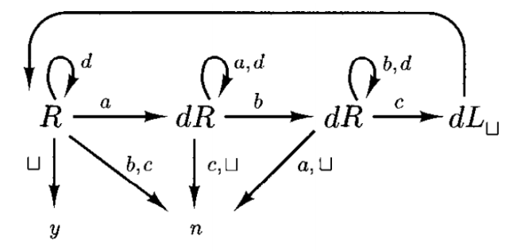
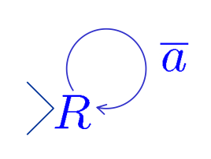
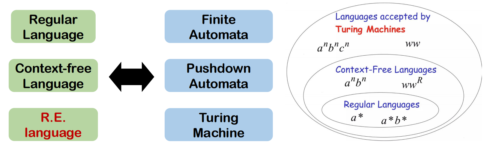

# Chapter 4 | Turing Machine

**为什么需要图灵机？**

在我们学习图灵机之前，我们已经接触了两种计算模型：

1.  **有限自动机 (Finite Automata, FA)**：

**模型**：一个只有有限多个状态（有限内存）的控制器，一个只读、单向（从左到右）的输入带。

* **能力**：只能识别“正则语言”，例如 $a^*$。
* **局限**：内存是有限的。它无法“计数”。例如，它无法识别 $L = \{a^n b^n \mid n \ge 0\}$，因为它不记得自己读了多少个 $a$。

2.  **下推自动机 (Pushdown Automata, PDA)**：

**模型**：一个 FA 加上一个**栈 (Stack)** 。栈是无限的，但访问受限（后进先出 LIFO）。

* **能力**：能识别“上下文无关语言”(CFL)，例如 $L = \{a^n b^n\}$。它可以通过“压栈”来“计数” $a$，再通过“弹栈”来匹配 $b$。
* **局限**：

    * **访问受限**：栈顶是唯一的读写位置。
    * **只读输入**：输入带仍然是只读、单向的。
    * 它无法识别 $L = \{ww \mid w \in \{a,b\}^*\}$（一个字符串的完美复制）。为什么？因为当它在读取第二个 $w$ 时，它需要拿 $w$ 的第一个字符去和*栈底*（即 $w$ 的第一个字符）比较，但它做不到，它只能访问栈顶。
    * 它也无法识别 $L = \{a^n b^n c^n\}$。因为栈在匹配完 $b^n$ 后就空了，它“忘记”了 $n$ 到底是多少，无法再用来匹配 $c^n$。

**图灵机的出现**

图灵机的设计思想就是为了克服上述所有局限。它问了一个问题：“如果我们把 PDA 的栈和 FA 的输入带合并，并让这个‘带子’变得既可读又可写，并且磁头可以双向移动呢？” 。

这就是图灵机 (Turing Machine, TM) 的核心理念。它引入了几个革命性的新特性：

* 磁头可以**同时读和写** 。
* 磁头可以**双向移动**（左或右）。
* 带子是**无限长的**（至少在概念上是这样，总有空白格可用） 。

---

## 图灵机的形式化定义

就像 FA 和 PDA 一样，一个图灵机 (TM) 被定义为一个**五元组 (quintuple)**：

$$M = (K, \Sigma, \delta, s, H)$$

我们来逐一拆解这五个组成部分：

* **$K$ (状态集)**：一个**有限**的状态集合。

* **$\Sigma$ (带字母表)**：这是一个**有限**的字母表。
    * 它必须包含一个特殊的**空白符号 $\sqcup$**（有时也写作 $\diamond$ 或 $B$）。
    * 它必须包含一个特殊的**左端点符号 $\triangleright$**。这标志着磁带的“起点”，磁头永远不能移动到它的左边。
    * 它**不包含**移动符号 $\leftarrow$ 和 $\rightarrow$（这些是“动作”，不是“符号”）。

* **$s$ (初始状态)**：$s \in K$，是机器开始时的状态。

* **$H$ (停机状态集)**：$H \subseteq K$，是一个或多个状态的集合。

* **$\delta$ (转移函数)**：这是图灵机的“程序”或“大脑”，也是最复杂的部分。

    * **数学定义**：$\delta: (K-H) \times \Sigma \to K \times (\Sigma \cup \{\leftarrow, \rightarrow\})$ 。
    * **输入 $(K-H) \times \Sigma$**：函数的输入是 (当前状态, 当前磁头下的符号)。注意，状态必须是**非停机状态** ($K-H$)。
    * **输出 $K \times (\Sigma \cup \{\leftarrow, \rightarrow\})$**：函数的输出是 (新状态, 要执行的动作)。这个“动作”*要么*是“写入一个新符号”（来自 $\Sigma$），*要么*是“移动磁头”（$\leftarrow$ 或 $\rightarrow$）。
    * **重要约束 (安全规则)**：

        1.  $\forall q \in K-H, \text{如果 } \delta(q, \triangleright) = (p, b), \text{ 那么 } b \text{ 必须是 } \rightarrow$。这条规则是说，当磁头在最左端的 $\triangleright$ 符号上时，它**唯一**允许的动作就是向右移动。它绝不能向左移（掉下磁带），也绝不能改写 $\triangleright$ 符号。
        2.  $\forall q \in K-H \text{ 和 } a \in \Sigma, \text{如果 } \delta(q, a) = (p, b), \text{ 那么 } b \ne \triangleright$。这说明图灵机永远不能“写入” $\triangleright$ 符号。$\triangleright$ 只能在初始时出现在磁带的最左端。

---

### 图灵机的图示表示

一个从 $q_1$ 到 $q_2$ 的箭头，标记为 $a \to b, L$ [cite: 193, 194, 195]，其含义是：

1.  **读 (Read)**：如果当前状态是 $q_1$，且磁头**读到**的符号是 $a$ 。
2.  **写 (Write)**：在磁带的*同一位置* **写入** 符号 $b$ 。
3.  **移 (Move)**：将磁头向**左 (Left)** 移动一个格子。
4.  **变 (Change)**：将状态从 $q_1$ 切换到 $q_2$ 。

同理，$a \to b, R$ 表示读 $a$，写 $b$，然后向**右 (Right)** 移动。

**图灵机是确定性的 (Deterministic)**

* 这意味着在任何 (状态, 符号) 组合下，*最多只有一种*可能的动作。这和 DFA 相同，但和 NFA/NPDA 不同。
* **允许 (Allowed)**：从 $q_1$ 出发，可以有 $a \to b, R$ 和 $b \to d, L$ 两条边。这是确定性的，因为如果读到 'a' 只有一条路可走，读到 'b' 也只有一条路可走。
* **不允许 (Not Allowed)**：从 $q_1$ 出发，*不能*同时有 $a \to b, R$ 和 $a \to d, L$ 两条边。如果读到 'a' 有两种选择，这就是非确定性的。

**TM 如何“接受”和“拒绝”？**

1.  **接受 (Accept)**：当机器执行到一个**接受状态** (accept state，通常是 $H$ 的子集，如图中的 $q_1$) 并**停机** (halt) 。
2.  **拒绝 (Reject)**：

* 机器停机了，但停在一个**非接受状态** (non-accept state)。
* 机器**永不停止**，即陷入了一个**无限循环** (infinite loop)。

**TM 如何“停机” (HALT)？**

* 进入一个定义好的停机状态 (Halting State)，例如 $H$ 中的状态。
* 遇到一个 (状态, 符号) 组合，但在 $\delta$ 中**没有定义**相应的转移。例如，在状态 $q_1$ 读到了符号 'c'，但图中没有 $q_1$ 在 'c' 上的转移，机器会“卡住”，即停机。

---

### 实例分析

让我们看一个关键实例：**$L = \{a^n b^n \mid n \ge 1\}$** 。

PDA 可以用栈解决它。TM 如何解决？TM 使用一种完全不同的“来回扫描、做标记”的策略。

1.  从左端开始，找到第一个 $a$，用 $x$ 替换它 (做标记)。
2.  向右移动，跳过所有的 $a$ 和 $y$ (已经标记过的 $b$)。
3.  找到第一个 $b$，用 $y$ 替换它 (做标记)。
4.  现在，一个 $a$ 和一个 $b$ 匹配了。磁头**向左移动**。
5.  向左移动，跳过所有的 $a$ 和 $y$。
6.  直到碰到我们之前留下的 $x$ 标记。
7.  磁头向右移动一步，回到 $x$ 标记后的第一个 $a$ (或 $y$)。
8.  回到状态 $q_0$，重复步骤 1 (寻找下一个 $a$)。

**图解这个过程：**

* $q_0 \xrightarrow{a \to x, R} q_1$ ：找到 $a$，标记为 $x$，向右找 $b$。
* $q_1 \xrightarrow{a \to a, R} q_1$ 和 $q_1 \xrightarrow{y \to y, R} q_1$ ：跳过路上的 $a$ 和 $y$。
* $q_1 \xrightarrow{b \to y, L} q_2$ ：找到 $b$，标记为 $y$，开始向左返回。
* $q_2 \xrightarrow{a \to a, L} q_2$ 和 $q_2 \xrightarrow{y \to y, L} q_2$ ：跳过路上的 $a$ 和 $y$。
* $q_2 \xrightarrow{x \to x, R} q_0$ ：找到 $x$ 标记，右移一格，回到 $q_0$ 准备下一轮。

**如何结束？**

* **接受**：当 $q_0$ 想找 $a$ 时 (步骤 1)，如果它没找到 $a$，而是找到了 $y$ (意味着所有 $a$ 都被标记了)，它就进入 $q_3$ 状态。 $q_3$ 会一路向右，检查是否还有剩余的 $b$ (如果找到 $b$ 就会卡住并拒绝)。如果 $q_3$ 只看到 $y$，最后撞到了空白符号 $\diamond$，说明 $a$ 和 $b$ 完美匹配。它进入 $q_4$ (接受状态) 并停机。
* **拒绝**：如果在 $q_1$ 找 $b$ 时 (步骤 2) 撞到了空白 $\diamond$ (没找到 $b$)，说明 $a > b$，机器停在 $q_1$ (非接受状态)，拒绝。

**关键启示**：
这个例子完美展示了“**读写**”和“**双向移动**”的威力。TM 通过在磁带上“做标记”($x, y$) 来“记忆”信息，这是 FA 和 PDA 都做不到的。

我们可以轻松修改这个机器来识别 $L = \{a^n b^n c^n\}$ 。我们只需要在 $q_2$ (标记完 $b$) 之后，再向右找 $c$ 并标记为 $z$，然后再一起返回最左端。这是 PDA 绝对无法做到的！

---

### 瞬时描述：格局 (Configuration)

一个格局 (Configuration) 必须包含三样东西：

1.  **$q$**：当前的状态。
2.  **$\triangleright x$**：从左端点 $\triangleright$ 开始，到**磁头左边**的所有内容。
3.  **$y$**：从**磁头当前位置**开始，到“最右边的非空白符号”为止的所有内容。

**形式化表示**：$(q, \triangleright x, y)$。(磁头正指向 $y$ 的第一个符号 )

**简化的表示法**

这个三元组 $(q, \triangleright x, y)$ 写起来很麻烦。一种更直观的“简化表示法”是把**当前状态 $q$ 直接插入到磁带字符串中，放在磁头所指符号的*前面***。

**例子 1**：格局 $(q, \triangleright a, aba)$。

* $q$ 是状态。
* 磁头左边是 $\triangleright a$。
* 磁头指向 $a$，后面是 $ba$。
* 磁带是 $\triangleright a a b a$。
* 简化表示为：$(q, \triangleright \underline{a} a b a)$ (下划线表示磁头位置)。

**例子 2**：格局 $(h, \triangleright\sqcup\sqcup\sqcup, \sqcup a)$。

* $h$ 是状态。
* 磁带是 $\triangleright \sqcup \sqcup \sqcup \sqcup a$。
* 磁头指向倒数第二个 $\sqcup$。
* 简化表示为：$(h, \triangleright \sqcup \sqcup \sqcup \underline{\sqcup} a)$。

**停机格局 (Halted Configuration)**

如果一个格局中的状态 $q$ 属于停机状态集 $H$ ( $q \in H$ )，那么这个格局就叫停机格局。

---

### 计算 (Computation)

我们如何描述图灵机“动起来”的过程？我们使用“产生”(yields) 符号 $\vdash_M$ 来表示机器从一个格局到下一个格局的“一步”推导。

**定义**：$(q_1, w_1 \underline{a_1} u_1) \vdash_M (q_2, w_2 \underline{a_2} u_2)$

这表示机器 $M$ 可以在**一步**之内，从左边的格局变到右边的格局。

这“一步”是怎么发生的？假设 $\delta(q_1, a_1) = (q_2, b)$ ：

**情况 1：写入 (b $\in \Sigma$)**

**情况 2：向左移动 (b = $\leftarrow$)**

* 假设 $\delta(q_1, a_1) = (q_2, \leftarrow)$。
* **例子 (a)**：格局 $(q_1, w b \underline{a_1} u)$。

    * 机器在 $a_1$ 处，状态 $q_1$。
    * 它执行“变 $q_2$，向左移”。
    * 新的格局是 $(q_2, w \underline{b} a_1 u)$。磁头移到了 $b$ 上面。

* **例子 (b)**：格局 $(q_1, w b \underline{\sqcup})$。

    * 在 $a_1=\sqcup$ 处，向左移。
    * 新的格局是 $(q_2, w \underline{b})$。

**情况 3：向右移动 (b = $\rightarrow$)**

* 假设 $\delta(q_1, a_1) = (q_2, \rightarrow)$。
* **例子 (a)**：格局 $(q_1, w \underline{a_1} b u)$。

    * 在 $a_1$ 处，状态 $q_1$。
    * 它执行“变 $q_2$，向右移”。
    * 新的格局是 $(q_2, w a_1 \underline{b} u)$。磁头移到了 $b$ 上面。

* **例子 (b)**：格局 $(q_1, w \underline{a_1})$。

    * 在 $a_1$ 处，右边是 $u=e$ (空)。
    * 向右移，磁头会移到一个**空白符号 $\sqcup$** 上。
    * 新的格局是 $(q_2, w a_1 \underline{\sqcup})$。( *知其所以然*：这就是磁带“无限长”的体现，你总可以向右移动到新的空白格上。)

**计算 (Computation)**

* **$\vdash_M^*$ (多步产生)**：这是 $\vdash_M$ 的“自反传递闭包”。
* **一个计算**：就是一个格局的序列 $C_0, C_1, ..., C_n$，其中 $C_0 \vdash_M C_1 \vdash_M \dots \vdash_M C_n$。
* **计算长度**：这个计算的长度为 $n$ (共 $n$ 步) ，记作 $C_0 \vdash_M^n C_n$。

---

### 模块化编程：组合图灵机

**基本机器**我们可以定义一些非常简单的“原子”机器：

* **$M_a$ (写符号 'a')** ：不管读到什么 (除了 $\triangleright$)，都写入 'a' 并停机。我们把它简写为 **$a$**。
* **$M_\leftarrow$ (左移)**：不管读到什么 (除了 $\triangleright$)，都向左移动一步并停机。简写为 **L**。
* **$M_\rightarrow$ (右移)**：不管读到什么，都向右移动一步并停机。简写为 **R**。

**构建循环**利用这些基本机器，我们可以构建出非常有用的“搜索”循环：

* **$R_{\sqcup}$** ：**向右找到第一个空白格**。
* **$R_{\overline{\sqcup}}$** ：**向右找到第一个非空白格**。
* **$L_{\sqcup}$** ：向左找到第一个空白格。
* **$L_{\overline{\sqcup}}$** ：向左找到第一个非空白格。

**组合规则**这是图灵机的“流程控制”，它定义了我们如何像搭乐高一样组合机器 $M_1, M_2, M_3$。

$$M_1 \xrightarrow{a} M_2$ 且 $M_1 \xrightarrow{b} M_3$$

它的执行逻辑是：

1. 从 $M_1$ 的初始状态 $s_1$ 开始。
2. 执行 $M_1$，直到 $M_1$ 停机 (进入 $H_1$ 中的某个状态)。
3. **检查停机时的符号**：

* 如果停机时，磁头正下方的符号是 'a'，则**不真正停机**，而是立即跳转到 $M_2$ 的初始状态 $s_2$ 。
* 如果停机时，磁头正下方的符号是 'b'，则跳转到 $M_3$ 的初始状态 $s_3$。
* 如果停机在其他符号上，则真正停机。

4.  继续执行 $M_2$ (或 $M_3$)，直到它停机。
5.  整个组合机器的停机状态是 $M_2$ 和 $M_3$ 的停机状态 ($H = H_2 \cup H_3$)。

---

## Computing with Turing Machine

### 任务一：判定语言

我们希望图灵机能像 FA 和 PDA 一样，对一个输入字符串 $w$ 给出“接受”或“拒绝”的答案。但 TM 比它们更复杂，因为它可能*永远不停止*（即无限循环）。因此，我们需要更精确地定义“接受”和“拒绝”。

---

#### 明确的停机状态

为了让“接受”和“拒绝”的意图更清晰，我们引入一个新的约定：

* 我们指定停机状态集 $H$ 由两个特殊状态组成：**$H = \{y, n\}$**。
* **$y$** 代表 "Yes" (是)，即**接受**。
* **$n$** 代表 "No" (否)，即**拒绝**。
* **接受格局 (Accepting Configuration)**：任何状态为 $y$ 的停机格局。
* **拒绝格局 (Rejecting Configuration)**：任何状态为 $n$ 的停机格局。

---

#### “判定”与“递归语言”

这是本节第一个**极其重要**的定义：

* **输入字母表 $\Sigma_0$**：这是我们“喂”给机器的合法输入符号集，它*不*包含特殊的 $\triangleright$ (左端点) 和 $\sqcup$ (空白)。
* **M 接受 $w$**：如果 M 从初始格局 $(s, \triangleright \underline{\sqcup} w)$ 开始，最终停机在一个“接受格局”（$y$ 状态）。
* **M 拒绝 $w$**：如果 M 从初始格局 $(s, \triangleright \underline{\sqcup} w)$ 开始，最终停机在一个“拒绝格局”（$n$ 状态）。

**核心定义：判定 (Decides)**

我们说一个 TM $M$ **“判定”(Decides)** 一个语言 $L$，必须满足以下**两个**条件：

1.  如果 $w \in L$ ( $w$ 属于这个语言)，M 必须**停机并接受** $w$。
2.  如果 $w \notin L$ ( $w$ 不属于这个语言)，M 必须**停机并拒绝** $w$。

"判定" 的关键在于**总是停机**。无论输入什么，这个 TM 必须在有限步骤内给出 "Yes" 或 "No" 的答案，绝不允许无限循环。

**核心定义：递归语言 (Recursive Language)**

如果一个语言 $L$ **存在**一个能“判定”它的图灵机 $M$，那么 $L$ 就被称为**递归语言**。

**示例：$L = \{a^n b^n c^n \mid n \ge 0\}$**

* 这个语言是递归的。

* **策略**：

1. **$R$ 状态**：机器从左向右扫描，寻找第一个 $a$。

* 如果找到 $a$，就用 $d$ 替换它 (做标记)，然后进入 $dR$ 状态。
* 如果没找到 $a$，反而找到了 $b$ 或 $c$ (顺序错了)，就跳转到 $n$ (拒绝)。
* 如果没找到 $a$，反而找到了 $\sqcup$ (空白)，意味着所有 $a, b, c$ 都被 $d$ 完美替换了 ( $n=0$ 或 $n>0$ 的情况都匹配完了)，就跳转到 $y$ (接受)。

2. **$dR$ 状态 (第一次)**：机器向右寻找第一个 $b$。

* 如果找到 $b$，用 $d$ 替换它，进入下一个 $dR$ 状态。
* 如果没找到 $b$，反而找到了 $a, c, \sqcup$ (数量不匹配或顺序错)，就跳转到 $n$ (拒绝)。

3.  **$dR$ 状态 (第二次)**：机器向右寻找第一个 $c$。

* 如果找到 $c$，用 $d$ 替换它，进入 $dL_{\sqcup}$ 状态。
* ...

4.  **$dL_{\sqcup}$ 状态**：一个“返回”状态，磁头一直向左，直到碰到 $\triangleright$，然后循环回 $R$ 状态，开始下一轮的 $a-b-c$ 标记。

* 这个 TM *总会停机*，因为它要么在 $(y, n)$ 停机，要么因为找不到匹配项而进入 $n$ 停机。因此，它“判定”了这个语言。

---

#### 停机问题 (The Halting Problem)

* **FA 和 PDA 的区别**：FA 和 PDA *总是会停机*的。它们在读完输入字符串后就会停止。
* **TM 的第三种可能**：图灵机 $M$ (即使是只有 $y, n$ 两个停机状态的 $M$)，除了“接受”或“拒绝”外，还有第三种可能：**永不停止 (failing to halt)**，即陷入无限循环。

这就引出了一个问题：如果我们有一个 TM $M$，它在 $w \in L$ 时停机 (接受)，但在 $w \notin L$ 时*无限循环*，那这个 $M$ 算什么呢？它显然没有“判定” $L$，因为它在 $w \notin L$ 时没有给出 "No" 的答案。

---

#### “半判定”与“递归可枚举语言”

**核心定义：半判定 (Semidecides)**

我们说一个 TM $M$ **“半判定”(Semidecides)** 一个语言 $L$，必须满足：

1. 如果 $w \in L$ ( $w$ 属于这个语言)，M 必须**停机** (我们不在乎它停在 $y$ 还是 $n$，只要停机就行)。
2. 如果 $w \notin L$ ( $w$ 不属于这个语言)，M 必须**永不停止**。

**核心定义：递归可枚举语言 (Recursively Enumerable, r.e.)**

如果一个语言 $L$ **存在**一个能“半判定”它的图灵机 $M$，那么 $L$ 就被称为**递归可枚举语言 (r.e. 语言)**。

**定理：Recursive $\implies$ r.e.**

* **“如果一个语言是递归的，那么它一定是 r.e. 的。”**

* **证明**：

1.  假设 $L$ 是递归的，那么存在一个 TM $M$ “判定”它 (即总在 $y$ 或 $n$ 停机)。
2.  我们构造一个新机器 $M'$：
3.  $M'$ 和 $M$ 几乎一样，但我们修改 $M$ 的“拒绝”逻辑：任何原本会导致 $M$ 进入 $n$ 状态的转移，在 $M'$ 中都改成进入一个“无限循环”的状态。
4.  现在 $M'$ 的行为是：

* 如果 $w \in L$，$M$ 会进入 $y$ (停机)。$M'$ 也会进入 $y$ (停机)。
* 如果 $w \notin L$，$M$ 会进入 $n$ (停机)。$M'$ 则会进入无限循环。

5.  $M'$ 的行为完美符合“半判定”的定义。因此 $L$ 是 r.e. 语言。

“递归”(Recursive) = 总能停机 (好)；“递归可枚举”(r.e.) = 只在 "Yes" 时停机 (次好)。

---

#### 语言示例

* $L = \{w \in \{a,b\}^* \mid w \text{ 至少包含一个 } a\}$。
* 下图展示了一个“半判定” $L$ 的 TM。

* **策略**：这是一个简单的“搜索”机器。

1.  从 $\triangleright$ 开始，状态为 $R$。
2.  只要读到的符号**不是 $a$** (记为 $\overline{a}$)，就保持 $R$ 状态并向右移动。
3.  一旦读到 $a$，循环条件 $\overline{a}$ 不满足，机器没有下一步动作，于是**停机**。

**分析**：

* 如果 $w \in L$ (例如 "bba")：机器会 $R, R, R$，读到 $a$ 时**停机**。
* 如果 $w \notin L$ (例如 "bbb")：机器会 $R, R, R$，读完 $b$ 后会继续读 $\sqcup, \sqcup, \dots$。因为 $\sqcup$ 也不是 $a$，机器将永远向右移动，**永不停止**。

因此，这个 TM “半判定” $L$，证明了 $L$ 是 r.e. 语言。

---

#### 语言层级总结与性质

**总结**：语言的“包含”关系：

* **正则语言 (RL)** (被 FA 识别) $\subset$
* **上下文无关语言 (CFL)** (被 PDA 识别) $\subset$
* **递归可枚举语言 (r.e.)** (被 TM 半判定)。
* (图中还暗示了**递归语言**在 CFL 和 r.e. 之间)。
* $a^n b^n c^n$ 和 $ww$ 是 r.e. 语言 (它们也是递归的)，但不是 CFL。

* **递归语言的性质**：

**定理 1：递归语言的“补集”也是递归的**。

* **证明**：如果 $L$ 是递归的，就有 TM $M$ 判定它 (总在 $y$ 或 $n$ 停机)。
* 我们构造 $M'$，只需**交换 $M$ 的 $y$ 和 $n$ 状态**。
* 如果 $w \in L$，$M$ 停在 $y$，$M'$ 就会停在 $n$ (拒绝)。
* 如果 $w \notin L$，$M$ 停在 $n$，$M'$ 就会停在 $y$ (接受)。
* $M'$ 仍然是*总停机*的，它完美地判定了 $\overline{L}$。

**定理 2：递归语言在“并集”和“交集”下是封闭的**。

* **证明 (交集)**：假设 $L_1$ (由 $M_1$ 判定) 和 $L_2$ (由 $M_2$ 判定) 都是递归的。
* 我们构造 $M_{intersect}$：

1.  在输入 $w$ 上运行 $M_1$。
2.  $M_1$ 必定停机。如果 $M_1$ 停在 $n$ (拒绝)，则 $M_{intersect}$ 也停在 $n$ (拒绝)。
3.  如果 $M_1$ 停在 $y$ (接受)，则 $M_{intersect}$ 擦除磁带，重新在 $w$ 上运行 $M_2$。
4.  $M_2$ 必定停机。$M_{intersect}$ 返回 $M_2$ 的答案 ($y$ 或 $n$)。

* 这个 $M_{intersect}$ *总会停机*，并且只有当 $M_1$ 和 $M_2$ 都接受时才接受。因此 $L_1 \cap L_2$ 是递归的。 (并集的构造类似)。

---

### 任务二：计算函数

TM 不仅能回答“是/否”，它还能“处理数据”。FA 和 PDA 只能读，而 TM 可读可写，所以它能把一个输入字符串 $w$ 彻底“转换”成一个输出字符串 $y$ 。

---

#### 函数计算的定义

* **用途**：TM 作为函数计算机，将输入 $w$ 转换为输出 $f(w)$ 。
* **约定** ：

1.  **输入**：初始格局为 $(s, \triangleright \underline{\sqcup} w)$。
2.  **运行**：TM 运行计算。
3.  **输出**：TM **必须停机**，且停机时的磁带内容为 $\triangleright \sqcup y$ ( $y$ 是结果) 。$y$ 就是输出，记为 $M(w) = y$ 。

**核心定义：递归函数 (Recursive Function)**

一个函数 $f: \Sigma_0^* \to \Sigma_0^*$ 是**递归的** (或称“可计算的”)，如果**存在**一个 TM $M$ 来“计算”它 (即对 $f$ 定义域 $D$ 中的所有 $w$，都有 $M(w) = f(w)$)。

---

#### 函数计算示例

**示例 1：复制机 (Copying Machine)**

* **函数**：$f(w) = ww$。
* **策略**：这是一个复杂但很经典的“子程序”示例。其高级策略是：

1.  从 $w$ 的第一个字符 $a$ 开始。
2.  将 $a$ “标记” (例如改写成 $\dot{a}$，或先用 $\sqcup$ 擦除)。
3.  向右跑到 $w$ 后面第一个空白 $\sqcup$ 处。
4.  写入 $a$。
5.  向左跑回被标记的 $\dot{a}$ 处。
6.  将 $\dot{a}$ 恢复成 $a$，并向右移动到下一个字符 $b$。
7.  重复 2-6，直到 $w$ 的所有字符都被复制到后面。

**示例 2：左移机 (Left-shifting Machine $S_{\leftarrow}$)**

* **函数**：$f(\sqcup w) = w \sqcup$ (它将 $\triangleright \sqcup w$ 转换为 $\triangleright w \sqcup$)。
* **策略**：这是一种“蠕虫”式的移动：

1.  从 $\triangleright \underline{\sqcup} a b \dots$ 开始。
2.  `R` (读 $a$) $\to$ `U` (写 $\sqcup$) $\to$ `L` (左移) $\to$ `a` (写 $a$) $\to$ `R` (右移)。
3.  磁带变为 $\triangleright a \underline{\sqcup} b \dots$。
4.  重复这个 $R \to \sqcup \to L \to \text{symbol} \to R$ 的循环，直到整个 $w$ 都向左移动了一格。

---

#### 对数字的递归函数

TM 只能处理字符串，我们如何让它计算 $n+1$ 这样的数学函数？答案是：**编码**。

* **编码**：我们使用二进制字符串来表示自然数 (例如 $w \in \{0, 1\}^*$)。
* **多参数**：我们用 $;$ (分号) 来分隔多个参数，例如 $w_1; w_2; \dots$。
* **定义**：一个数字函数 $f: N^k \to N$ 是**递归的**，如果其对应的*字符串函数* (在二进制编码上操作) 是 TM 可计算的。

**示例 1：后继函数 $succ(n) = n+1$**

* **策略**：这就是二进制加法器。

1.  `R_U L`：转到 $n$ 的最右一位 (L-bit)。
2.  `1` 分支：如果读到 `1`，改为 `0` (进位)，然后 `L` (向左移)，回到循环。
3.  `0` 分支：如果读到 `0`，改为 `1`，**停机** (加法完成)。
4.  `U` 分支：如果读到 $\sqcup$ (空白)，说明遇到了 $n=111\dots1$ 的情况，一路进位到了最左端。此时需要：
5.  `1 S_R`：写入 `1`，然后调用“右移机” $S_R$ (与 $S_{\leftarrow}$ 相反)，把 $n$ 的所有位都向右移一格，给这个新的 `1` 腾出空间。

**示例 2：组合机器**

* 我们可以像搭积木一样组合 TM 来计算复杂函数。
* **函数**：$f(x, y) = \text{if } x > y \text{ then } x+y \text{ else } 0$。
* **策略**：

1.  运行 **Comparator** (比较器) TM 模块。
2.  如果 $x > y$，则将磁带内容传递给 **Adder** (加法器) TM 模块。
3.  如果 $x \le y$，则将磁带内容传递给 **Eraser** (清零器) TM 模块。
4.  最终输出 $x+y$ 或 $0$。

---

## 图灵机的扩展 (Extension of Turing Machine)

这些扩展（Extensions）虽然看起来更方便、更强，但它们在**计算能力**上(computational power)和最基础的标准图灵机是**等价（Equivalent）**的。也就是说，凡是这些“高级”图灵机能计算的问题，我们那个“简陋”的标准图灵机也一样能算，只是可能算的慢一点、笨一点。

1.  **Multiple tapes (多磁带)**
2.  **Two-way infinite tape (双向无限磁带)**
3.  **Multiple heads (多读写头)**
4.  **Multi-dimensional tape (多维磁带)**
5.  **Non-determinism (非确定性)**

**为什么研究它们？**

因为在设计图灵机来解决特定问题时（比如我们之前做的“复制”或“$a^n b^n c^n$”），只用一条磁带会感觉非常“憋屈”和麻烦。如果能有更多“草稿纸”（多磁带），或者更灵活的读写方式，设计起来会方便得多。

**它们为什么等价？**

核心在于**“模拟” (Simulation)**。我们可以证明，对于任何一个“高级”图灵机，都存在一个“标准”图灵机能够模拟它的所有计算过程。

---

### 1. 多磁带图灵机 (Multiple Tapes)
一个 $k$-带图灵机 ($k$-tape TM) 和标准图灵机（1-tape TM）基本一样，都有有限的状态 $K$、字母表 $\Sigma$、初始状态 $s$ 和停机状态 $H$。

**唯一的、也是最关键的区别在于它的转移函数 $\delta$：**

**标准图灵机 (1-tape TM) 的 $\delta$：**

$$\delta: (K-H) \times \Sigma \rightarrow K \times (\Sigma \cup \{\leftarrow, \rightarrow\})$$

* **解读：** 机器根据「当前状态」和「当前读写头下的1个符号」，决定「下一个状态」、「写入1个新符号」和「读写头移动1个方向」。

**k-带图灵机 (k-tape TM) 的 $\delta$：**

$$\delta: (K-H) \times \Sigma^k \rightarrow K \times (\Sigma \cup \{\leftarrow, \rightarrow\})^k$$

* **解读：** 机器根据「当前状态」和「所有k个读写头下的k个符号」，**同时**决定「下一个状态」、「（在k个带上）写入k个新符号」和「（k个读写头）各自的移动方向」。
* **重点：** 这 $k$ 个读写头是**独立**的。在同一步操作中，1号带的头可以左移，2号带的头可以右移，3号带的头可以不动。

**约定 (Convention)：**

* 输入字符串 $w$ 初始时放在**1号磁带**上。
* 其余的 $k-1$ 条磁带（2号到k号带）初始时全是空白（$\sqcup$）。
* 计算结束后，最终的输出结果也在**1号磁带**上。
* 其他的磁带在计算过程中扮演了“草稿纸”的角色。

**示例：复制机 (Copying Machine)**

* **问题：** 把输入 $w$ 变成 $ww$。
* **用标准 (1-tape) TM 怎么做？** 我们需要非常麻烦地来回跑：在 $w$ 后面先写一个标记（比如 $a$ 变成 $A$），跑到 $w$ 的末尾写一个 $a$，再跑回开头找下一个标记... 每次只能复制一个字符，非常慢。
* **用 2-tape TM 怎么做？** 过程变得极其简单：

1. 1号带的头和2号带的头同时从头开始向右跑。1号带读什么，2号带就写什么。直到1号带读到空白（$w$ 结束了）。（此时，1号带是 $w$，2号带也是 $w$）。
2. 保持1号带的头不动（在 $w$ 的末尾），让2号带的头“倒带”，一路向左跑，直到读到开头的空白 $\triangleright$。
3. 1号带的头和2号带的头又一起向右跑。2号带读什么，1号带就在后面（$w$ 的后面）写什么。
4. 1号带的内容就从 $w$ 变成了 $ww$。

这个例子清晰地展示了多磁带的**“方便性”**。

为什么它和标准TM等价？

**定理：** 任何 $k$-带图灵机 $M$ 都可以被一个标准 (1-tape) 图灵机 $M'$ **模拟**。

**证明思路 (Proof Idea)：**

我们怎么用“一条”磁带去模拟“k条”磁带呢？ 答案是：**把标准TM的磁带“分割”成很多“轨道” (Tracks)。**

假设我们有一个 $k$-带图灵机 $M$。我们要构造一个 1-tape 图灵机 $M'$ 来模拟它。

$M'$ 的磁带字母表 $\Sigma'$ 会更复杂。$M'$ 的磁带上会存储**所有 $k$ 条磁带的内容**，以及**所有 $k$ 个读写头的位置**。

具体做法是，我们将 $M'$ 的磁带（概念上）分为 **$2k$ 个轨道**：

* **$k$ 个内容轨道：** 第1、3、5、...、$2k-1$ 轨道，分别用来存储 $M$ 的第1、2、3、...、$k$ 条磁带的**内容**。
* **$k$ 个读写头位置轨道：** 第2、4、6、...、$2k$ 轨道，用作**标记**。每个轨道上只有一个 $1$，其余都是 $0$，这个 $1$ 所在的位置就代表 $M$ 对应磁带的读写头位置。

**例如：**

一个 2-tape TM ($k=2$)，它的模拟 1-tape TM 就会有 $2k=4$ 个轨道。

* 轨道1: 存储 2-tape TM 的 磁带1 内容 (e.g., `...sqcup, u, b, c, u...`)
* 轨道2: 存储 磁带1 的 读写头位置 (e.g., `... 0, 0, 1, 0, 0...`) $\leftarrow$ 1在`b`下面，表示头在`b`
* 轨道3: 存储 2-tape TM 的 磁带2 内容 (e.g., `...sqcup, a, a, b, a...`)
* 轨道4: 存储 磁带2 的 读写_头位置 (e.g., `... 0, 0, 0, 0, 1...`) $\leftarrow$ 1在`a`下面，表示头在`a`

**$M'$ 如何模拟 $M$ 的一步？**

$M$ 走一步是“瞬间”完成的（读取 $k$ 个符号，写入 $k$ 个符号，移动 $k$ 个头）。但 $M'$ 要模拟这一步，就需要一个**非常宏大**的操作：

1.  **收集信息 (Scan Left)：** $M'$ 的读写头必须从当前位置一直向**左**扫描（扫过所有有内容的格子），直到磁带开头 $\triangleright$。在扫描过程中，它“记住”在 $k$ 个“读写头位置轨道”上（那些标记为 $1$ 的地方）所对应的 $k$ 个“内容轨道”上的符号是什么。
2.  **决定操作：** 当 $M'$ 扫描到开头，它就知道了 $M$ 当前在 $k$ 个磁带上读到的 $k$ 个符号（比如 `(b, a)`）。$M'$ 内部的有限控制器 (F.C.) 和 $M$ 的 $\delta$ 函数是一样的。它查询 $\delta(q, (b,a))$，得到了 $M$ 的下一步操作，比如是 $(q', (x, y), (\rightarrow, \leftarrow))$。
3.  **执行操作 (Scan Right)：** $M'$ 现在从头开始向**右**扫描，把所有事情“落实到位”：

* 当它找到第一个 $1$ (磁带1的头)，它在对应的“内容轨道”上把 `b` 改成 `x`。
* 它把这个 $1$ 擦掉，在**右边**一个格子的“位置轨道”上写 $1$（模拟 $\rightarrow$）。
* 它继续扫描，找到第二个 $1$ (磁带2的头)，它在对应的“内容轨道”上把 `a` 改成 `y`。
* 它把这个 $1$ 擦掉，在**左边**一个格子的“位置轨道”上写 $1$（模拟 $\leftarrow$）。

4.  **完成：** $M'$ 的读写头回到它开始的地方。$M'$ 终于完成了对 $M$ **一步**的模拟。

**结论：**

* **能力等价：** 这个模拟虽然繁琐，但它是**可行**的。所以 $k$-tape TM 能做的，1-tape TM 也能做。
* **效率降低：** 模拟是需要**代价**的。$M$ 走一步，$M'$ 可能要来回扫描整个磁带两次，花费 $\mathcal{O}(\text{磁带长度})$ 步。
* **时间复杂度 (Time Complexity)：** (Page 45) 如果 $M$ 在 $t$ 步内完成计算， $M'$ 需要的步数是 $\mathcal{O}(t \cdot (|x|+t))$。（$|x|$ 是输入长度，$t$ 步计算最多让磁带长度也变为 $\mathcal{O}(t)$）。这是一个**多项式**的“减速”。在“可计算性”理论中，我们只关心“能不能算出来”（哪怕很慢），所以它们是等价的。

---

### 2. 双向无限磁带 (Two-way Infinite Tape)

标准TM的磁带只有一端（右侧）是无限的，左侧有 $\triangleright$ 挡住。双向无限磁带，就是左侧也是无限的。

为什么等价？

我们可以用一个**标准 (1-tape) TM** 模拟它，也可以用一个**2-tape TM** 来模拟它。

用 2-tape TM 模拟更简单（如图所示）：

1.  我们构造一个 2-tape TM $M'$。
2.  $M'$ 的 **1号带** 存储 $M$（那个双向无限带）的**所有“正”地址**（格子 $0, 1, 2, ...$）上的内容。
3.  $M'$ 的 **2号带** 存储 $M$ 的**所有“负”地址**（格子 $-1, -2, -3, ...$）上的内容，但是是**反向**存的。
4.  $M'$ 的状态中会记住，它当前模拟的 $M$ 的读写头是在“正半轴”还是“负半轴”。

* 如果 $M$ 的头在正半轴上移动， $M'$ 就在1号带上正常操作。
* 如果 $M$ 的头从 $0$ 号格子想移动到 $-1$ 号， $M'$ 就会切换到 2号带上开始操作。
* 如果 $M$ 在 $-1$ 号格子上想向左移动（到 $-2$），$M'$ 在 2号带上反而要向**右**移动（因为2号带是反向存的）。

**结论：** 既然 2-tape TM 可以模拟双向无限带 TM，而我们又知道 2-tape TM 和 1-tape TM 是等价的，那么**双向无限带 TM 也和 1-tape TM 等价**。

---

### 3. 多读写头 (Multiple Heads)

只有**一条**磁带，但是有 $k$ 个读写头在上面。它的 $\delta$ 函数会根据 $k$ 个读写头**同时**读取到的 $k$ 个符号来决定下一步。

为什么等价？

这个模拟思路和“多磁带”非常像！

我们可以用一个**标准 (1-tape) TM $M'$** 来模拟它。

$M'$ 的磁带需要 **$(k+1)$ 个轨道**：

* **轨道1：** 存储那条**唯一**的磁带的**内容**。
* **轨道2 到 $k+1$：** 这 $k$ 个轨道用来**标记 $k$ 个读写头的位置**。每个轨道只有一个 $1$，其余是 $0$。

**$M'$ 模拟 $M$ 的一步：**

1.  **收集信息：** $M'$ 从头到尾扫描一次磁带，找到 $k$ 个位置轨道上的 $1$，并查看它们对应的“内容轨道”（轨道1）上的符号是什么。
2.  **决定操作：** $M'$ 知道了 $k$ 个头读到的 $k$ 个符号，通过 $\delta$ 函数决定下一步。
3.  **执行操作：** $M'$ 再从头到尾扫描一次磁带，去更新“内容轨道”上的符号，并把 $k$ 个位置轨道上的 $1$ 分别向左或向右移动。

**结论：** 同样是可行的模拟，只是更慢了。因此，多读写头图灵机与标准图灵机**计算能力等价**。

---

### 4. 多维磁带 (Multi-dimensional Tape)

磁带不再是一条线，而是一个二维的网格（甚至更高维度）。读写头可以上、下、左、右移动。

为什么等价？

我们仍然可以用一个**标准 (1-tape) TM $M'$** 来模拟它。关键在于如何把“二维”信息“压扁”成“一维”。

**模拟思路：**

我们可以用 1-tape TM $M'$ 来存储 2D-tape TM $M$ 访问过的**所有格子的(坐标, 内容)**。

$M'$ 的磁带可以这样组织：`# (0,0), a # (0,1), b # (1,0), c # (0,-1), d # ...`

$M'$ 在自己的状态里记住 $M$ 的“虚拟”当前坐标，比如 $(x, y)$，以及 $M$ 的当前状态 $q$。

**$M'$ 模拟 $M$ 的一步 (比如 $M$ 要“向上”移动)：**

1.  $M'$ 在状态里计算出新坐标 $(x, y+1)$。
2.  $M'$ 扫描**整个**磁带，查找形如 `# (x, y+1), ...` 的字符串。
3.  **如果找到了** (比如是 `# (x, y+1), s #`)： $M'$ 就知道了 $M$ 向上移动后读到的符号是 $s$。
4.  **如果没找到：** 说明 $M$ 移动到了一个（虚拟的）新空白格。 $M'$ 就自己“创造”一个记录，在磁带末尾添加 `# (x, y+1), $\sqcup$ #`，并假装读到了 $\sqcup$。
5.  $M'$ 根据 $M$ 的 $\delta$ 函数决定要写入的新符号和新状态，然后**再次**扫描整个磁带，找到 `# (x, y+1), ...` 这段，把它更新成新的内容。

**结论：** 这个模拟过程极其繁琐和缓慢，但它**在理论上是可行的**。所以，多维磁带图灵机与标准图灵机**计算能力等价**。

---

## 非确定性图灵机 (Nondeterministic Turing Machines, NTM)

### 直观理解：为什么需要“非确定性”？

在标准图灵机（DTM）中，每一步做什么都是确定的（就像写好的程序，if 后面是什么很清楚）。但在解决某些问题（比如“寻找一个合数因数”）时，我们往往需要“搜索”或“猜测”。

非确定性图灵机（NTM） 拥有了一种超能力：“猜测”能力。

在某个状态下，面对同一个输入符号，它可以有多种可能的下一步动作。

这就像在一个岔路口，NTM 可以同时分身走所有的路。只要有一条路通向成功，我们就说这台机器成功了。

---

### 数学定义

标准图灵机是一个五元组 $(K, \Sigma, \delta, s, H)$，其中 $\delta$ 是一个函数（Function）。

NTM 也是一个五元组 $(K, \Sigma, \Delta, s, H)$，唯一的区别在于转移规则 $\Delta$ 是一个关系（Relation）。

公式对比：

DTM: 

$$\delta: (K-H) \times \Sigma \rightarrow K \times (\Sigma \cup \{\leftarrow, \rightarrow\})$$

给定了当前状态 $q$ 和读到的符号 $\sigma$，结果是唯一的 $(p, b)$。

NTM: 

$$\Delta \subseteq ((K-H) \times \Sigma) \times (K \times (\Sigma \cup \{\leftarrow, \rightarrow\}))$$

这意味着对于一个输入 $(q, \sigma)$，可能有多个 $(p, b)$ 与之对应。

---

### NTM 如何“接受”语言？

NTM 的“接受”和“拒绝”是不对称的。

- 半判定 (Semidecide) / 接受：

定义：对于输入 $w$，如果在该输入产生的所有可能的计算路径树中，存在至少一条路径最终停机在接受状态（$y$），那么 $M$ 接受 $w$。

注意： 哪怕有 9999 条路径死循环或者拒绝，只要有 1 条接受，整体就算接受。

- 判定 (Decide)：

要求更严格：

所有可能的计算路径都必须在有限步内停机（不能有死循环）。

$w \in L$ 当且仅当存在一条路径接受。

计算函数：

要求极高：所有计算路径必须停机，且所有导致停机的路径必须输出相同的结果。

---

### 经典例子：合数判定

我们要判定一个数 $n$ 是否是合数（Composite）。

DTM 思路：循环尝试 $2, 3, \dots, \sqrt{n}$ 能否整除 $n$。需要很多步。

NTM 思路：

- 非确定性猜测：直接“猜”两个数 $p$ 和 $q$（这一步在计算树上分叉出了所有可能的 $p, q$ 组合）。
- 验证：计算 $p \times q$。
- 比对：如果 $p \times q = n$，则接受。

只要 $n$ 真的是合数，总会在某个平行宇宙（计算分支）里猜对，所以机器接受。

---

### 核心定理：NTM 与 DTM 等价

定理：如果一个 NTM $M$ 半判定/判定语言 $L$，那么一定存在一个标准图灵机 $M'$ 也半判定/判定 $L$。

意义：虽然 NTM 看起来有“分身术”，但它能解决的问题范围并没有扩大，只是可能解决得“快”一点（步数少）。任何 NTM 能做的事，DTM 都能做。

证明思路（重点）：我们需要用 DTM 来模拟 NTM。

难点：NTM 的计算像一棵树。DTM 不能只顺着一条路走到底（深度优先搜索，DFS），因为如果那条路是死循环，DTM 就卡住了，永远发现不了隔壁那条能接受的路。

解法：广度优先搜索 (BFS)。

DTM 按步骤数 $k=1, 2, 3, \dots$ 模拟 NTM 的所有可能路径。

先检查所有 1 步能到的状态，再检查所有 2 步能到的...

具体构造：

使用 3 条带子 的 DTM：

- 输入带：永远存着原始输入 $w$（只读）。
- 模拟带：用来模拟 NTM 的某一条具体路径。
- 地址带：生成像 1, 11, 12, 111... 这样的序列，指导模拟带“在第1步走第1个分支，第2步走第2个分支...”。

DTM 只要不断生成地址带上的序列，就能遍历 NTM 计算树上的每一个节点。

---

## 文法 (Grammars)

### 直观理解：从“识别”到“生成”

图灵机是识别器（给一个字符串，问是不是合法的）。文法是生成器（给我一套规则，我能造出所有合法的字符串）。

我们在之前的课程（如 CFG）中学过文法，这里的文法指的是0型文法 (Type-0) 或 无限制文法 (Unrestricted Grammar)。它的规则左边不仅仅可以是一个非终结符，而可以是一串符号。

---

### 数学定义

文法 $G = (V, \Sigma, R, S)$：

- $V$：字母表（包含终结符和非终结符）。
- $\Sigma \subseteq V$：终结符集合。
- $S$：开始符号。
- $R$：规则集合。规则形式为 $u \rightarrow v$，其中 $u \in V^*(V-\Sigma)V^*$（$u$ 至少包含一个非终结符），$v \in V^*$。

区别点：CFG 的规则左边必须是单个非终结符（如 $A \rightarrow aBc$）。而这里可以是 $AbC \rightarrow deF$。这意味着替换是上下文相关的。

---

### 核心定理：文法 $\Leftrightarrow$ 图灵机

定理：一个语言 $L$ 是由文法生成的，当且仅当它是递归可枚举 (Recursively Enumerable, R.E.) 的。

R.E. 的意思是：存在一个图灵机能半判定这个语言。

---

证明思路：

#### 方向 $\Rightarrow$ (文法生成的都是 R.E. 的)：

我们可以造一个 NTM 来模拟文法的推导过程。

NTM 在带子上非确定性地选择规则 $u \rightarrow v$，并在带子上进行替换。

如果最后带子上的内容等于输入 $w$，则接受。

因为 NTM 等价于 DTM，所以文法生成的语言能被 TM 识别。

---

#### 方向 $\Leftarrow$ (R.E. 的都能用文法生成)：

这是一个非常精彩的构造。我们要设计一套文法，来模拟图灵机的计算过程。

但是文法是“生成”字符串，图灵机是“吃掉”字符串并计算。怎么联系？

思路：让文法逆向模拟图灵机。

构造细节：

图灵机的格局（Configuration）如 $uqv$ 可以看作字符串。

图灵机的每一步转移 $(q, a) \rightarrow (p, b)$ 都可以写成文法规则（比如 $qa \rightarrow pb$）。

文法先生成形如 $\triangleright \sqcup h \triangleleft$ （停机接收状态）的字符串。

利用规则逆推回到初始状态 $S \triangleright \sqcup w$。

最后清理掉多余的非终结符，只留下 $w$。

结论：任何被图灵机接受的 $w$，都能通过这套文法从 $S$ 推导出来。

---

## 数值函数 (Numerical Functions)

### 直观理解：计算不仅仅是推导符号

之前我们把计算看作是符号的移动（图灵机）或替换（文法）。现在我们回到数学本源：计算就是函数求值。

这节的目的是定义**“什么样的数学函数是可计算的？”。
这套理论叫递归函数论 (Recursive Function Theory)**。

---

### 原始递归函数 (Primitive Recursive Functions, PRF)

我们要像搭积木一样，从最基础的积木搭建出复杂的函数。

三块基石（基本函数）：

1. 零函数 $Z(n) = 0$
2. 后继函数 $S(n) = n+1$
3. 投影函数 $P_i^k(x_1, \dots, x_k) = x_i$ （从一堆参数里选一个出来）

两种搭建方法（运算）：

1. 合成 (Composition)：把一个函数的输出塞给另一个函数做输入。$f(x) = g(h(x))$。
2. 原始递归 (Primitive Recursion)：这就是编程里的 for 循环。

- 定义 $f(n+1)$ 时利用 $f(n)$ 的值。
- 公式：$f(\vec{n}, m+1) = h(\vec{n}, m, f(\vec{n}, m))$。

构建示例：

- 加法 $Plus(m, n)$：利用递归，$m+0=m$, $m+(n+1) = S(m+n)$。
- 乘法 $Mult(m, n)$：利用加法递归。
- 指数 $Exp(m, n)$：利用乘法递归。
- 甚至 前驱函数 ($n-1$)、减法（$m \dot{-} n$, 结果非负）都是 PRF。

PRF 的局限性：

原始递归本质上对应编程语言中的 for 循环（循环次数在开始前就已经确定了）。虽然它能涵盖几乎所有日常函数，但它无法计算某些增长极快或者需要“无限寻找”的函数（如 Ackermann 函数）。

---

### 极小化与 $\mu$-递归函数 (Minimalization)

为了拥有图灵机那样的完全计算能力（包括死循环的能力），我们需要引入**“极小化算子” ($\mu$-operator)**。

这对应编程里的 while 循环。

**定义**：

$$\mu m [g(\vec{n}, m) = 1]$$

意思是：寻找最小的自然数 $m$，使得 $g(\vec{n}, m) = 1$。

为什么重要？

- `for` 循环（原始递归）一定会停机。
- `while` 循环（极小化）去寻找满足条件的 $m$，可能永远找不到，从而导致函数无定义（死循环）。
- 这引入了部分函数 (Partial Function) 的概念。

$\mu$-递归函数定义：

由基本函数出发，通过合成、原始递归、以及极小化操作得到的函数。

---

### 终极定理：$\mu$-递归 $\Leftrightarrow$ 图灵机可计算

这是本章的最高潮，也是邱奇-图灵论题（Church-Turing Thesis）的数学体现。

定理：一个函数是 $\mu$-递归的，当且仅当它是图灵机可计算的。

---

证明思路：

#### 方向 $\Rightarrow$ ($\mu$-递归 $\rightarrow$ TM)：

比较简单。因为 $Z, S, P$ 都能用 TM 实现，合成和递归也能用 TM 模拟，极小化就是一个不断尝试 $m=0, 1, 2...$ 的循环，TM 也能做。

---

#### 方向 $\Leftarrow$ (TM $\rightarrow$ $\mu$-递归)：

这需要把图灵机的整个计算过程“数字化”（哥德尔数风格）。

步骤：

1. 编码：把图灵机的格局（Tape内容, 状态, 读写头位置）编码成一个巨大的整数。
2. Step函数：定义一个 PRF，输入当前格局的数字，输出下一步格局的数字。
3. Run函数：利用原始递归，模拟 $t$ 步后的格局。
4. Halt判定：定义一个谓词，判断该格局是否停机。
5. 关键点（极小化）：我们不知道图灵机什么时候停机，所以定义函数 $Comp(w) = \mu t [Halt(Run(w, t)) = 1]$。即“寻找最小的步数 $t$，使得机器停机”。
6. 一旦找到了 $t$，就解码该时刻的格局作为输出。

结论：因为图灵机的计算过程可以用数值函数精确描述，所以图灵机可计算的函数必然是 $\mu$-递归的。

---