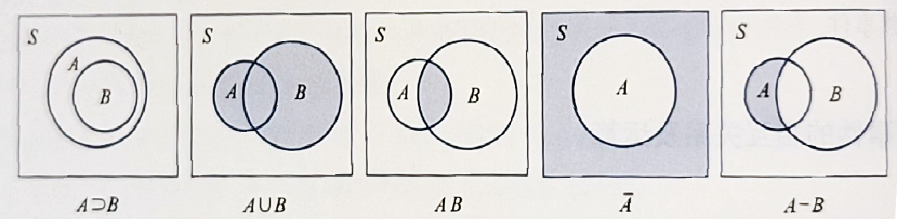
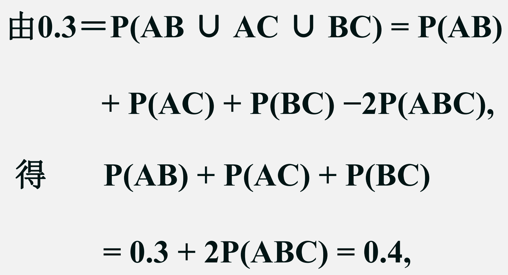
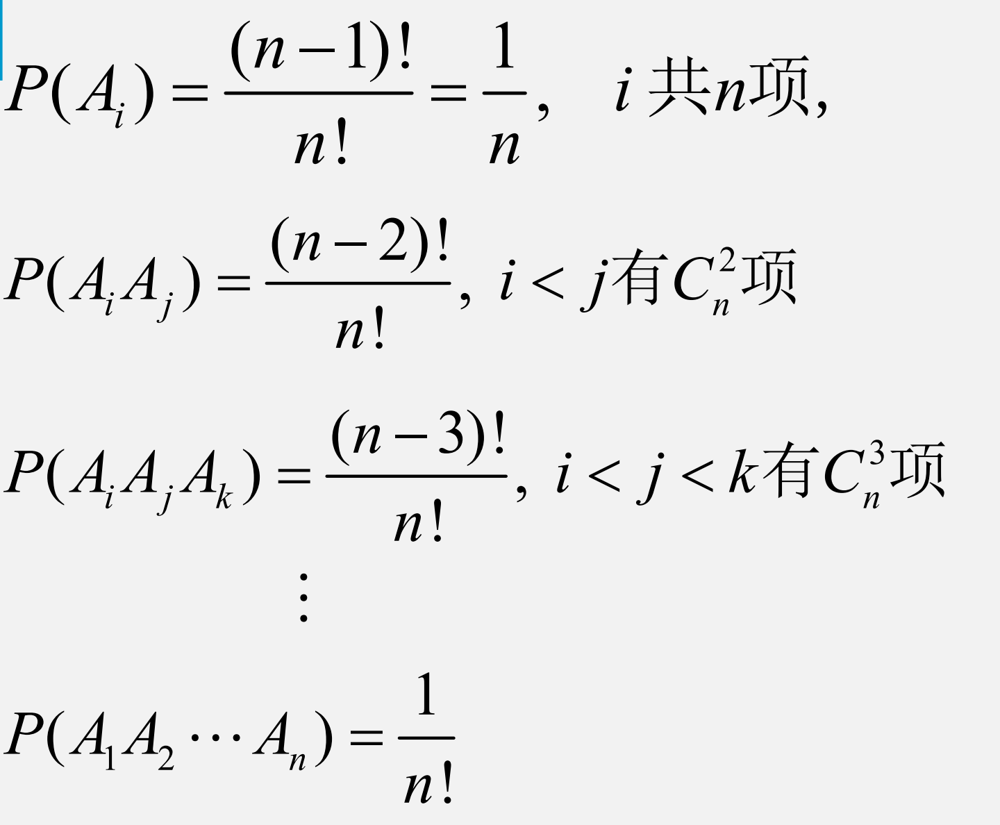
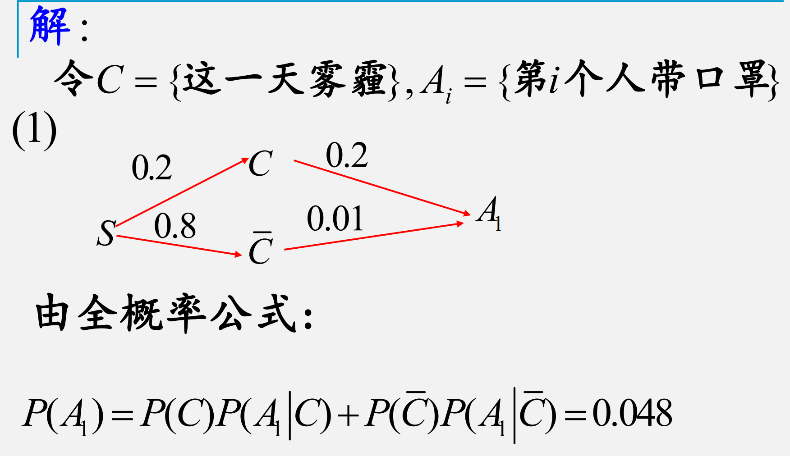

# Chapter 1 概率论的基本概念

## 样本空间与随机事件

### 随机试验的特点

1. 可以在相同条件下重复进行
2. 事先知道可能出现的结果
3. 进行试验前并不知道哪个试验结果会发生

---

### 样本空间

定义：随机试验 E 的所有结果构成的集合称为 E 的样本空间，记为 S，称 S 中的元素 e 为样本点。

---

### 随机事件

称 S 的子集 A 为 E 的随机事件 A，简称事件 A。当且仅当 A 所包含的一个样本点发生称事件 A 发生。

**随机事件有以下特征：**

1. 事件 A 是相应的样本空间 S 的一个子集，其关系可用维恩(Venn)图来表示
2. 事件 A 发生当且仅当 A 中的某一个样本点出现
3. 事件 A 的表示可用集合，也可用语言来表示

---

**基本事件：**由一个样本点组成的单点集。

**必然事件：**每次试验 S 总是发生。

**不可能事件：**记Φ为空集，不包含任何样本点，则每次试验Φ都不发生。

---

### 事件的相互关系

包含 | 和事件 | 积事件 | 逆事件 | 差事件

---

### 事件的运算

$$A \cup B = \{x | x \in A 或 x \in B\}$$

$$A \cap B  = A \cdot B = AB = \{ x| x \in A 且 x \in B\}$$

$\cup_{i=1}^{n} A_i: A_1,A_2,\dots,A_n$至少有一个发生

$\cap_{i=1}^{n}A_i:A_1,A_2,\dots,A_n$同时发生

当$AB = \Phi$时，称事件A与B是互不相容的，或互斥的。

A的逆事件记作$\overline{A}$,$\begin{cases} A\cup \overline{A} &= S \\ A \overline{A} &= \emptyset \end{cases}$,若$\begin{cases} A\cup B &= S \\ A B &= \emptyset \end{cases}$,称AB互逆。

$$A \overline{B} = A - B = \{ x | x \in A 且 x \notin B\}$$

- **交换律：**A∪B = B∪A, A ∩ B = B ∩ A；
- **结合律：**A∪(B∪C) = (A∪B)∪C, A(BC) = (AB)C；
- **分配律：**A(B∪C) = (AB)∪(AC), (AB)∪C = (A∪C)(B∪C);
- **对偶律** / **德摩根定律(De Morgan's law)：**

$$\overline{\cup_{j=1}^n A_j} = \cap_{j=1}^n \overline{A_j}$$

$$\overline{\cap_{j=1}^nA_{j}} = \cup_{j=1}^n\overline{A_j}$$

---

## 频率与概率

### 频率

定义：$$f_n(A) = \frac{n_A}{n}$$ ； 称为A在这n次试验中发生的**频率**。

其中$n_A$​——A发生的次数(频数)；n——总试验次数。

**频率的性质：**

1. $$ 0 \le f_n(A) \le 1$$
2. $$f_n(S) = 1$$
3. 若$A_1,A_2,\dots,A_n$两两互不相容，则$f_n(\cup_{i=1}^k A_i) = \sum_{i=1}^k f_n(A_i)$
4. $f_n(A)$随n的增大渐趋稳定，记稳定值为p

---

### 概率

若样本空间 S中的任一事件 A，**定义概率** P(A) 满足以下三条公理：

1. 非负性 P(A)≥0；
2. 规范性 / 正则性 P(S)=1；
3. 可列可加性：对于 S 中不相容的事件 $A_i$，有$P(\cup_{i=1}^{\infty} A_i) = \sum_{i=1}^{\infty} P(A_i)$

由此得到如下几条**概率的性质**：

1. 对于有限个**两两不相容**的事件的和事件，有 $P(\cup_{i=1}^{n} A_i) = \sum_{i=1}^{n} P(A_i)$
2. $P(A)=1−P(\overline{A})$; 特别的，可以得到 $P(\Phi) = 0$;
3. 当 A⊃B 时，P(A−B)=P(A)−P(B)  且 P(A) ≥ P(B);
4. 概率的**加法公式**：P(A∪B) = P(A)+P(B)−P(AB) ; 推广即容斥原理；
5. 加法公式的推论：P(A∪B) ≤ P(A)+P(B);

???+ question 
	甲乙丙3人去参加某个集会的概率均为0.4，其中至少有两人参加的概率为0.3，都参加的概率为0.05，求3人中至少有一人参加的概率。
   

   
答案

   
   
   
   

---

## 等可能概型

如果随机事件满足：

1. S 中样本点数有限；
2. $∀i,j∈{1,2,...,n},P(e_i)=P(e_j)$，即等可能；

则该试验问题为**等可能概型**（**古典概型**）
有如下性质：若总事件个数为 N，A 为 n 个基本事件的和事件，则 $P(A) = \frac{n}{N}$

???+ question
	（配对问题）一个小班有n个同学，编号为1, 2, …, n 号，中秋节前每人准备一件礼物，相应编号为1,2, … ,n。将所有礼物集中放在一起，然后每个同学随机取一件，求没有人拿到自己礼物的概率。

答案

---

## 条件概率

### 定义

$$P(B|A) = \frac{P(AB)}{P(A)}, P(A) \ne 0$$

### 性质

1. $P(\cdot|A)$是概率
2. 非负性：$P(B|A) \ge 0$
3. 规范性：$P(S|A) = 1$
4. 可列可加性：$A_1,A_2,\dots,A_k,\dots$两两互斥$\rightarrow P(\cup_{i=1}^{\infty}A_i|A) = \sum_{i=1}^{\infty}P(A_i|A)$
5. $P(\cdot | A)$具有概率的所有性质

???+ question
	天气很好,小王想带家人去千岛湖玩,又想到天目山玩.他有一枚硬币,但不知道这枚硬币出现正面的概率.利用这枚硬币设计一个试验帮他做决定，使得最后他去千岛湖和去天目山的概率相等.

    
答案

???+ question
	某单位想从8名业务员中等概率地选取一名去外地出差一年.现有一枚均匀硬币.利用这枚硬币设计一个试验帮这个单位做决定.

答案

### 乘法公式

$P(AB) = P(A) \times P(B | A) = P(B) \times P(A| B)$

$P(ABC) = P(A) \times P(B | A) \times P(C | AB)$

$$P(A_1A_2\dots A_n ) = P(A_1)P(A_2 | A_1)P(A_3 |A_1A_2 ) \dots P(A_n | A_1 \dots A_{n-1})$$

???+ question
	一盒中有5个红球，4个白球，采用不放回抽样，每次取一个，取4次，
	(1)已知前两次中至少有一次取到红球，求前两次中恰有一次取到红球的概率；
	(2)已知第4次取到红球，求第1，2次也取到红球的概率。

答案

### 全概率公式&Bayes公式

$$P(A)=\sum_{j=1}^nP(B_j)P(A∣B_j)$$

$$P(B_i|A) = \frac{P(B_i)P(A|B_i)}{\sum_{j=1}^{n}P(B_j)P(A|B_j)}$$

???+ question
	根据以往的临床记录，某种诊断癌症的试验具有5%的假阳性及5%的假阴性：即设A={试验反应是阳性}，C={被诊断患有癌症}则有：$P(A |C) = 5%, P(A | C ) = 5 %$ .已知某一群体$P(C)=0.005$，问这种方法能否用于普查？

答案

---

## 独立性

设 A,B 为两个随机事件，若有 $P(AB)=P(A) \times P(B)$，则 A,B 相互**独立(independent)**

若$P(A) \ne 0$,那么$P(B|A) = P(B)$

当出现两个以上的随机事件时，如三个随机事件 A,B,C 当：
$$P(AB)=P(A)∗P(B),P(AC)=P(A)∗P(C),P(BC)=P(B)∗P(C)$$

都成立，则称事件 A,B,C*A*,*B*,*C* **两两独立**；

如果**同时还**满足：$P(ABC)=P(A)P(B)P(C)$ 则称事件 A,B,C**相互独立**。

- 注意: $相互独立 \rightarrow 两两独立$但是$两两独立 \nrightarrow 相互独立$

更普遍的：

**定义** $\{A_i\}$ **相互独立**当且仅当 $\forall i_j, P(\prod_{j=1}^k A_{i_j}) = \prod_{j=1}^k P(A_{i_j})$

**独立试验**：指任一次子试验出现的结果都不影响其他各子试验出现的结果；例如观察十期彩票的开奖结果，是独立试验。

**重复试验**：如果各子试验是在相同条件下进行的。

???+ question
	一袋中有编号为1,2,3,4共4个球，采用有放回抽样，每次取一球，共取2次，记录号码之和，这样独立重复进行试验，求“和等于3”出现在“和等于5”之前的概率。

答案

???+ question
	设某地每天发生雾霾的概率为0.2.在雾霾天气,该地各居民独立地以概率0.2戴口罩，在没有雾霾的时候各居民独立地以概率0.01戴口罩.某天
	(1)在该地任选一居民,求他戴口罩的概率；
	(2)若选n人,求他们都戴口罩的概率；
	(3)若选n人发现他们都戴口罩,求这一天发生雾霾的概率.(这里n为正整数.)

答案

---