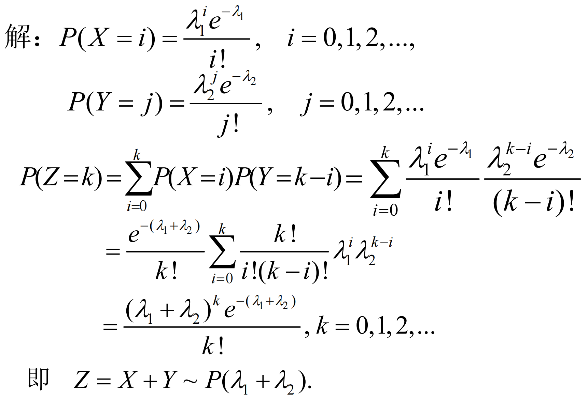
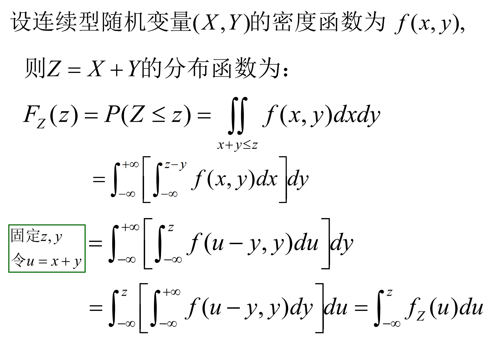
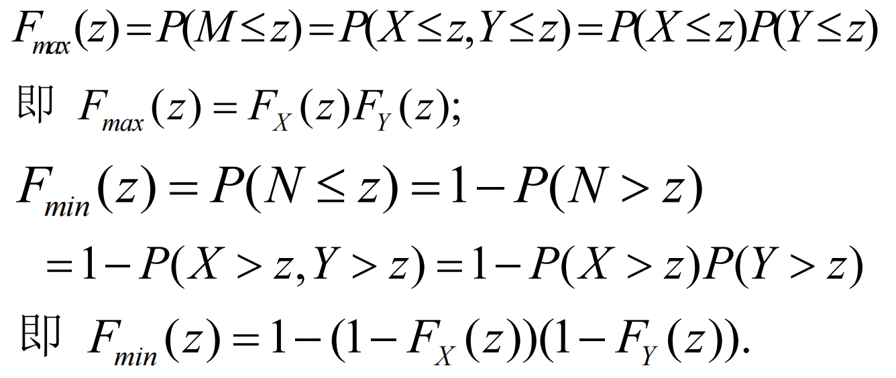
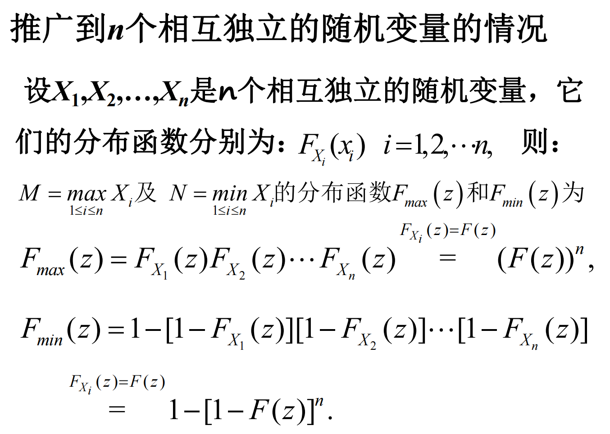
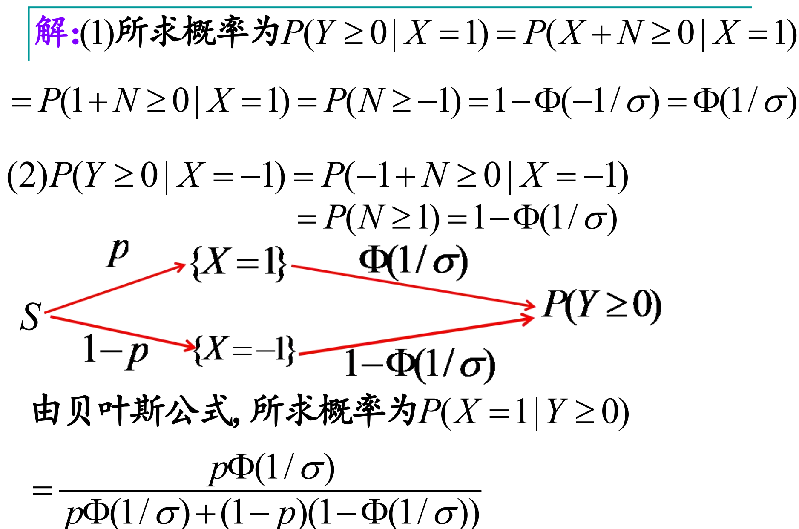
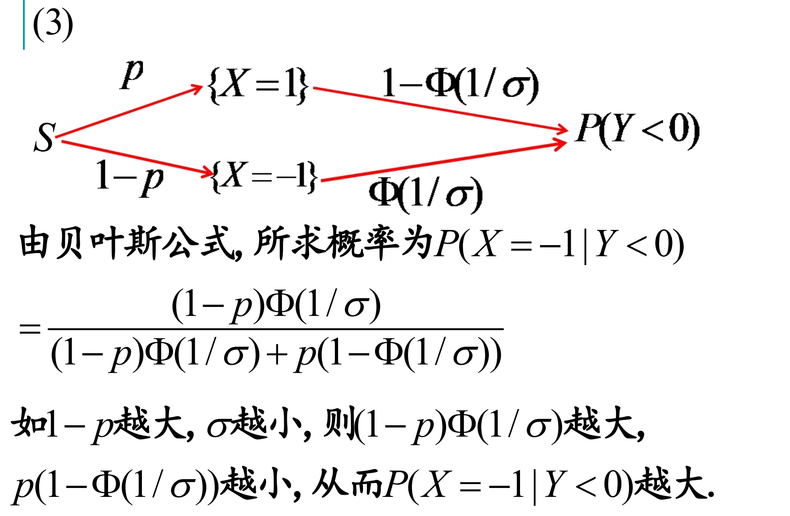

# Chapter 3 多元随机变量及其分布

## 离散型随机变量

### 联合概率分布

$$P(X = x_i,Y = y_j) = p_{ij},\ i,j = 1,2,\dots$$

- $P_{ij} \ge 0, i,j=1,2,\dots$
- $\sum\limits_{i=1}^{\infty}\sum\limits_{j=1}^{\infty}p_{ij} = 1$

---

### 边际分布

边际分布律（Marginal Mass Function）是联合分布律的行/列求和；

- $P(X=x_i)=P(X=x_i,Y < \infty )= \sum\limits_{j=1}^{\infty}p_{ij} \mathop{=}\limits^{\textbf{记为}}p_{i⋅}$
- $P(Y=y_j)=P(X< \infty,Y = y_j )= \sum\limits_{i=1}^{\infty}p_{ij}\mathop{=}\limits^{\textbf{记为}}p_{⋅j}$

---

### 条件分布

条件分布律（Conditional Mass Function）

$$P\{X=x_i∣Y=y_j\}=\frac{P(X=x_i,Y=y_j)}{P(Y=y_j)}=\frac{p_{ij}}{p\cdot j},\ i,j=1,2,\dots$$

---

### 联合分布函数

$F(x,y)=P\{X \le x,Y \le y\}$ 为 $(X,Y)$ 的**联合概率分布函数**，简称**联合分布函数（Joint Distribution Function）**，其具有如下性质：

1. **固定**其中一个变量，则该二元函数关于另外一个变量单调**不减**；

2. $0 \le F(x,y) \le1 ,\ 0\le F(x,y) \le1$，且

$$F(x,−\infty )=F(−\infty ,y)=F(−\infty,−\infty)=0, \ F(+\infty ,+\infty ) =1;$$

3. $F(x,y)$ 关于 $x$ 和 $y$ **分别**右连续（离散）；

4. $x_1 < x_2,y_1<y_2$ 时，有：

$$P\{x_i < X \le x_2,y_1 < Y \le y_2\} = F(x_2,y_2) - F(x_1,y_2) -F(x_2,y_1) + F(x_1,y_1);$$

5. 联合可以决定边际，边际不能决定联合，边际加上条件可以决定联合。

---

### 边际分布函数

$F_X(x)=P\{X\le x\}=P\{X\le x,Y<+\infty \}=F(x,+\infty )=\int_{−\infty}^{+\infty}f(x,y)dy$ 为$X$ 关于联合分布函数 $F(x,y)$的**边际分布函数（Marginal Distribution Function）**。

对于$F_Y(y)$同理。

---

### 条件分布函数

$F_{Y∣X}(y∣x)=P\{ Y\le y∣X=x\}=\frac{P\{Y\le y,X =x\}}{P\{X=x\}}$ 为 $\{X=x\}$ 条件下 $Y$ 的**条件分布函数（Conditional Distribution Function**。

进一步推广，若 $P(X=x)=0$ ，但对任意给定的 $\varepsilon$，$P(x<X\le x+ \varepsilon ) >0$ ，则在 $\{X=x\}$ 条件下，$Y$ 的条件分布函数为 $F_{Y∣X}(y∣x) = \mathop{lim}\limits_{\varepsilon \rightarrow 0^+}P\{Y \le y∣x<X\le x+ \varepsilon \}$ ，仍记为 $P\{Y\le y∣X=x \}$。

---

## 连续型随机变量

### 分布函数和联合概率密度函数

$$F(x,y) = \int_{-\infty}^{y} \int_{-\infty}^{x}f(u,v)dudv$$

**性质**：

1. $f(x,y) \ge 0$ ；
2. $F(+\infty ,+\infty ) = \int_{−\infty}^{+\infty} \int_{−\infty}^{+\infty}f(u,v)dudv=1$ ；
3. 在 $f(x,y)$ 的连续点 $(x,y)$ 上有 $\frac{\delta^2 F(x,y)}{\delta x\delta y}=f(x,y)$ ；
4. $(X,Y)$ 落入 $xOy$ 平面任意区域 $D$ 的概率为： $P\{(X,Y)\in D\}=\int \int f(x,y)dxdy$ ；
5. 由于其几何意义为落在以 $D$ 为底，以曲面 $z=f(x,y)$ 为顶面的柱体体积，所以当 $D$ 面积为 0 时概率为 0；`eg`： $P(X=1,Y=1)=0$ ， $P(X+Y=1)=0$ ， $P(X^2+Y^2 \le 1) \neq 0$ ；

---

### 边际概率密度函数

$f_X(x)=\int_{−\infty}^{+\infty}f(x,y)dy$ 为边际概率密度函数（Marginal Probability Density Function），简称**边际密度函数**。

---

### 条件概率密度函数

在给定 $\{X=x\}$ 的条件下，$Y$ 的条件概率密度函数（Conditional Prob-ability Density Function）为 $f_{Y∣X}(y∣x)=\frac{\int_{−\infty}^{y}f(x,v)dv}{f_X(x)} = \frac{f(x,y)}{f_X(x)},\ f_X(x) \neq 0$，简称**条件密度函数**。

对于 $Y$ 同理。

**条件概率** $P(Y \in D | X = x) = \int_{D} f_{Y|X}(y|x) dy$ 。

---

## 二元均匀分布

(X,Y)在D上服从均匀分布，具有概率密度函数:

$$f(x,y) = \begin{cases}\frac{1}{D的面积}，&(x,y) \in D\\0,&其他\end{cases}$$

$$P\{(X,Y) \in D\} = \frac{D_1的面积}{D的面积}, while\ D_1 \in D$$

---

## 二元正态分布

设二元随机变量$(X,Y)$的概率密度函数为:

$$f(x,y) = \frac{1}{2\pi \sigma_1 \sigma_2 \sqrt{1- \rho^2}} \times exp\{\frac{-[\frac{(x- \mu_1)^2}{\sigma_1^2} - 2\rho \frac{(x - \mu_1)(y-\mu_2)}{\sigma_1 \sigma_2} + \frac{(y-\mu_2)^2}{\sigma_2^2}]}{2(1-\rho^2)}\}$$

$$(-\infty < x < +\infty,-\infty < y < +\infty)$$

且有 $∣\mu_1∣<+\infty$，$∣\mu_2∣<+\infty$，$\sigma_1>0$，$\sigma_2>0$，$∣ρ∣<1$ ，则称 $(X,Y)$ 服从参数为 $(\mu_1,\mu_2,\sigma_1^2,\sigma_2^2,\rho)$的 **二元正态分布（Bivariate Normal Distribution）**，记做 $(X,Y)∼N(\mu_1,\mu_2,,\sigma_1^2,\sigma_2^2,\rho)$。

- 二维正态分布的两个边际分布都是**对应参数的一维正态分布**，与 $\rho$ 无关。
- **联合密度函数可以推出边际密度函数。边际密度函数无法推出联合密度函数。**例如联合正态分布，联合密度函数与$\rho$有关而边际密度函数则与$\rho$无关。

---

## 随机变量的独立性

**定义**:

随机变量 $X,Y$ 相互独立

$$P(X \le x,Y \le y) = P(X \le x)P(Y \le y)$$

也即：

$$F(x,y) = F_X(x)F_Y(y)$$

---

### 独立性等价判断

#### 离散型

用分布律判断。对一切 $i,j$ 都成立 $p_{ij} = p_{i·} p_{·j}$ 。

即

$$P(X=x_i,Y=y_j) = P(X=x_i)P(Y=y_j),\forall i,j$$

$$\Leftrightarrow P(Y = y_j|X = x_i) = P(Y = y_j),\forall j$$

即 $Y$ 条件分布律与 $Y$的边际分布律相等。

---

#### 连续型

用密度函数判断。对在平面的点 (x,y) 几乎处处成立 $f(x,y) = f_X(x)f_Y(y)$ 。

即在平面上除去 "面积" 为零的集合以外，上述等式处处成立。

$$\Leftrightarrow f_{Y|X}(y|x) = f_Y(y)$$

即 $Y$ 的条件密度函数与 $Y$ 的边际密度函数相等。

???+ question 
	设随机变量$X ∼ P(\lambda_1),Y ∼ P(\lambda_2 )$，且$X$ ,$Y$相互独立。若$Z =X+Y$，求$Z$的概率分布律。

??? note "Answer"
	

---

### 随机变量函数的分布

已知随机变量 $X$ 的分布, $Y = g(X)$ ,函数 $g(·)$ 已知,求 $Y$ 的分布。

- 离散型

先写出 $Y$ 的可能取值： $y_1,y_2,...,y_n$ ,再找出 $\{Y = y_i\}$ 的等价事件 $\{X \in D\}$ 得 $P(Y = y_j) = P(X \in D)$

- 连续型

1. 确定 $Y$ 的取值范围
2. 写出 $Y$ 的分布函数 $F_Y(y) = P(Y \le y)$ ,找出 $\{Y = y_i\}$ 的等价事件 $\{X \in D\}$ 得 $F_Y(y) = P(X \in D)$
3. 对 $F_Y(y)$ 求导得到 $Y$ 的密度函数 $f_Y(y)$

注意用到复合函数求导 $\frac{d (F_X(h(y)))}{dy} = f_X(h(y))h'(y)$

**定理**

设随机变量 $X \sim f_X(x)$ , $-\infty < x < +\infty$ , $Y = g(X)$ , $g'(x) > 0$ 或 $(g'(x) < 0)$ ,则 $Y$ 具有概率密度为 

$$f_Y(y) = \begin{cases} f_X(h(y))|h'(y)|, & \alpha < y < \beta \\ 0, & \text{其他} \end{cases}$$

其中 $\alpha,\beta$ 是 $Y$ 的取值范围， $h$ 是 $g$ 的反函数，即 $h(y) = x

---

### 卷积公式

当 $X$ 与 $Y$ 相互独立时

$$f_Z(z) = \int_{-\infty}^{+\infty}f_X(z-y)f_Y(y)dy = \int_{-\infty}^{+\infty}f_X(x)f_Y(z-x)dx$$

???+ question 
	卷积公式的证明

??? Info "Attenion"
	应该体现出z，或者说，体现出z = x + y的性质

??? note "Answer"
	

???+ question 
	若 $M=max\{X,Y\},N=min\{X,Y\}$ 。设 $X$ , $Y$ 是两个相互独立的随机变量，它们的分布函数分别为 $F_X(x)$ 和 $F_Y(y)$ 。
	
	求 $M$ , $N$ 的分布函数分别为 $F_{max}(z)$和$F_{min}(z)$ 。

??? note "Answer"
	
	

???+ question 
	发送机发送信号 $X$ ,假设在传输过程中带有噪声 $N ∼ N(0,\sigma^2 )$ 且与发送信号独立。最后接收到的信号是 $Y=X+N$ . 当 $Y\ge 0$ 时判断 $X= 1$ ;否则判断 $X=-1$ .假设 $P(X=1)=p$ , $P(X=-1)=1-p$ , $0< p <1$ . 

	(1)如果 $X=1$ ,那么判断准确的概率？

	(2)如果 $Y\ge 0$ ,那么判断准确的概率？

	(3)如果 $Y < 0$ ,那么判断准确的概率?

??? note "Answer"
	
	

---