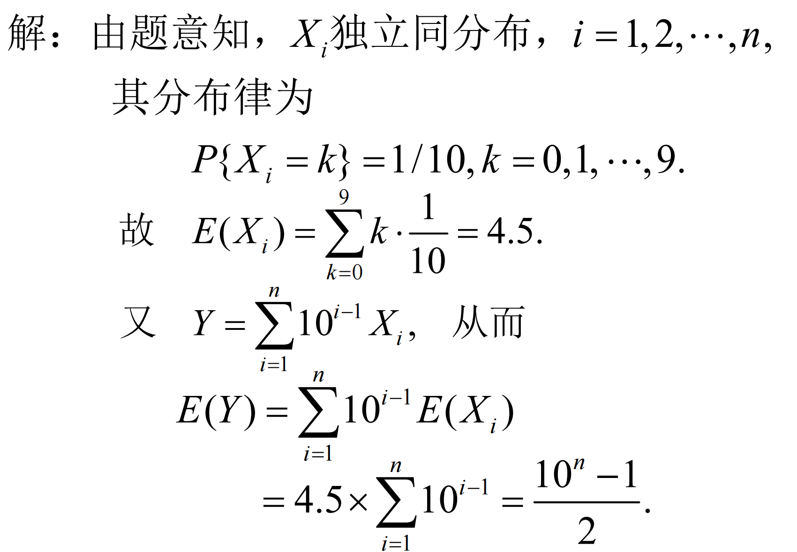
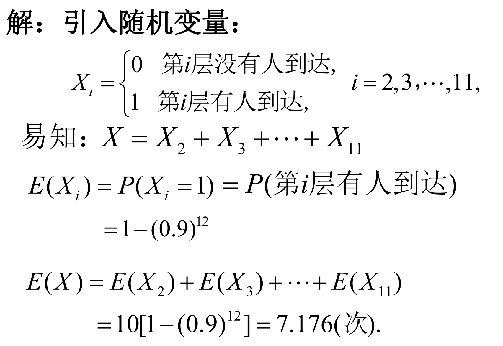
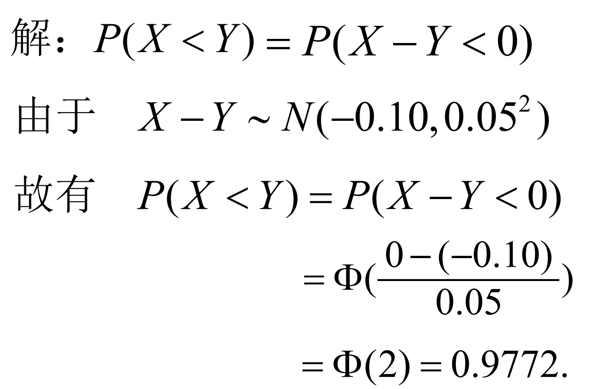
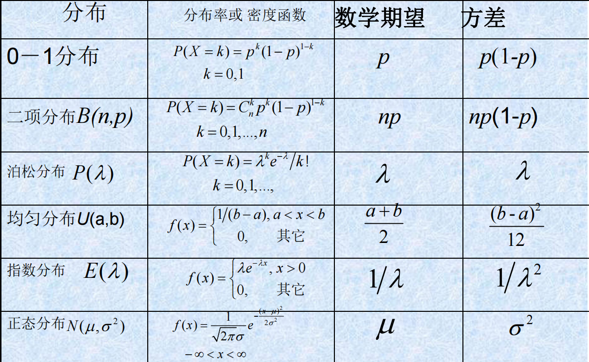
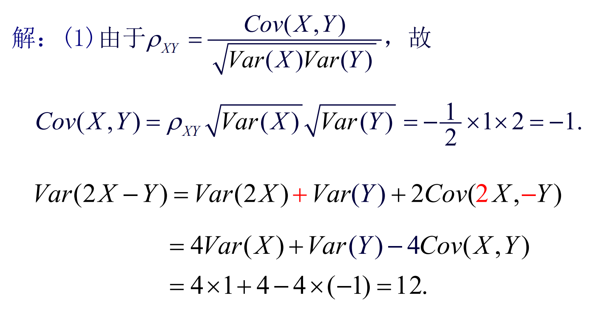
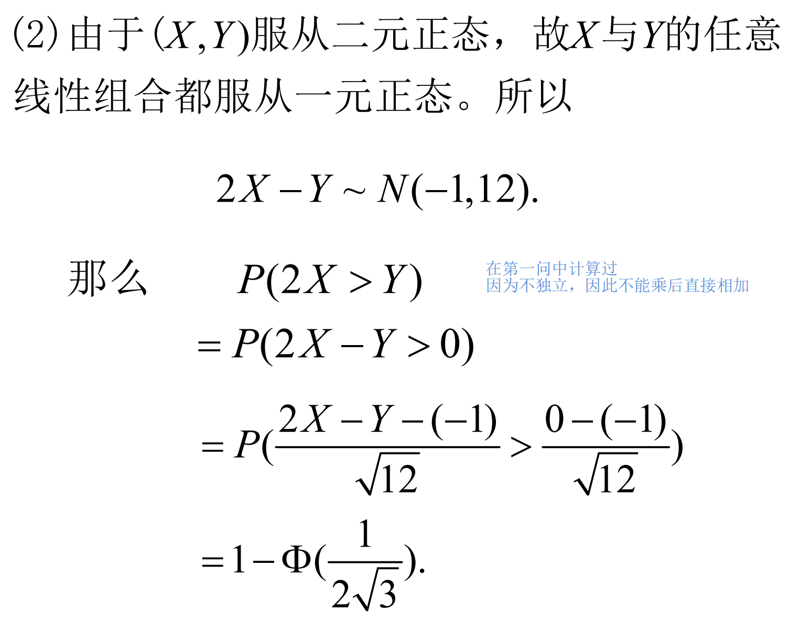
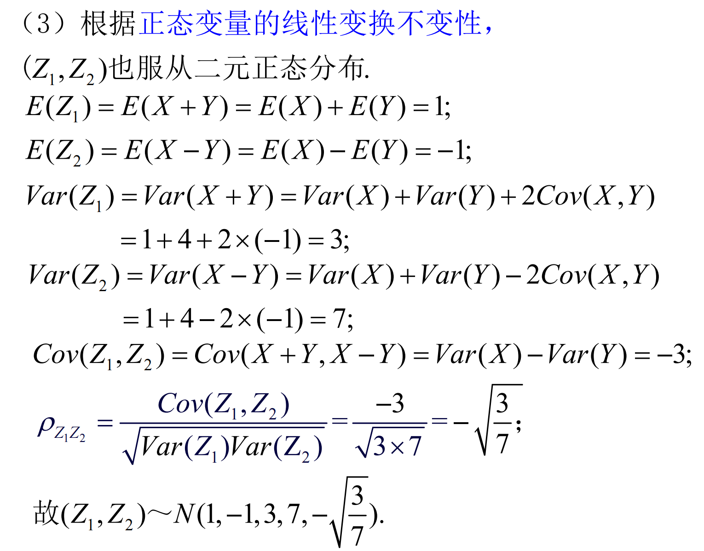

# Chapter 4 随机变量的数字特征

## 数学期望

数学期望简称**期望**，又称**均值**。

- 离散型随机变量：$E(X) = \sum\limits_{k=1}^{+\infty}x_kp_k$，且要求$\sum\limits_{k=1}^{+\infty}|x_k|p_k < \infty$
- 连续型随机变量：$E(X) = \int_{-\infty}^{+\infty} xf(x)dx$，且要求$\int_{-\infty}^{+\infty}|x|f(x)dx< \infty$
- 随机变量函数的数学期望：设 $Y$ 是随机变量 $X$ 的函数：$Y=g(X)$（$g$ 是连续函数）。
  - $X$ 是**离散型随机变量**，它的分布律为 $P(X=x_k)=p_k,k=1,2,\dots$，若 $\sum\limits_{k=1}^{+\infty}g(x_k)p_k$ 绝对收敛，则有：$E(Y)=E(g(X))=\sum\limits_{k=1}^{+\infty}g(x_k)p_k$。
  - $X$ 是**连续型随机变量**，它的概率密度为 $f(x)$，若 $\int_{−\infty}^{+\infty}g(x)f(x)dx$ 绝对收敛，则有：$E(Y)=E(g(X))=\int_{−\infty}^{+\infty}g(x)f(x)dx$。

---

### 性质

1. $C$是常数，则有$E(C)=C$

2. 设$X$是随机变量，$C$是常数，$E(CX)=CE(X)$

3. 设$X,Y$是两个随机变量，$E(X+Y) = E(X) + E(Y)$

   - 这一性质可以推广到任意有限个随机变量线性组合的情况:

     $E(c_o + \sum\limits_{i=1}^nc_iX_i) = c_o + \sum\limits_{i=1}^nc_iE(X_i)$

4. 设 $X,Y$ 是相互独立的随机变量，则 $E(X \cdot Y)=E(X) \cdot E(Y)$，但**逆命题不成立**；

   - 这一性质可以推广到任意有限个相互独立的随机变量：

     $E(\prod\limits_{i=1}^nX_i) = \prod\limits_{i=1}^nE(X_i)$

???+ question 
	计算机程序随机产生0 ~ 9中的数字. 记$X_i$为第$i$次产生的数字，$i=1, 2,\dots ,n$. 将这$n$个数依次排列，得到一数，记为$Y$,求$E(Y)$.

??? note "Answer"
	

???+ question 
	一专用电梯载着12位乘客从一层上升，最高11层.假设中途没有乘客进入，每位乘客独立等概率地到达各层.如果没有乘客到达某层楼，电梯在该层就不停.记电梯停留次数为X，求E(X). (设电梯到达11层后乘客全部下完)

??? note "Answer"
	

---

## 方差

X的**方差**：

$$D(X) = Var(X) = E\{[X-E(X)]^2\}$$

X的**标准差**或**均方差**：

$$\sigma(X) = \sqrt{Var(X)}$$

而其计算方法可以利用随机变量函数的数学期望，记$ g(X)=(X−E(X))^2$，然后计算 $E(g(X))$。

- 离散型：$Var(X)=E{[X−E(X)]^2}=\sum\limits_{i=1}^{+\infty}[x_i−E(X)]^2p_i;$
- 连续型：$Var(X)=E{[X−E(X)]^2}=\int_{−\infty}^{+\infty}[x−E(X)]^2f(x)dx;$
- 利用期望的性质，可以得到 $Var(X)=E(X^2)−E^2(X)$；

---

### 性质

1. 若 $C$ 是常数，则 $Var(C)=0$；

2. 设 $X$  是随机变量，$C$ 是常数，则 $Var(C \cdot X)= C^2\cdot Var(X)$；

3. 设$X,Y$ 是两个随机变量，则

   
$$Var(X\pm Y)=Var(X)+Var(Y) \pm 2E{[X−E(X)][Y−E(Y)]}=Var(X)+Var(Y) \pm 2Cov(X,Y);$$

   - 这一性质可以推广到任意有限个随机变量之和的情况：
   
   
$$Var(\sum_{i=1}^nX_i)=\sum_{i=1}^nVar(X_i)+2\sum_{1\le i < j \le n} Cov(X_i,X_j);$$

   - 特别地，如果 $X,Y$ 相互独立，则 $Var(X \pm Y)=Var(X)+Var(Y)$;

   - 进一步地，如果 $X_i(i=1,2,\dots,n)$ 彼此独立，则$Var(c_0+\sum\limits_{i=1}^nc_iX_i)=\sum\limits_{i=1}^nc_i^2Var(X_i);$

4. $Var(X)\le E[(X−c)^2]$，并且当且仅当 $E(X)=c$ 时等号成立；

5. $Var(X)=0 \Leftrightarrow P(X=c)=1$  and  $c=E(X);$

???+ question 
	设$X ∼N(22.40,0.03^2),Y∼ N(22.50,0.04^2)$，且$X$和$Y$相互独立，计算$P(X < Y)$

??? note "Answer"
	

---

## 常见分布的数学期望与方差

---

## 协方差与相关系数

随机变量 $X,Y$ 的**协方差** $Cov(X,Y)=E{[X−E(X)][Y−E(Y)]}=E(XY)−E(X)E(Y)$

随机变量 $X,Y$ 的**相关系数** $\rho_{XY}= \frac{Cov(X,Y)}{Var(X)Var(Y)}$

### 协方差的性质
1. $Cov(X,Y)=Cov(Y,X)$；
2. $Cov(X,Y)=E(XY)−E(X)E(Y)$；
3. $Cov(aX,bY)=ab*Cov(X,Y) \ ,a,b \in R$；
4. $Cov(X+Y,Z)=Cov(X,Z)+Cov(Y,Z)$；
5. $Cov(X,X)=Var(X)$；
6. $Cov(c,Y)=E(cY)−E(c)E(Y)=0,c \in R;$
7. $Cov(X+Y,X−Y)=Cov(X,X)−Cov(Y,Y);$
8. $Cov(X∗,Y∗)=Cov(\frac{X−E(X)}{\sqrt{Var(X)}},\frac{Y−E(Y)}{\sqrt{Var(Y)}})=\frac{Cov(X,Y)}{Var(X)Var(Y)}=\rho_{XY};$
9. $Cov(aX+bY,cX+dY)=ac \cdot Var(X)+bd \cdot Var(Y)+(ad+bc)Cov(X,Y);$

### 相关系数的性质

1. $∣\rho_{XY}∣\le 1$；

2. $∣\rho_{XY}∣=1 \Leftrightarrow \exists a,b \in R,\ s.t.\ P(Y=a+bX)=1;$

   - $\rho_{XY}=+1$时，$b>0$；
   - $\rho_{XY}=-1$时，$b<0$；

3. 上述两条性质可以合并写成：
   当 $Var(X)Var(Y) \neq 0$ 时，有 $Cov^2(X,Y) \le Var(X)Var(Y)$，其中等号当且仅当 $X$ 与 $Y$ 之间有严格的线性关系，即存在常数 $a,b$，使 $P(Y=a+bX)=1;$

相关系数 $\rho_{XY}$ 是用来表征 $ X,Y$ 之间**线性关系紧密程度**的量。此外，考虑以 $X$ 的线性函数 $a+bX$ 来近似表示 $Y$，均方误差 $e(a,b)=E{[Y−(a+bX)]^2}$ 也可以用来衡量 $X,Y$ 之间线性关系紧密程度。其中有：

$$\begin{cases}a_0 = E(Y)-b_0E(X)\\b_0=\frac{Cov(X,Y)}{Var(X)}\end{cases}$$

- $∣\rho_{XY}∣$比较大时，均方误差较小，表示 $X,Y$ 线性关系的程度好；

- $∣\rho_{XY}∣=1$ 时，均方误差为 0，表示 $X,Y$ 之间以概率 1 存在线性关系；

- $∣\rho_{XY}∣$ 比较小时，均方误差较大，表明 $X,Y$ 线性关系的程度差；

- $\rho_{XY}>0$时，$X,Y$ 正相关；

- $\rho_{XY}<0$时，$X,Y$ 负相关；

- $\rho_{XY}=0$时，称$X,Y$不相关或零相关（仅仅对于线性关系来说，与独立的含义不同）；
    - $\rho_{XY}=0$有如下等价条件：
        1. $Cov(X,Y)=0$；
        2. $E(XY)=E(X)E(Y)$；
        3. $Var(X \pm Y)=Var(X)+Var(Y)$；
    

**特别地**：

若$(X,Y)$服从二元正态分布，$X$和$Y$的相关系数$\rho_{XY} = \rho$，且可以证明**X与Y相互独立$\Leftrightarrow$X与Y不相关**

**注意区分独立性和相关性：**

- $X,Y$互相独立 $\Rightarrow X,Y$ 不相关；
- $X,Y$ 不独立 $\Leftarrow X,Y$ 相关；

---

## 其他数字特征

- X的k阶(原点)矩：$E(X^k)$
- X的k阶中心矩：$E\{[X-E(X)]^k\}$
- X和Y的k+l阶混合(原点)矩：$E\{X^kY^l\}$
- X，Y的k+l阶混合中心矩：$E\{[X-E(X)]^k[Y-E(Y)]^l\}$
- $x_\alpha$为随机变量X的上(侧)$\alpha$分位数：$P\{X > x_\alpha \} = 1 - F(x_{\alpha}) = \int_{x_{\alpha}}^{+\infty}f(x)dx = \alpha$

---

**n元随机变量X的数学期望(向量)**：

$$E(X) = (E(X_1),E(X_2),\dots,E(X_n))^T$$

**协方差矩阵**：

$$\left( \begin{array}{l} Var(X_1) & Cov(X_1,X_2) & \dots & Cov(X_1,X_n) \\ Cov(X_2,X_1) & Var(X_2) & \dots & Cov(X_2,X_n)\\ \dots & \dots & \dots & \dots \\ Cov(X_n,X_1) & Cov(X_n,X_2) & \dots & Var(X_n) \end{array}\right)$$

---

### n元正态变量具有以下四条重要性质

1. $n$维正态变量$(X1,X2,...,Xn)^T$中的任意子向量 $(X_{i_1},X_{i_2},\dots,X_{i_k})^T , \ 1 \le k \le n$也服从$k$元正态分布；

   - 特别地，每一个分量 $X_i,\ i=1,2,\dots ,n$都是正态变量；
   - 反之，若每个 $X_i$ 都是正态变量，且相互独立，则$ (X_1,X_2, \dots,X_n)$是 $n$维正态变量；

2. $n$ 维随机变量 $(X_1,X_2,\dots ,X_n)$ 服从 $n$ 维正态分布的**充要条件**是 $X_1,X_2,\dots ,X_n$ 的任意线性组合 $\sum\limits_{i=1}^nl_iX_i$ 服从一维正态分布，其中 $l_1,l_2,\dots ,l_n$不全为 $0$；

3. 若 $(X_1,X_2,\dots ,X_n)$ 服从 $n$ 维正态分布，设 $Y_1,Y_2,\dots ,Y_k$ 是 $X_i$ 的线性函数，则 $(Y_1,Y_2,\dots,Y_k)$ 也服从多维正态分布，这一性质被称为正态变量的线性变换不变性；

4. 若 $(X_1,X2,\dots ,X_n)$ 服从 $n$ 维正态分布，则 $X_1,X_2,\dots ,X_n$ 互相独立的**充要条件**是 $X_i$ 两两不相关，也等价于协方差矩阵为对角矩阵；

???+ question 
	设二元随机变量$(X,Y)$服从二元正态分布，$X∼N(0,1),Y∼N(1,4)$，X与Y的相关系数$\rho = -\frac{1}{2}$求: 

	(1)$Var(2X-Y)$；

	(2)$P(2X > Y)$；

	(3) $Z_1 = X + Y,Z_2 = X - Y$，求$(Z_1,Z_2)$的分布。

??? note "Answer"
	
	
	

---

