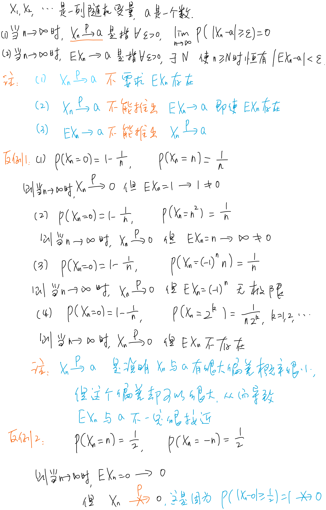

# Chapter 5 大数定律和中心极限定理

## 大数定律

### 依概率收敛

随机变量序列 $Y_1,Y_2，Y_3,\dots$ ，若存在某常数 $c$ ，使得 $\forall \epsilon > 0$ ，均有：$\mathop{lim}\limits_{n \rightarrow +\infty}P\{|Y_n - c| \ge \epsilon\} = 0$，则称$\{Y_n,n \ge 1\}$**依概率收敛**于常数$c$，记为：当$n \rightarrow +\infty$时，$Y_n \mathop{\rightarrow}\limits^P c$

**性质**：

若$X_n \mathop{\rightarrow}\limits^P a,Y_n \mathop{\rightarrow}\limits^P b,g$在$(a,b)$连续，则$g(X_n,Y_n) \mathop{\rightarrow}\limits^P g(a,b)$

**特别地**，若$X_n \mathop{\rightarrow}\limits^P a,f(x)$在点$a$连续，则当$n \rightarrow \infty$时，$f(X_n) \mathop{\rightarrow}\limits^P f(a)$

---

### 马尔可夫不等式

设随机变量$Y$的$k$阶矩存在$(k \ge 1)$，则对于任意$\epsilon > 0$，都有：

$$P\{|Y| \ge \epsilon \} \le \frac{E(|Y|^k)}{\epsilon^k}$$

成立。

定理的等价形式为：

$$P\{|Y| < \epsilon \} \ge 1 - \frac{E(|Y|^k)}{\epsilon^k}$$

---

### 切比雪夫不等式

设$X$的方差$Var(X)$存在，则对于任意$\epsilon > 0$，都有：

$$P\{|X - E(X)| \ge \epsilon \} <  \frac{Var(x)}{\epsilon^2}$$

定理的等价形式为：

$$P\{|X - E(X)| < \epsilon \} \ge 1 - \frac{Var(x)}{\epsilon^2}$$

---

### 几个大数定律

大数定律主要讨论什么条件下，随机变量序列的算术平均依概率收敛到一个稳定值。

设 $\{Y_i,i \ge 1\}$为一随机变量**序列**，若存在**常数**序列 $\{c_n,n \ge 1\}$，使得 $\forall \epsilon >0$，均有：

$$\mathop{lim}\limits_{n\rightarrow +\infty}P(|\frac{1}{n} \sum\limits_{i=1}^n Y_i - c_n| \ge \epsilon) = 0$$ 

or

$$\mathop{lim}\limits_{n\rightarrow +\infty}P(|\frac{1}{n} \sum\limits_{i=1}^n Y_i - c_n| < \epsilon) = 1$$ 

则称随机变量序列 $\{Y_i,i \ge 1\}$ 服从**弱大数定理(Weak Law of Large Numbers)**，简称服从**大数定律**。

特别地，若 $c_n$ 与 $n$ 无关，则可以写为：

$$\frac{1}{n}\sum\limits_{i=1}^nY_i\mathop{\rightarrow}\limits^Pc, n \rightarrow +\infty$$

#### 切比雪夫大数定律

设$X_1,X_2,\dots,X_n,\dots$相互独立，具有相同的数学期望$\mu$和相同的方差$\sigma^2$，则当$n \rightarrow +\infty$时，

$$\frac{1}{n}\sum\limits_{k=1}^nX_k\mathop{\rightarrow}\limits^P\mu$$

#### 辛钦大数定律

设$X_1,X_2,\dots,X_n,\dots$独立同分布，$E(X_i) = \mu$，则当$n \rightarrow +\infty$时，

$$\frac{1}{n}\sum\limits_{i=1}^nX_i\mathop{\rightarrow}\limits^P\mu$$

#### 贝努里大数定律

设$n_A$为$n$重贝努里试验中事件$A$发生的次数，并记事件$A$在每次试验中发生的概率为$p$，则有当$n \rightarrow +\infty$时

$$\mathop{lim}\limits_{n\rightarrow +\infty}P\{|\frac{n_A}{n} - p| \ge \epsilon\} = 0$$

---

## 中心极限定理

### 独立同分布的中心极限定理

设$X_1,X_2,\dots,X_n,\dots$独立同分布，$E(X_i) = \mu,Var(X_i) = \sigma^2$，则对任意实数$x$，$\mathop{lim}\limits_{n\rightarrow\infty}P(\frac{\sum\limits_{i=1}^n X_i - n\mu}{\sqrt{n}\sigma} \le x) = \int_{-\infty}^x\frac{1}{\sqrt{2\pi}}e^{-\frac{t^2}{2}}dt = \Phi(x)$

因此当$n$充分大时

- $\sum\limits_{i=1}^{n}X_i \mathop{\sim}\limits^{近似} N(n\mu,n\sigma^2)$
- $\frac{1}{n}\sum\limits_{i=1}^{n}X_i \mathop{\sim}\limits^{近似} N(\mu,\frac{\sigma^2}{n})$

### 推论(棣莫弗——拉普拉斯中心极限定理)

设$n_A$为$n$重贝努里试验中事件$A$发生的次数，$P(A) = p \ (0 < p < 1)$，则对任何实数$x$，有：

$\mathop{lim}\limits_{n\rightarrow\infty}P(\frac{n_A-np}{\sqrt{np(1-p)}} \le x) = \int_{-\infty}^x\frac{1}{\sqrt{2\pi}}e^{-\frac{t^2}{2}}dt = \Phi(x)$

即，当$n$充分大时$B(n,p) \mathop{\sim}\limits^{近似} N(np,np(1-p))$

---

!!! note "依概率收敛与均值之间的关系补充"
    

---

