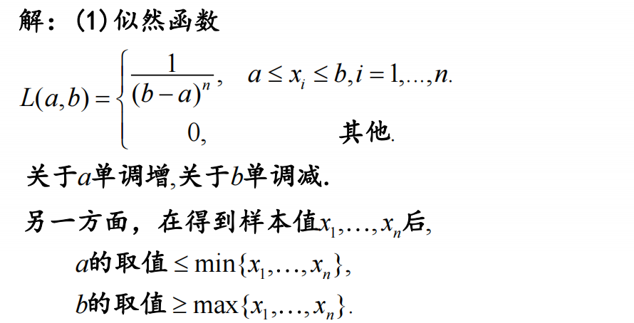

# Chapter 7 参数估计

设总体 $X$ 有未知参数 $\theta$ , $X_1,\dots,X_n$ 是 $X$ 的简单随机样本。

**点估计问题**：构造合适的统计量 $\hat{\theta}=\hat{\theta}(X_1,\dots,X_n)$ 用来估计未知参数 $\theta$ ，称 $\hat{\theta}$ 为 $\theta$ 的**点估计量**。

当给定样本观察值 $x_1,\dots,x_n$ 时，$\hat{\theta}(x_1,\dots,x_n)$ 为 $\theta$ 的**点估计值**。

## 矩估计法

**统计思想**：用样本矩估计总体矩，用样本矩的函数估计总体矩的函数。

**理论依据**：辛钦大数定律和依概率收敛的性质。

假设 $\mu_j = E(X^j)$ 存在， $j=1,\dots,k$ ，则

$$\hat{\mu}_j = A_j =\frac{1}{n}\sum_{i=1}^n X_i^j, j=1,\dots,k$$

$$\hat{h}(\mu_1,\dots,\mu_k) = h(A_1,\dots,A_k)$$

设总体有 $k$ 个未知参数 $\theta_1,\dots,\theta_k$ ， $X_1,\dots,X_n$ 是来自总体的样本，假设总体的前 $k$ 阶矩存在，矩估计的步骤如下：

1. 建立 $(\theta_1,\dots,\theta_k)$ 与 $(\mu_1,\dots,\mu_k)$ 之间的联系，求总体前 $k$ 阶矩关于 $k$ 个参数的函数， $\mu_j = E(X^i) = h_i(\theta_1,\dots,\theta_k) , i=1,\dots,k$
2. 求各参数关于 $k$ 阶矩的反函数， $\theta_i = g_i(\mu_1,\dots,\mu_k) , i=1,\dots,k$
3. 以样本各阶矩 $A_1,\dots,A_k$ 代替总体各阶矩 $\mu_1,\dots,\mu_k$ ，得到参数的矩估计

$$\hat{\theta}_i = g_i(A_1,\dots,A_k) , i=1,\dots,k$$

???+ question
    现随机选出100名学生,计算得他们的平均成绩为72.3分,标准差为15.8分.试估计全部学生的平均成绩.

??? note "Answer"
    $$\begin{cases}\mu_1 = E(X) = \mu \\ \mu_2 = E(X^2) = \mu^2 + \sigma^2 \end{cases} \Rightarrow \begin{cases}\mu = \mu_1 \\ \sigma = \sqrt{\mu_2 - \mu_1^2} \end{cases}$$

    $$\Rightarrow \begin{cases}\hat{\mu} = 72.3 \\ \hat{\sigma} = \sqrt{A_2 - \overline{X}^2} = \sqrt{B_2} = \sqrt{\frac{99}{100} \times 15.8^2} = 15.7 \end{cases}$$

???+ question
    设总体 $X \sim B(1,p)$ ， $X_1,\dots,X_n$ 是样本，求 $p$ 的矩估计量. (Something like 标记重捕法)

??? note "Answer"
    $$\mu = E(X) = p$$

    $$\hat{p} = \overline{X} = \frac{1}{n} \sum_{i=1}^n X_i$$

???+ question
    设总体的密度为: $f(x;\theta) = \begin{cases} \sqrt{\theta}x^{\sqrt{\theta}-1},&0 \le x \le 1 \\ 0, & \text{otherwise}\end{cases} , \theta > 0$ 未知，其中 $X_1,\dots,X_n$ 为样本，求 $\theta$ 的矩估计量.

    若已获得 $n = 10$ 的样本值如下,
    
    0.43  0.01  0.30  0.04  0.54
    
    0.14  0.99  0.18  0.98  0.02
    
    求 $\theta$ 的矩估计值.

??? note "Answer"
    (1)
    
    $$\mu = E(X) = \int_0^1 x \sqrt{\theta} x^{\sqrt{\theta}-1} dx = \frac{\sqrt{\theta}}{\sqrt{\theta}+1}$$
    
    $$\theta = (\frac{\mu_1}{1 - \mu_1})^2$$
    
    $$\hat{\theta} = (\frac{\overline{X}}{1-\overline{X}})^2$$
    
    (2)
    
    $$\overline{X} = \frac{1}{10} \sum\limits_{i=1}^{10} X_i = 0.363$$
    
    $$\hat{\theta} = (\frac{0.363}{1-0.363})^2 = 0.325$$

???+ question
    设总体 $X$ 服从均匀分布 $U(a,b)$ ，其中 $a,b$ 为未知参数， $X_1,\dots,X_n$ 为样本，求 $a,b$ 的矩估计量.

??? note "Answer"
    (1)求矩关于参数的函数

    $$\mu_1 = E(X) = \frac{a+b}{2}$$
    
    $$Var_2 = \frac{(b-a)^2}{12}$$
    
    (2)求参数关于矩的反函数
    
    $$a = \mu_1 - \sqrt{3Var_2}$$
    
    $$b = \mu_1 + \sqrt{3Var_2}$$
    
    (3)以样本矩 $A_1 = \overline{X}$ 代替总体矩 $\mu_1$ ， $B_2 = \frac{1}{n}\sum\limits_{i=1}^{n}(X_i - \overline{X})^2$ 代替总体方差 $Var_2$ ，得到参数的矩估计量
    
    $$\hat{a} = \overline{X} - \sqrt{3B_2}$$
    
    $$\hat{b} = \overline{X} + \sqrt{3B_2}$$

---

## 极大似然估计

**思想**:用“最像” $\theta$ 真值的值去估计 $\theta$ 换言之，在参数空间中找一个 $\theta$ 使得 $L(\theta)$ 达到最大。

---

设**离散型**总体 $X \sim p(x;\theta)$ ，$\theta \in \Theta$ , $\theta$ 未知. $X_1,\dots,X_n$ 为样本，其观察值为 $x_1,\dots,x_n$ ，则事件 $\{X_1 = x_1 , \dots , X_n = x_n\}$ 发生的概率为 

似然函数 ： $L(\theta) = \prod\limits_{i=1}^{n} p(x_i;\theta)$ 

极大似然原理 ： $L(\hat{\theta}(x_1,\dots,x_n)) = \max\limits_{\theta \in \Theta} L(\theta)$

称 $\hat{\theta}(x_1,\dots,x_n)$ 为 $\theta$ 的极大似然估计值，相应统计量 $\hat{\theta} = \hat{\theta}(X_1,\dots,X_n)$ 为 $\theta$ 的极大似然估计量(MLE).

---

**连续型**总体 $X$ 概率密度为 $f(x;\theta)$ ，$\theta \in \Theta$ ，$\theta$ 未知. $X_1,\dots,X_n$ 为样本，其观察值为 $(x_1,\dots,x_n)$ 邻域发生的概率为

$\prod\limits_{i=1}^{n} P(x_i < X_i < x_i + \Delta x_i) \approx \prod\limits_{i=1}^{n} f(x_i;\theta) \Delta x_i$ , $\Delta x_i$ 与参数 $\theta$ 无关.

因此，似然函数取为 $L(\theta) = \prod\limits_{i=1}^{n} f(x_i;\theta)$

---

极大似然原理 ： $L(\hat{\theta}(x_1,\dots,x_n)) = \max\limits_{\theta \in \Theta} L(\theta)$

???+ question
    设总体 $X$ 的概率分布律为:
    
    $$ \left(\begin{array}{cc}1&2&3\\ \theta & \frac{\theta}{2} & 1-\frac{3\theta}{2}\end{array}\right)$$
    
    其中 $0 < \theta < \frac{2}{3}$ ，现得到样本观测值 2，3，2，1，3，求 $\theta$ 的矩估计值与极大似然估计值.

??? note "Answer"
    (1)矩估计:

    $$\mu_1 = E(X) = 3 - \frac{5\theta}{2}$$
    
    $$\hat{\theta} = \frac{2(3 - \mu_1)}{5}$$
    
    $$\overline{X} = 2.2 \Rightarrow \hat{\theta} = 0.32$$
    
    (2)极大似然估计:
    
    $$L(\theta) = (\frac{\theta}{2}) \cdot (1 - \frac{3\theta}{2}) \cdot (\frac{\theta}{2}) \cdot \theta \cdot (1-\frac{3\theta}{2}) = \frac{1}{16} \theta^3 (2 - 3 \theta)^2$$
    
    可以直接求导或是取 $lnL(\theta)$ 求导，得到 $\hat{\theta} = 0.4$ .

---

- 说明：

    1. 未知参数可能不是一个,设为 $\theta = (\theta_1,\dots,\theta_k)$ ;

    2. 求 $L(\theta)$ 的最大值时，可转换为求 $\ln L(\theta)$ 的最大值, $\ln L(\theta)$ 称为对数似然函数.

    通常利用 $\frac{\partial \ln L(\theta)}{\partial \theta} = 0,i = 1,2,\dots,k$ 解得 $\hat{\theta_i}, i = 1,2,\dots,k$ 

    3. 若 $L(\theta)$ 关于某个 $\theta_i$ 是单调的，则 $\theta_i$ 的极大似然估计在其边界取得；

    4. 若 $\hat{\theta}$ 是 $\theta$ 的极大似然估计，则 $g(\theta)$ 的极大似然估计为 $g(\hat{\theta})$ .

???+ question
    设总体的密度为: $f(x;\theta) = \begin{cases} \sqrt{\theta}x^{\sqrt{\theta}-1},&0 \le x \le 1 \\ 0, & \text{otherwise}\end{cases} , \theta > 0$ 未知，其中 $X_1,\dots,X_n$ 为样本，求 $\theta$ 的极大似然估计值.

    若已获得 $n = 10$ 的样本值如下,
    
    0.43  0.01  0.30  0.04  0.54
    
    0.14  0.99  0.18  0.98  0.02
    
    求 $\theta$ 的极大似然估计值

??? note "Answer"
    $$L(\theta) = \prod_{i=1}^{n} f(x_i;\theta) = \theta^{\frac{n}{2}} (\prod\limits_{i=1}^{n} x_i)^{\sqrt{\theta}-1}$$

    $$\frac{\partial \ln L(\theta)}{\partial \theta} = \frac{n}{2} \cdot \frac{1}{\theta} + \frac{1}{2\sqrt{\theta}} \sum\limits_{i=1}^{n} \ln x_i = 0$$
    
    $$\Rightarrow \frac{n}{\sqrt{\theta}} = - \sum\limits_{i=1}^{n} \ln x_i$$
    
    $\theta$ 的极大似然估计量： $\hat{\theta} = \frac{n^2}{(\sum\limits_{i=1}^{n} \ln x_i)^2}$
    
    代入 $n = 10$ 的样本值，得 $\hat{\theta} = 0.305$ .

???+ question
    设总体 $X \sim N(\mu,\sigma^2)$ ，其中 $\mu$ 和 $\sigma^2$ 均未知，$X_1,\dots,X_n$ 为样本，求 $\mu$ 和 $\sigma^2$ 的极大似然估计值.

??? note "Answer"
    过程省略，这里直接给出结果。

    $$\hat{\mu} = \overline{X}$$
    
    $$\hat{\sigma}^2 = B_2$$

???+ question
    设总体 $X$ 服从均匀分布 $U(0,\theta)$ ，其中 $\theta$ 未知，$X_1,\dots,X_n$ 为样本，求 $\theta$ 的矩估计和极大似然估计值.

??? note "Answer"
    (1) 矩估计

    $$E(X) = \frac{\theta}{2}$$
    
    $$\hat{\theta} = 2\overline{X}$$
    
    (2) 极大似然估计
    
    当 $0 \le x_1, \dots, x_n \le \theta$ 时，似然函数为
    
    $$L(\theta) = \prod_{i=1}^{n} \frac{1}{\theta} = \frac{1}{\theta^n}$$
    
    可以发现关于 $\theta>0$ 的似然函数是单调递减的
    
    而 $\theta$ 的取值范围是 $\theta = \max\{x_1,\dots,x_n\}$
    
    $$\therefore \hat{\theta} = \max\{X_1,\dots,X_n\}$$

???+ question
    设总体 $X$ 服从均匀分布 $U(a,b)$ ，其中 $a$ 和 $b$ 均未知，$X_1,\dots,X_n$ 为样本
    
    (1)求 $a$ 和 $b$ 的极大似然估计.
    
    (2)求 $E(X)$ 的极大似然估计.
    
    (3)若已获得 $n = 5$ 的样本值如下，
    
    0.34  0.59  0.16  0.96  0.84
    
    求 $a$ , $b$ , $E(X)$ 的极大似然估计值.

??? note "Answer"
    
    

---

## 估计量的评价准则

### 四条评价准则：
1. 无偏性准则

2. 有效性准则

3. 均方误差准则

4. 相合性准则

### 定义

若参数 $\theta$ 的估计量 $\hat{\theta} = \hat{\theta}(X_1,X_2,\cdots,X_n)$ 满足 $E(\hat{\theta}) = \theta$ ，则称 $\hat{\theta}$ 为 $\theta$ 的无偏估计量.

若 $E(\hat{\theta}) \neq \theta$ ，那么 $E(\hat{\theta}) - \theta$ 称为估计量 $\hat{\theta}$ 的偏差.

若 $\mathop{lim}\limits_{n \to \infty} E(\hat{\theta}) = \theta$ ，则称 $\hat{\theta}$ 为 $\theta$ 的渐进无偏估计量.

---

- 无偏性的统计意义是指在**大量重复**试验下，由 $\hat{\theta}(X_1,\cdots.X_n)$ 所作的估计值的**平均恰是** $\theta$ ，从而无偏性保证了 $\hat{\theta}$ **没有系统误差**.

???+ question
    设总体 $X$ 的一阶和二阶矩存在， $E(X) = \mu$ , $D(X) = \sigma^2$ 

    (1)证明： 样本均值 $\overline{X}$ 和样本方差 $S^2$ 分别是 $\mu$ 和 $\sigma^2$ 的无偏估计.

    (2)判断： $B_2$ 是否为 $\sigma^2$ 的无偏估计？是否为 $\sigma^2$ 的渐进无偏估计？

??? note "Answer"
    (1) 因为 $X_1,\cdots,X_n$ 与 $X$ 同分布，所以

    $$E(\overline{X}) = E\left(\frac{1}{n}\sum\limits_{i=1}^n X_i\right) = \frac{1}{n}\sum\limits_{i=1}^n E(X_i) = \mu$$

    故 $\overline{X}$ 是 $\mu$ 的无偏估计.

    $$E(S^2) = E\left(\frac{1}{n-1}\sum\limits_{i=1}^n (X_i - \overline{X})^2\right) = \frac{1}{n-1}\sum\limits_{i=1}^n E((X_i - \overline{X})^2) = \sigma^2$$

    故 $S^2$ 是 $\sigma^2$ 的无偏估计.

    (2) 

    $$B_2 = \frac{n-1}{n}S^2$$

    $$E(B_2) = \frac{n-1}{n}E(S^2) = \frac{n-1}{n}\sigma^2 \neq \sigma^2$$

    故 $B_2$ 不是 $\sigma^2$ 的无偏估计.

    $$\mathop{lim}\limits_{n \to \infty} E(B_2) = \mathop{lim}\limits_{n \to \infty} \frac{n-1}{n}\sigma^2 = \sigma^2$$

    故 $B_2$ 是 $\sigma^2$ 的渐进无偏估计.

???+ question
    设总体 $X$ 服从均匀分布 $U(0,\theta)$ ， $X_1,\cdots,X_n$ 是来自 $X$ 的样本，$\theta$ 是未知参数

    (1)求 $\theta$ 的矩估计，判断是否无偏

    (2)求 $\theta$ 的最大似然估计，判断是否无偏

??? note "Answer"
    (1) 矩估计

    $$\mu_1 = E(X) = \frac{\theta}{2}$$

    $$\Rightarrow \theta = 2 \mu_1 \Rightarrow \hat{\theta} = 2\overline{X}$$

    $$E(\hat{\theta}) = E(2\overline{X}) = 2E(\overline{X}) = 2\mu = 2\cdot\frac{\theta}{2} = \theta$$

    故 $\hat{\theta}$ 是 $\theta$ 的无偏估计.

    (2) 最大似然估计

    $$L(\theta) = \prod\limits_{i=1}^n \frac{1}{\theta}I(0 < X_i < \theta)$$

    $$\hat{\theta_L} = X_{(n)} = max\{X_1,\cdots,X_n\}$$

    $$F_{X_{(n)}}(x) = [F_X(x)]^n = \begin{cases} 0, & x < 0 \\ (\frac{x}{\theta})^n, & 0 \leq x \leq \theta \\ 1, & x > \theta \end{cases}$$

    $$f_{X_{(n)}}(x) = \begin{cases} n\frac{x^{n-1}}{\theta^n}^n ,& 0 \leq x \leq \theta \\ 0, & x < 0, x > \theta \end{cases}$$

    $$E(\hat{\theta_L}) = E(X_{(n)}) = \int_0^\theta x f_{X_{(n)}}(x) dx = \int_0^\theta \frac{n}{\theta^n} x^{n} dx = \frac{n}{n+1}\theta \neq \theta$$

    故 $\hat{\theta_L = X_{(n)}}$ 是有偏的.

---

### 纠偏方法

如果 $E(\hat{\theta})  = a \theta + b$， $\theta \in \Theta$ ， 其中 $a,b$ 是常数，且 $a \neq 0$，则 $\frac{1}{a}(\hat{\theta} - b)$ 是 $\theta$ 的无偏估计.

---

## 有效性与均方误差

### 有效性准则

**定义**： 设 $\hat{\theta}_1,\hat{\theta}_2$ 是参数 $\theta$ 的两个无偏估计，若 $D(\hat{\theta}_1) \leq D(\hat{\theta}_2)$ ，对一切 $\theta \in \Theta$ 成立，且不等号至少对某一 $\theta \in \Theta$ 成立，则称 $\hat{\theta}_1$ 比 $\hat{\theta}_2$ 有效.

也即：**方差较小的无偏估计量是一个更有效的估计量。**

???+ question
    设总体为 $X$ , $E(X) = \mu$，$D(X) = \sigma^2$， $X_1,\cdots,X_n$ 是样本，对 $1 \le k \le n$ , $\hat{\theta}_k = \frac{1}{k} \sum\limits_{i=1}^k X_i$ ，为前 $k$ 个样本的样本均值，则 $\hat{\theta}_k$ 是 $\mu$ 的无偏估计.判断 $\hat{\theta}_1,\hat{\theta}_2,\dots, \hat{\theta}_n$ 中哪个最有效？

??? note "Answer"
    $$D(\hat{\theta}_k) = \frac{1}{k^2} D(\sum\limits_{i=1}^k X_i) = \frac{\sigma^2}{k}$$

    随着 $k$ 的增大，$D(\hat{\theta}_k)$ 越来越小，故 $\hat{\theta}_n$ 最有效.

???+ question
    设总体 $X \sim U[0,\theta]$，$X_1,\cdots,X_n$ 是样本，已知 $\theta$ 的两个无偏估计为 $\hat{\theta}_1 = 2\overline{X}, \hat{\theta}_2 = \frac{n+1}{n}X_{(n)}$，判断哪个更有效？

??? note "Answer"
    $$D(\hat{\theta}_1) = D(2\overline{X}) = \frac{4}{n} \cdot \frac{\theta^2}{12} = \frac{\theta^2}{3n}$$

    $$f_{X_{(n)}}(x) = \frac{n}{\theta^n} x^{n-1} ,0<x<\theta$$

    $$E(X_{(n)}^2) = \int_0^\theta \frac{nx^{n+1}}{\theta^n} dx = \frac{n}{n+2} \theta^2$$

    

    $$D(X_{(n)}) = E(X_{(n)}^2) - [E(X_{(n)})]^2 = \frac{n}{n+2} \theta^2 - \left(\frac{n+1}{n}\theta\right)^2 = \frac{\theta^2}{n(n+2)}$$

    $$D(\hat{\theta}_1) > D(\hat{\theta}_2)$$

    $$\therefore \hat{\theta}_2 \text{更有效.}$$

---

### 均方误差准则

**定义** ：

设 $\hat{\theta}$ 是 $\theta$ 的点估计，方差存在，则称 $E(\hat{\theta} - \theta)^2$ 为估计量 $\hat{\theta}$ 的均方误差（Mean Square Error，MSE），记为 $Mse(\hat{\theta})$.

若 $\hat{\theta}$ 是 $\theta$ 的无偏估计，则 $Mse(\hat{\theta}) = D(\hat{\theta})$.

!!! Info
    在实际应用中,均方误差准则比无偏性准则更重要.

???+ question
    利用均方误差准则，对用样本方差 $S^2$ 和样本二阶中心矩 $B_2$ 分别估计正态总体方差 $\sigma^2$ 时进行评价.

??? note "Answer"
    在正态总体下，

    $$\frac{(n-1)S^2}{\sigma^2} \sim \chi^2(n-1)$$

    又因为 $S^2$ 是 $\sigma^2$ 的无偏估计，所以 
    
    $$Mse(S^2) = D(S^2) = \frac{2\sigma^4}{n-1}$$

    而对于 $B_2$，有

    $$Mse(B_2) = E[(B_2 - \sigma^2)^2] = D(B_2 - \sigma^2) + [E(B_2) - \sigma^2]^2 = D(B_2) + [E(B_2) - \sigma^2]^2$$

    $$= D(\frac{n-1}{n}S^2) + [E(\frac{n-1}{n}S^2) - \sigma^2]^2 = \frac{2n-1}{n^2} \sigma^4$$

    当 $n > 1$ 时有 $Mse(S^2) > Mse(B_2)$

    因此在均方误差准则下， $B_2$ 优于 $S^2$.

---

**Conclusion** ：在正态分布下，$D(S^2) = \frac{2\sigma^4}{n-1}$

??? note "证明"
    $$\frac{(n-1)S^2}{\sigma^2} \sim \chi^2(n-1)$$

    $$D(\frac{(n-1)S^2}{\sigma^2}) = 2(n-1)$$

    $$\therefore D(S^2) = \frac{2\sigma^4}{n-1}$$

---

## 相合性

### 相合性准则

**定义**：设 $\hat{\theta}(X_1,\cdots,X_n)$ 为参数 $\theta$ 的估计量，若对于任意 $\theta \in \Theta$，当 $n \rightarrow +\infty$ 时

$$\hat{\theta_n} \mathop{\rightarrow}\limits^p \theta$$

即 $\forall \varepsilon > 0$，有 $\mathop{lim}\limits_{n \rightarrow +\infty} P(|\hat{\theta_n} - \theta| \ge \varepsilon) = 0$，则称 $\hat{\theta_n}$ 为 $\theta$ 的**相合估计量**或**一致估计量**.

---

- **一致性** 随着样本容量的增大，估计量越来越接近被估计的总体参数

$A_1,\dots,A_k$ 是 $\mu_1,\dots,\mu_k$ 的相合估计,即 $A_i \mathop{\rightarrow}\limits^p \mu_i$ ，且 $g(\mu_1,\dots,\mu_k)$ 是连续函数，则

$$g(A_1,\dots,A_k) \mathop{\rightarrow}\limits^p g(\mu_1,\dots,\mu_k)$$

即 $g(A_1,\dots,A_k)$ 也是 $g(\mu_1,\dots,\mu_k)$ 的相合估计.

???+ question
    设总体 $X$ 的 $k$ 阶矩 $E(X^k) = \mu_k(k \ge 2)$ 存在， $X_1,\cdots,X_n$ 是来自 $X$ 的样本，证明：

    (1)$A_l = \frac{1}{n}\sum\limits_{i=1}^n X_i^l$ 是 $\mu_l$ 的相合估计， $l = 1,\cdots,k$

    (2) $B_2,S^2$ 是 $D(X) = \sigma^2$ 的相合估计

    (3) $S$ 是 $\sigma$ 的相合估计

??? note "Answer"
    (1) 由辛钦大数定律知，对 $l = 1,\cdots,k$，有

    $$A_l = \frac{1}{n}\sum\limits_{i=1}^n X_i^l \mathop{\rightarrow}\limits^p \mu_l = E(X^l)$$

    (2)

    由强大数定律， $\overline{X}$ 和 $A_2$ 分别一致收敛于 $\mu_1$ 和 $\mu_2$

    $$B_2 = \frac{1}{n}\sum\limits_{i=1}^n (X_i - \overline{X})^2 = A_2 - \overline{X}^2$$

    $\therefore B_2,S^2$ 是 $\sigma^2$ 的相合估计

    (3)

    $S = \sqrt{S^2}$ 是 $\sigma$ 的相合估计

???+ question
    设总体 $X \sim U[0,\theta]$， $X_1,\cdots,X_n$ 是来自 $X$ 的样本，证明 $\hat{\theta_1} = 2\overline{X}$ 和 $\hat{\theta_2} = \frac{n+1}{n}\overline{X}$ 都是 $\theta$ 的相合估计

??? note "Answer"
    $$\hat{\theta_1} = 2\overline{X} = \mathop{\rightarrow}\limits^p 2E(X) = \theta$$

    $\therefore \hat{\theta_1}$ 是 $\theta$ 的相合估计

    $$E(\hat{\theta_2}) = \theta,D(\hat{\theta_2}) = \frac{\theta^2}{n(n+2)}$$

    (关于 $D(\hat{\theta_2})$ 已在前文证明过，如果忘记了可以移步[这里](#D2))

    由切比雪夫不等式， $\forall \varepsilon > 0$， 当 $n \to \infty$ 时，有

    $$P(|\hat{\theta_2} - \theta| \geq \varepsilon) \leq \frac{D(\hat{\theta_2})}{\varepsilon^2}  = \frac{\theta^2}{n(n+2)\varepsilon^2} \to 0$$

    所以 $\hat{\theta_2}$ 也是 $\theta$ 的相合估计

---

## 置信区间, 置信限

设 $X$ 是总体， $X_1,\cdots,X_n$ 是来自 $X$ 的样本， 区间估计的目的是找到两个统计量：

$$\hat{\theta_1} = \theta_1(X_1,\cdots,X_n),\hat{\theta_2} = \theta_2(X_1,\cdots,X_n)$$

使**随机区间** $(\hat{\theta_1},\hat{\theta_2})$ 以一定可靠程度盖住 $\theta$

---

### 定义1

设总体 $X$ 的分布函数 $F(x;\theta)$  $\theta$ 未知，对给定值 $\alpha$ ( $0 < \alpha < 1$ )，有两个统计量 $\theta_L = \theta_L(X_1,\cdots,X_n)$ 和 $\theta_U = \theta_U(X_1,\cdots,X_n)$，使得

$$P(\theta_L(X_1,\cdots,X_n)) < \theta < \theta_U(X_1,\cdots,X_n) \ge 1 - \alpha$$

称 $(\theta_L,\theta_U)$ 为 $\theta$ 的置信水平为 $1-\alpha$ 的双侧置信区间， $\theta_L$ 和 $\theta_U$ 分别称为双侧置信下限和双侧置信上限.

---

**说明：**

1. $\theta$ 是**确定**的值，未知。

2. $\theta_L$ 和 $\theta_U$ 是统计量，**随机**的，依赖于样本.

3. 置信区间 $(\theta_L,\theta_U)$ 是随机的，依赖于样本。样本不同，算出的区间也可能不同。

4. 对于有些样本观察值,区间覆盖 $\theta$ ，但对于于另一些样本观察值,区间则不能覆盖 $\theta$ .

???+ example
    设总体 $X \sim N(\mu,4)$ , $\mu$ 未知， $X_1,\cdots,X_4$ 是样本，则 $\overline{X} \sim N(\mu,1)$

    $$P(\overline{X} - 2 < \mu < \overline{X} + 2) = P(|\overline{X} - \mu| < 2) = 2 \Phi(2) - 1 = 0.9544$$

    $\Rightarrow (\overline{X} - 2,\overline{X} + 2)$ 是 $\mu$ 的置信水平为 $0.95$ 的置信区间

---

如果 $P\{\hat{\theta_L}(X_1,\dots,X_n) < \theta < \hat{\theta_U}(X_1,\dots,X_n)\} = 1 - \alpha$，则置信区间 $(\hat{\theta_L},\hat{\theta_U})$ 的含义为：

反复抽样多次(各次样本容量都为 n ).每个样本值确定一个区间 $(\hat{\theta_L},\hat{\theta_U})$ .每个这样的区间或包含 $\theta$ 的真值，或不包含 $\theta$ 的真值. 按照伯努利大数定律，在这些区间中，包含 $\theta$ 真值的比例约为 $1-\alpha$.

---

### 定义二

如果 $P\{\hat{\theta_L}(X_1,\dots,X_n) < \theta \} \ge 1 - \alpha$ ，则称 $\hat{\theta_L}$ 是参数为 $\theta$ 的置信水平为 $1-\alpha$ 的单侧置信下限.

如果 $P\{\theta < \hat{\theta_U}(X_1,\dots,X_n)\} \ge 1 - \alpha$ ，则称 $\hat{\theta_U}$ 是参数为 $\theta$ 的置信水平为 $1-\alpha$ 的单侧置信上限.

---

**单侧置信限和双侧置信区间的关系**

设 $\theta_L$ 是 $\theta$ 的置信水平为 $1-\alpha_1$ 的单侧置信下限， $\theta_U$ 是 $\theta$ 的置信水平为 $1-\alpha_2$ 的单侧置信上限，则 $(\theta_L,\theta_U)$ 是 $\theta$ 的置信水平为 $1-\alpha_1-\alpha_2$ 的双侧置信区间.

---

### 定义三

称置信区间 $[\hat{\theta_L},\hat{\theta_U}]$ 的平均长度 $E(\hat{\theta_U} - \hat{\theta_L})$ 为区间的**精确度**，精确度的一半为**误差限**。

- 在给定的样本容量下,置信水平和精确度是相互制的。

---

### Neyman原则

在置信水平达到 $1-\alpha$ 的置信区间中，选精确度尽可能高的置信区间.