# Mermaid

## 流程图

流程图由节点（几何形状）和边（箭头或线条）组成。

!!! warning
    1. 如果你在流程图节点中使用单词 "end"，请将整个单词或任何字母大写（例如，"End" 或 "END"）。输入全部小写字母的 "end" 将破坏流程图。

    2. 如果你使用字母 "o" 或 "x" 作为连接流程图节点的首字母，请在字母前添加空格或将字母大写（例如，"dev--- ops"、"dev---Ops"）。输入 "A---oB" 将创建 circle edge。输入 "A---xB" 将创建 cross edge。

---

### basics

- 一个节点

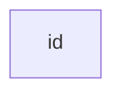

- 带有文本的节点

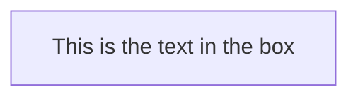

- 使用 " 将 unicode 文本括起来。

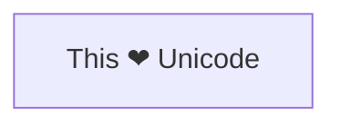

- 使用双引号和反引号 "text" 将 Markdown 文本括起来。

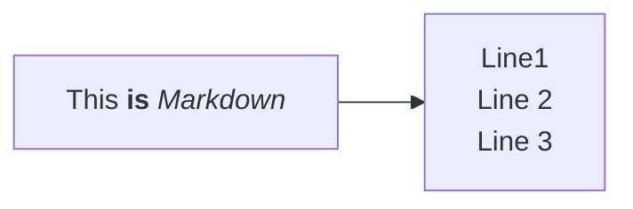

---

### 方向

可能的流程图方向是：

- `TB` - 从上到下
- `TD` - 自上而下/与从上到下相同
- `BT` - 从下到上
- `RL` - 从右到左
- `LR` - 从左到右

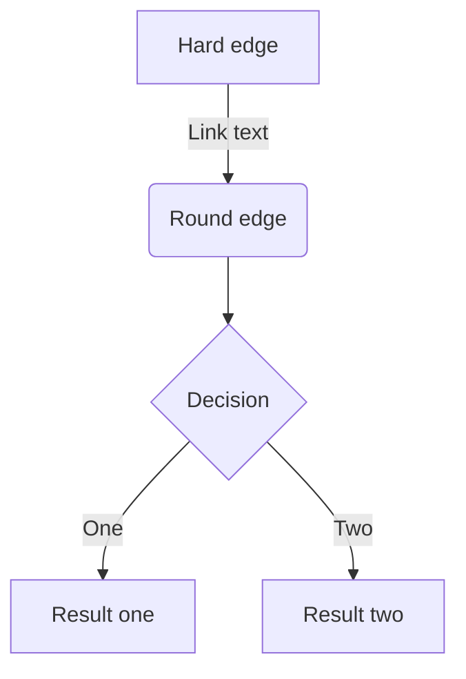

---

### 节点形状

- 具有圆边的节点

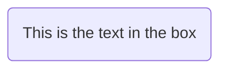

- 一个 stadium-shaped 的节点

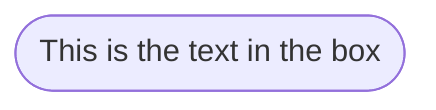

- A node in a subroutine shape

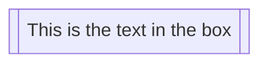

- 圆柱形节点

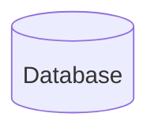

- 一个圆形的节点

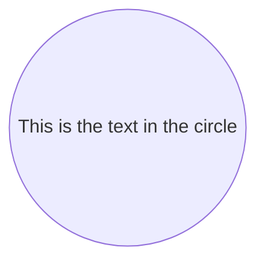

- 形状不对称的节点

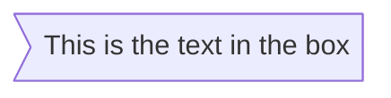

!!! info
    目前只有上面的形状是可能的，而不是它的镜像。这可能会随着未来的版本而改变。

- 节点（菱形）

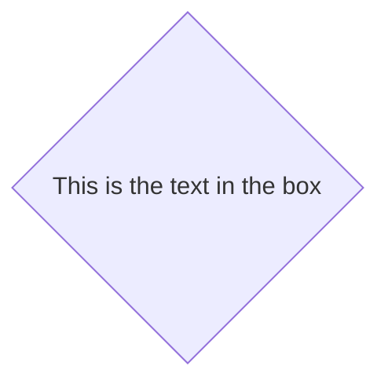

- 六边形节点

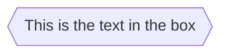

- 平行四边形

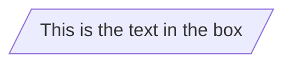

- 平行四边形（镜像）

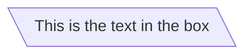

- 梯形

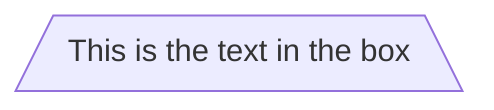

- 梯形（倒置）

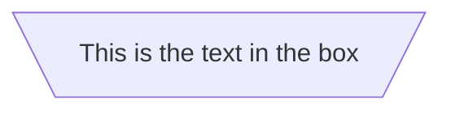

- 双圈

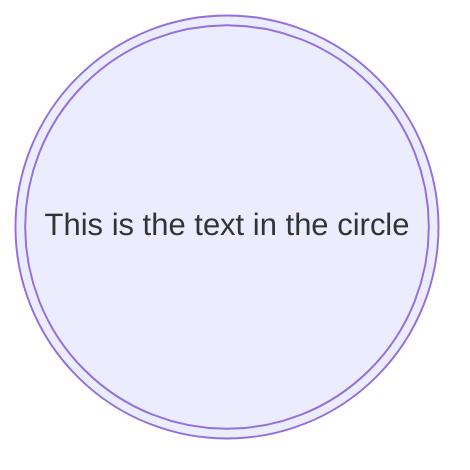

- [一些其他节点&特殊形状](https://mermaid.nodejs.cn/syntax/flowchart.html#expanded-node-shapes-in-mermaid-flowcharts-v1130)

---

### 节点之间的链接

- 箭头

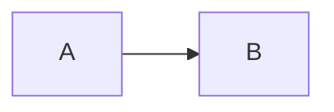

- 箭头（无箭头）

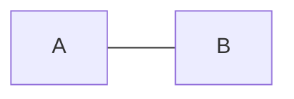

- 连接上的文本

```mermaid
flowchart LR
    A-- This is the text! ---B
    A---|This is the text|B
```

- 箭头加文本

```mermaid
flowchart LR
    A-- text -->B
    A-->|text|B
```

- 虚线链接

```mermaid
flowchart LR
    A-.->B;
```

- 粗链接

```mermaid
flowchart LR
    A==>B
```

- 看不见的链接

在某些你想要更改节点的默认位置的情况下，这可能是一个有用的工具。

```mermaid
flowchart LR
    A ~~~ B
```

---

### 链接的链接

```mermaid
flowchart LR
   A -- text --> B -- text2 --> C
   a --> b & c--> d
   1 & 2--> 3 & 4
```

---

### 更多

[有关动画等等](https://mermaid.nodejs.cn/syntax/flowchart.html#special-shapes-in-mermaid-flowcharts-v1130)

---

### 新的箭头类型

```mermaid
flowchart LR
    A --o B
    A --x B
    A o--o B
    B <--> C
    C x--x D
```

---

### 破坏语法的特殊字符

- 可以使用此处示例的语法对字符进行转义。

```mermaid
flowchart LR
    A["A double quote:#quot;"] --> B["A dec char:#9829;"]
```

---

### 子图

```mermaid
flowchart TB
    c1-->a2
    subgraph one
    a1-->a2
    end
    subgraph two
    b1-->b2
    end
    subgraph three
    c1-->c2
    end
```

- With the graphtype flowchart it is also possible to set edges to and from subgraphs as in the flowchart below.

```mermaid
flowchart TB
    c1-->a2
    subgraph one
    a1-->a2
    end
    subgraph two
    b1-->b2
    end
    subgraph three
    c1-->c2
    end
    one --> two
    three --> two
    two --> c2
```

- 使用 graphtype 流程图，你可以使用方向语句来设置子图渲染的方向，如本例所示。

```mermaid
flowchart LR
  subgraph TOP
    direction TB
    subgraph B1
        direction RL
        i1 -->f1
    end
    subgraph B2
        direction BT
        i2 -->f2
    end
  end
  A --> TOP --> B
  B1 --> B2
```

---

### Markdown 字符串

```mermaid
%%{init: {"flowchart": {"htmlLabels": false}} }%%
flowchart LR
subgraph "One"
    a("`The **cat** in the hat`") -- "edge label" --> b{{"`The **dog** in the hog`"}}
end
subgraph "`**Two**`"
    c("`The **cat** in the hat`") -- "`Bold **edge label**`" --> d("The dog in the hog")
end
```

---

```mermaid
graph LR

o(群里提问的艺术)
o1(提问之前)
o11(尝试自己解决)
o111(搜索也是一门艺术)
o1111(Baidu)
o1112(Google)
o112(查阅手册或者文档)
o113(查阅论坛或者社区)
o1131(github)
o1132(stackoverflow)
o114(查阅源代码)
o115(询问朋友)
o116(自检并且不断尝试)
o12(不能自己解决)
o121(明白自己想问什么)
o122(梳理准备你的问题)
o123(言简意赅)
o2(怎样提问)
o21(用词准确, 问题明确)
o22(描述准确, 信息充足)
o221(准确有效的信息)
o222(问题内容)
o223(做过什么尝试)
o224(想要问什么)
o23(别问毫无意义的问题)
o231(有没有人在)
o232(有没有人会)
o3(注意事项)
o31(提问前做好冷场的心理准备)
o311(也许这个问题网上搜一下就知道答案)
o312(也许别人在忙)
o313(也许这个问题太简单了)
o314(也许没人做过这个)
o32(谦虚, 别人没有义务为你解决问题)
o33(没有一定的学习能力, 遇到问题只会伸手的不适合玩这个)
o34(群唯一的作用: 扯淡, 交流, 分享, 以上几条为前提)

o --- o1
o --- o2
o --- o3
o1 --- o11
o1 --- o12
o2 --- o21
o2 --- o22
o2 --- o23
o3 --- o31
o3 --- o32
o3 --- o33
o3 --- o34
o11 --- o111
o111 -.- o1111
o111 -.- o1112
o11 --- o112
o11 --- o113
o113 -.- o1131
o113 -.- o1132
o11 --- o114
o11 --- o115
o11 --- o116
o12 --- o121
o12 --- o122
o12 --- o123
o22 --- o221
o22 --- o222
o22 --- o223
o22 --- o224
o23 --- o231
o23 --- o232
o31 --- o311
o31 --- o312
o31 --- o313
o31 --- o314

style o fill:black,stroke:black,stroke-width:1px,color:white
style o1 fill:#f22816,stroke:#f22816,stroke-width:1px,color:white
style o2 fill:#f2b807,stroke:#f2b807,stroke-width:1px,color:white
style o3 fill:#233ed9,stroke:#233ed9,stroke-width:1px,color:white
style o11 fill:#fcd4d0,stroke:#fcd4d0,stroke-width:1px
style o12 fill:#fcd4d0,stroke:#fcd4d0,stroke-width:1px
style o111 fill:#fcd4d0,stroke:#fcd4d0,stroke-width:1px
style o112 fill:#fcd4d0,stroke:#fcd4d0,stroke-width:1px
style o113 fill:#fcd4d0,stroke:#fcd4d0,stroke-width:1px
style o114 fill:#fcd4d0,stroke:#fcd4d0,stroke-width:1px
style o115 fill:#fcd4d0,stroke:#fcd4d0,stroke-width:1px
style o116 fill:#fcd4d0,stroke:#fcd4d0,stroke-width:1px
style o121 fill:#fcd4d0,stroke:#fcd4d0,stroke-width:1px
style o122 fill:#fcd4d0,stroke:#fcd4d0,stroke-width:1px
style o123 fill:#fcd4d0,stroke:#fcd4d0,stroke-width:1px
style o1111 fill:#fcd4d0,stroke:#fcd4d0,stroke-width:1px
style o1112 fill:#fcd4d0,stroke:#fcd4d0,stroke-width:1px
style o1131 fill:#fcd4d0,stroke:#fcd4d0,stroke-width:1px
style o1132 fill:#fcd4d0,stroke:#fcd4d0,stroke-width:1px
style o21 fill:#fcf1cd,stroke:#fcf1cd,stroke-width:1px
style o22 fill:#fcf1cd,stroke:#fcf1cd,stroke-width:1px
style o221 fill:#fcf1cd,stroke:#fcf1cd,stroke-width:1px
style o222 fill:#fcf1cd,stroke:#fcf1cd,stroke-width:1px
style o223 fill:#fcf1cd,stroke:#fcf1cd,stroke-width:1px
style o224 fill:#fcf1cd,stroke:#fcf1cd,stroke-width:1px
style o23 fill:#fcf1cd,stroke:#fcf1cd,stroke-width:1px
style o231 fill:#fcf1cd,stroke:#fcf1cd,stroke-width:1px
style o232 fill:#fcf1cd,stroke:#fcf1cd,stroke-width:1px

linkStyle 0 stroke:#f22816,stroke-width:5px;
linkStyle 1 stroke:#f2b807,stroke-width:5px;
linkStyle 2 stroke:#233ed9,stroke-width:5px;
linkStyle 3 stroke:#f22816,stroke-width:3px;
linkStyle 4 stroke:#f22816,stroke-width:3px;
linkStyle 5 stroke:#f2b807,stroke-width:3px;
linkStyle 6 stroke:#f2b807,stroke-width:3px;
linkStyle 7 stroke:#f2b807,stroke-width:3px;
linkStyle 8 stroke:#233ed9,stroke-width:3px;
linkStyle 9 stroke:#233ed9,stroke-width:3px;
linkStyle 10 stroke:#233ed9,stroke-width:3px;
linkStyle 11 stroke:#233ed9,stroke-width:3px;
```

